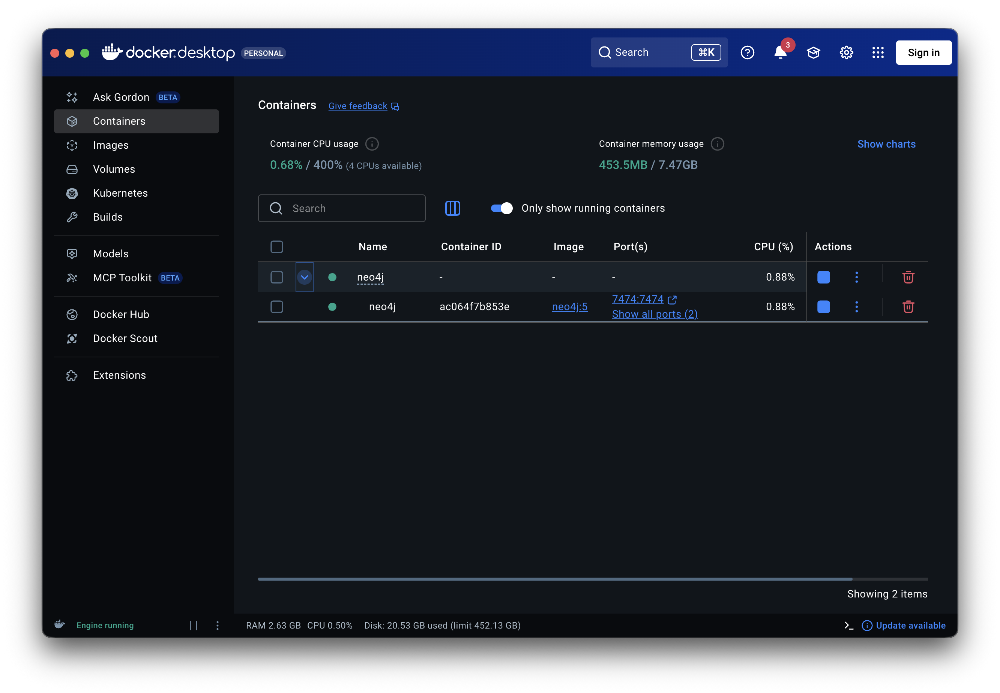
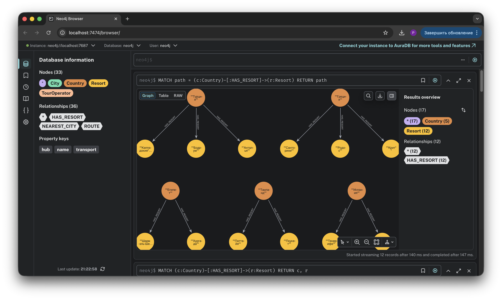
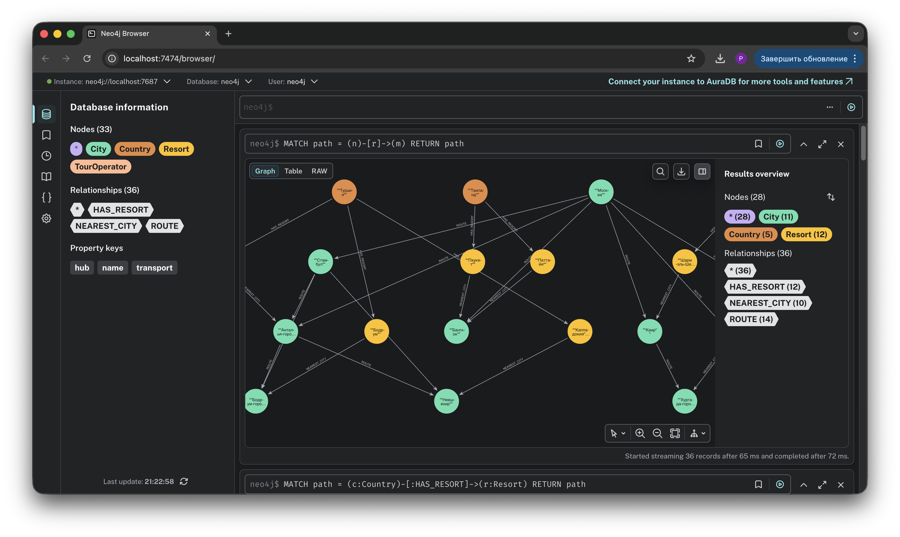
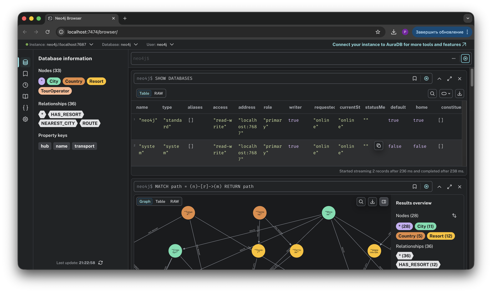
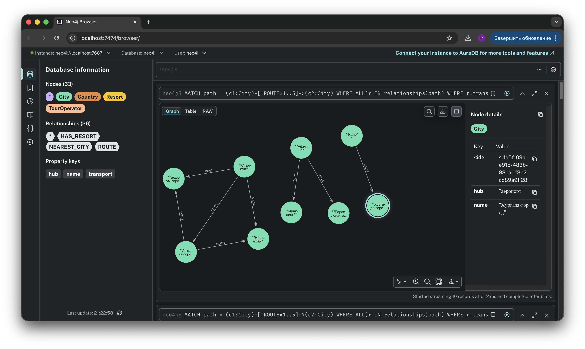
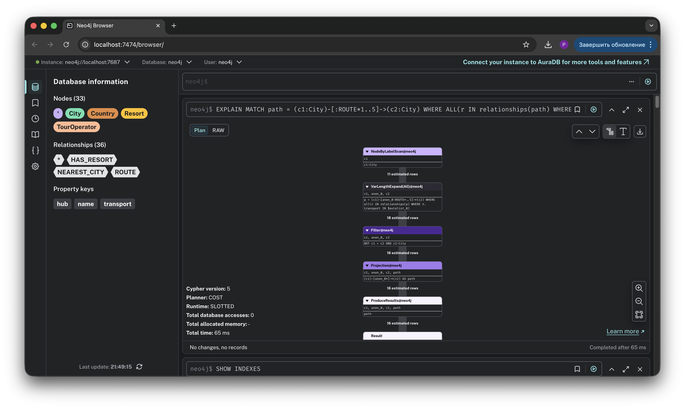
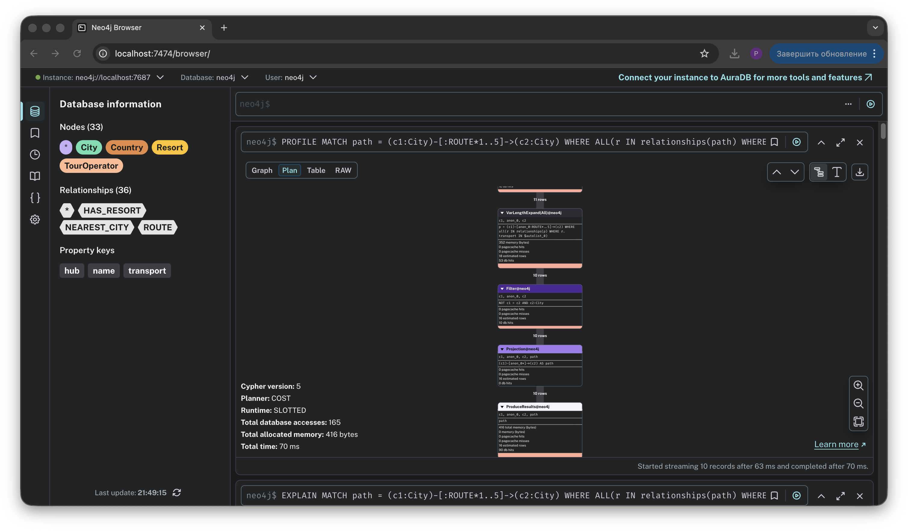
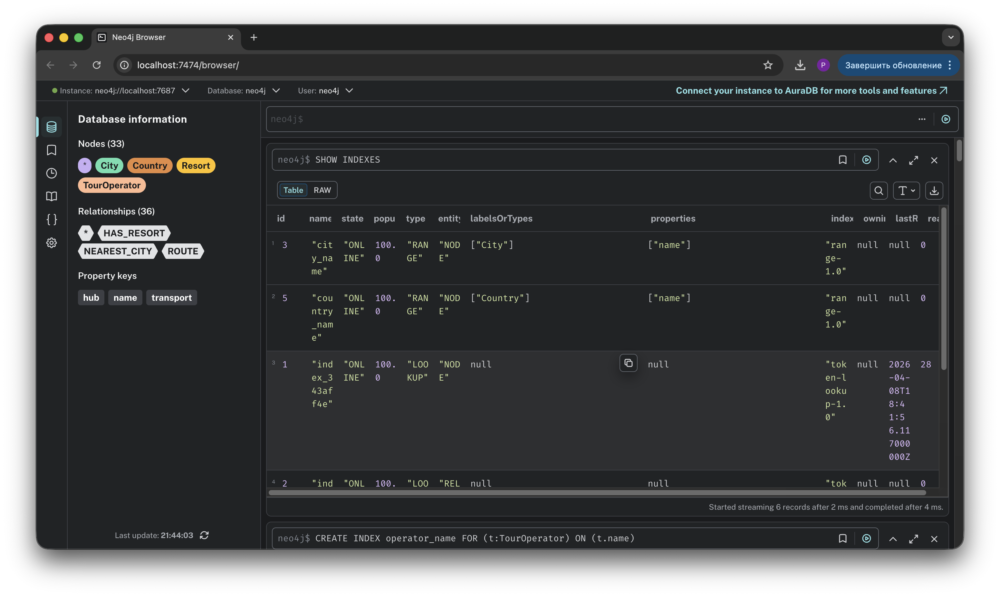
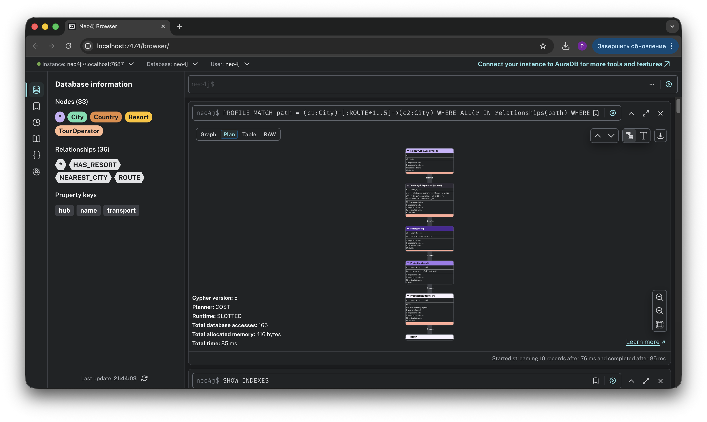
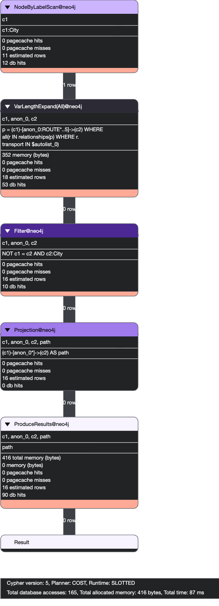

# Отчет по домашней работе: Использование Neo4j

## 1. Установка и настройка окружения

### 1.1. Docker-контейнер с Neo4j

Развёрнут контейнер Neo4j 5 с плагином APOC.

**Docker Compose файл:**

```yaml
services:
  neo4j:
    image: neo4j:5
    container_name: neo4j
    ports:
      - "7474:7474"
      - "7687:7687"
    environment:
      - NEO4J_AUTH=neo4j/password123
      - NEO4J_PLUGINS=["apoc"]
    volumes:
      - neo4j_data:/data
 
volumes:
  neo4j_data:
```

**Скриншот запущенного контейнера:**



**Neo4j Browser:**


 
---

## 2. Создание модели данных

### 2.1. Туроператоры (5 штук)

```cypher
CREATE (:TourOperator {name: "TUI"})
CREATE (:TourOperator {name: "Anex Tour"})
CREATE (:TourOperator {name: "Pegas Touristik"})
CREATE (:TourOperator {name: "Coral Travel"})
CREATE (:TourOperator {name: "Sunmar"})
```

### 2.2. Страны и курорты (5 стран, 12 курортов)

```cypher
// Турция
CREATE (tr:Country {name: "Турция"})
CREATE (antalya:Resort {name: "Анталья"})
CREATE (bodrum:Resort {name: "Бодрум"})
CREATE (cappadocia:Resort {name: "Каппадокия"})
CREATE (tr)-[:HAS_RESORT]->(antalya)
CREATE (tr)-[:HAS_RESORT]->(bodrum)
CREATE (tr)-[:HAS_RESORT]->(cappadocia)
 
// Египет
CREATE (eg:Country {name: "Египет"})
CREATE (hurghada:Resort {name: "Хургада"})
CREATE (sharm:Resort {name: "Шарм-эль-Шейх"})
CREATE (eg)-[:HAS_RESORT]->(hurghada)
CREATE (eg)-[:HAS_RESORT]->(sharm)
 
// Таиланд
CREATE (th:Country {name: "Таиланд"})
CREATE (phuket:Resort {name: "Пхукет"})
CREATE (pattaya:Resort {name: "Паттайя"})
CREATE (th)-[:HAS_RESORT]->(phuket)
CREATE (th)-[:HAS_RESORT]->(pattaya)
 
// Испания
CREATE (es:Country {name: "Испания"})
CREATE (barcelona:Resort {name: "Барселона"})
CREATE (tenerife:Resort {name: "Тенерифе"})
CREATE (es)-[:HAS_RESORT]->(barcelona)
CREATE (es)-[:HAS_RESORT]->(tenerife)
 
// Греция
CREATE (gr:Country {name: "Греция"})
CREATE (crete:Resort {name: "Крит"})
CREATE (rhodes:Resort {name: "Родос"})
CREATE (santorini:Resort {name: "Санторини"})
CREATE (gr)-[:HAS_RESORT]->(crete)
CREATE (gr)-[:HAS_RESORT]->(rhodes)
CREATE (gr)-[:HAS_RESORT]->(santorini)
```

### 2.3. Связи туроператоров с направлениями

```cypher
MATCH (tui:TourOperator {name: "TUI"}), (tr:Country {name: "Турция"}), (es:Country {name: "Испания"}), (gr:Country {name: "Греция"})
CREATE (tui)-[:OFFERS]->(tr), (tui)-[:OFFERS]->(es), (tui)-[:OFFERS]->(gr)
 
MATCH (anex:TourOperator {name: "Anex Tour"}), (tr:Country {name: "Турция"}), (eg:Country {name: "Египет"}), (th:Country {name: "Таиланд"})
CREATE (anex)-[:OFFERS]->(tr), (anex)-[:OFFERS]->(eg), (anex)-[:OFFERS]->(th)
 
MATCH (pegas:TourOperator {name: "Pegas Touristik"}), (tr:Country {name: "Турция"}), (eg:Country {name: "Египет"}), (gr:Country {name: "Греция"})
CREATE (pegas)-[:OFFERS]->(tr), (pegas)-[:OFFERS]->(eg), (pegas)-[:OFFERS]->(gr)
 
MATCH (coral:TourOperator {name: "Coral Travel"}), (th:Country {name: "Таиланд"}), (es:Country {name: "Испания"}), (eg:Country {name: "Египет"})
CREATE (coral)-[:OFFERS]->(th), (coral)-[:OFFERS]->(es), (coral)-[:OFFERS]->(eg)
 
MATCH (sun:TourOperator {name: "Sunmar"}), (tr:Country {name: "Турция"}), (gr:Country {name: "Греция"}), (th:Country {name: "Таиланд"})
CREATE (sun)-[:OFFERS]->(tr), (sun)-[:OFFERS]->(gr), (sun)-[:OFFERS]->(th)
```

**Скриншоты результата:**





**Обзор созданных данных:**


 
---

## 3. Запрос: маршруты наземным транспортом

### 3.1. Запрос

```cypher
MATCH path = (c1:City)-[:ROUTE*1..5]->(c2:City)
WHERE ALL(r IN relationships(path) WHERE r.transport IN ["автобус", "паром"])
  AND c1 <> c2
RETURN path
```

Запрос находит все пути длиной от 1 до 5 переходов между городами, используя только наземный транспорт (автобус и паром).

**Результат:**


 
---

## 4. Анализ плана запроса

### 4.1. EXPLAIN — логический план

```cypher
EXPLAIN
MATCH path = (c1:City)-[:ROUTE*1..5]->(c2:City)
WHERE ALL(r IN relationships(path) WHERE r.transport IN ["автобус", "паром"])
  AND c1 <> c2
RETURN path
```

**Результат:**



### 4.2. PROFILE — фактическое выполнение (без индексов)

```cypher
PROFILE
MATCH path = (c1:City)-[:ROUTE*1..5]->(c2:City)
WHERE ALL(r IN relationships(path) WHERE r.transport IN ["автобус", "паром"])
  AND c1 <> c2
RETURN path
```

**Результат:**




 
---

## 5. Оптимизация с помощью индексов

### 5.1. Создание индексов

```cypher
CREATE INDEX city_name FOR (c:City) ON (c.name)
CREATE INDEX resort_name FOR (r:Resort) ON (r.name)
CREATE INDEX country_name FOR (c:Country) ON (c.name)
CREATE INDEX operator_name FOR (t:TourOperator) ON (t.name)
```

**Проверка индексов:**

```cypher
SHOW INDEXES
```



### 5.2. Повторный PROFILE запроса обхода графа

```cypher
PROFILE
MATCH path = (c1:City)-[:ROUTE*1..5]->(c2:City)
WHERE ALL(r IN relationships(path) WHERE r.transport IN ["автобус", "паром"])
  AND c1 <> c2
RETURN path
```

**Результат:**





Запрос обхода графа не получил ускорения, потому что он не ищет ноды по свойствам — он обходит связи, а для этого Neo4j использует native graph storage, а не property-индексы.

### 5.3. Тест на запросе с поиском по свойству

Чтобы показать реальный эффект индексов, протестирован запрос с фильтрацией по имени города.

**Без индексов:**

```cypher
PROFILE
MATCH (c:City {name: "Москва"})-[:ROUTE]->(dest:City)
RETURN c, dest
```

```
NodeByLabelScan → Filter → Expand → Filter → ProduceResults
Total database accesses: 72
```

Сканирует все 11 нод City (12 db hits), проверяет name у каждой (11 db hits).

**С индексами:**

```
NodeIndexSeek → Expand → Filter → ProduceResults
Total database accesses: 45
```

Сразу находит Москву по индексу (2 db hits). Шаг Filter для поиска по имени исчез полностью.

### 5.4. Сравнительная таблица

| Метрика | Без индексов | С индексами | Изменение |
|---------|-------------|-------------|-----------|
| Способ поиска ноды | NodeByLabelScan + Filter | NodeIndexSeek | B-tree вместо перебора |
| DB accesses (поиск Москвы) | 23 | 2 | -91% |
| Total DB accesses | 72 | 45 | -37% |
| Количество шагов плана | 5 | 4 | -1 шаг |
 
---

## 6. Выводы

Property-индексы в Neo4j ускоряют запросы, которые ищут ноды по значению свойств (name, id и т.д.) — вместо полного перебора всех нод лейбла используется B-tree индекс. На 11 нодах разница невелика, но на миллионах это разница между секундами и миллисекундами.

Запросы обхода графа (variable-length path) не получают ускорения от property-индексов, потому что Neo4j и так использует native graph storage для обхода связей — это его основное архитектурное преимущество перед реляционными БД.