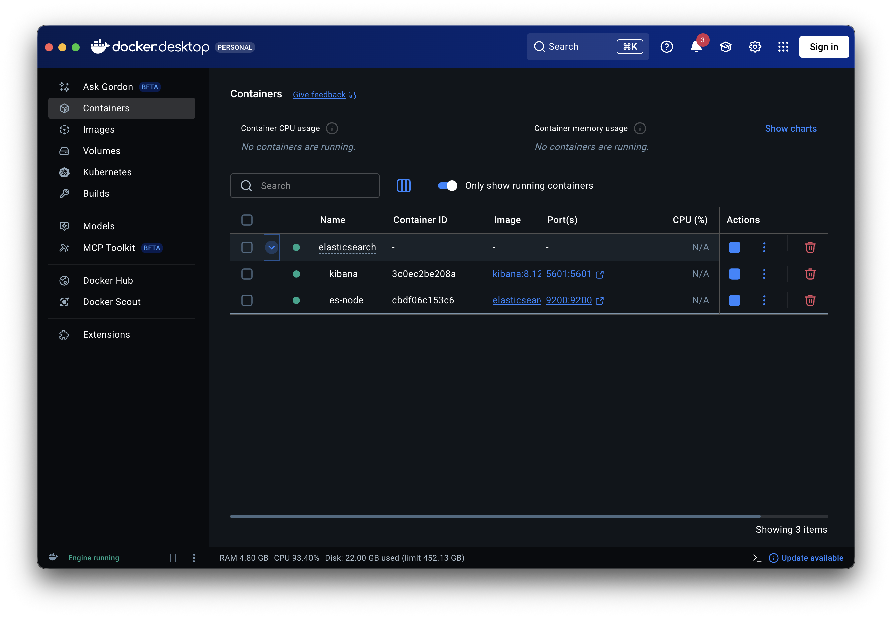
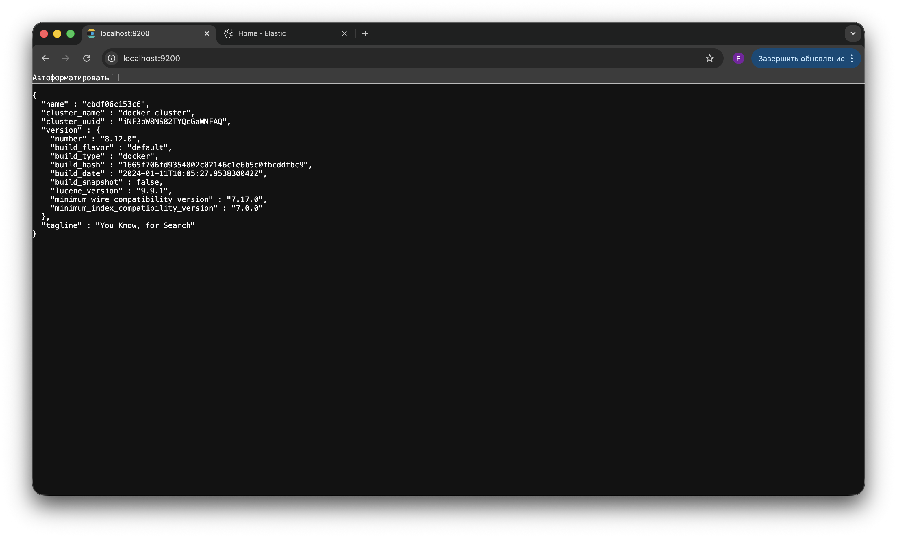
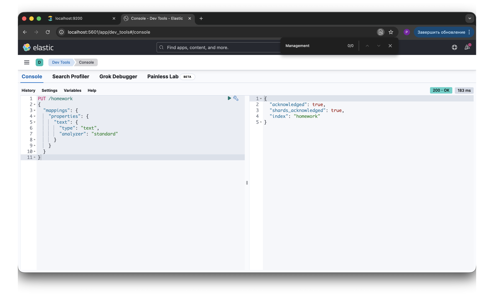
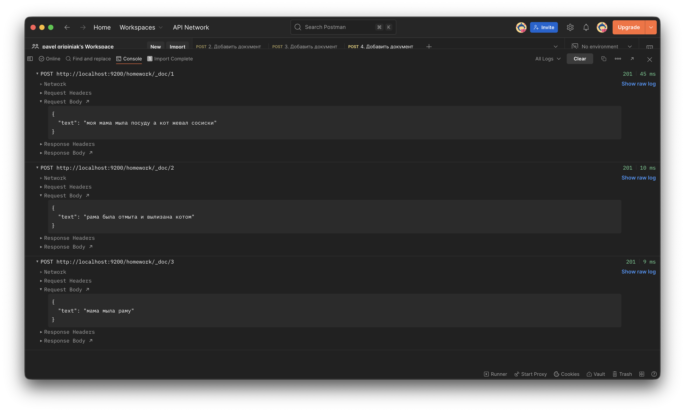
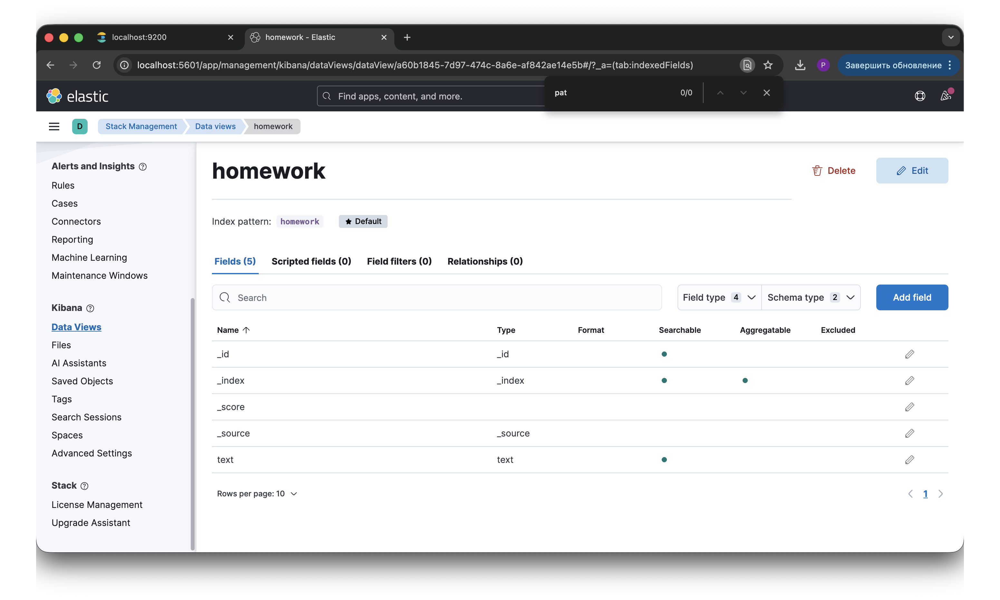
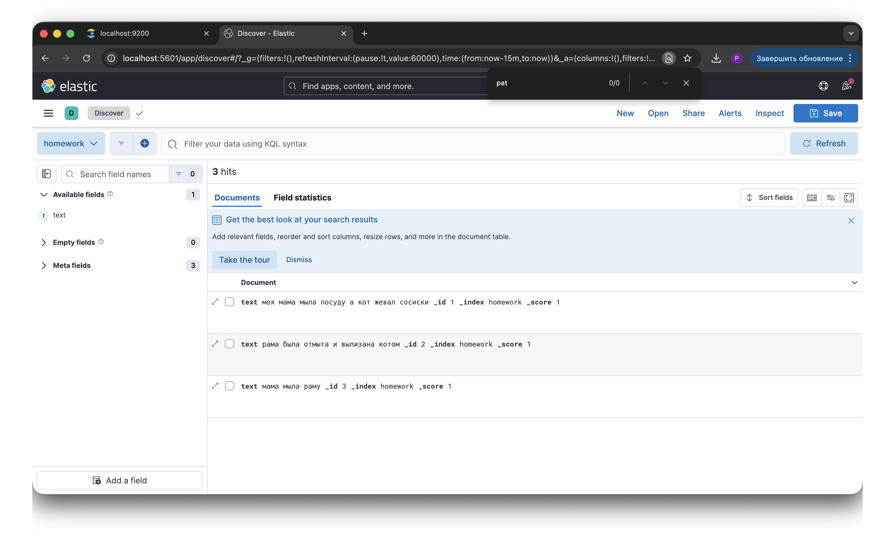
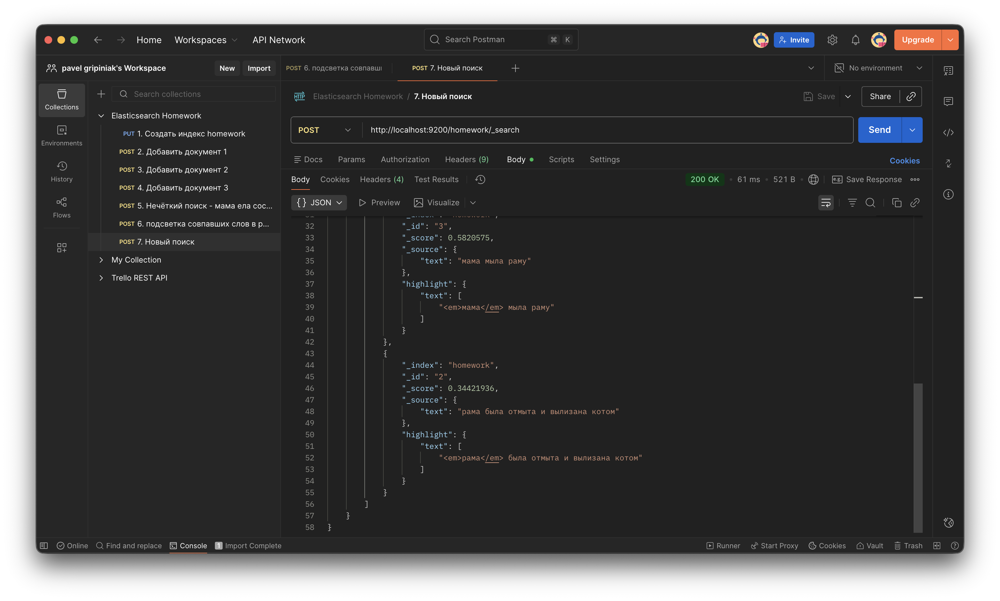

# Отчет по домашней работе: Elasticsearch

## 1. Разворачиваем Elasticsearch + Kibana в Docker

Для работы подняли два сервиса — Elasticsearch 8.12.0 и Kibana 8.12.0 — через Docker Compose. Безопасность (`xpack.security`) отключена для простоты, JVM ограничена 512 МБ.

**Docker Compose файл:**

```yaml
version: '3.8'
services:
  elasticsearch:
    image: elasticsearch:8.12.0
    container_name: es-node
    environment:
      - discovery.type=single-node
      - xpack.security.enabled=false
      - ES_JAVA_OPTS=-Xms512m -Xmx512m
    ports:
      - "9200:9200"
    volumes:
      - es-data:/usr/share/elasticsearch/data
 
  kibana:
    image: kibana:8.12.0
    container_name: kibana
    ports:
      - "5601:5601"
    environment:
      - ELASTICSEARCH_HOSTS=http://elasticsearch:9200
    depends_on:
      - elasticsearch
 
volumes:
  es-data:
```

**Скриншоты запущенных контейнеров и интерфейсов:**






 
---

## 2. Создание индекса с маппингом

Создан индекс `homework` с одним полем `text` типа `text` и стандартным анализатором:

```json
PUT /homework
{
  "mappings": {
    "properties": {
      "text": {
        "type": "text",
        "analyzer": "standard"
      }
    }
  }
}
```


 
---

## 3. Добавление документов

В индекс добавлены три документа с русскоязычным текстом:

```json
POST /homework/_doc/1
{
  "text": "моя мама мыла посуду а кот жевал сосиски"
}
 
POST /homework/_doc/2
{
  "text": "рама была отмыта и вылизана котом"
}
 
POST /homework/_doc/3
{
  "text": "мама мыла раму"
}
```


 
---

## 4. Создание Index Pattern в Kibana

Для визуализации данных в Kibana создан Index Pattern по индексу `homework`.




 
---

## 5. Полнотекстовый поиск с нечётким совпадением

### 5.1. Базовый запрос

Отправлен поисковый запрос через Postman с включённым нечётким поиском (`fuzziness: "auto"`). Коллекция запросов приложена: [Postman Collection](../11_elastic/elastic_collection.json).

```json
POST /homework/_search
{
  "query": {
    "match": {
      "text": {
        "query": "мама ела сосиски",
        "fuzziness": "auto"
      }
    }
  }
}
```

**Ответ** — ES вернул все три документа, отранжированных по релевантности:

```json
{
    "took": 9,
    "timed_out": false,
    "_shards": {
        "total": 1,
        "successful": 1,
        "skipped": 0,
        "failed": 0
    },
    "hits": {
        "total": {
            "value": 3,
            "relation": "eq"
        },
        "max_score": 1.241674,
        "hits": [
            {
                "_index": "homework",
                "_id": "1",
                "_score": 1.241674,
                "_source": {
                    "text": "моя мама мыла посуду а кот жевал сосиски"
                }
            },
            {
                "_index": "homework",
                "_id": "3",
                "_score": 0.5820575,
                "_source": {
                    "text": "мама мыла раму"
                }
            },
            {
                "_index": "homework",
                "_id": "2",
                "_score": 0.34421936,
                "_source": {
                    "text": "рама была отмыта и вылизана котом"
                }
            }
        ]
    }
}
```

### 5.2. Запрос с подсветкой совпадений (Highlight)

Тот же запрос, но с добавлением секции `highlight`, чтобы увидеть, какие именно слова совпали:

```json
POST /homework/_search
{
  "query": {
    "match": {
      "text": {
        "query": "мама ела сосиски",
        "fuzziness": "auto"
      }
    }
  },
  "highlight": {
    "fields": {
      "text": {}
    }
  }
}
```

**Ответ:**

```json
{
    "took": 32,
    "timed_out": false,
    "_shards": {
        "total": 1,
        "successful": 1,
        "skipped": 0,
        "failed": 0
    },
    "hits": {
        "total": {
            "value": 3,
            "relation": "eq"
        },
        "max_score": 1.241674,
        "hits": [
            {
                "_index": "homework",
                "_id": "1",
                "_score": 1.241674,
                "_source": {
                    "text": "моя мама мыла посуду а кот жевал сосиски"
                },
                "highlight": {
                    "text": [
                        "моя <em>мама</em> мыла посуду а кот жевал <em>сосиски</em>"
                    ]
                }
            },
            {
                "_index": "homework",
                "_id": "3",
                "_score": 0.5820575,
                "_source": {
                    "text": "мама мыла раму"
                },
                "highlight": {
                    "text": [
                        "<em>мама</em> мыла раму"
                    ]
                }
            },
            {
                "_index": "homework",
                "_id": "2",
                "_score": 0.34421936,
                "_source": {
                    "text": "рама была отмыта и вылизана котом"
                },
                "highlight": {
                    "text": [
                        "<em>рама</em> была отмыта и вылизана котом"
                    ]
                }
            }
        ]
    }
}
```


 
---

## 6. Выводы и наблюдения

**Нечёткий поиск.** Запрос «мама ела сосиски» не содержит ни одного слова из документа 2, но Elasticsearch всё равно его нашёл — «рама» нечётко совпала с «мама» (отличие в одну букву). Это и есть суть `fuzziness`: ES допускает опечатки и близкие по написанию слова, используя расстояние Левенштейна. Параметр `auto` подбирает допустимое количество изменений в зависимости от длины слова.

**Ранжирование по `_score`.** Документ 1 получил наивысший балл (1.24), потому что совпали сразу два слова из запроса — «мама» и «сосиски». Документ 3 — средний балл (0.58), одно точное совпадение «мама». Документ 2 — минимальный (0.34), только нечёткое совпадение «рама» ≈ «мама». ES учитывает и количество совпадений, и их точность.

**Standard analyzer и русский язык.** Стандартный анализатор не понимает русскую морфологию. Поэтому «ела» не нашла «жевал» (синоним), а «мыла» не связалась с «отмыта» (однокоренные). Для продвинутой работы с русским текстом нужен `russian` analyzer, который приводит слова к основе (стемминг).

**Highlight.** Подсветка наглядно показывает, какие именно слова в документе совпали с запросом. Это полезно и для понимания логики ранжирования, и для пользовательских интерфейсов поиска.