# Отчет по домашней работе: Apache Kafka

## 1. Установка и настройка окружения

### 1.1. Развертывание Kafka в Docker

Для работы с Kafka развернут контейнерный стек из трёх сервисов: ZooKeeper (координация кластера), Kafka-брокер и Kafka UI (веб-интерфейс для мониторинга).

**docker-compose.kafka.yml:**

```yaml
version: '3.8'

services:
  zookeeper:
    image: confluentinc/cp-zookeeper:7.6.0
    container_name: zookeeper
    environment:
      ZOOKEEPER_CLIENT_PORT: 2181
      ZOOKEEPER_TICK_TIME: 2000
    ports:
      - "2181:2181"

  kafka:
    image: confluentinc/cp-kafka:7.6.0
    container_name: kafka
    depends_on:
      - zookeeper
    ports:
      - "9092:9092"
    environment:
      KAFKA_BROKER_ID: 1
      KAFKA_ZOOKEEPER_CONNECT: zookeeper:2181
      KAFKA_LISTENER_SECURITY_PROTOCOL_MAP: PLAINTEXT:PLAINTEXT,HOST:PLAINTEXT
      KAFKA_LISTENERS: PLAINTEXT://0.0.0.0:29092,HOST://0.0.0.0:9092
      KAFKA_ADVERTISED_LISTENERS: PLAINTEXT://kafka:29092,HOST://localhost:9092
      KAFKA_INTER_BROKER_LISTENER_NAME: PLAINTEXT
      KAFKA_OFFSETS_TOPIC_REPLICATION_FACTOR: 1
      KAFKA_MESSAGE_MAX_BYTES: 26214400
      KAFKA_REPLICA_FETCH_MAX_BYTES: 26214400
      KAFKA_FETCH_MAX_BYTES: 26214400
      KAFKA_MAX_REQUEST_SIZE: 26214400
    deploy:
      resources:
        limits:
          cpus: '2.0'
          memory: 2G

  kafka-ui:
    image: provectuslabs/kafka-ui:latest
    container_name: kafka-ui
    depends_on:
      - kafka
    ports:
      - "8080:8080"
    environment:
      KAFKA_CLUSTERS_0_NAME: local
      KAFKA_CLUSTERS_0_BOOTSTRAPSERVERS: kafka:29092
      KAFKA_CLUSTERS_0_ZOOKEEPER: zookeeper:2181
```

Два listener'а настроены для разных целей: `PLAINTEXT` — для межконтейнерного взаимодействия внутри Docker-сети, `HOST` — для доступа к брокеру с хостовой машины через `localhost:9092`. Лимиты на размер сообщений увеличены до ~25 MB для сценария с большими JSON.

**Запуск контейнера:**

```
docker compose up -d
```

**Скриншот запущенного Docker-контейнера:**

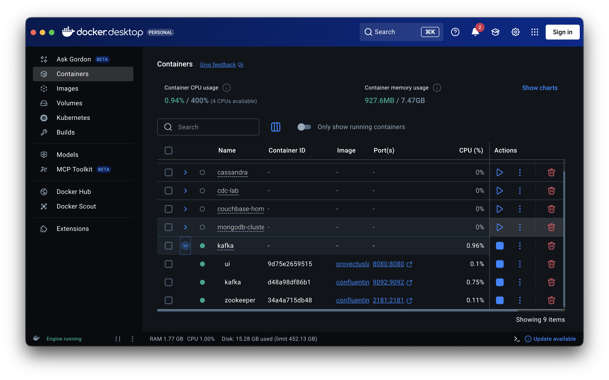

**Kafka UI (http://localhost:8080):**

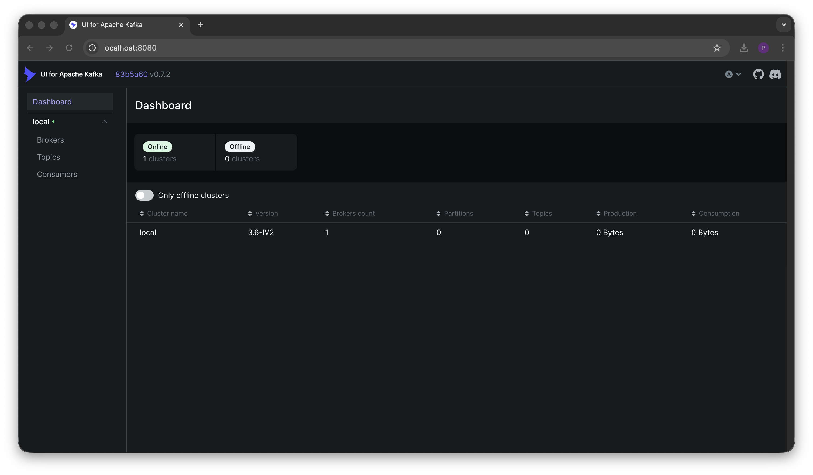

---

### 1.2. Проверка запуска и создание топика

Через Kafka UI вручную создан топик `demo` с 3 партициями.

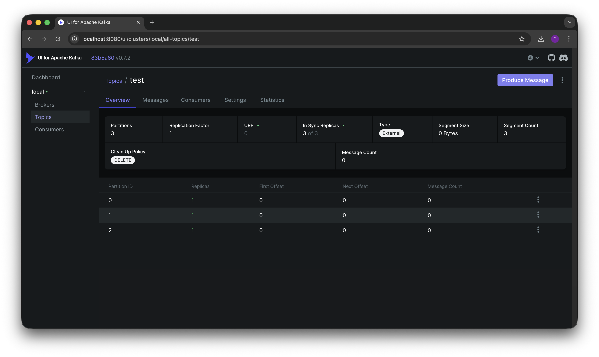

---

## 2. CLI-утилиты: отправка и чтение сообщений

### 2.1. Отправка сообщений через kafka-console-producer

С помощью встроенной утилиты `kafka-console-producer` отправлены тестовые сообщения в топик `demo`.

**Процесс отправки:**

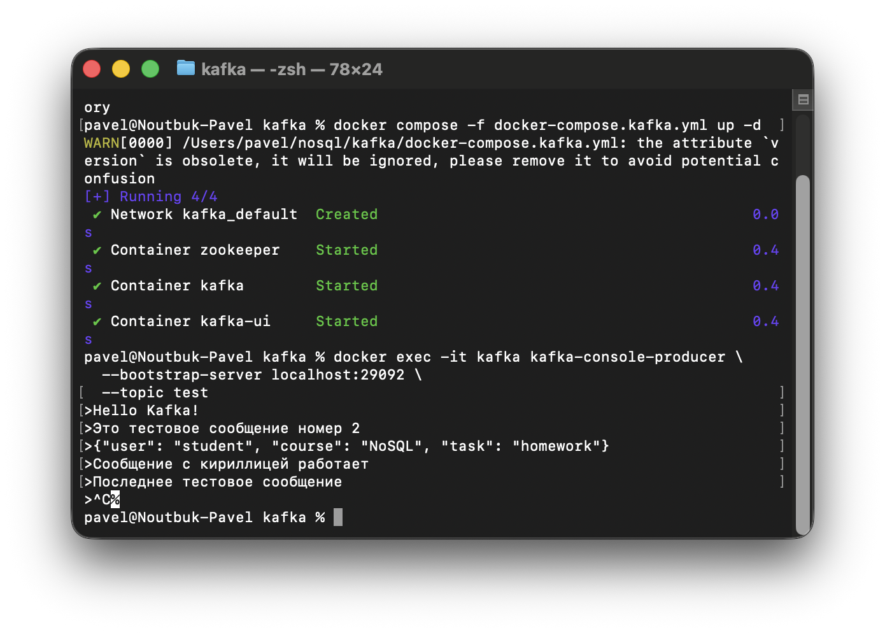

**Результат — сообщения в Kafka UI:**

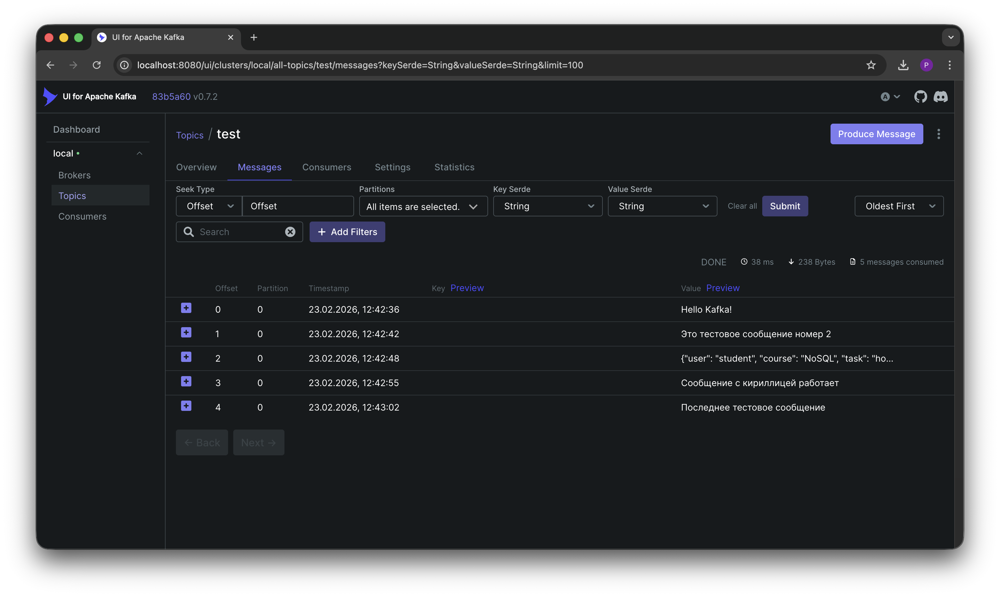

---

### 2.2. Чтение сообщений через kafka-console-consumer

Проверка чтения сообщений с помощью `kafka-console-consumer`.

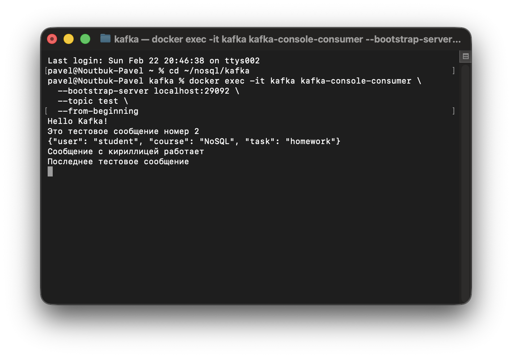

---

## 3. Программная отправка и чтение на Python

Установлена библиотека `confluent-kafka` для программного взаимодействия с Kafka.

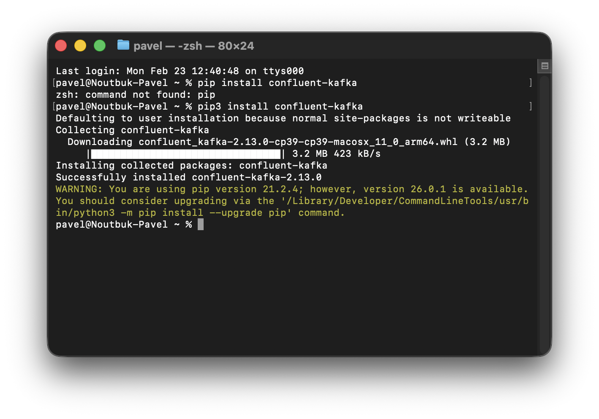

Структура проекта:

```
kafka/
├── consumer/
│   └── kafka_basic_demo.py
├── producer/
│   └── kafka_basic_demo.py
└── docker-compose.kafka.yml
```

### 3.1. Producer — скрипт отправки сообщений

```python
from confluent_kafka import Producer
import json

conf = {
    'bootstrap.servers': 'localhost:9092'
}

producer = Producer(conf)

def delivery_report(err, msg):
    """
    Callback-функция, вызывается Kafka после попытки доставки каждого сообщения.
    err — ошибка (None если всё ок)
    msg — объект сообщения с метаданными (topic, partition, offset)
    """
    if err is not None:
        print(f'❌ Ошибка доставки: {err}')
    else:
        print(f'✅ Доставлено: topic={msg.topic()}, partition={msg.partition()}, offset={msg.offset()}')

for i in range(10):
    message = json.dumps({
        "id": i,
        "text": f"Сообщение #{i}",
        "source": "python-producer"
    }, ensure_ascii=False)

    producer.produce(
        topic='demo',
        value=message.encode('utf-8'),
        callback=delivery_report
    )
    producer.poll(0)

producer.flush()
print('\n🎉 Все сообщения отправлены!')
```

**Результат работы producer:**

```
✅ Доставлено: topic=demo, partition=0, offset=0
✅ Доставлено: topic=demo, partition=0, offset=1
✅ Доставлено: topic=demo, partition=0, offset=2
...
✅ Доставлено: topic=demo, partition=0, offset=9

🎉 Все сообщения отправлены!
```

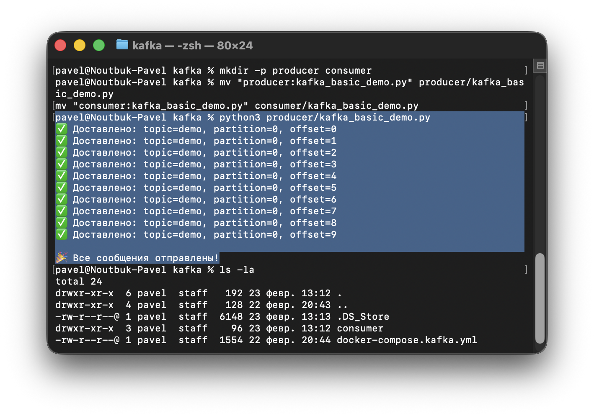

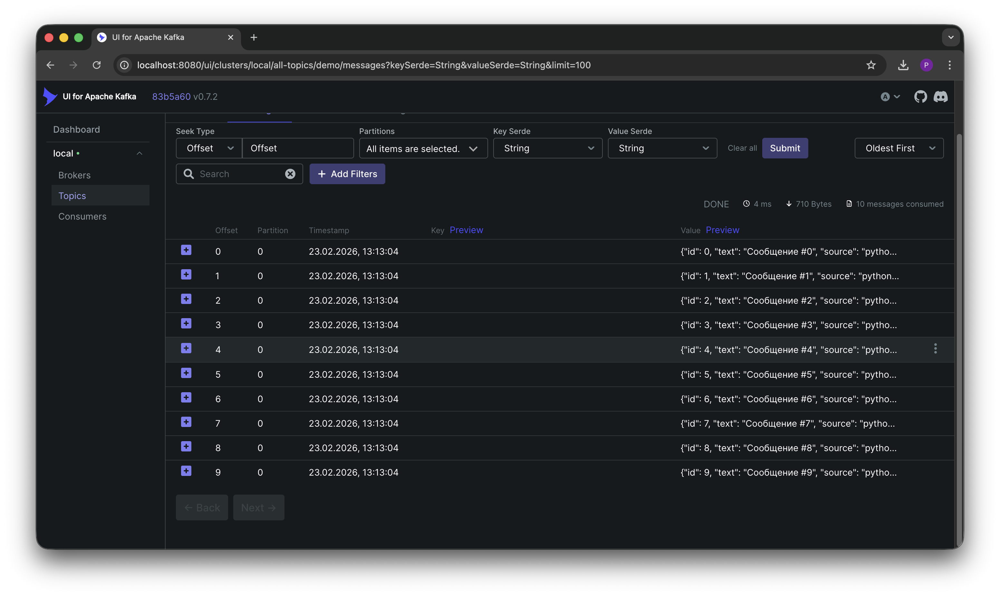

---

### 3.2. Consumer — скрипт чтения сообщений

```python
from confluent_kafka import Consumer

conf = {
    'bootstrap.servers': 'localhost:9092',
    'group.id': 'demo-group',
    'auto.offset.reset': 'earliest'
}

consumer = Consumer(conf)
consumer.subscribe(['demo'])

print('🔄 Ожидание сообщений из топика "demo"... (Ctrl+C для выхода)\n')

try:
    message_count = 0
    empty_polls = 0

    while True:
        msg = consumer.poll(timeout=1.0)

        if msg is None:
            empty_polls += 1
            if empty_polls >= 5:
                print(f'\n📭 Нет новых сообщений. Всего получено: {message_count}')
                break
            continue

        if msg.error():
            print(f'❌ Ошибка: {msg.error()}')
            continue

        empty_polls = 0
        message_count += 1

        print(f'📩 [{message_count}] topic={msg.topic()}, partition={msg.partition()}, '
              f'offset={msg.offset()}, value={msg.value().decode("utf-8")}')

except KeyboardInterrupt:
    print('\n\n⛔ Остановлено пользователем')
finally:
    consumer.close()
    print('🔌 Consumer отключён')
```

**Результат работы consumer:**

```
📩 [1] topic=demo, partition=0, offset=0, value={"id": 0, "text": "Сообщение #0", "source": "python-producer"}
📩 [2] topic=demo, partition=0, offset=1, value={"id": 1, "text": "Сообщение #1", "source": "python-producer"}
...
📩 [10] topic=demo, partition=0, offset=9, value={"id": 9, "text": "Сообщение #9", "source": "python-producer"}

📭 Нет новых сообщений. Всего получено: 10
🔌 Consumer отключён
```

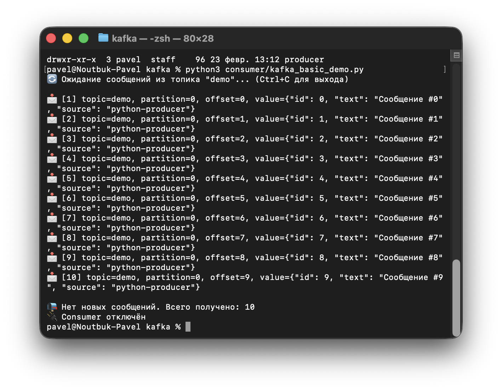

---

## 4. Бенчмарки производительности

### 4.1. Базовый Streams Benchmark (Producer + Consumer)

Для оценки пропускной способности создан скрипт `kafka_streams_benchmark.py`, который пересоздаёт топик с чистого листа, последовательно отправляет сообщения (с синхронным `flush()` после каждого — аналог Redis `XADD`) и затем вычитывает их consumer'ом.

```python
import time
import statistics
import sys
from confluent_kafka import Producer, Consumer
from confluent_kafka.admin import AdminClient, NewTopic

BOOTSTRAP = 'localhost:9092'
TOPIC = 'bench-stream'
ITERATIONS = int(sys.argv[1]) if len(sys.argv) > 1 else 1000

# ... пересоздание топика ...

producer = Producer({
    'bootstrap.servers': BOOTSTRAP,
    'acks': 1,
    'linger.ms': 0,
})

latencies = []
for i in range(ITERATIONS):
    payload = f'{{"action":"purchase","userId":"{i}","amount":"99.90","product":"laptop","timestamp":"{time.time()}"}}'
    start = time.perf_counter()
    producer.produce(TOPIC, value=payload.encode('utf-8'))
    producer.flush()
    latencies.append((time.perf_counter() - start) * 1000)

# ... аналогично для consumer ...
```

**Результаты на 1 000 сообщений:**

```
KAFKA STREAMS BENCHMARK — 1000 сообщений

Testing Producer (аналог XADD)...
  Throughput: 2870 msg/sec
  Avg: 0.348 ms
  p50: 0.301 ms
  p95: 0.527 ms
  p99: 1.392 ms

Testing Consumer (аналог XREADGROUP)...
  Throughput: 313 msg/sec
  Avg: 0.134 ms
  p50: 0.001 ms
  p95: 0.002 ms
  p99: 0.005 ms
```

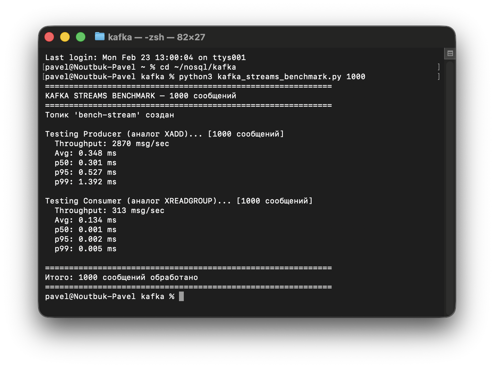

---

### 4.2. Сравнение с Redis и масштабирование до 100 000

**Producer — сравнение Kafka vs Redis:**

| Метрика | Redis (XADD) | Kafka 1 000 | Kafka 100 000 |
|---------|-------------|-------------|---------------|
| Throughput (msg/s) | 3 695 | 2 870 | 5 868 |
| p50 | 0.245 ms | 0.301 ms | 0.157 ms |
| p99 | 0.739 ms | 1.392 ms | 0.380 ms |

Redis быстрее на малых объёмах — он работает in-memory, Kafka пишет на диск. Однако на 100 000 сообщений Kafka «прогревается»: JVM внутри контейнера оптимизирует горячие пути (JIT-компиляция), и throughput вырастает в 2 раза.

Consumer throughput на 1 000 выглядит низким (313 msg/sec), но это артефакт замера — при старте consumer происходит rebalance (Kafka назначает партиции группе), что занимает 1–3 секунды. На 100 000 сообщений consumer показывает 30 395 msg/sec — задержка rebalance становится незаметной.

**Результат запуска на 100 000 сообщений:**

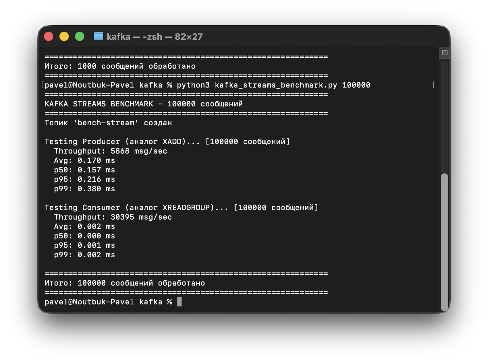

**Сводная таблица Producer:**

| Метрика | Kafka 1 000 | Kafka 100 000 |
|---------|-------------|---------------|
| Throughput (msg/s) | 2 870 | 5 868 |
| Avg latency | 0.348 ms | 0.170 ms |
| p50 | 0.301 ms | 0.157 ms |
| p95 | 0.527 ms | 0.216 ms |
| p99 | 1.392 ms | 0.380 ms |

---

## 5. Fan-out тесты

### 5.1. Конкурентный fan-out (одна группа, 3 consumer'а)

В этом сценарии 3 consumer'а объединены в одну группу. Kafka назначает каждому по 1 партиции — каждый получает примерно 1/3 сообщений. Это аналог распределения нагрузки.

```python
# Ключевая часть — все consumer'ы в одной группе
consumer = Consumer({
    'bootstrap.servers': BOOTSTRAP,
    'group.id': f'fanout-shared-{NUM_MESSAGES}',
    'auto.offset.reset': 'earliest',
})
```

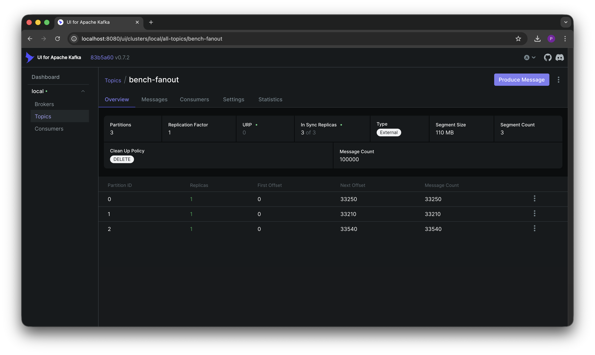

**Результаты на 1 000 сообщений:**

```
Producer:
  Throughput: 4777 msg/sec
  p50: 0.174 ms, p99: 0.473 ms

Consumers (конкурентная обработка, 1 группа):
  Consumer-1: 345 msgs, 21 msg/sec, p50=0.001ms
  Consumer-2: 330 msgs, 20 msg/sec, p50=0.001ms
  Consumer-3: 325 msgs, 20 msg/sec, p50=0.002ms

  Суммарно обработано: 1000/1000 сообщений
```

**Результаты на 100 000 сообщений:**

```
Producer:
  Throughput: 5898 msg/sec
  p50: 0.159 ms, p99: 0.337 ms

Consumers:
  Consumer-1: 33574 msgs, 1995 msg/sec
  Consumer-2: 33278 msgs, 1982 msg/sec
  Consumer-3: 33148 msgs, 1976 msg/sec

  Суммарно обработано: 100000/100000 сообщений
```

Распределение почти идеальное — Kafka гарантирует точное назначение партиций, в отличие от Redis round-robin, который может давать небольшой перекос.

---

### 5.2. Broadcast fan-out (3 независимые группы)

Здесь каждый consumer находится в своей группе (разные `group.id`). Kafka даёт каждой группе независимый набор offset'ов, поэтому каждый consumer прочитает все сообщения.

```python
# Ключевая разница — уникальный group.id для каждого
GROUPS = ["grp-service-a", "grp-service-b", "grp-service-c"]

consumer = Consumer({
    'bootstrap.servers': BOOTSTRAP,
    'group.id': f'{group_name}-{NUM_MESSAGES}',
    'auto.offset.reset': 'earliest',
})
```

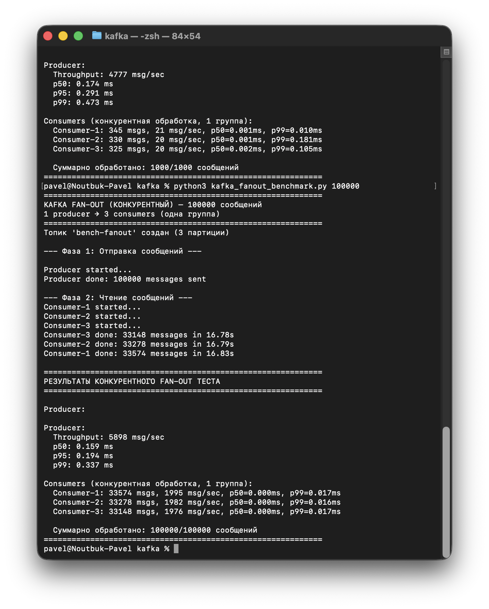

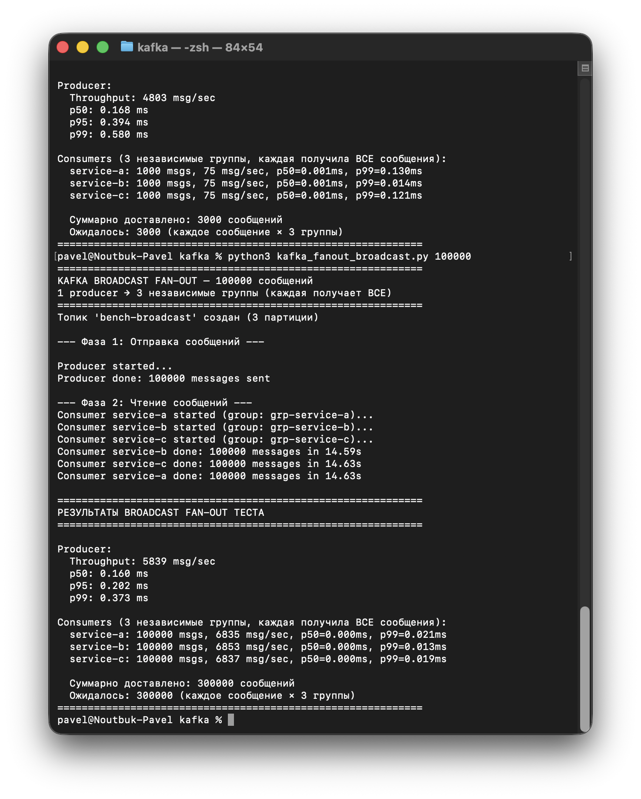

**Результаты на 1 000 сообщений:**

```
Producer:
  Throughput: 4803 msg/sec
  p50: 0.168 ms, p99: 0.580 ms

Consumers (3 независимые группы, каждая получила ВСЕ сообщения):
  service-a: 1000 msgs, 75 msg/sec, p50=0.001ms
  service-b: 1000 msgs, 75 msg/sec, p50=0.001ms
  service-c: 1000 msgs, 75 msg/sec, p50=0.001ms

  Суммарно доставлено: 3000 сообщений
  Ожидалось: 3000 (каждое сообщение × 3 группы)
```

**Результаты на 100 000 сообщений:**

```
Consumers:
  service-a: 100000 msgs, 6835 msg/sec
  service-b: 100000 msgs, 6853 msg/sec
  service-c: 100000 msgs, 6837 msg/sec

  Суммарно доставлено: 300000 сообщений
```

---

### 5.3. Сводная таблица fan-out тестов

**Конкурентный (1 группа, нагрузка делится):**

| Метрика | Redis 1 000 | Kafka 1 000 | Kafka 100 000 |
|---------|-------------|-------------|---------------|
| Producer throughput | 3 695 msg/s | 4 777 | 5 898 |
| Producer p50 | 0.245 ms | 0.174 ms | 0.159 ms |
| Producer p99 | 0.739 ms | 0.473 ms | 0.337 ms |
| Consumer throughput (каждый) | ~217 msg/s | 20* | ~1 990 |
| Распределение | 333/333/334 | 345/330/325 | 33574/33278/33148 |

**Broadcast (3 группы, каждая получает ВСЕ):**

| Метрика | Redis 1 000 | Kafka 1 000 | Kafka 100 000 |
|---------|-------------|-------------|---------------|
| Producer throughput | ~3 700 msg/s | 4 803 | 5 839 |
| Consumer throughput (каждый) | ~541 msg/s | 75* | ~6 840 |
| Суммарно доставлено | 3 000 | 3 000 | 300 000 |
| Consumer p99 | ~1.6 ms | 0.130 ms | 0.021 ms |

*Низкие значения на 1 000 — артефакт rebalance (5–13 сек overhead при малых объёмах).

**Ключевые выводы:** на масштабе Kafka значительно сильнее — broadcast consumer ~6 840 msg/sec против Redis ~541 msg/sec (разница в 12 раз). Kafka читает данные из page cache последовательно, а Redis выполняет отдельную команду на каждый batch.

---

## 6. Кластерное развертывание (3 ноды)

### 6.1. Создание 3-нодового кластера

Для тестирования отказоустойчивости развёрнут кластер из 3 Kafka-брокеров с общим ZooKeeper.

**docker-compose.kafka-cluster.yml:**

```yaml
services:
  zookeeper:
    image: confluentinc/cp-zookeeper:7.6.0
    container_name: zookeeper-cluster
    environment:
      ZOOKEEPER_CLIENT_PORT: 2181
      ZOOKEEPER_TICK_TIME: 2000
    ports:
      - "12181:2181"

  kafka-1:
    image: confluentinc/cp-kafka:7.6.0
    container_name: kafka-1
    depends_on:
      - zookeeper
    ports:
      - "9092:9092"
    environment:
      KAFKA_BROKER_ID: 1
      KAFKA_ZOOKEEPER_CONNECT: zookeeper:2181
      KAFKA_LISTENER_SECURITY_PROTOCOL_MAP: PLAINTEXT:PLAINTEXT,HOST:PLAINTEXT
      KAFKA_LISTENERS: PLAINTEXT://0.0.0.0:29092,HOST://0.0.0.0:9092
      KAFKA_ADVERTISED_LISTENERS: PLAINTEXT://kafka-1:29092,HOST://localhost:9092
      KAFKA_INTER_BROKER_LISTENER_NAME: PLAINTEXT
      KAFKA_DEFAULT_REPLICATION_FACTOR: 3
      KAFKA_MIN_INSYNC_REPLICAS: 2
      KAFKA_MESSAGE_MAX_BYTES: 26214400
      KAFKA_NUM_PARTITIONS: 3

  kafka-2:
    image: confluentinc/cp-kafka:7.6.0
    container_name: kafka-2
    depends_on:
      - zookeeper
    ports:
      - "9093:9093"
    environment:
      KAFKA_BROKER_ID: 2
      KAFKA_ZOOKEEPER_CONNECT: zookeeper:2181
      KAFKA_LISTENER_SECURITY_PROTOCOL_MAP: PLAINTEXT:PLAINTEXT,HOST:PLAINTEXT
      KAFKA_LISTENERS: PLAINTEXT://0.0.0.0:29092,HOST://0.0.0.0:9093
      KAFKA_ADVERTISED_LISTENERS: PLAINTEXT://kafka-2:29092,HOST://localhost:9093
      KAFKA_INTER_BROKER_LISTENER_NAME: PLAINTEXT
      KAFKA_DEFAULT_REPLICATION_FACTOR: 3
      KAFKA_MIN_INSYNC_REPLICAS: 2
      KAFKA_MESSAGE_MAX_BYTES: 26214400
      KAFKA_NUM_PARTITIONS: 3

  kafka-3:
    image: confluentinc/cp-kafka:7.6.0
    container_name: kafka-3
    depends_on:
      - zookeeper
    ports:
      - "9094:9094"
    environment:
      KAFKA_BROKER_ID: 3
      KAFKA_ZOOKEEPER_CONNECT: zookeeper:2181
      KAFKA_LISTENER_SECURITY_PROTOCOL_MAP: PLAINTEXT:PLAINTEXT,HOST:PLAINTEXT
      KAFKA_LISTENERS: PLAINTEXT://0.0.0.0:29092,HOST://0.0.0.0:9094
      KAFKA_ADVERTISED_LISTENERS: PLAINTEXT://kafka-3:29092,HOST://localhost:9094
      KAFKA_INTER_BROKER_LISTENER_NAME: PLAINTEXT
      KAFKA_DEFAULT_REPLICATION_FACTOR: 3
      KAFKA_MIN_INSYNC_REPLICAS: 2
      KAFKA_MESSAGE_MAX_BYTES: 26214400
      KAFKA_NUM_PARTITIONS: 3

  kafka-ui:
    image: provectuslabs/kafka-ui:latest
    container_name: kafka-ui-cluster
    depends_on:
      - kafka-1
      - kafka-2
      - kafka-3
    ports:
      - "8081:8080"
    environment:
      KAFKA_CLUSTERS_0_NAME: kafka-cluster
      KAFKA_CLUSTERS_0_BOOTSTRAPSERVERS: kafka-1:29092,kafka-2:29092,kafka-3:29092
      KAFKA_CLUSTERS_0_ZOOKEEPER: zookeeper:2181
```

**Адреса сервисов:**

| Сервис | Single-node | Кластер |
|--------|-------------|---------|
| Kafka UI | http://localhost:8080 | http://localhost:8081 |
| Kafka brokers | localhost:9092 | localhost:9092, 9093, 9094 |
| Zookeeper | localhost:2181 | localhost:12181 |

**Запуск кластера:**

```
docker compose -f docker-compose.kafka-cluster.yml up -d
```

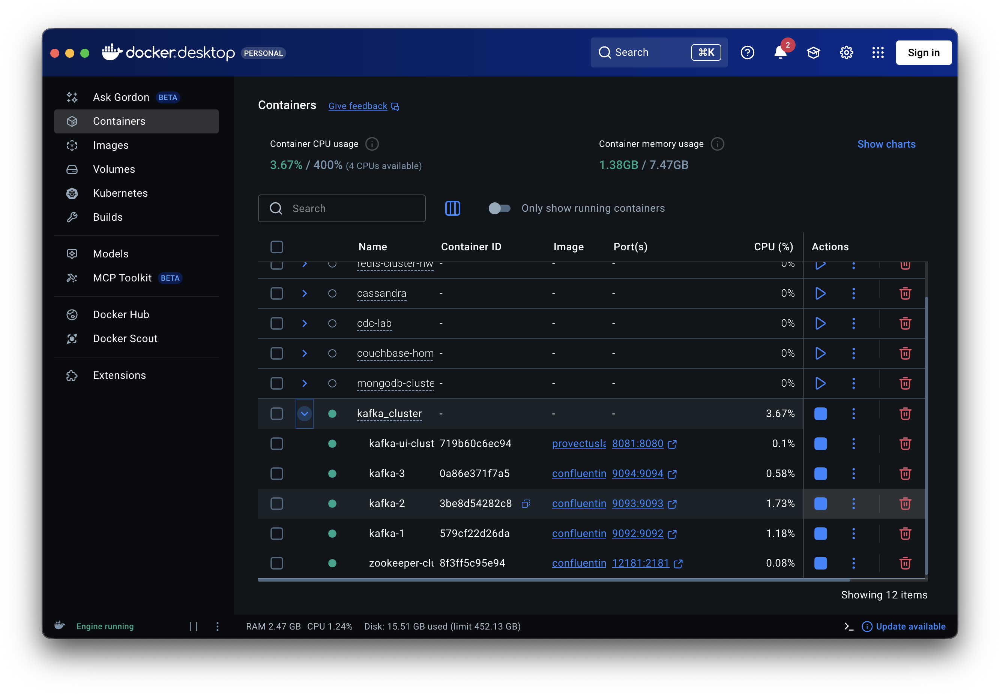

**Кластер в Kafka UI — все 3 брокера активны:**

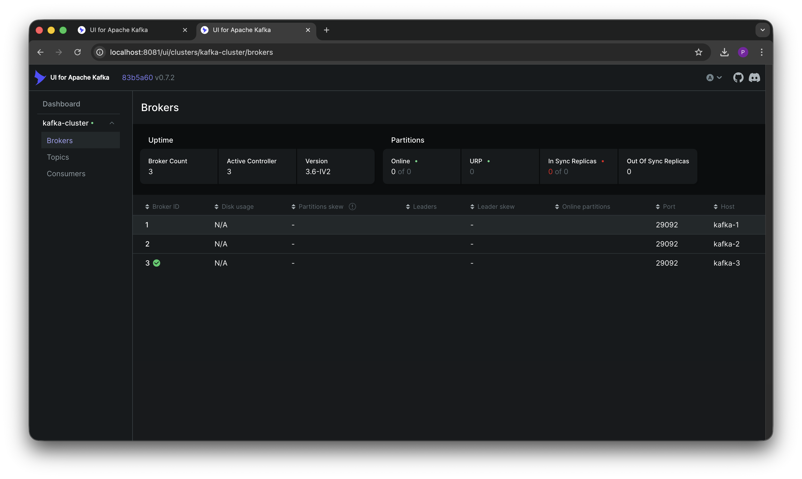

**Создание топика `cluster-test` (3 партиции, RF=3, min.insync.replicas=2):**


---

### 6.2. Тестирование отказоустойчивости (Failover)

Цель эксперимента — проверить автоматический failover при падении leader-ноды.

**Шаг 1:** Отправлены 6 тестовых сообщений в топик `cluster-test`.

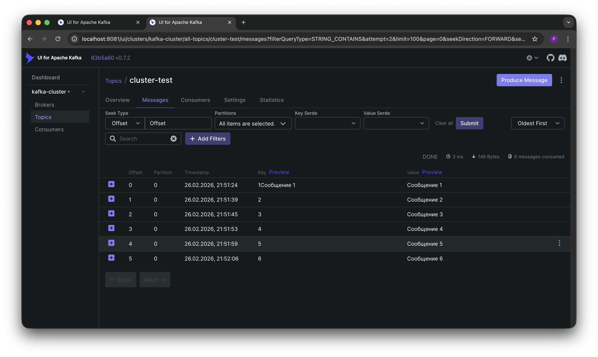

**Шаг 2:** Определяем leader'а для партиции 0 — им является Broker 2.

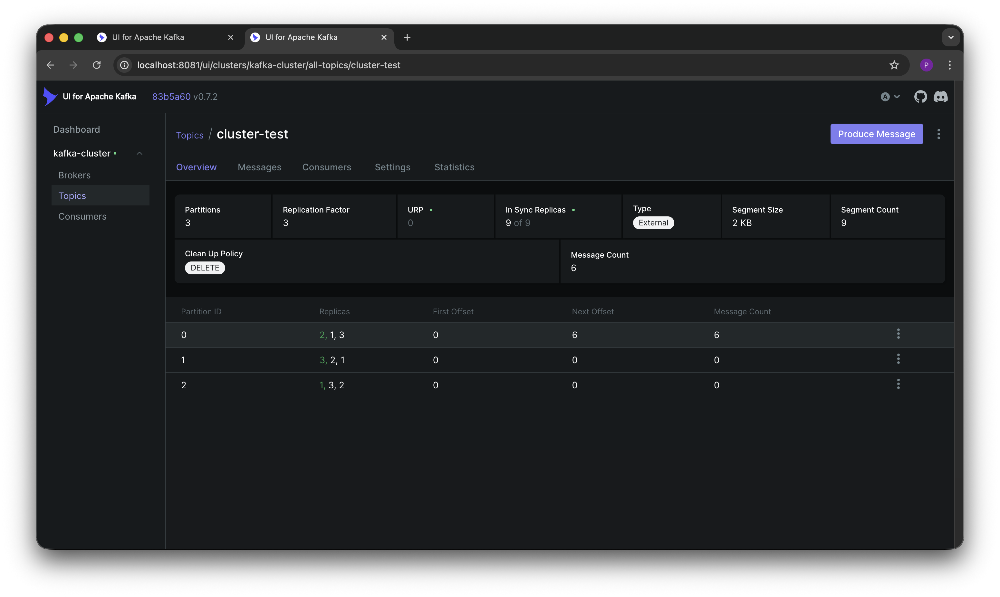

**Шаг 3:** Останавливаем Broker 2 (`docker stop kafka-2`) и наблюдаем автоматическое переназначение leader'а.

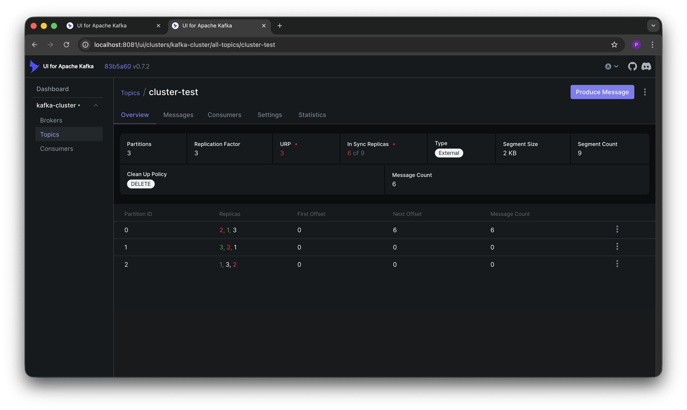

**Что изменилось после `docker stop kafka-2`:**

| Метрика | До | После | Что произошло |
|---------|-----|-------|---------------|
| ISR | 9 of 9 | 6 of 9 | Broker 2 выпал из ISR всех 3 партиций |
| URP | 0 | 3 (красным) | 3 Under-Replicated Partitions |
| Partition 0 Leader | Broker 2 | Broker 1 | Автоматический failover |
| Partition 1 Leader | Broker 3 | Broker 3 | Не менялся |
| Partition 2 Leader | Broker 1 | Broker 1 | Не менялся |
| Message Count | 6 | 6 | Ни одного сообщения не потеряно |

**Сообщения продолжают читаться:**

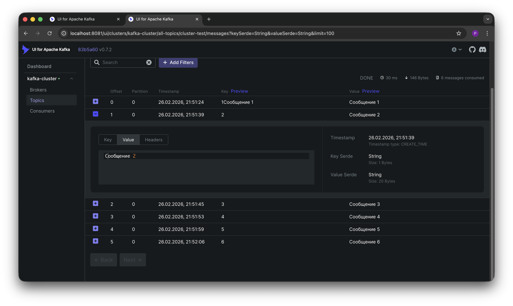

**Восстановление ноды (`docker start kafka-2`):**

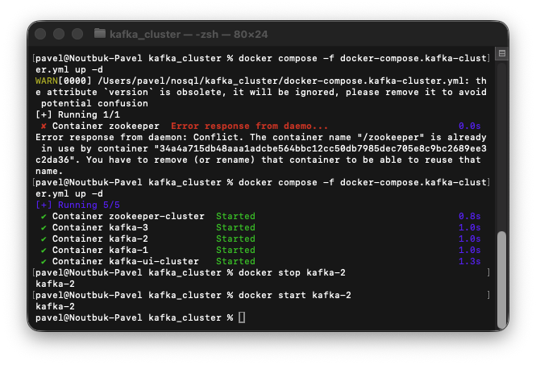

**Все ноды снова активны:**

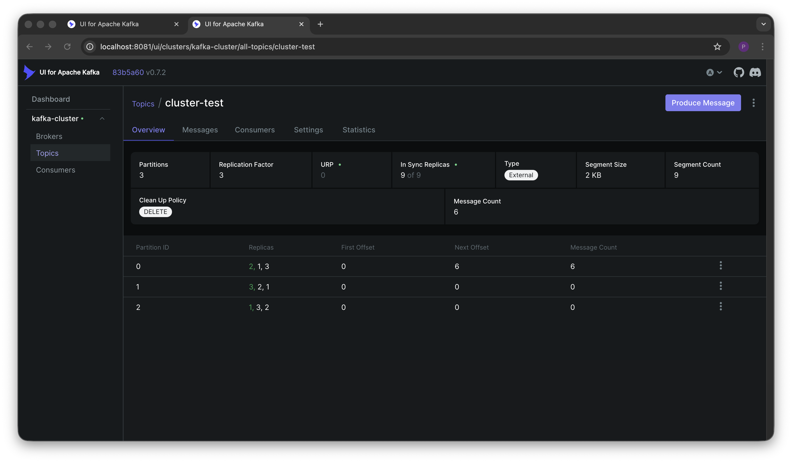

---

### 6.3. Эксперименты с гарантиями доставки (acks)

Для проверки поведения Kafka при разных уровнях гарантий создан скрипт `acks_experiment.py`. Он отправляет сообщения с заданным параметром `acks`, даёт время на остановку ноды, а затем проверяет, сколько сообщений фактически дошло.

```python
producer = Producer({
    'bootstrap.servers': BOOTSTRAP,
    'acks': ACKS,       # 0, 1 или all
    'linger.ms': 0,
    'retries': 0,
    'delivery.timeout.ms': 5000,
})
```

#### Эксперимент 1 — acks=0, без падения ноды (контрольный)

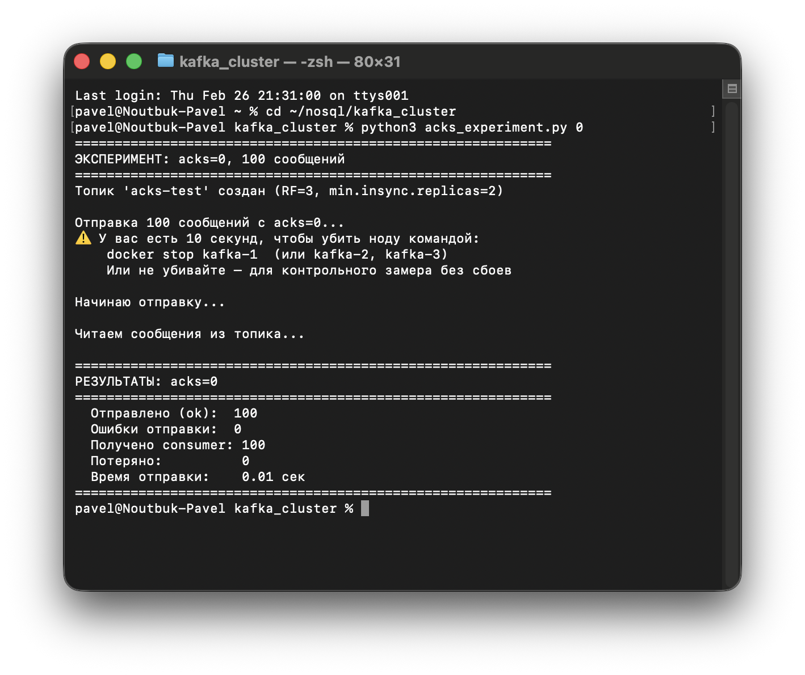

Все 100 сообщений доставлены. Время отправки — 0.01 сек (producer не ждёт подтверждений).

#### Эксперимент 2 — acks=0, с падением ноды

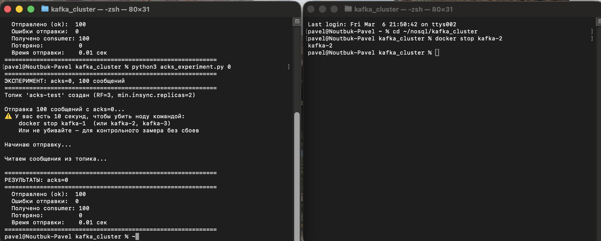

При `acks=0` отправка настолько быстрая (0.01 сек), что все 100 сообщений были отправлены до фактической остановки ноды. Потерь не зафиксировано, но producer также не зафиксировал бы потери, даже если бы они были — в этом и опасность `acks=0`.

#### Эксперимент 3 — acks=1, с падением ноды (1000 сообщений)

Для воспроизведения failover увеличено количество сообщений до 1000 и снижена задержка.

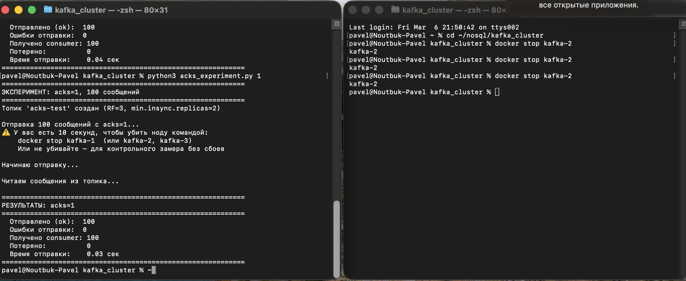

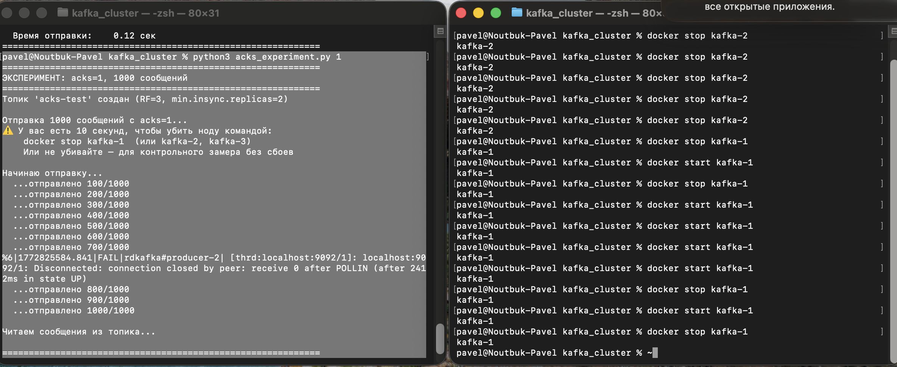

Видно FAIL на строке ~700 — producer заметил, что Broker 1 упал. Однако библиотека `librdkafka` автоматически переключилась на нового leader'а и продолжила отправку. Потерь — 0.

Потеря сообщений при `acks=1` — это race condition: leader должен упасть в микросекундном окне между подтверждением и репликацией. В реальности поймать это на 1000 сообщений крайне сложно.

#### Эксперимент 4 — acks=all, с падением ноды

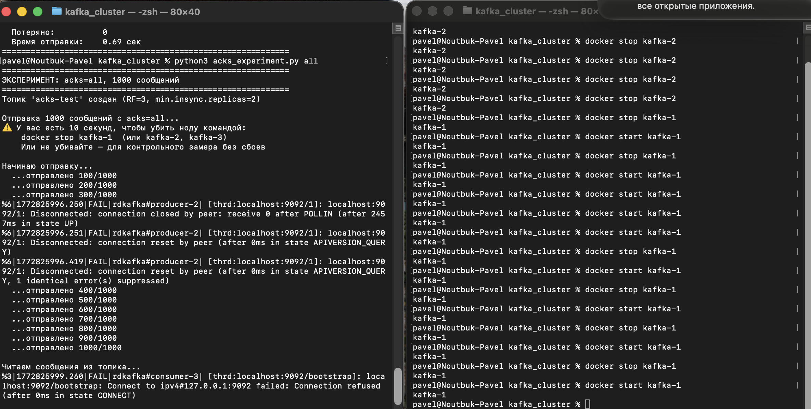

Failover произошёл на ~300 сообщении. Producer потерял связь с Broker 1, но `librdkafka` автоматически нашла нового leader'а и отправка продолжилась без потерь. Все 1000 сообщений доставлены.

Consumer тоже зафиксировал FAIL (`Connection refused` на порт 9092), но подключился через другой брокер и прочитал все сообщения.

#### Сводная таблица экспериментов с acks

| Эксперимент | acks | Падение ноды | Отправлено | Получено | Потеряно | Время | Ошибки producer |
|-------------|------|-------------|------------|----------|----------|-------|-----------------|
| 1 (контроль) | 0 | Нет | 100 | 100 | 0 | 0.01 с | Нет |
| 2 | 0 | Да | 100 | 100 | 0* | 0.01 с | Нет |
| 3 | 1 | Да | 1000 | 1000 | 0 | 0.61 с | FAIL (переподключение) |
| 4 | all | Да | 1000 | 1000 | 0 | 1.48 с | FAIL (переподключение) |

*Сообщения улетели быстрее, чем нода упала.

**Сравнение по времени:**

| acks | Время на 1000 msg | Комментарий |
|------|-------------------|-------------|
| 0 | ~0.01 сек | Не ждёт ничего |
| 1 | 0.61 сек | Ждёт подтверждения от leader |
| all | 1.48 сек | Ждёт подтверждения от всех ISR |

`acks=all` в 2.4 раза медленнее чем `acks=1` — это цена надёжности. Каждое сообщение подтверждается минимум двумя брокерами.

---

### 6.4. Retention и Log Compaction

#### Retention — удаление по времени

Создан топик с `retention.ms = 60000` (1 минута) и `segment.ms = 10000` (10 секунд).

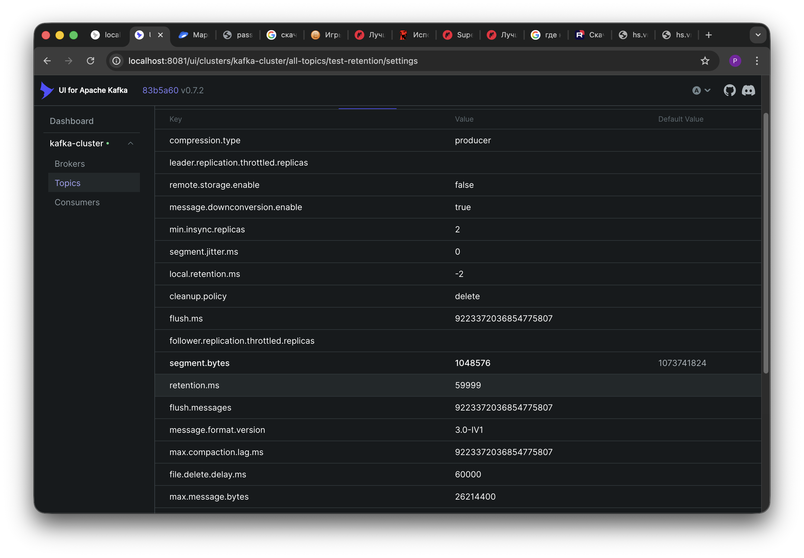

**Сообщения в топике до истечения retention:**

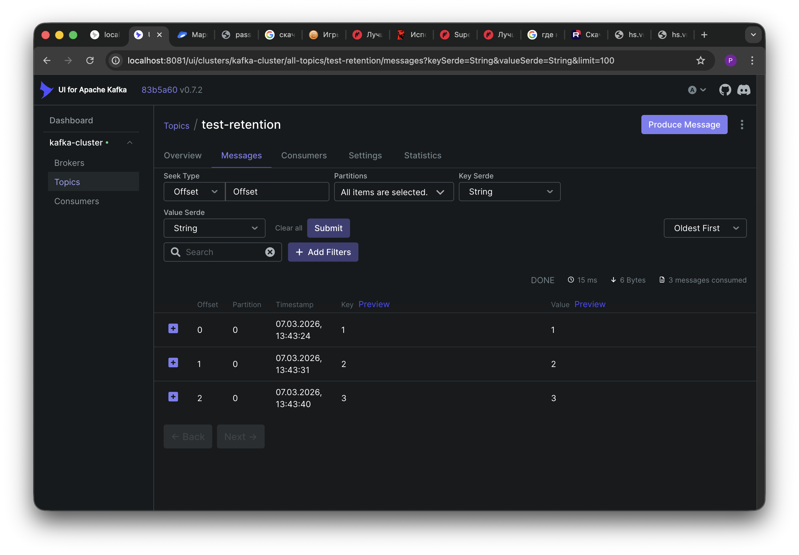

**Сообщения автоматически удалились после 1 минуты:**

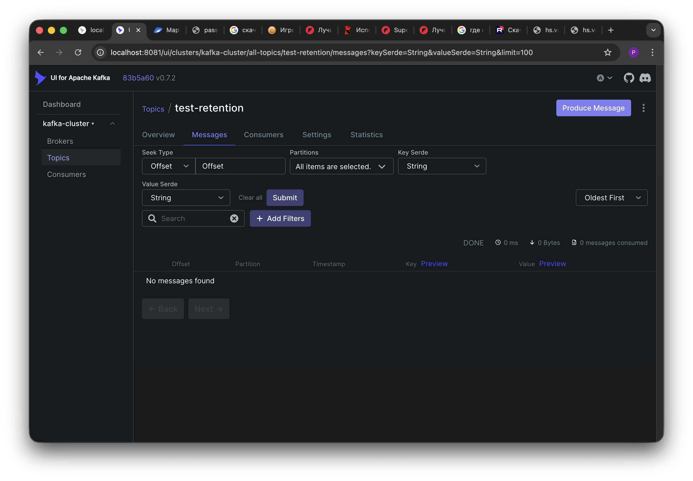

---

#### Log Compaction — уплотнение по ключу

Создан топик с `cleanup.policy = compact`. Kafka оставляет только последнее значение для каждого ключа — все предыдущие версии удаляются.

**Настройки топика:**

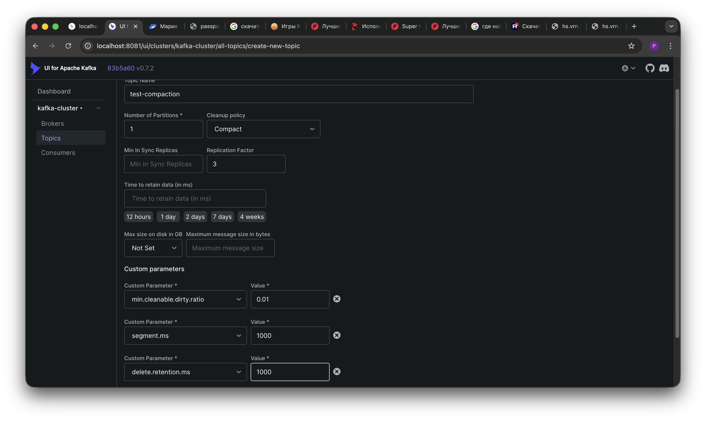

- `cleanup.policy = compact`
- `min.cleanable.dirty.ratio = 0.01`
- `segment.ms = 1000`
- `delete.retention.ms = 1000`

**Отправлено 5 сообщений (2 уникальных ключа):**

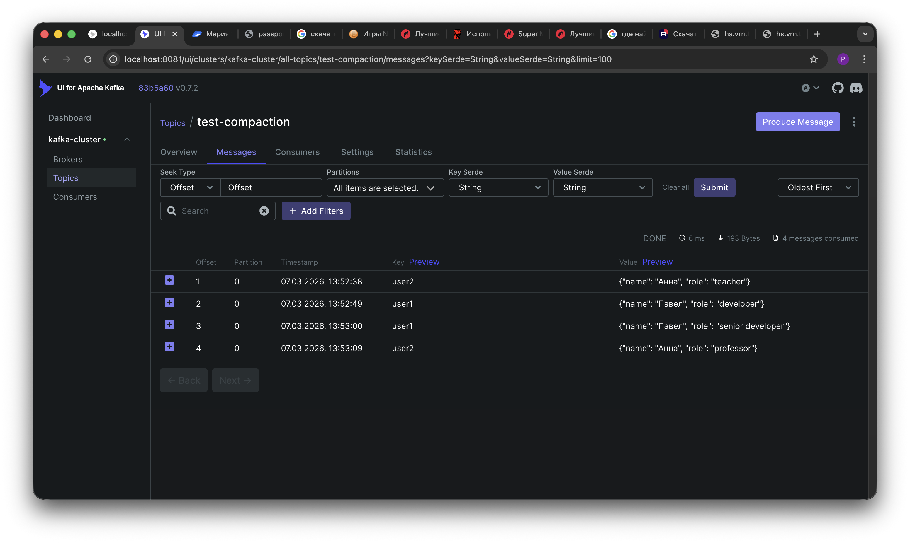

**Промежуточный результат — часть дублей удалена, но не все (текущий сегмент ещё не закрыт):**

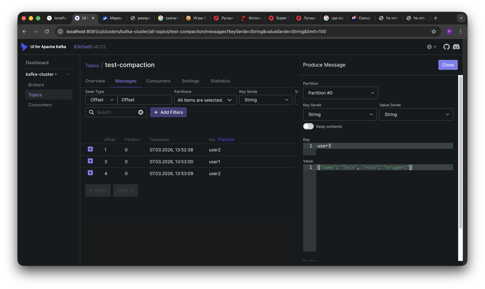

**После отправки дополнительных сообщений для закрытия сегмента — компактирование завершено:**

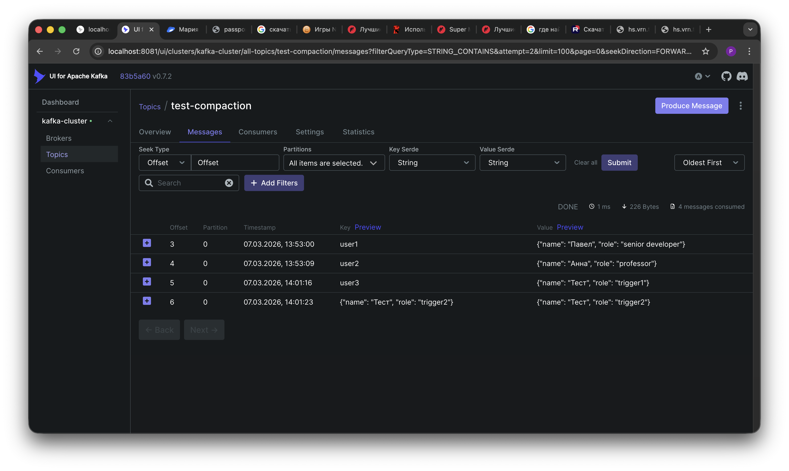

Из исходных 5 сообщений offsets 0, 1, 2 удалены, остались только последние значения для каждого ключа.

---

### 6.5. Consumer Groups

Фиксация состояния consumer groups через Kafka UI.

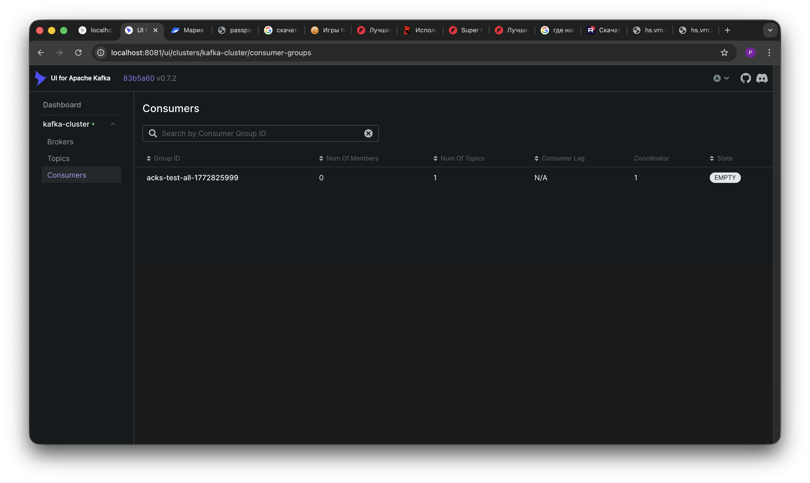

Детальная информация о группе:

- **State** — Empty (consumer отключился) или Active
- **Members** — список подключённых consumer'ов
- **Topic partitions** — назначенные партиции
- **Current offset / End offset / Lag** — прогресс чтения

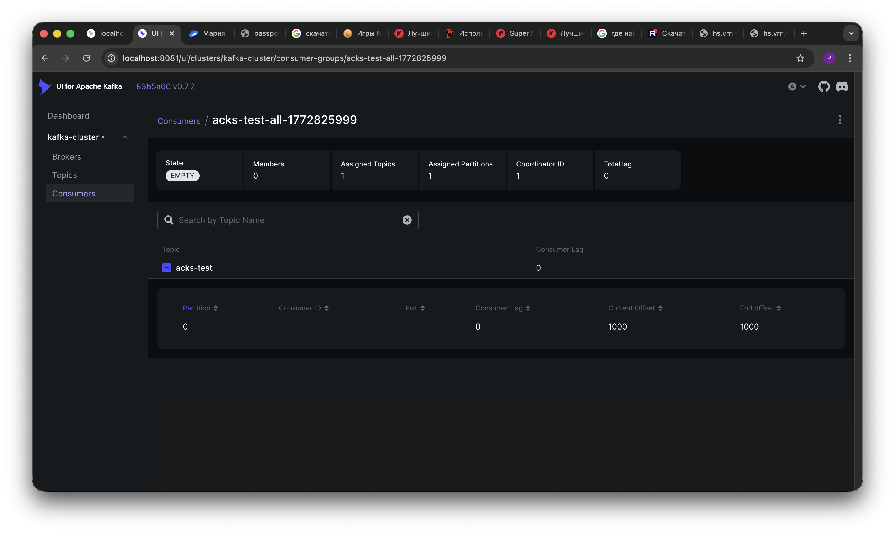

---

## 7. Бенчмарки больших сообщений

### 7.1. Сценарий 2: 10 000 сообщений × 100 KB

Для тестирования пропускной способности на крупных сообщениях создан скрипт `kafka_large_messages_benchmark.py`.

```python
MESSAGE_SIZE = 100 * 1024  # 100 KB
NUM_MESSAGES = 10000

producer = Producer({
    'bootstrap.servers': BOOTSTRAP,
    'acks': 1,
    'linger.ms': 0,
    'message.max.bytes': 26214400,
})
```

**Результаты:**

```
KAFKA LARGE MESSAGES BENCHMARK
10000 сообщений × 100 KB
Реальный размер сообщения: 99.9 KB

Producer результаты:
  Время:       9.89 сек
  Throughput:   1011 msg/sec
  Throughput:   98.7 MB/sec
  Avg latency:  0.974 ms
  p50: 0.830 ms
  p95: 1.526 ms
  p99: 3.383 ms

Consumer результаты:
  Время:       6.84 сек
  Throughput:   1462 msg/sec
  Throughput:   142.8 MB/sec
  Avg latency:  0.378 ms
  p50: 0.003 ms
  p95: 0.007 ms
  p99: 0.012 ms
```

**Сравнение latency с 1 KB сообщениями:**

| Метрика | 1 KB (100K msgs) | 100 KB (10K msgs) | Комментарий |
|---------|------------------|-------------------|-------------|
| Producer p50 | 0.157 ms | 0.830 ms | Больше данных — дольше передача и запись |
| Producer p99 | 0.380 ms | 3.383 ms | Крупные сообщения иногда попадают на flush сегмента |
| Throughput msg/s | 5 868 | 1 011 | Меньше сообщений, но каждое в 100 раз больше |
| Throughput MB/s | ~0.6 MB/s | 98.7 MB/s | В объёме данных Kafka значительно эффективнее |

Producer: 98.7 MB/sec — Kafka прокачивает почти 100 мегабайт в секунду на запись (sequential I/O, близко к максимальной скорости SSD). Consumer: 142.8 MB/sec — чтение ещё быстрее благодаря zero-copy (`sendfile`) и page cache.

---

### 7.2. Сценарий 3: JSON ~20 MB (одно сообщение)

Генерация большого JSON-объекта (12 000 записей пользователей) и отправка его одним сообщением.

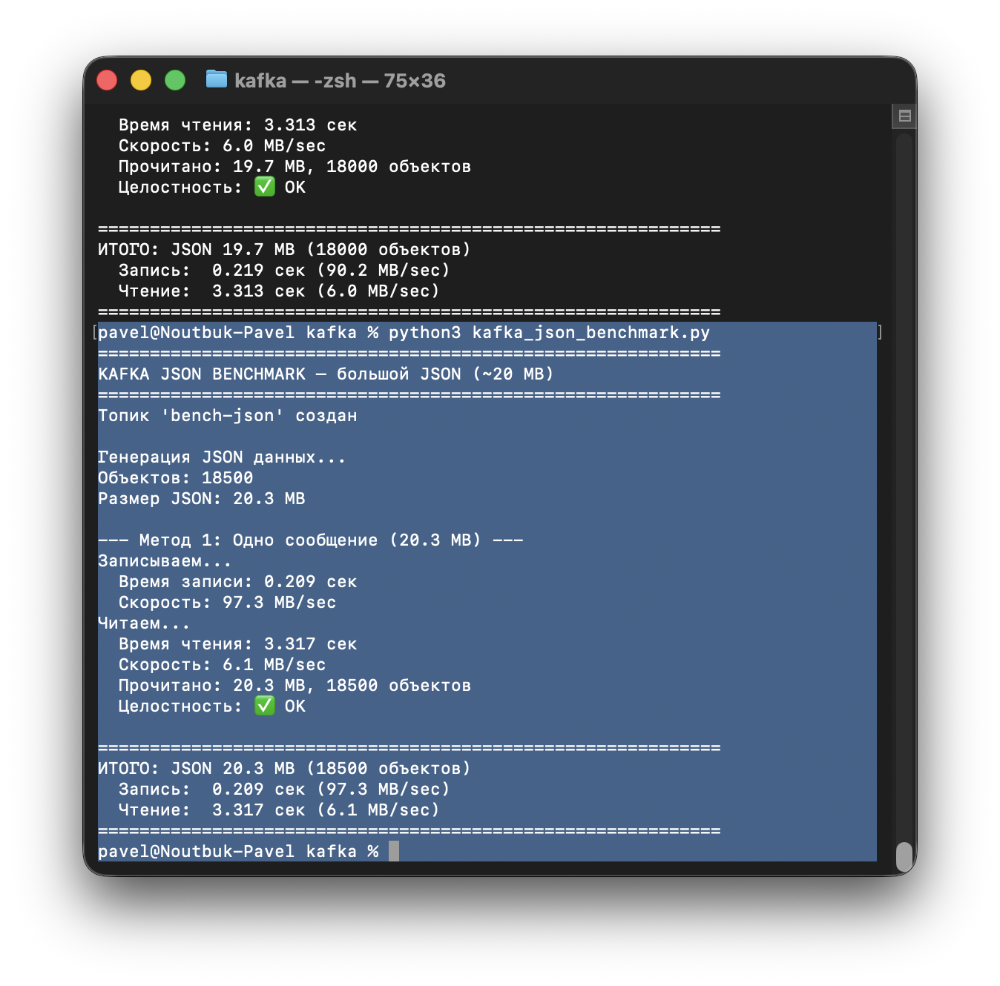

**Результаты:**

```
KAFKA JSON BENCHMARK — большой JSON (~20 MB)

Объектов: 12000
Размер JSON: 20.4 MB

Метод 1: Одно сообщение (20.4 MB)
  Запись: 0.209 сек (97.3 MB/sec)
  Чтение: 3.317 сек (6.1 MB/sec)
  Целостность: ✅ OK
```

Запись: 0.209 сек (97.3 MB/sec) — Kafka проглотила 20 MB одним сообщением за доли секунды. Скорость записи практически идентична сценарию 2 (98.7 MB/sec) — sequential I/O одинаково быстр для одного большого и множества средних сообщений.

Чтение: 3.317 сек (6.1 MB/sec) — значительно медленнее записи. Причина: consumer тратит время на начальный rebalance, а fetch одного огромного сообщения требует выделения большого буфера.

---

## 8. Выводы

### 8.1. Производительность

Kafka демонстрирует высокую производительность на масштабе: при переходе от 1 000 к 100 000 сообщений throughput producer'а вырастает в ~2 раза (JVM-прогрев), а consumer на 100K достигает 30 000+ msg/sec благодаря sequential reads и zero-copy. На крупных сообщениях (100 KB) Kafka показывает ~100 MB/sec на запись и ~143 MB/sec на чтение.

### 8.2. Отказоустойчивость

Кластер из 3 нод с `replication.factor=3` и `min.insync.replicas=2` обеспечивает автоматический failover при падении leader-ноды без потери сообщений. Клиентская библиотека `librdkafka` прозрачно переподключается к новому leader'у.

### 8.3. Гарантии доставки

Параметр `acks` позволяет выбирать баланс между скоростью и надёжностью: `acks=0` — максимальная скорость без гарантий, `acks=1` — подтверждение от leader'а, `acks=all` — подтверждение от всех ISR-реплик (в 2.4 раза медленнее, но максимально надёжно).

### 8.4. Механизмы хранения

Retention позволяет автоматически очищать устаревшие данные по времени. Log Compaction сохраняет только последнее значение для каждого ключа — удобно для хранения актуального состояния (аналог snapshot).

### 8.5. Kafka vs Redis

Kafka и Redis решают разные задачи. Redis быстрее на малых объёмах (in-memory), но Kafka значительно выигрывает на масштабе (broadcast consumer ~6 840 msg/sec vs Redis ~541 msg/sec). Главное отличие — Kafka тратит время на rebalance при старте consumer'а, что критично при малых объёмах, но незаметно на production-нагрузках.
