# Отчет по домашней работе: RabbitMQ

## 1. Запуск кластера RabbitMQ в Docker

### 1.1. Конфигурация docker-compose

Развёрнут кластер из трёх нод RabbitMQ (версия 3.13-management) в Docker. Все ноды используют общий Erlang cookie для взаимной аутентификации и объединены в одну сеть.

**docker-compose.yml:**

```yaml
networks:
  rabbitmq-cluster:
    driver: bridge

services:
  rabbit1:
    image: rabbitmq:3.13-management
    hostname: rabbit1
    container_name: rabbit1
    networks:
      - rabbitmq-cluster
    ports:
      - "5672:5672"     # AMQP
      - "15672:15672"   # Management UI
    environment:
      RABBITMQ_ERLANG_COOKIE: "rabbitmq-homework-cookie"
      RABBITMQ_NODENAME: "rabbit@rabbit1"
      RABBITMQ_DEFAULT_USER: "admin"
      RABBITMQ_DEFAULT_PASS: "admin123"
    volumes:
      - ./rabbitmq.conf:/etc/rabbitmq/rabbitmq.conf:ro
      - rabbit1-data:/var/lib/rabbitmq
    healthcheck:
      test: ["CMD", "rabbitmq-diagnostics", "check_running"]
      interval: 10s
      timeout: 10s
      retries: 12
      start_period: 30s

  rabbit2:
    image: rabbitmq:3.13-management
    hostname: rabbit2
    container_name: rabbit2
    networks:
      - rabbitmq-cluster
    ports:
      - "5673:5672"     # AMQP
      - "15673:15672"   # Management UI
    environment:
      RABBITMQ_ERLANG_COOKIE: "rabbitmq-homework-cookie"
      RABBITMQ_NODENAME: "rabbit@rabbit2"
      RABBITMQ_DEFAULT_USER: "admin"
      RABBITMQ_DEFAULT_PASS: "admin123"
    volumes:
      - ./rabbitmq.conf:/etc/rabbitmq/rabbitmq.conf:ro
      - rabbit2-data:/var/lib/rabbitmq
    depends_on:
      rabbit1:
        condition: service_healthy

  rabbit3:
    image: rabbitmq:3.13-management
    hostname: rabbit3
    container_name: rabbit3
    networks:
      - rabbitmq-cluster
    ports:
      - "5674:5672"     # AMQP
      - "15674:15672"   # Management UI
    environment:
      RABBITMQ_ERLANG_COOKIE: "rabbitmq-homework-cookie"
      RABBITMQ_NODENAME: "rabbit@rabbit3"
      RABBITMQ_DEFAULT_USER: "admin"
      RABBITMQ_DEFAULT_PASS: "admin123"
    volumes:
      - ./rabbitmq.conf:/etc/rabbitmq/rabbitmq.conf:ro
      - rabbit3-data:/var/lib/rabbitmq
    depends_on:
      rabbit1:
        condition: service_healthy

volumes:
  rabbit1-data:
  rabbit2-data:
  rabbit3-data:
```

### 1.2. Конфигурация RabbitMQ

Кластер формируется автоматически через `classic_config`: каждая нода знает статический список соседей и подключается к ним при старте.

**rabbitmq.conf:**

```ini
# ────────────────────────────────────────────────────────────
#  RabbitMQ Configuration — Cluster Auto-Formation
# ────────────────────────────────────────────────────────────

# Peer discovery: ноды находят друг друга через статический список
cluster_formation.peer_discovery_backend = classic_config
cluster_formation.classic_config.nodes.1 = rabbit@rabbit1
cluster_formation.classic_config.nodes.2 = rabbit@rabbit2
cluster_formation.classic_config.nodes.3 = rabbit@rabbit3

# Таймаут ожидания других нод при старте (сек)
cluster_formation.node_cleanup.interval = 30
cluster_formation.node_cleanup.only_log_warning = true

# Management UI — слушать на всех интерфейсах
management.tcp.port = 15672

# Лимит памяти (40% от доступной контейнеру)
vm_memory_high_watermark.relative = 0.4

# Лимит дискового пространства (50MB минимум)
disk_free_limit.absolute = 50MB

# Логирование
log.console = true
log.console.level = info
```

### 1.3. Проверка состояния кластера

После запуска проверяем статус через `rabbitmqctl`. Все три ноды в строю, ни алармов, ни сетевых разделений.

```bash
docker exec rabbit1 rabbitmqctl cluster_status
```

```
Cluster status of node rabbit@rabbit1 ...
Basics

Cluster name: rabbit@rabbit1
Total CPU cores available cluster-wide: 12

Disk Nodes
rabbit@rabbit1
rabbit@rabbit2
rabbit@rabbit3

Running Nodes
rabbit@rabbit1
rabbit@rabbit2
rabbit@rabbit3

Versions
rabbit@rabbit1: RabbitMQ 3.13.7 on Erlang 26.2.5.16
rabbit@rabbit2: RabbitMQ 3.13.7 on Erlang 26.2.5.16
rabbit@rabbit3: RabbitMQ 3.13.7 on Erlang 26.2.5.16

Alarms
(none)

Network Partitions
(none)
```

Главное здесь — три ноды в разделе **Running Nodes** и пустые секции Alarms/Network Partitions. Это и есть признак здорового кластера.

**Скриншот статуса кластера:**

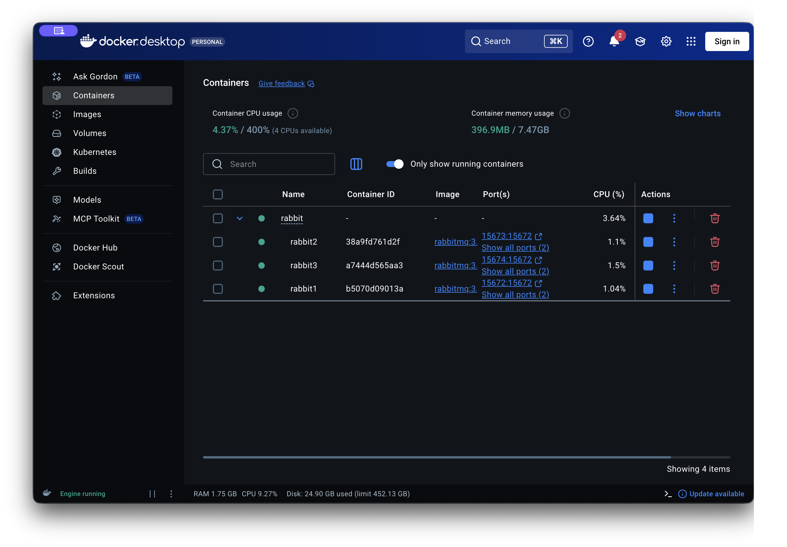

**Итог.** Кластер из трёх нод поднялся и сформировался автоматически — без ручного добавления нод через `rabbitmqctl join_cluster`. Все три ноды видят друг друга, общий Erlang cookie сработал, разделов сети нет. Это и есть та база, на которой дальше тестируется всё остальное.

---

## 2. Работа через Management UI

Прежде чем писать код, удобно пощупать всё руками через веб-интерфейс — так лучше понимаешь, что именно потом будет делать `pika`.

### 2.1. Запуск Management UI

Интерфейс доступен на порту 15672. Авторизуемся под `admin`.

**Скриншот:**

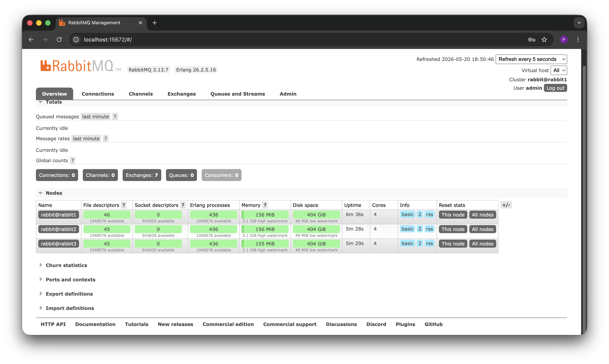

### 2.2. Создание Direct Exchange

Создан exchange `orders-direct` типа `direct` — он маршрутизирует сообщения по точному совпадению routing key.

**Скриншот:**

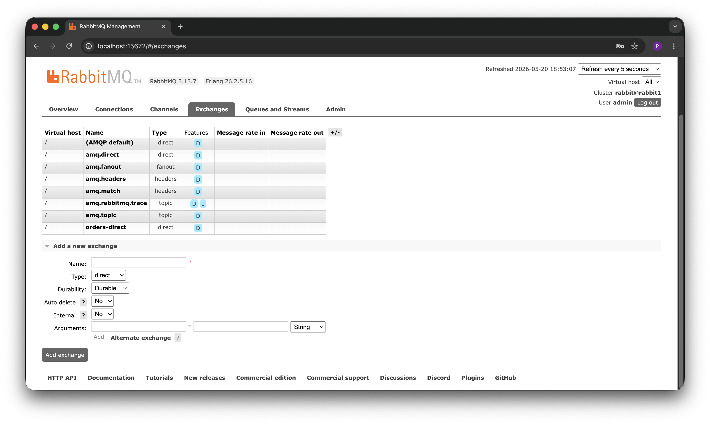

### 2.3. Создание очереди

Создана очередь `order-processing`.

**Скриншот:**

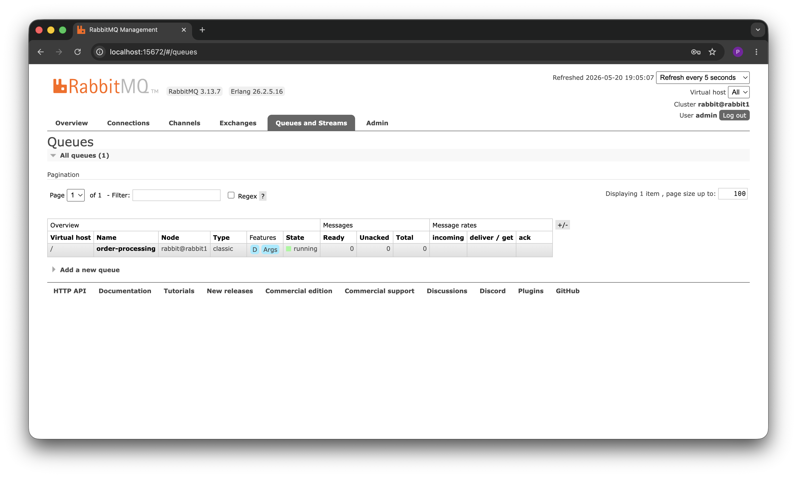

### 2.4. Создание binding

Очередь связана с exchange через routing key `order.created`.

**Скриншот:**

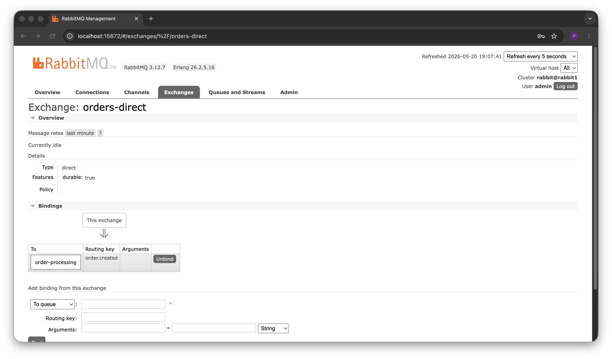

### 2.5. Создание Quorum Queue

Дополнительно создана quorum-очередь `order-processing-qq`. В отличие от классической, она реплицируется по нодам через Raft — пригодится позже, в тестах отказоустойчивости.

**Скриншот:**

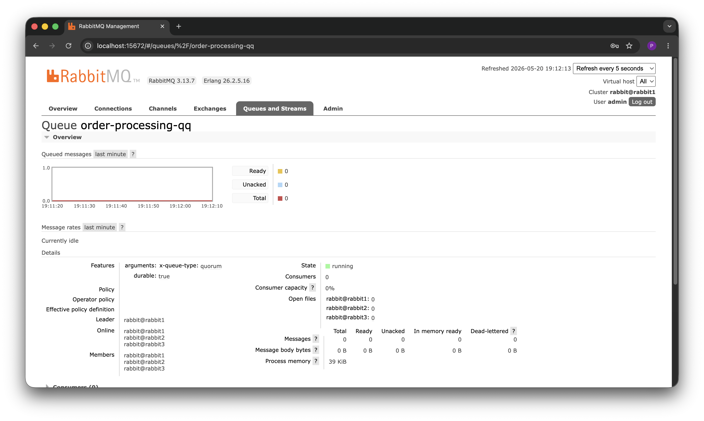

Binding для quorum-очереди:

**Скриншот:**

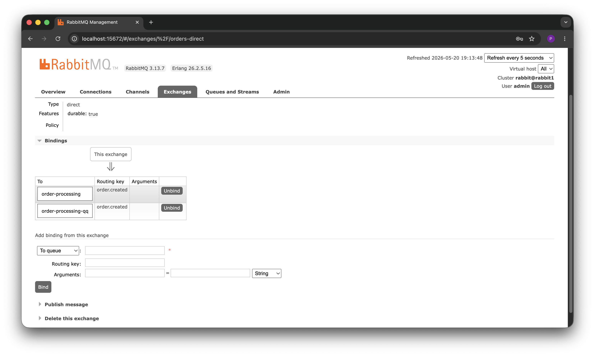

### 2.6. Fanout Exchange

Создан fanout-exchange — этот тип игнорирует routing key и рассылает копию сообщения во все связанные очереди.

**Скриншот:**

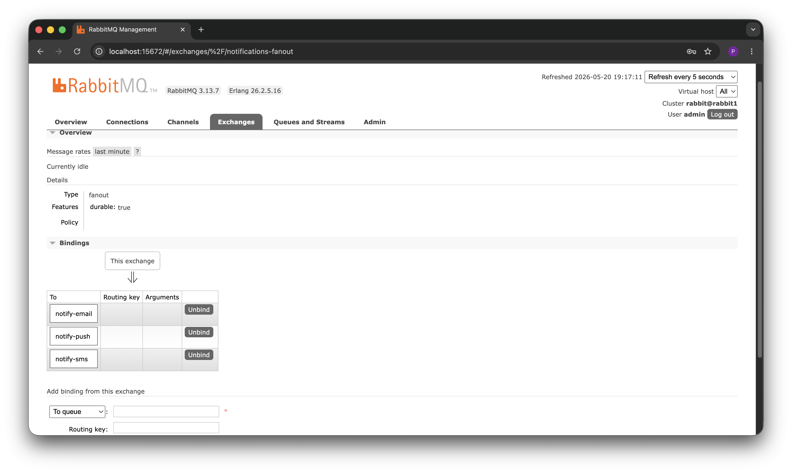

### 2.7. Отправка и получение сообщений

Через UI отправлено событие в `orders-direct` с routing key `order.created`. Сообщение появилось сразу в обеих очередях — `order-processing` и `order-processing-qq`.

**Скриншоты:**


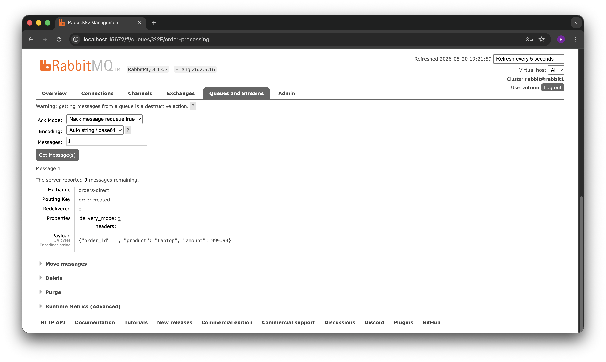

Тест fanout: одно сообщение разлетелось по всем `notify`-очередям.

**Скриншоты:**

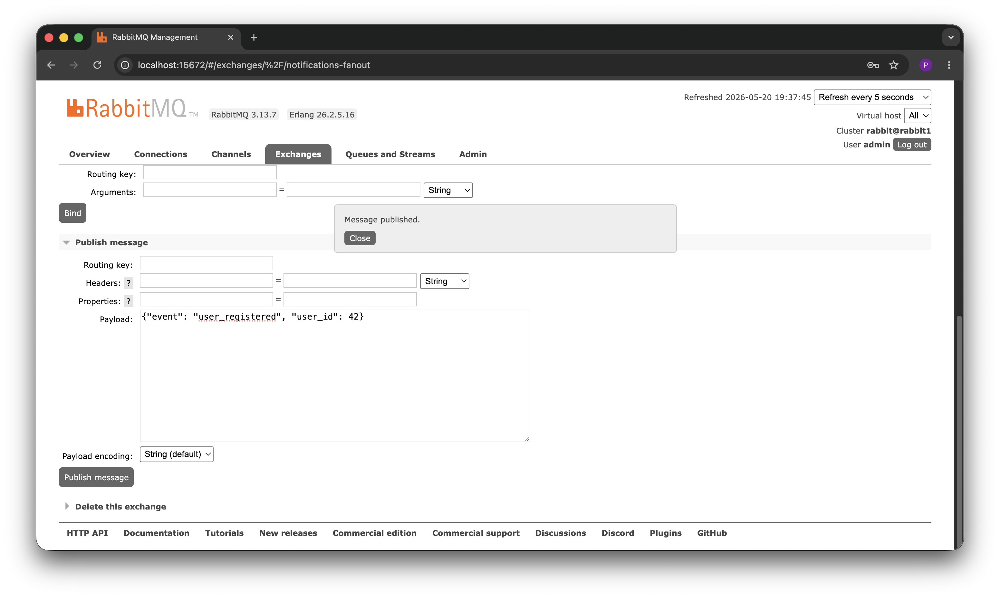

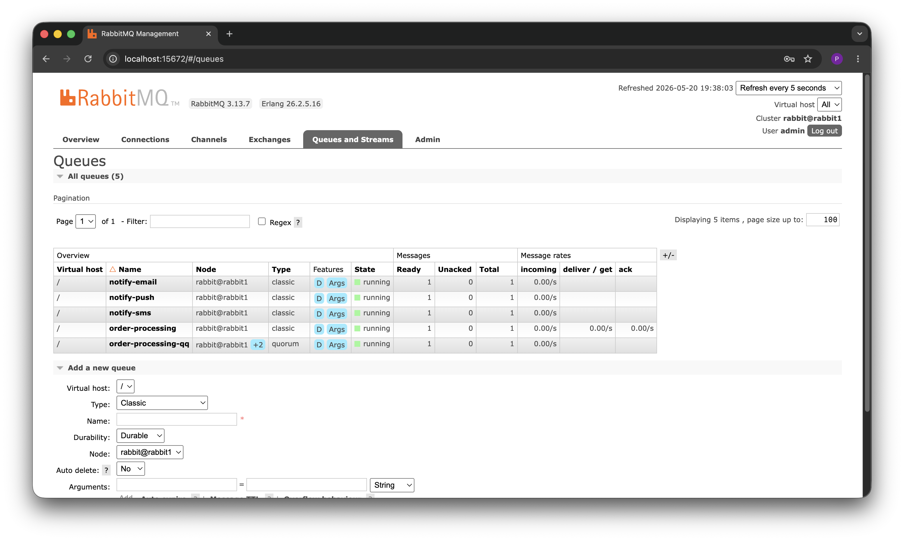

**Итог.** Через UI вручную собрана базовая топология маршрутизации и проверена логика двух типов exchange. Direct по точному ключу `order.created` положил сообщение сразу в две связанные очереди (классическую и quorum), а fanout разослал копию во все очереди, игнорируя routing key. Стало понятно, что именно потом будет декларировать `pika` в коде — это уже не «магия», а те же exchange'и, очереди и binding'и.

---

## 3. Python-скрипты с pika

### 3.1. Producer

Скрипт отправляет 10 сообщений в direct exchange. Из интересного: подключение пытается пройти по очереди ко всем трём нодам (если первая недоступна — берём следующую), и включены publisher confirms — брокер подтверждает приём каждого сообщения.

```python
"""
RabbitMQ Producer — отправка сообщений через direct exchange.
"""

import pika
import json
import sys

# ── Подключение к кластеру ──
# Указываем все 3 ноды — pika переключится, если одна недоступна
credentials = pika.PlainCredentials('admin', 'admin123')

connection_params = [
    pika.ConnectionParameters(host='localhost', port=5672, credentials=credentials),
    pika.ConnectionParameters(host='localhost', port=5673, credentials=credentials),
    pika.ConnectionParameters(host='localhost', port=5674, credentials=credentials),
]

for params in connection_params:
    try:
        connection = pika.BlockingConnection(params)
        print(f"Подключились к {params.host}:{params.port}")
        break
    except pika.exceptions.AMQPConnectionError:
        print(f"Нода {params.host}:{params.port} недоступна, пробуем следующую...")
else:
    print("Не удалось подключиться ни к одной ноде!")
    sys.exit(1)

channel = connection.channel()

# ── Декларация инфраструктуры (идемпотентно) ──
channel.exchange_declare(
    exchange='orders-direct',
    exchange_type='direct',
    durable=True
)

channel.queue_declare(queue='order-processing', durable=True)

channel.queue_bind(
    queue='order-processing',
    exchange='orders-direct',
    routing_key='order.created'
)

# ── Publisher Confirms ──
channel.confirm_delivery()

# ── Отправка сообщений ──
num_messages = 10

for i in range(1, num_messages + 1):
    message = {
        "order_id": i,
        "product": f"Product-{i}",
        "amount": round(100.0 * i, 2),
        "status": "created"
    }
    try:
        channel.basic_publish(
            exchange='orders-direct',
            routing_key='order.created',
            body=json.dumps(message),
            properties=pika.BasicProperties(
                delivery_mode=2,        # persistent
                content_type='application/json'
            )
        )
        print(f"Отправлено: order_id={i}, amount={message['amount']}")
    except pika.exceptions.UnroutableError:
        print(f"Сообщение {i} не доставлено!")

connection.close()
```

### 3.2. Consumer

Consumer подписывается на очередь с `prefetch_count=1` (брокер не отдаёт следующее сообщение, пока не подтверждено текущее) и использует ручной ack — то есть сообщение считается обработанным только после явного подтверждения.

```python
"""
RabbitMQ Consumer — получение и обработка сообщений.
"""

import pika
import json
import sys

credentials = pika.PlainCredentials('admin', 'admin123')

connection_params = [
    pika.ConnectionParameters(host='localhost', port=5672, credentials=credentials),
    pika.ConnectionParameters(host='localhost', port=5673, credentials=credentials),
    pika.ConnectionParameters(host='localhost', port=5674, credentials=credentials),
]

for params in connection_params:
    try:
        connection = pika.BlockingConnection(params)
        print(f"Подключились к {params.host}:{params.port}")
        break
    except pika.exceptions.AMQPConnectionError:
        print(f"Нода {params.host}:{params.port} недоступна, пробуем следующую...")
else:
    print("Не удалось подключиться ни к одной ноде!")
    sys.exit(1)

channel = connection.channel()

# Идемпотентная декларация — consumer может стартовать первым
channel.queue_declare(queue='order-processing', durable=True)

# Получаем по 1 сообщению за раз — честный round-robin
channel.basic_qos(prefetch_count=1)

processed_count = 0

def on_message(ch, method, properties, body):
    global processed_count
    processed_count += 1
    message = json.loads(body)
    print(f"[{processed_count}] order_id={message['order_id']}, "
          f"product={message['product']}, amount={message['amount']}")
    # --- здесь была бы бизнес-логика ---
    ch.basic_ack(delivery_tag=method.delivery_tag)

channel.basic_consume(
    queue='order-processing',
    on_message_callback=on_message,
    auto_ack=False          # manual ack
)

try:
    channel.start_consuming()
except KeyboardInterrupt:
    print(f"Остановлен. Обработано сообщений: {processed_count}")
    channel.stop_consuming()

connection.close()
```

### 3.3. Запуск и наблюдения

Запуск producer'а:

**Скриншоты:**

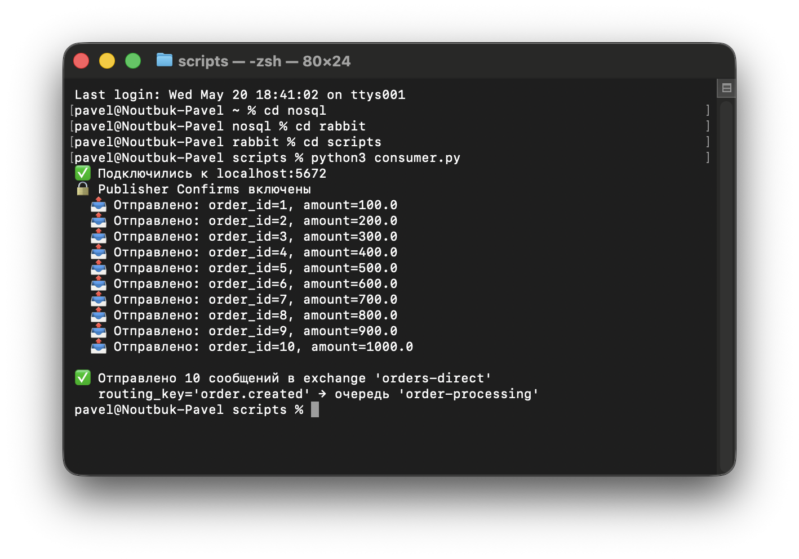


Запуск consumer'а:

**Скриншоты:**

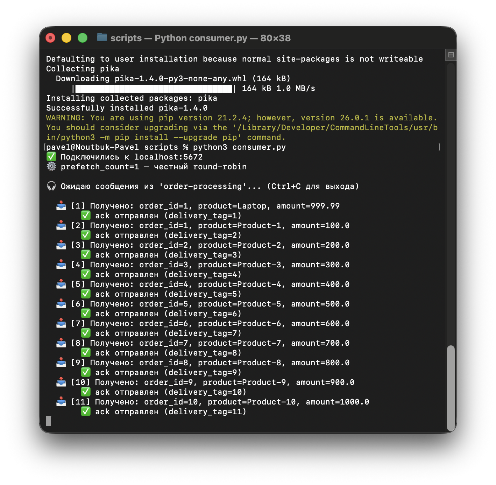

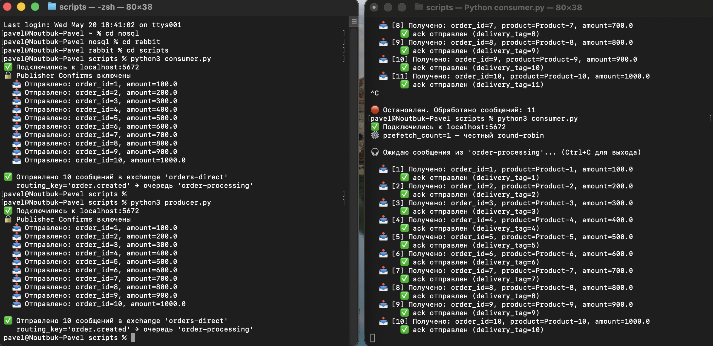

Отдельно проверена развязанность producer'а и consumer'а во времени. Если consumer не запущен, сообщения спокойно копятся в очереди в статусе Ready:

**Скриншот:**

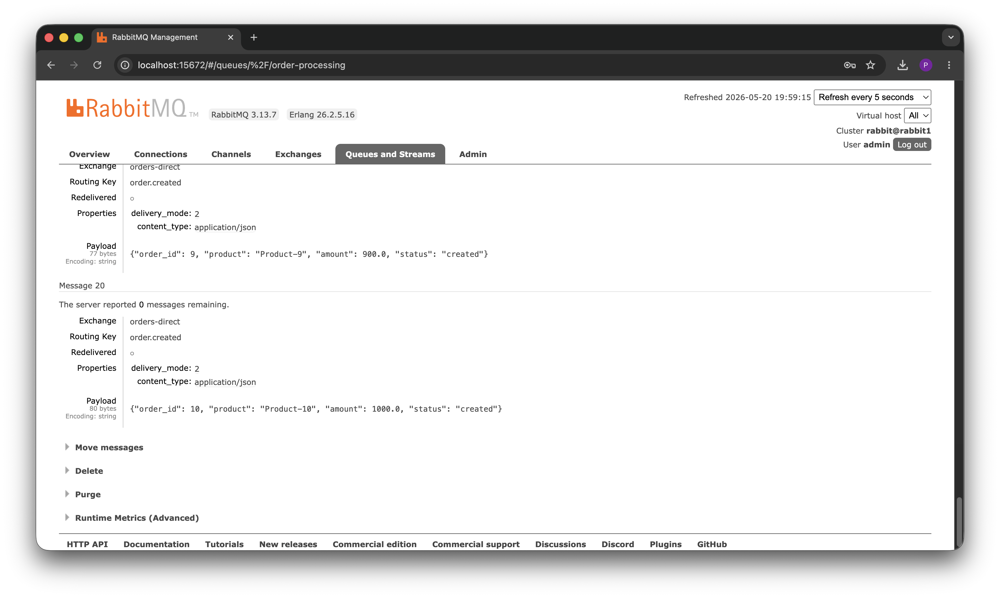

А как только consumer стартует — очередь разгребается, и Ready падает до нуля:

**Скриншот:**

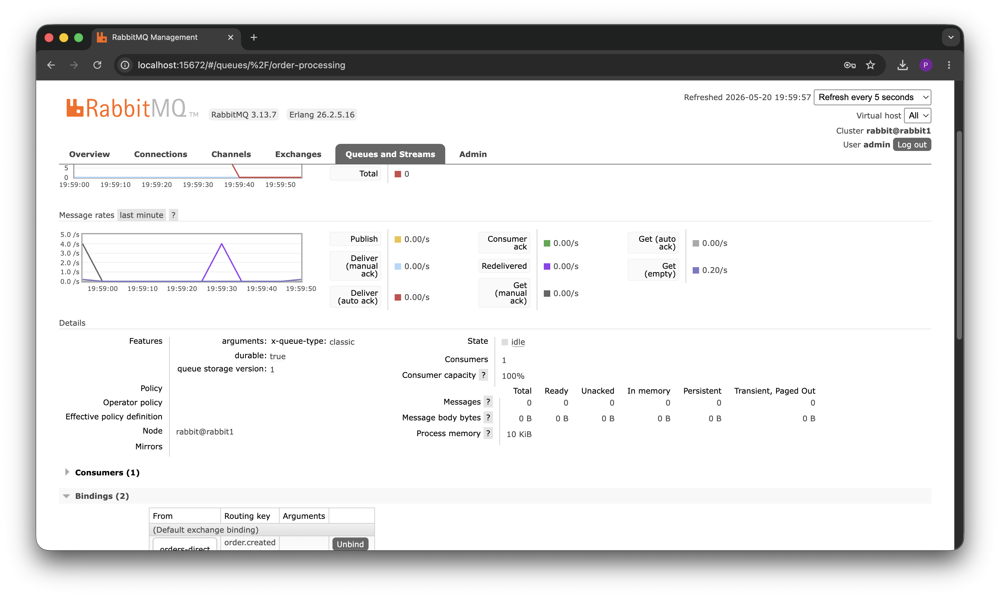

Это, собственно, и есть смысл брокера: producer и consumer не обязаны работать одновременно.

**Итог.** Producer и consumer написаны и проверены в работе. Подтвердились три вещи: подключение с фолбэком корректно перебирает ноды, очередь буферизует сообщения при отсутствующем потребителе, а связка `prefetch_count=1` + ручной ack гарантирует, что сообщение не пропадёт, даже если consumer упадёт в середине обработки (без ack брокер вернёт его в очередь).

---

## 4. Бенчмарки и паттерны доставки

В этой фазе замеряем производительность в двух режимах: конкурентные consumer'ы (work queue) и broadcast (fanout).

### 4.1. Сценарий A: Competing Consumers (Work Queue)

Один producer, одна очередь, три consumer'а. RabbitMQ раздаёт сообщения по round-robin, и при `prefetch_count=1` нагрузка должна лечь равномерно.

```python
"""
Сценарий 4A: Competing Consumers (Work Queue)
1 producer → 1 очередь → 3 consumer'а (round-robin)
"""

import pika
import json
import time
import threading

RABBITMQ_NODES = [
    pika.ConnectionParameters('localhost', 5672, '/', pika.PlainCredentials('admin', 'admin123')),
    pika.ConnectionParameters('localhost', 5673, '/', pika.PlainCredentials('admin', 'admin123')),
    pika.ConnectionParameters('localhost', 5674, '/', pika.PlainCredentials('admin', 'admin123')),
]
QUEUE_NAME = 'benchmark-competing'
NUM_MESSAGES = 1000
EXCHANGE = ''  # default exchange


def get_connection():
    for params in RABBITMQ_NODES:
        try:
            return pika.BlockingConnection(params)
        except pika.exceptions.AMQPConnectionError:
            continue
    raise Exception("Не удалось подключиться ни к одной ноде")


def run_producer():
    conn = get_connection()
    ch = conn.channel()
    ch.queue_declare(queue=QUEUE_NAME, durable=True)
    ch.confirm_delivery()

    start = time.time()
    for i in range(NUM_MESSAGES):
        msg = json.dumps({"id": i, "data": f"task-{i}"})
        ch.basic_publish(
            exchange=EXCHANGE,
            routing_key=QUEUE_NAME,
            body=msg,
            properties=pika.BasicProperties(delivery_mode=2)
        )
    elapsed = time.time() - start
    rate = NUM_MESSAGES / elapsed
    print(f"Producer завершён: {NUM_MESSAGES} сообщений за {elapsed:.2f}с ({rate:.0f} msg/s)")
    conn.close()
    return elapsed, rate


def run_consumer(consumer_id, results, stop_event):
    conn = get_connection()
    ch = conn.channel()
    ch.queue_declare(queue=QUEUE_NAME, durable=True)
    ch.basic_qos(prefetch_count=1)

    count = 0

    def on_message(ch, method, properties, body):
        nonlocal count
        count += 1
        ch.basic_ack(delivery_tag=method.delivery_tag)

    ch.basic_consume(queue=QUEUE_NAME, on_message_callback=on_message, auto_ack=False)

    while not stop_event.is_set():
        conn.process_data_events(time_limit=0.5)

    results[consumer_id] = count
    print(f"Consumer-{consumer_id}: обработал {count} сообщений")
    conn.close()


if __name__ == '__main__':
    num_consumers = 3
    results = {}
    stop_event = threading.Event()

    threads = []
    for i in range(num_consumers):
        t = threading.Thread(target=run_consumer, args=(i, results, stop_event))
        t.start()
        threads.append(t)

    time.sleep(1)  # ждём, пока consumer'ы подпишутся
    prod_time, prod_rate = run_producer()

    time.sleep(3)  # ждём завершения обработки
    stop_event.set()
    for t in threads:
        t.join(timeout=5)

    total_consumed = sum(results.values())
    print(f"\nСообщений отправлено:  {NUM_MESSAGES}")
    print(f"Сообщений обработано:  {total_consumed}")
    print(f"Producer throughput:   {prod_rate:.0f} msg/s")
    print(f"Распределение по consumer'ам:")
    for cid, cnt in sorted(results.items()):
        pct = cnt / total_consumed * 100 if total_consumed else 0
        print(f"  Consumer-{cid}: {cnt} ({pct:.1f}%)")
```

**Результат выполнения:**

```
Producer завершён: 1000 сообщений за 1.39с (722 msg/s)
Consumer-1: обработал 334 сообщений
Consumer-0: обработал 333 сообщений
Consumer-2: обработал 333 сообщений

Сообщений отправлено:  1000
Сообщений обработано:  1000
Producer throughput:   722 msg/s
Распределение по consumer'ам:
  Consumer-0: 333 (33.3%)
  Consumer-1: 334 (33.4%)
  Consumer-2: 333 (33.3%)
```

Распределение получилось почти идеальным — 333/334/333. Именно так и должен работать `prefetch_count=1`: никто из consumer'ов не «нахватывает» сообщений впрок.

**Скриншот:**

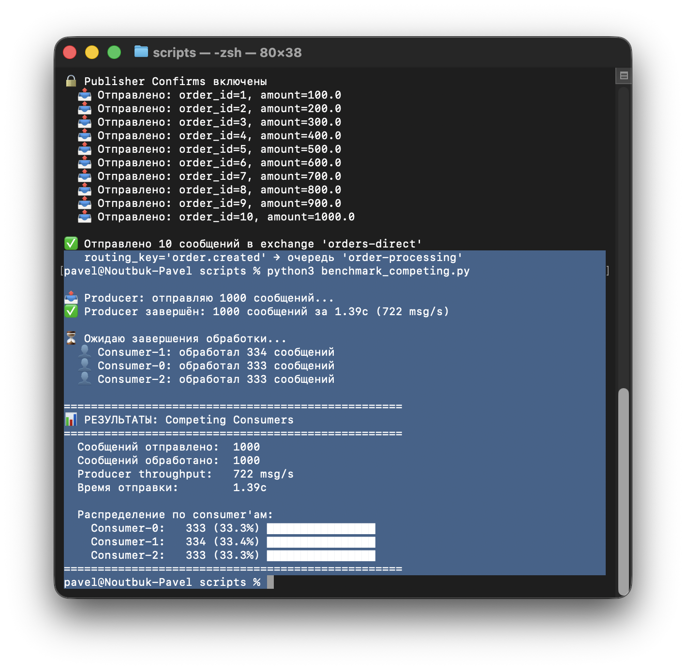

### 4.2. Сценарий B: Fanout (Broadcast)

Здесь один producer, fanout exchange и три очереди — каждая получает копию каждого сообщения. То есть 1000 отправленных превращаются в 3000 на стороне consumer'ов.

**Результат выполнения:**

```
Setup: exchange + 3 очереди + bindings созданы

Producer завершён: 1000 сообщений за 2.03с (492 msg/s)
Итого сообщений в системе: 1000 × 3 очереди = 3000

Сообщений отправлено:     1000
Копий создано (×3):       3000
Сообщений обработано:     3000
Producer throughput:       492 msg/s

Обработка по consumer'ам:
  Consumer-0 (fanout-queue-0): 1000
  Consumer-1 (fanout-queue-1): 1000
  Consumer-2 (fanout-queue-2): 1000
```

**Скриншот:**

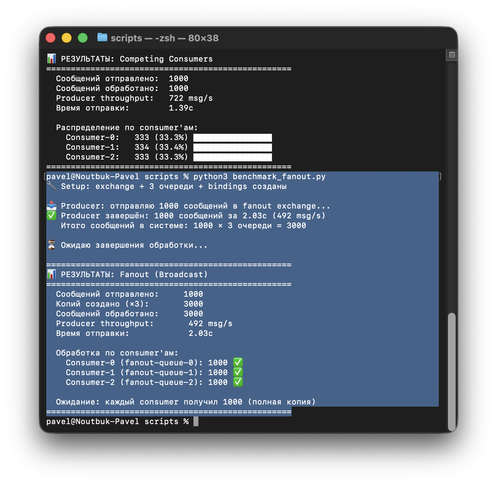

### 4.3. Сравнение результатов

| Метрика | Competing (4A) | Fanout (4B) |
|---|---|---|
| Producer throughput | 722 msg/s | 492 msg/s |
| Время отправки | 1.39с | 2.03с |
| Сообщений на consumer'а | ~333 | 1000 |
| Всего обработано | 1000 | 3000 |

Fanout заметно медленнее по throughput, и это логично: брокер записывает каждое сообщение в три очереди вместо одной, отсюда и просадка с 722 до 492 msg/s. По сути это плата за широковещание — мы получили тройную доставку, но и работы у брокера втрое больше.

---

## 5. Гарантии доставки и Dead Letter Exchange

### 5.1. Бенчмарк режимов доставки

Сравниваем три уровня надёжности: fire-and-forget (без подтверждений, transient-сообщения), confirmed на классической очереди и confirmed на quorum-очереди с Raft-репликацией. В терминах Kafka это примерно `acks=0`, `acks=1` и `acks=all`.

```python
"""
Фаза 5.1: Сравнение режимов доставки
- fire-and-forget (без confirms, transient)
- confirmed (publisher confirms + persistent + durable)
- confirmed + quorum queue (Raft-репликация)
"""

import pika
import json
import time

RABBITMQ_NODES = [
    pika.ConnectionParameters('localhost', 5672, '/', pika.PlainCredentials('admin', 'admin123')),
    pika.ConnectionParameters('localhost', 5673, '/', pika.PlainCredentials('admin', 'admin123')),
    pika.ConnectionParameters('localhost', 5674, '/', pika.PlainCredentials('admin', 'admin123')),
]
NUM_MESSAGES = 1000


def get_connection():
    for params in RABBITMQ_NODES:
        try:
            return pika.BlockingConnection(params)
        except pika.exceptions.AMQPConnectionError:
            continue
    raise Exception("Не удалось подключиться")


def benchmark_fire_and_forget():
    conn = get_connection()
    ch = conn.channel()
    ch.queue_declare(queue='bench-fire-forget', durable=False)
    start = time.time()
    for i in range(NUM_MESSAGES):
        ch.basic_publish(
            exchange='', routing_key='bench-fire-forget',
            body=json.dumps({"id": i}),
            properties=pika.BasicProperties(delivery_mode=1)  # transient
        )
    elapsed = time.time() - start
    ch.queue_delete(queue='bench-fire-forget')
    conn.close()
    return elapsed


def benchmark_confirmed_classic():
    conn = get_connection()
    ch = conn.channel()
    ch.queue_declare(queue='bench-confirmed', durable=True)
    ch.confirm_delivery()
    start = time.time()
    for i in range(NUM_MESSAGES):
        ch.basic_publish(
            exchange='', routing_key='bench-confirmed',
            body=json.dumps({"id": i}),
            properties=pika.BasicProperties(delivery_mode=2)  # persistent
        )
    elapsed = time.time() - start
    ch.queue_delete(queue='bench-confirmed')
    conn.close()
    return elapsed


def benchmark_confirmed_quorum():
    conn = get_connection()
    ch = conn.channel()
    ch.queue_declare(
        queue='bench-quorum',
        durable=True,
        arguments={'x-queue-type': 'quorum'}
    )
    ch.confirm_delivery()
    start = time.time()
    for i in range(NUM_MESSAGES):
        ch.basic_publish(
            exchange='', routing_key='bench-quorum',
            body=json.dumps({"id": i}),
            properties=pika.BasicProperties(delivery_mode=2)
        )
    elapsed = time.time() - start
    ch.queue_delete(queue='bench-quorum')
    conn.close()
    return elapsed


if __name__ == '__main__':
    t1 = benchmark_fire_and_forget()
    r1 = NUM_MESSAGES / t1
    t2 = benchmark_confirmed_classic()
    r2 = NUM_MESSAGES / t2
    t3 = benchmark_confirmed_quorum()
    r3 = NUM_MESSAGES / t3

    print(f"{'Режим':<35} {'Время':>8} {'msg/s':>10}")
    print(f"{'fire-and-forget':<35} {t1:>7.2f}с {r1:>9.0f}")
    print(f"{'confirmed + classic':<35} {t2:>7.2f}с {r2:>9.0f}")
    print(f"{'confirmed + quorum (Raft)':<35} {t3:>7.2f}с {r3:>9.0f}")
    print(f"\nЗамедление confirmed vs fire-and-forget: {t2/t1:.1f}x")
    print(f"Замедление quorum vs fire-and-forget:    {t3/t1:.1f}x")
    print(f"Замедление quorum vs confirmed classic:  {t3/t2:.1f}x")
```

**Результат выполнения:**

```
Режим                                  Время      msg/s
fire-and-forget                        0.14с      7200
confirmed + classic                    1.25с       799
confirmed + quorum (Raft)              1.66с       602

Замедление confirmed vs fire-and-forget: 9.0x
Замедление quorum vs fire-and-forget:    12.0x
Замедление quorum vs confirmed classic:  1.3x
```

**Скриншот:**

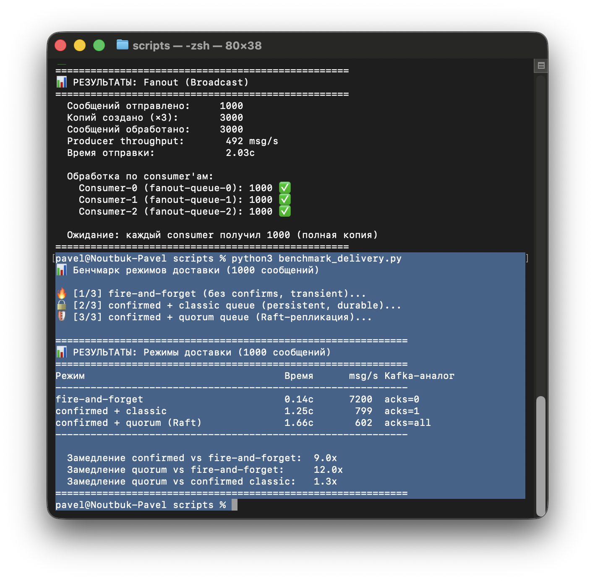

Тут хорошо видна цена надёжности. Fire-and-forget выдаёт 7200 msg/s, но без всяких гарантий. Как только включаем подтверждения и пишем на диск, скорость падает в 9 раз — до 799 msg/s. А quorum-очередь добавляет ещё минус 30%, потому что producer ждёт подтверждения от большинства нод (2 из 3) через Raft. По сути это шкала «скорость против сохранности»: каждый шаг к надёжности оплачивается throughput'ом.

### 5.2. DLX через TTL

Dead Letter Exchange — это «куда уходят сообщения, которые по той или иной причине выпали из обычной обработки». Первый триггер — истечение TTL. Создаём рабочую очередь с TTL 30 секунд: что не успело обработаться — автоматически переезжает в DLQ силами самого брокера.

```python
"""
Фаза 5.2: Dead Letter Exchange через TTL.
Сообщения с TTL 30 сек → после истечения уходят в DLQ.
"""

import pika
import json
import time

conn = pika.BlockingConnection(
    pika.ConnectionParameters('localhost', 5672, '/', pika.PlainCredentials('admin', 'admin123'))
)
ch = conn.channel()

# ── DLX инфраструктура ──
ch.exchange_declare(exchange='dlx-exchange', exchange_type='direct', durable=True)
ch.queue_declare(queue='dead-letter-queue', durable=True)
ch.queue_bind(queue='dead-letter-queue', exchange='dlx-exchange', routing_key='dead')

# ── Рабочая очередь с TTL и DLX ──
ch.queue_declare(
    queue='work-queue-ttl',
    durable=True,
    arguments={
        'x-message-ttl': 30000,              # 30 секунд TTL
        'x-dead-letter-exchange': 'dlx-exchange',
        'x-dead-letter-routing-key': 'dead'
    }
)

# ── Отправляем сообщения ──
num_messages = 5
for i in range(1, num_messages + 1):
    msg = json.dumps({"id": i, "data": f"message-{i}", "created_at": time.strftime("%H:%M:%S")})
    ch.basic_publish(
        exchange='', routing_key='work-queue-ttl',
        body=msg,
        properties=pika.BasicProperties(delivery_mode=2)
    )
    print(f"Отправлено: message-{i}")

conn.close()
```

**Результаты:**

В первый момент после отправки `work-queue-ttl` содержит 5 сообщений, DLQ пуста.

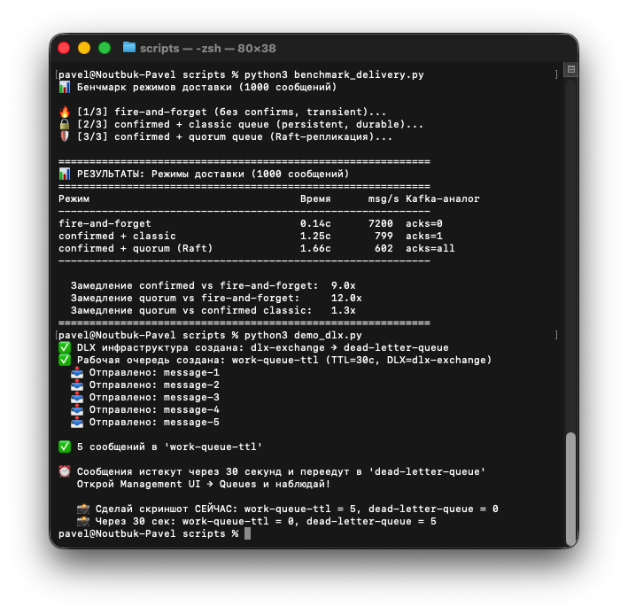

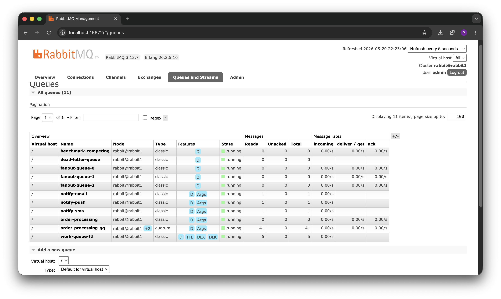

Через 30 секунд картина переворачивается: рабочая очередь опустела, а все пять сообщений оказались в `dead-letter-queue`.

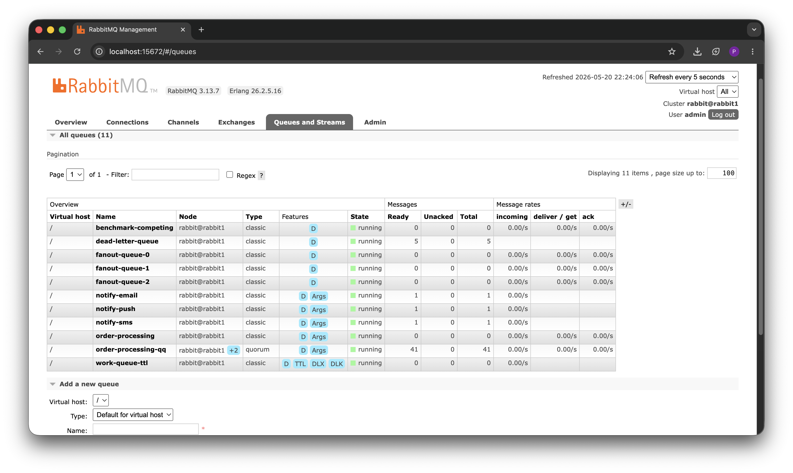

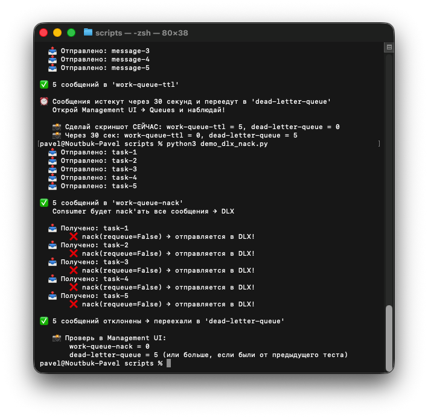

Что тут важно: сообщения переехали без единой строчки кода со стороны consumer'а — это полностью декларативный механизм. Достаточно указать аргументы при создании очереди (`x-message-ttl`, `x-dead-letter-exchange`, `x-dead-letter-routing-key`), и дальше брокер сам разруливает. И в отличие от обычного удаления по таймауту, expired-сообщения не теряются, а «паркуются» в DLQ — их можно проанализировать или переобработать. На практике это удобно для отложенной доставки (retry через TTL + DLX) и для мониторинга зависших задач.

### 5.3. DLX через nack

Второй триггер для DLX — явный отказ consumer'а. Здесь consumer получает сообщение и делает `basic_nack(requeue=False)`, что означает «не возвращай в очередь, отправь в DLX». Это классический паттерн обработки «отравленных» сообщений (poison messages).

```python
"""
Фаза 5.3: DLX через nack (отравленные сообщения).
Consumer получает сообщения и делает nack(requeue=False) → DLX.
"""

import pika
import json

conn = pika.BlockingConnection(
    pika.ConnectionParameters('localhost', 5672, '/', pika.PlainCredentials('admin', 'admin123'))
)
ch = conn.channel()

# ── Инфраструктура (DLX уже создан ранее) ──
ch.exchange_declare(exchange='dlx-exchange', exchange_type='direct', durable=True)
ch.queue_declare(queue='dead-letter-queue', durable=True)
ch.queue_bind(queue='dead-letter-queue', exchange='dlx-exchange', routing_key='dead')

ch.queue_declare(
    queue='work-queue-nack',
    durable=True,
    arguments={
        'x-dead-letter-exchange': 'dlx-exchange',
        'x-dead-letter-routing-key': 'dead'
    }
)

# ── Отправляем сообщения ──
for i in range(1, 6):
    msg = json.dumps({"id": i, "data": f"task-{i}"})
    ch.basic_publish(exchange='', routing_key='work-queue-nack', body=msg,
                     properties=pika.BasicProperties(delivery_mode=2))
    print(f"Отправлено: task-{i}")

# ── Consumer с nack ──
ch.basic_qos(prefetch_count=1)
nacked = 0

def on_message(ch, method, properties, body):
    global nacked
    nacked += 1
    msg = json.loads(body)
    print(f"Получено: {msg['data']} → nack(requeue=False) → DLX")
    ch.basic_nack(delivery_tag=method.delivery_tag, requeue=False)
    if nacked >= 5:
        ch.stop_consuming()

ch.basic_consume(queue='work-queue-nack', on_message_callback=on_message, auto_ack=False)
ch.start_consuming()

print(f"{nacked} сообщений отклонены → переехали в 'dead-letter-queue'")

conn.close()
```

**Результат:**

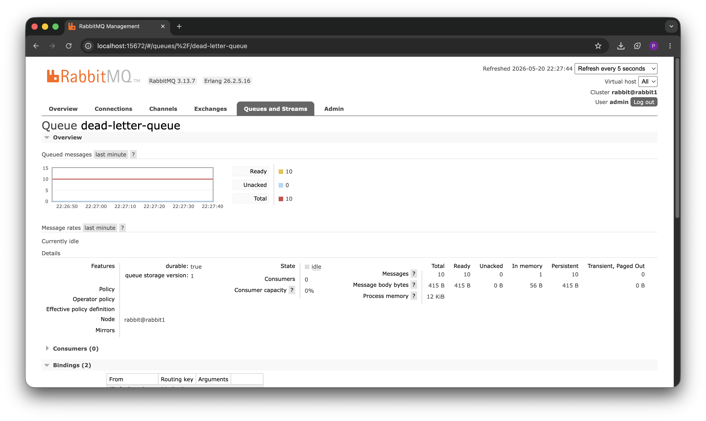

В заголовках сообщений в DLQ виден `x-death` с причиной `rejected` — то есть брокер фиксирует, почему именно сообщение тут оказалось.

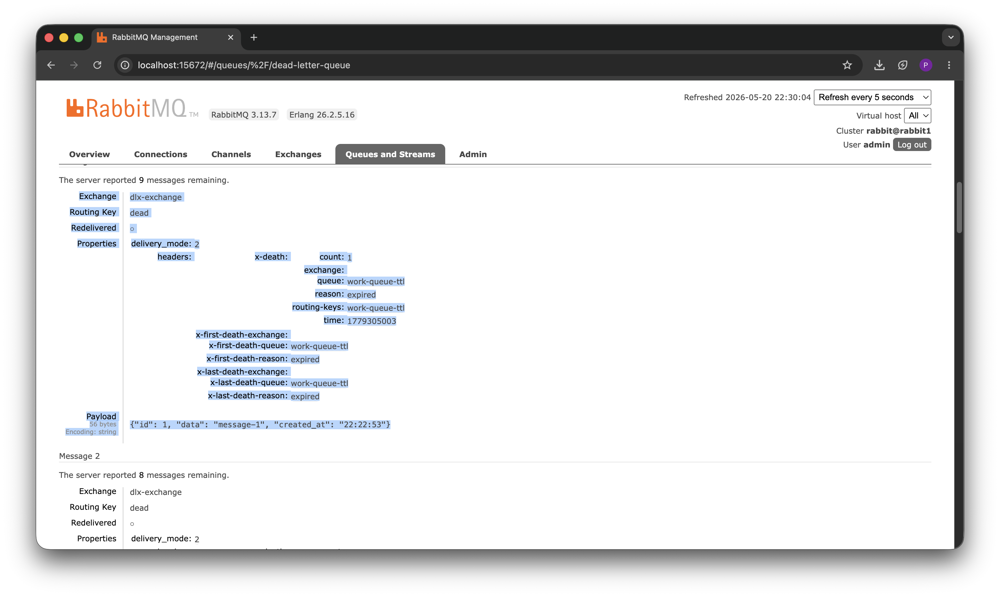

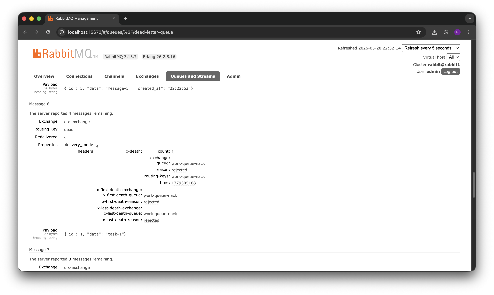

Интересный момент: и TTL-expired, и nack-rejected используют одну и ту же связку DLX/DLQ, но RabbitMQ различает их через `x-death.reason` (`expired` против `rejected`). И ещё критичная деталь — разница между `requeue=True` и `requeue=False`. Первый вернёт сообщение обратно в очередь (а если у нас баг в обработке — получим бесконечный цикл), второй безопасно отправит его в DLX. Поэтому для poison messages всегда `requeue=False`.

**Итог.** Фаза показала две стороны RabbitMQ — цену надёжности и механику обработки сбоев. По надёжности: каждый шаг к гарантиям стоит throughput'а (7200 → 799 → 602 msg/s), и выбор уровня — это всегда осознанный компромисс под конкретную задачу. По сбоям: DLX закрывает оба сценария «что делать с проблемным сообщением» — и просроченным по TTL, и отклонённым consumer'ом — причём декларативно, силами самого брокера, без потери данных.

---

## 6. Отказоустойчивость кластера

### 6.1. Подготовка теста

Создаём quorum-очередь и набиваем её 100 сообщениями. Quorum-очередь реплицируется по всем трём нодам (лидер + два фолловера), и именно это мы сейчас и проверим на прочность.

```python
"""
Фаза 6.1: Подготовка к тесту отказоустойчивости.
Создаём quorum queue и отправляем 100 сообщений.
"""

import pika
import json

conn = pika.BlockingConnection(
    pika.ConnectionParameters('localhost', 5672, '/', pika.PlainCredentials('admin', 'admin123'))
)
ch = conn.channel()

QUEUE = 'failover-test-qq'
ch.queue_declare(
    queue=QUEUE,
    durable=True,
    arguments={'x-queue-type': 'quorum'}
)
ch.confirm_delivery()

print(f"Quorum queue '{QUEUE}' создана")

for i in range(1, 101):
    ch.basic_publish(
        exchange='', routing_key=QUEUE,
        body=json.dumps({"id": i, "data": f"important-{i}"}),
        properties=pika.BasicProperties(delivery_mode=2)
    )

print(f"100 сообщений отправлено в '{QUEUE}'")

conn.close()
```

**Результат:**

```
Quorum queue 'failover-test-qq' создана
100 сообщений отправлено в 'failover-test-qq'
```

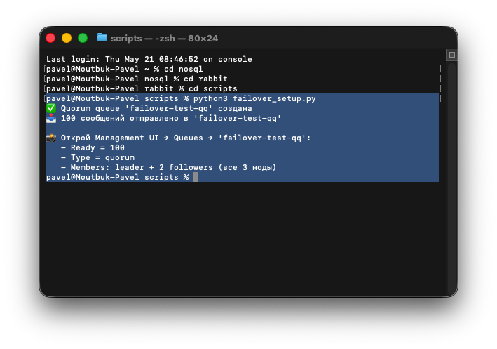

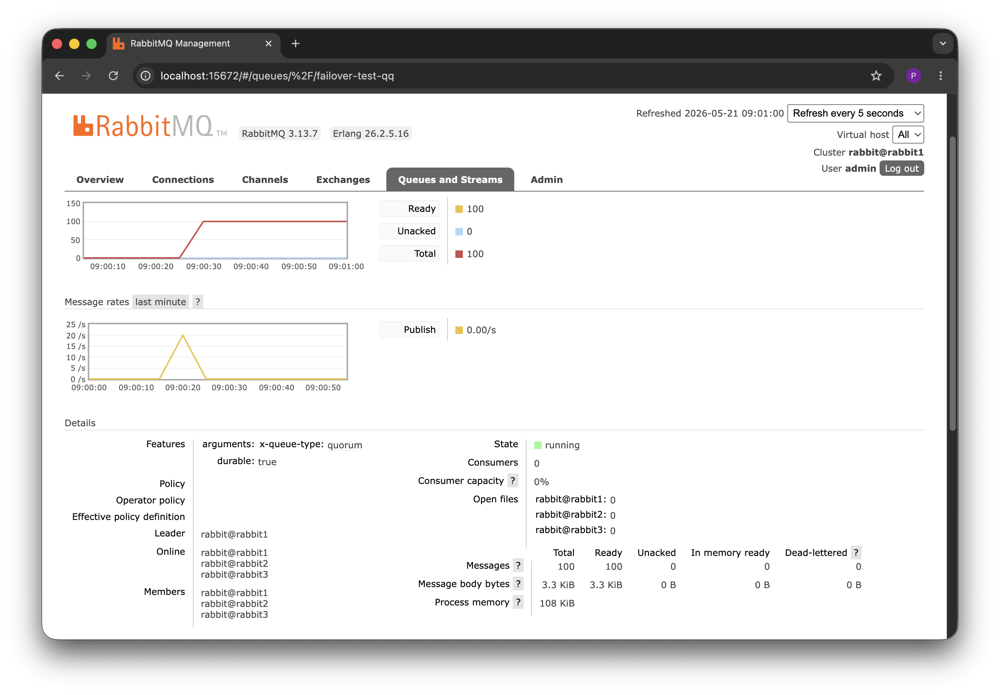

### 6.2. Падение ноды

Останавливаем `rabbit1` — ту самую ноду, через которую всё создавалось.

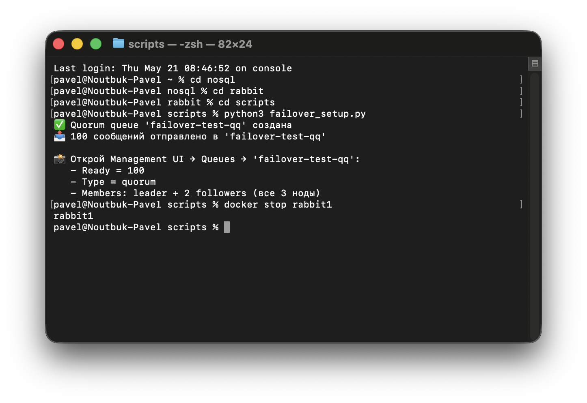

Management UI на первой ноде, ожидаемо, перестал отвечать. Но лидером quorum-очереди автоматически стала `rabbit2`, и все 100 сообщений на месте.

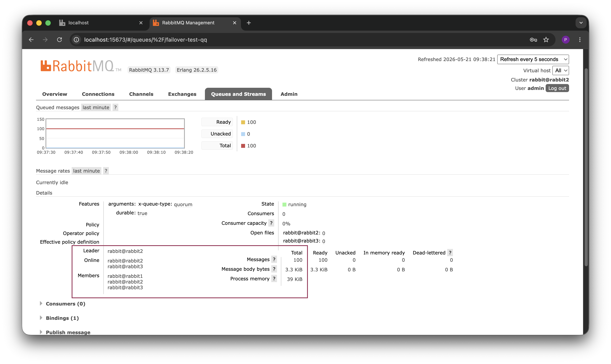

Проверяем статус кластера уже через вторую ноду:

```bash
docker exec rabbit2 rabbitmqctl cluster_status
```

```
Cluster status of node rabbit@rabbit2 ...

Disk Nodes
rabbit@rabbit1
rabbit@rabbit2
rabbit@rabbit3

Running Nodes
rabbit@rabbit2
rabbit@rabbit3

Alarms
(none)

Network Partitions
(none)
```

`rabbit1` всё ещё числится в Disk Nodes (она часть кластера), но в Running Nodes её больше нет — осталось две живых ноды.


### 6.3. Чтение сообщений при упавшей ноде

Главная проверка: можно ли вычитать данные, когда одна нода лежит. Подключаемся к `rabbit2` и забираем все 100 сообщений.

```python
"""
Фаза 6.3: Чтение из quorum queue при упавшей ноде.
Подключаемся к живой ноде и забираем сообщения.
"""

import pika
import json

# rabbit1 упал — подключаемся к rabbit2
conn = pika.BlockingConnection(
    pika.ConnectionParameters('localhost', 5673, '/', pika.PlainCredentials('admin', 'admin123'))
)
ch = conn.channel()

QUEUE = 'failover-test-qq'
ch.basic_qos(prefetch_count=1)

count = 0

def on_message(ch, method, properties, body):
    global count
    count += 1
    msg = json.loads(body)
    if count <= 5 or count % 20 == 0:
        print(f"[{count}] {msg['data']}")
    ch.basic_ack(delivery_tag=method.delivery_tag)
    if count >= 100:
        ch.stop_consuming()

ch.basic_consume(queue=QUEUE, on_message_callback=on_message, auto_ack=False)
print(f"Читаю из '{QUEUE}' через rabbit2 (rabbit1 = DOWN)...")
ch.start_consuming()

print(f"Прочитано {count} сообщений при упавшей ноде")

conn.close()
```

**Результат:**

```
Читаю из 'failover-test-qq' через rabbit2 (rabbit1 = DOWN)...
[1] important-1
[2] important-2
[3] important-3
[4] important-4
[5] important-5
[20] important-20
[40] important-40
[60] important-60
[80] important-80
[100] important-100

Прочитано 100 сообщений при упавшей ноде
```

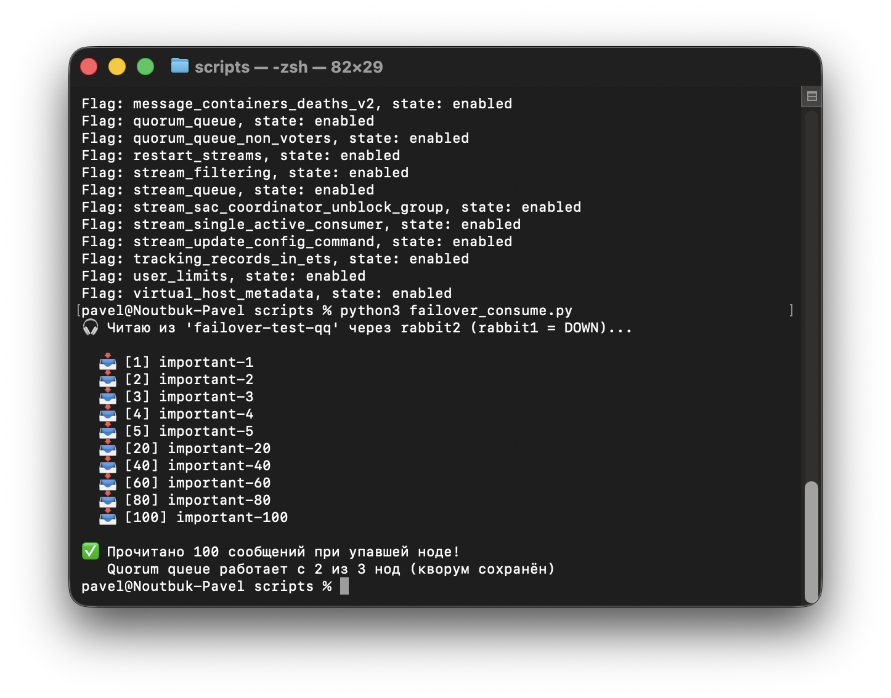

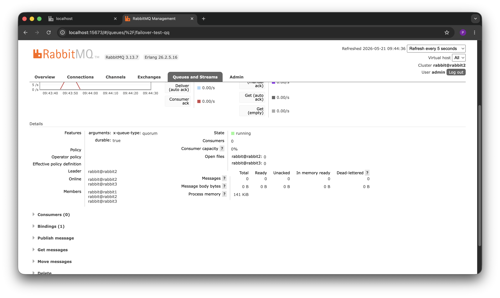

Все 100 сообщений прочитаны без потерь. Кворум сохранён — две ноды из трёх это большинство, и этого достаточно для работы quorum-очереди.

### 6.4. Возврат ноды

Поднимаем `rabbit1` обратно.

```bash
docker start rabbit1
docker exec rabbit1 rabbitmqctl cluster_status
```

```
Running Nodes
rabbit@rabbit1
rabbit@rabbit2
rabbit@rabbit3

Total CPU cores available cluster-wide: 12

Alarms
(none)

Network Partitions
(none)
```

Лидером осталась `rabbit2`, но `rabbit1` снова в строю.

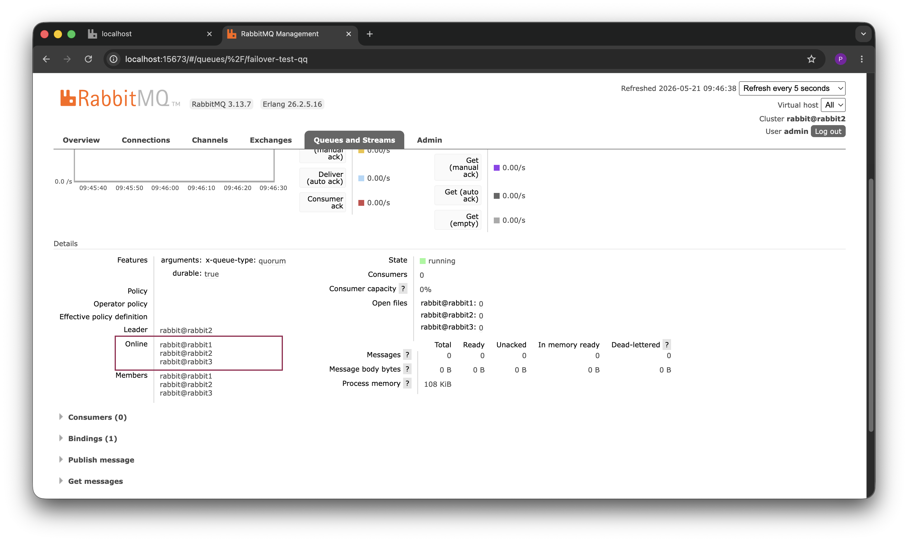

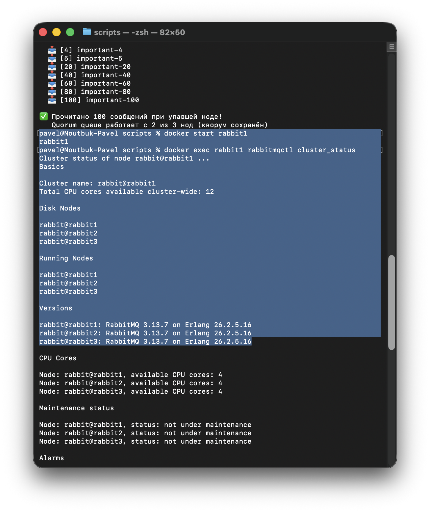

Кластер полностью восстановился: три ноды в Running Nodes, снова доступны все 12 CPU cores, ни алармов, ни partitions. То есть после возврата ноды никаких ручных действий по «склейке» не потребовалось — нода сама догналась и встроилась обратно.

**Итог.** Quorum-очередь прошла полный цикл сбоя и восстановления без единой потери: при падении лидера роль автоматически перешла на живую ноду, все 100 сообщений остались читаемы через оставшиеся две ноды, а вернувшаяся нода сама дореплицировала данные и встроилась в кластер. Это и есть практический смысл нечётного числа нод — две из трёх дают большинство, которого достаточно для сохранения кворума и продолжения работы.

---

## 7. Дополнительные эксперименты

### 7.1. Topic Exchange

Topic-exchange маршрутизирует по паттерну, а не по точному совпадению. Символ `*` совпадает ровно с одним словом, `#` — с нулём или более слов. Создаём три очереди с разными паттернами и смотрим, куда что разойдётся.

```python
"""
Фаза 7.1: Topic Exchange — маршрутизация по паттерну.
"""

import pika
import json

conn = pika.BlockingConnection(
    pika.ConnectionParameters('localhost', 5672, '/', pika.PlainCredentials('admin', 'admin123'))
)
ch = conn.channel()

ch.exchange_declare(exchange='logs-topic', exchange_type='topic', durable=True)

queues = {
    'logs-orders':   'order.*',       # order.created, order.error, но НЕ order.item.created
    'logs-errors':   '#.error',       # всё, что заканчивается на .error
    'logs-all':      '#',             # абсолютно всё
}

for queue_name, binding_key in queues.items():
    ch.queue_declare(queue=queue_name, durable=True)
    ch.queue_bind(queue=queue_name, exchange='logs-topic', routing_key=binding_key)
    print(f"{queue_name} ← binding: '{binding_key}'")

messages = [
    ('order.created',       'Заказ #1 создан'),
    ('order.error',         'Ошибка при создании заказа #2'),
    ('payment.error',       'Ошибка оплаты заказа #3'),
    ('payment.completed',   'Оплата прошла'),
    ('user.signup.error',   'Ошибка регистрации пользователя'),
    ('user.login',          'Пользователь вошёл'),
]

for routing_key, description in messages:
    ch.basic_publish(
        exchange='logs-topic',
        routing_key=routing_key,
        body=json.dumps({"routing_key": routing_key, "desc": description})
    )
    print(f"routing_key='{routing_key}' → {description}")

print("\nРезультат маршрутизации:")
for queue_name, binding_key in queues.items():
    result = ch.queue_declare(queue=queue_name, passive=True)
    count = result.method.message_count
    keys = []
    for _ in range(count):
        method, props, body = ch.basic_get(queue=queue_name, auto_ack=True)
        if method:
            msg = json.loads(body)
            keys.append(msg['routing_key'])
    print(f"\n{queue_name} (pattern: '{binding_key}') — получено {count}:")
    for k in keys:
        print(f"  {k}")

conn.close()
```

Главное наблюдение: одно сообщение может попасть сразу в несколько очередей, если его routing key подходит под несколько паттернов. Например, `order.error` совпадает и с `order.*`, и с `#.error`, и с `#` — значит, оно ляжет во все три очереди одновременно.

### 7.2. Per-message TTL

В отличие от per-queue TTL (где срок жизни задан на всю очередь), здесь TTL указывает сам publisher для каждого сообщения индивидуально через `properties.expiration`.

```python
"""
Фаза 7.2: Per-message TTL — у каждого сообщения свой срок жизни.
"""

import pika
import json

conn = pika.BlockingConnection(
    pika.ConnectionParameters('localhost', 5672, '/', pika.PlainCredentials('admin', 'admin123'))
)
ch = conn.channel()

QUEUE = 'ttl-per-message-demo'

ch.exchange_declare(exchange='dlx-exchange', exchange_type='direct', durable=True)
ch.queue_declare(queue='dead-letter-queue', durable=True)
ch.queue_bind(queue='dead-letter-queue', exchange='dlx-exchange', routing_key='dead')

ch.queue_declare(
    queue=QUEUE,
    durable=True,
    arguments={
        'x-dead-letter-exchange': 'dlx-exchange',
        'x-dead-letter-routing-key': 'dead'
    }
)

ttl_configs = [
    ('msg-fast',     '5000',   '5 сек'),
    ('msg-medium',   '15000',  '15 сек'),
    ('msg-slow',     '30000',  '30 сек'),
    ('msg-immortal',  None,    'без TTL (живёт вечно)'),
]

for msg_id, ttl, label in ttl_configs:
    props = pika.BasicProperties(delivery_mode=2)
    if ttl:
        props.expiration = ttl
    ch.basic_publish(
        exchange='', routing_key=QUEUE,
        body=json.dumps({"id": msg_id, "ttl": label}),
        properties=props
    )
    print(f"{msg_id}: TTL = {label}")

conn.close()
```

По мере истечения сроков очередь `ttl-per-message-demo` уменьшается, а DLQ растёт. Тут есть один нюанс, о который легко споткнуться: expired-сообщение удаляется только с головы очереди (FIFO-ограничение). То есть если в начале очереди лежит «бессмертное» сообщение, то сообщения за ним не уйдут в DLX, даже если их TTL уже истёк — они дождутся своей очереди на проверку.

### 7.3. Queue Max-Length + Overflow Policy

Ограничиваем очередь пятью сообщениями с политикой `drop-head` — при переполнении вытесняется самое старое сообщение. Отправляем 10 и смотрим, что останется.

```python
"""
Фаза 7.3: Queue max-length и overflow policy.
Очередь на 5 сообщений — что происходит при переполнении.
"""

import pika
import json

conn = pika.BlockingConnection(
    pika.ConnectionParameters('localhost', 5672, '/', pika.PlainCredentials('admin', 'admin123'))
)
ch = conn.channel()

ch.exchange_declare(exchange='dlx-exchange', exchange_type='direct', durable=True)
ch.queue_declare(queue='dead-letter-queue', durable=True)
ch.queue_bind(queue='dead-letter-queue', exchange='dlx-exchange', routing_key='dead')

QUEUE = 'overflow-demo'

# Аргументы нельзя менять на лету — пересоздаём очередь
try:
    ch.queue_delete(queue=QUEUE)
except Exception:
    pass

ch.queue_declare(
    queue=QUEUE,
    durable=True,
    arguments={
        'x-max-length': 5,
        'x-overflow': 'drop-head',                # вытесняем самое старое
        'x-dead-letter-exchange': 'dlx-exchange',
        'x-dead-letter-routing-key': 'dead'
    }
)

for i in range(1, 11):
    ch.basic_publish(
        exchange='', routing_key=QUEUE,
        body=json.dumps({"id": i, "data": f"message-{i}"}),
        properties=pika.BasicProperties(delivery_mode=2)
    )
    print(f"Отправлено: message-{i}")

result = ch.queue_declare(queue=QUEUE, passive=True)
print(f"\nВ очереди '{QUEUE}': {result.method.message_count} сообщений")
print("Содержимое очереди (должны остаться 6-10):")
for _ in range(result.method.message_count):
    method, props, body = ch.basic_get(queue=QUEUE, auto_ack=True)
    if method:
        msg = json.loads(body)
        print(f"  {msg['data']}")

conn.close()
```

В очереди остаются сообщения 6–10 (последние пять), а первые пять вытесняются. Причём вытесненные не пропадают бесследно — они уходят в DLX с причиной `maxlen`. Такой паттерн удобен для «скользящего окна» последних N событий, когда старые данные просто не интересны.

### 7.4. Сводка по дополнительным экспериментам

| Механизм | Суть | Аналог в Kafka |
|---|---|---|
| Topic Exchange | Маршрутизация по паттерну (`*` — одно слово, `#` — любое количество); одно сообщение может попасть в несколько очередей | Прямого аналога нет, фильтрация на стороне consumer'а |
| Per-message TTL | Publisher задаёт срок жизни каждому сообщению; нюанс — удаление только с головы очереди | Нет |
| Overflow `drop-head` | Вытеснение старого при переполнении, вытесненное → DLX (`maxlen`) | `retention.bytes` + `cleanup.policy=delete`, но на уровне сегментов лога |

---

## 8. Выводы

В ходе работы был развёрнут и исследован полноценный кластер RabbitMQ из трёх нод. Освоены следующие блоки.

**Кластеризация и инфраструктура.** Поднят кластер с автоформированием через `classic_config`, настроена работа Management UI, созданы exchange'и трёх типов (direct, fanout, topic), классические и quorum-очереди, binding'и.

**Программная работа через pika.** Написаны producer и consumer с подключением к кластеру с фолбэком по нодам, publisher confirms, ручным ack и `prefetch_count=1`. На практике подтвердилась развязка producer'а и consumer'а во времени — сообщения спокойно копятся в очереди и разгребаются, как только появляется потребитель.

**Производительность и гарантии.** Замеры показали чёткую закономерность: чем выше надёжность, тем ниже throughput. Fire-and-forget — 7200 msg/s без гарантий, confirmed на классической очереди — 799 msg/s (в 9 раз медленнее), confirmed на quorum-очереди — 602 msg/s. Competing consumers дают равномерное round-robin распределение, fanout — гарантированную доставку копии в каждую очередь ценой кратного роста нагрузки на брокер.

**Обработка сбойных сообщений.** Разобрана связка TTL/nack + DLX — единая инфраструктура для двух разных триггеров, которые брокер различает через `x-death.reason` (`expired` против `rejected`). Ключевой вывод: для poison messages нужен `nack(requeue=False)`, иначе при баге в обработчике легко получить бесконечный цикл переобработки.

**Отказоустойчивость.** Quorum-очередь пережила падение ноды без потери данных: лидер автоматически переехал на живую ноду, все 100 сообщений остались доступны для чтения через оставшиеся ноды. После возврата упавшей ноды кластер восстановился сам, без ручного вмешательства. Это наглядно показывает, зачем quorum-очередям нужно нечётное число нод — большинства 2 из 3 достаточно для сохранения кворума.

Общее впечатление: RabbitMQ ведёт себя как «умный брокер» — многое из того, что в Kafka приходится решать на стороне приложения (перенаправление сбойных сообщений, индивидуальные TTL, вытеснение по лимиту), здесь делается декларативно через аргументы очередей. За это платишь меньшим максимальным throughput'ом, но взамен получаешь гибкую маршрутизацию и удобную работу из коробки.
