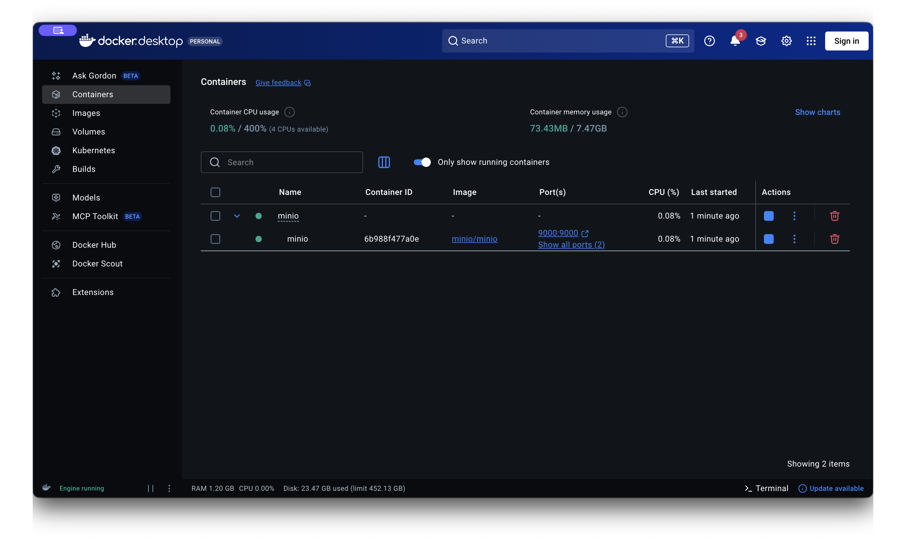
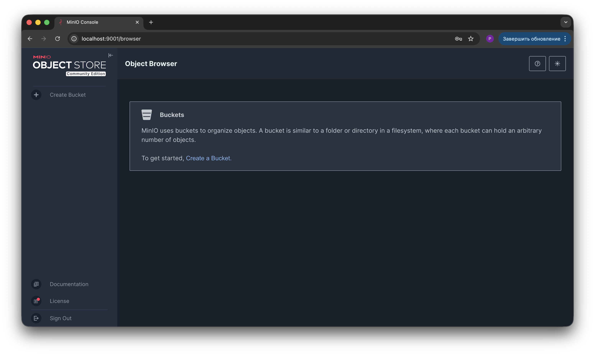
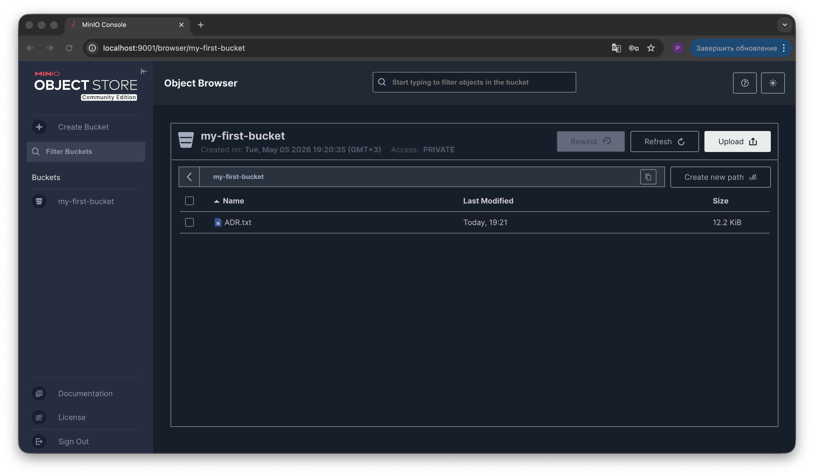
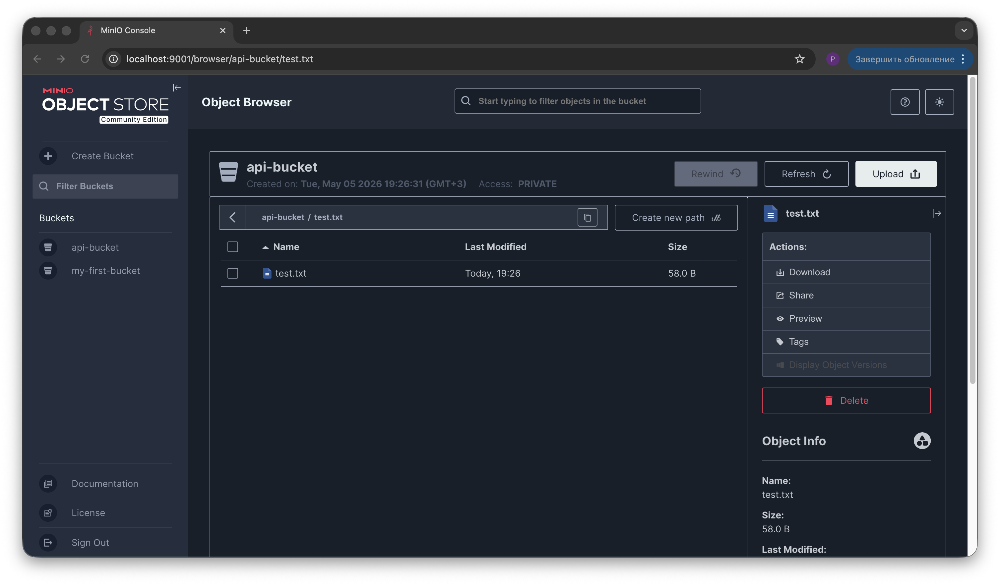
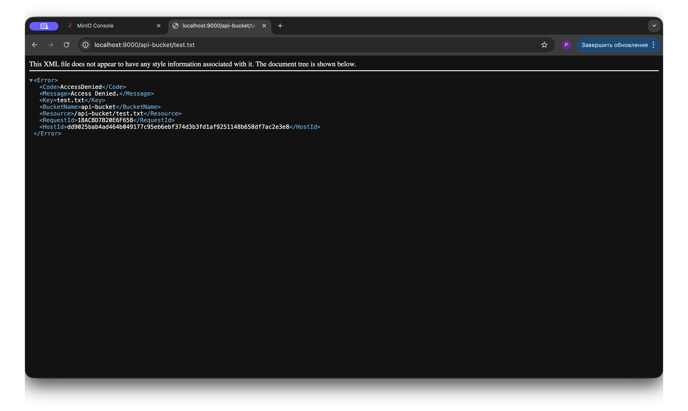
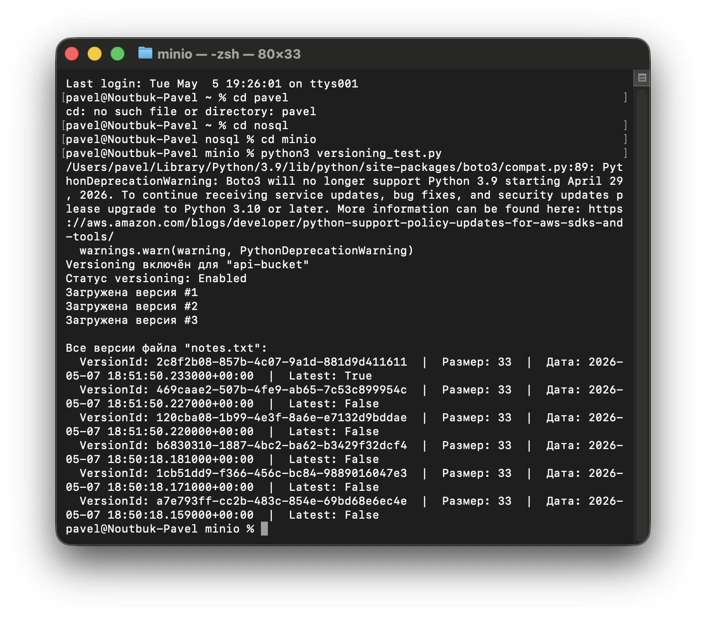
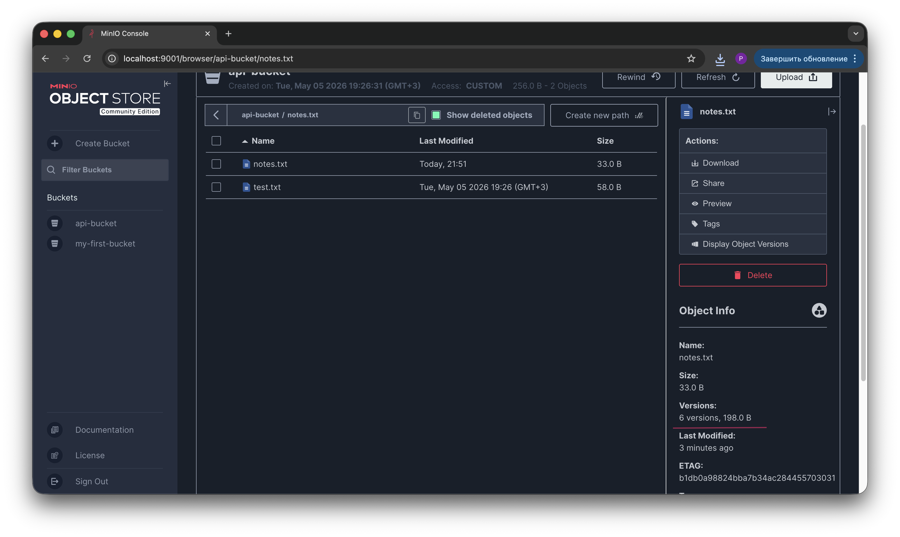
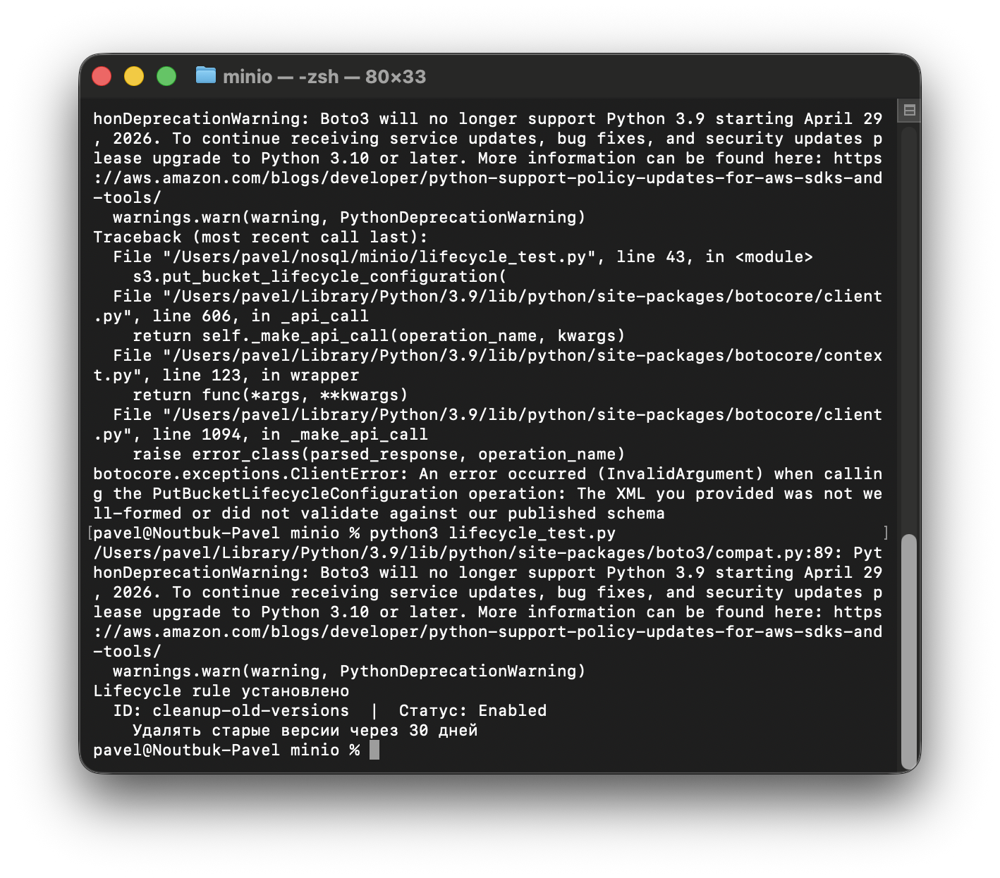
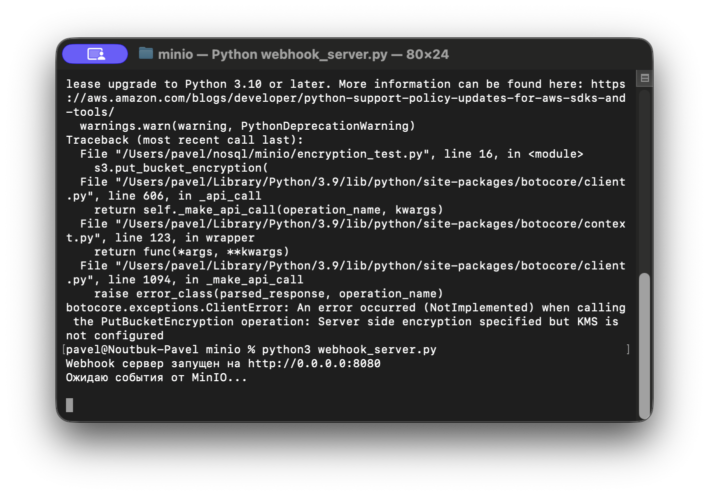
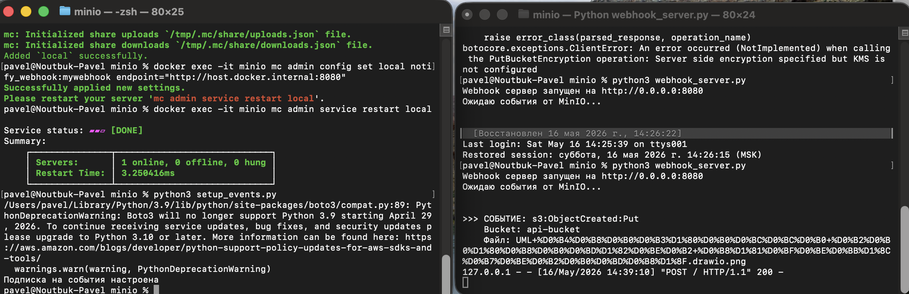

# Отчет по домашней работе: MinIO (S3-совместимое хранилище)

## 1. Установка и настройка окружения

### 1.1. Запуск MinIO через Docker Compose

Для развертывания S3-совместимого хранилища выбран MinIO в Docker-контейнере. Такой вариант удобен тем, что не нужно тянуть на машину реальный AWS-аккаунт — API полностью совместимы, и тот же `boto3` работает без изменений.

**docker-compose.yml (первоначальная версия):**

```yaml
version: '3.8'

services:
  minio:
    image: quay.io/minio/minio
    container_name: minio
    ports:
      - "9000:9000"
      - "9001:9001"
    environment:
      MINIO_ROOT_USER: minioadmin
      MINIO_ROOT_PASSWORD: minioadmin123
    volumes:
      - minio-data:/data
    command: server /data --console-address ":9001"
    restart: unless-stopped

volumes:
  minio-data:
```

Здесь два порта пробрасываются наружу: `9000` — это сам S3 API (с ним работает boto3), а `9001` — веб-консоль для администрирования.

**Запуск контейнера:**

```bash
docker compose up -d
```

**Скриншот запущенного контейнера:**



---

### 1.2. Веб-консоль MinIO

После запуска консоль доступна по адресу `http://localhost:9001`. Авторизация выполняется через `MINIO_ROOT_USER` / `MINIO_ROOT_PASSWORD` из compose-файла.

**Скриншот админки:**



---

## 2. Создание bucket и загрузка файла через UI

В качестве разминки — создание bucket и загрузка файла через веб-интерфейс. Это самый простой способ убедиться, что хранилище работает, прежде чем переходить к автоматизации.

**Скриншот:**



---

## 3. Работа с MinIO через Python (boto3)

Дальше всё делается программно. Главное здесь — `endpoint_url` указывает на локальный MinIO, а не на реальный AWS. Всё остальное (signature_version, регион) — формальность, без которой `boto3` ругается.

### 3.1. Создание bucket и загрузка файла

```python
import boto3
from botocore.client import Config

# Подключение к MinIO
s3 = boto3.client(
    's3',
    endpoint_url='http://localhost:9000',
    aws_access_key_id='minioadmin',
    aws_secret_access_key='minioadmin123',
    config=Config(signature_version='s3v4'),
    region_name='us-east-1'
)

# 1. Создать bucket через API
bucket_name = 'api-bucket'
s3.create_bucket(Bucket=bucket_name)
print(f'Bucket "{bucket_name}" создан')

# 2. Загрузить файл
with open('test.txt', 'w') as f:
    f.write('Привет из MinIO! Это тестовый файл.')

s3.upload_file('test.txt', bucket_name, 'test.txt')
print('Файл загружен')

# 3. Получить список файлов в bucket
response = s3.list_objects_v2(Bucket=bucket_name)
print('\nФайлы в bucket:')
for obj in response.get('Contents', []):
    print(f'  {obj["Key"]}  |  размер: {obj["Size"]} байт  |  изменён: {obj["LastModified"]}')
```

**Результат выполнения:**



---

## 4. Управление доступом

### 4.1. Поведение private bucket по умолчанию

По умолчанию bucket приватный — прямая ссылка на файл возвращает ошибку. Это правильное поведение: даже знание точного URL не должно давать доступ, если на это нет явного разрешения.

**Ответ сервера при попытке прямого доступа:**

```xml
<Error>
  <Code>AccessDenied</Code>
  <Message>Access Denied.</Message>
  <Key>test.txt</Key>
  <BucketName>api-bucket</BucketName>
  <Resource>/api-bucket/test.txt</Resource>
</Error>
```

**Скриншот:**



---

### 4.2. Presigned URL

Presigned URL — временная подписанная ссылка, по которой даже анонимный пользователь может скачать файл, пока она не истекла. В S3 это стандартный паттерн для отдачи приватных файлов клиенту без раскрытия ключей.

```python
import boto3
from botocore.client import Config

s3 = boto3.client(
    's3',
    endpoint_url='http://localhost:9000',
    aws_access_key_id='minioadmin',
    aws_secret_access_key='minioadmin123',
    config=Config(signature_version='s3v4'),
    region_name='us-east-1'
)

# Генерируем presigned URL на 5 минут (300 секунд)
url = s3.generate_presigned_url(
    'get_object',
    Params={'Bucket': 'api-bucket', 'Key': 'test.txt'},
    ExpiresIn=300
)

print('Presigned URL (действует 5 минут):')
print(url)
```

По сгенерированной ссылке файл скачивается без авторизации — внутри URL уже зашита подпись с TTL.

---

### 4.3. Bucket policy на чтение

Альтернативный способ — выдать публичный доступ на чтение всему bucket через policy. Это уже постоянное разрешение, а не временная ссылка.

```python
import boto3
import json
from botocore.client import Config

s3 = boto3.client(
    's3',
    endpoint_url='http://localhost:9000',
    aws_access_key_id='minioadmin',
    aws_secret_access_key='minioadmin123',
    config=Config(signature_version='s3v4'),
    region_name='us-east-1'
)

# Read-only policy — разрешает всем читать файлы
policy = {
    "Version": "2012-10-17",
    "Statement": [
        {
            "Effect": "Allow",
            "Principal": {"AWS": ["*"]},
            "Action": ["s3:GetObject"],
            "Resource": ["arn:aws:s3:::api-bucket/*"]
        }
    ]
}

s3.put_bucket_policy(Bucket='api-bucket', Policy=json.dumps(policy))
print('Read-only policy установлена')
```

После применения такой policy файл начинает отдаваться по прямой ссылке без всяких подписей. 

---

## 5. Versioning

Versioning хранит все версии объекта при перезаписи. Полезно как защита от случайного удаления и для аудита изменений.

```python
import boto3
from botocore.client import Config

s3 = boto3.client(
    's3',
    endpoint_url='http://localhost:9000',
    aws_access_key_id='minioadmin',
    aws_secret_access_key='minioadmin123',
    config=Config(signature_version='s3v4'),
    region_name='us-east-1'
)

bucket = 'api-bucket'

# Включаем versioning
s3.put_bucket_versioning(
    Bucket=bucket,
    VersioningConfiguration={'Status': 'Enabled'}
)
print(f'Versioning включён для "{bucket}"')

# Проверяем статус
status = s3.get_bucket_versioning(Bucket=bucket)
print(f'Статус versioning: {status.get("Status")}')

# Загружаем 3 версии одного файла
filename = 'notes.txt'
for i in range(1, 4):
    content = f'Это версия #{i} файла'
    s3.put_object(Bucket=bucket, Key=filename, Body=content.encode('utf-8'))
    print(f'Загружена версия #{i}')

# Список всех версий
versions = s3.list_object_versions(Bucket=bucket, Prefix=filename)
print(f'\nВсе версии файла "{filename}":')
for v in versions.get('Versions', []):
    print(f'  VersionId: {v["VersionId"]}  |  Размер: {v["Size"]}  |  Дата: {v["LastModified"]}  |  Latest: {v["IsLatest"]}')
```

Скрипт запускался дважды — во второй раз к существующим версиям добавились ещё три, и `IsLatest=true` стоит уже у самой последней. Видно, что MinIO для каждой версии генерирует свой `VersionId`, и старые версии никуда не пропадают.

**Результаты первого запуска:**



**Результаты второго запуска:**



---

## 6. Lifecycle Rules

Если versioning включён, старые версии накапливаются и едят место. Lifecycle-правила позволяют автоматически их подчищать — например, удалять некурсирующие версии старше N дней.

```python
import boto3
from botocore.client import Config

s3 = boto3.client(
    's3',
    endpoint_url='http://localhost:9000',
    aws_access_key_id='minioadmin',
    aws_secret_access_key='minioadmin123',
    config=Config(signature_version='s3v4'),
    region_name='us-east-1'
)

bucket = 'api-bucket'

# Описываем правило жизненного цикла объектов
lifecycle = {
    "Rules": [
        {
            # Идентификатор правила — нужен для последующего управления (поиск, удаление)
            "ID": "cleanup-old-versions",
            # Статус Enabled включает правило сразу; Disabled оставляет настройку, но не применяет её
            "Status": "Enabled",
            # Пустой Filter означает, что правило применяется ко всем объектам bucket'а.
            # При необходимости здесь можно указать Prefix или Tag, чтобы ограничить область
            "Filter": {},
            # Действие: удалить неактуальные (предыдущие) версии объектов
            "NoncurrentVersionExpiration": {
                # Через сколько дней с момента, когда версия перестала быть текущей, её можно удалять
                "NoncurrentDays": 30
            }
        }
    ]
}

# Применяем правило к bucket'у
s3.put_bucket_lifecycle_configuration(
    Bucket=bucket,
    LifecycleConfiguration=lifecycle
)
print('Lifecycle rule установлено')

# Проверяем, что правило действительно записалось
result = s3.get_bucket_lifecycle_configuration(Bucket=bucket)
for rule in result['Rules']:
    print(f'  ID: {rule["ID"]}  |  Статус: {rule["Status"]}')
    if 'NoncurrentVersionExpiration' in rule:
        print(f'    Удалять старые версии через {rule["NoncurrentVersionExpiration"]["NoncurrentDays"]} дней')
```

Несколько замечаний по структуре правила. `NoncurrentVersionExpiration` срабатывает только если versioning включён, иначе понятие "неактуальной версии" попросту не существует. Кроме него есть `Expiration` (удаление текущих объектов по возрасту) и `AbortIncompleteMultipartUpload` (зачистка незавершённых загрузок), которые тоже стоит держать в голове для продакшена.

**Результат выполнения:**



---

## 7. Шифрование на стороне сервера

### 7.1. Попытка включить SSE-S3

Идея — включить серверное шифрование AES-256, чтобы MinIO сам шифровал объекты при записи и расшифровывал при чтении.

```python
import boto3
from botocore.client import Config

s3 = boto3.client(
    's3',
    endpoint_url='http://localhost:9000',
    aws_access_key_id='minioadmin',
    aws_secret_access_key='minioadmin123',
    config=Config(signature_version='s3v4'),
    region_name='us-east-1'
)

bucket = 'api-bucket'

# Включаем SSE-S3 (шифрование на стороне сервера)
s3.put_bucket_encryption(
    Bucket=bucket,
    ServerSideEncryptionConfiguration={
        'Rules': [
            {
                'ApplyServerSideEncryptionByDefault': {
                    'SSEAlgorithm': 'AES256'
                }
            }
        ]
    }
)
print('Server-side encryption (SSE-S3) включено')
```

### 7.2. Полученная ошибка

```
botocore.exceptions.ClientError: An error occurred (NotImplemented)
when calling the PutBucketEncryption operation:
Server side encryption specified but KMS is not configured
```

Я попытался решить проблему добавлением KMS-ключа в docker-compose:

```yaml
environment:
  MINIO_ROOT_USER: minioadmin
  MINIO_ROOT_PASSWORD: minioadmin123
  MINIO_KMS_SECRET_KEY: my-key:Y2hhbmdlbWVjaGFuZ2VtZWNoYW5nZW1lY2hhbmdlbWU=
```

Но окончательно поднять шифрование в community-сборке не удалось.

### 7.3. Что я понял про разницу с AWS

В AWS S3 шифрование SSE-S3 работает "из коробки" — это одна настройка, ключами управляет сам сервис. В MinIO community-edition такой автоматики нет: для любого SSE требуется внешний KMS (например, MinIO KES) либо как минимум корректно сконфигурированный встроенный KMS-провайдер. Это важное отличие, которое надо учитывать при локальной разработке — не всё, что работает в AWS, заработает в MinIO без дополнительных шагов.

Краткая теория по типам шифрования, которую я нашёл:

- **SSE-S3** — сам сервис шифрует данные и управляет ключами, для пользователя прозрачно
- **SSE-KMS** — ключи хранятся в KMS, доступна ротация и аудит обращений
- **SSE-C** — ключ предоставляет сам клиент при каждом запросе, сервер его не хранит

Для продакшена в AWS обычно выбирают SSE-KMS — баланс удобства и контроля.

---

## 8. Event-driven: уведомления при загрузке файлов

Финальный этап — заставить MinIO сообщать внешнему сервису о событиях в bucket. Это нужно для всяких задач вида "загрузили картинку — нарезали превью", "положили файл — запустили обработку".

### 8.1. Webhook-приёмник

Простейший HTTP-сервер, который слушает POST-запросы от MinIO и печатает информацию о событии:

```python
from http.server import HTTPServer, BaseHTTPRequestHandler
import json

class WebhookHandler(BaseHTTPRequestHandler):
    def do_POST(self):
        length = int(self.headers.get('Content-Length', 0))
        body = self.rfile.read(length)
        event = json.loads(body)
        
        for record in event.get('Records', []):
            event_name = record.get('eventName', 'unknown')
            obj_key = record.get('s3', {}).get('object', {}).get('key', 'unknown')
            bucket = record.get('s3', {}).get('bucket', {}).get('name', 'unknown')
            print(f'\n>>> СОБЫТИЕ: {event_name}')
            print(f'    Bucket: {bucket}')
            print(f'    Файл: {obj_key}')
        
        self.send_response(200)
        self.end_headers()

print('Webhook сервер запущен на http://0.0.0.0:8080')
print('Ожидаю события от MinIO...\n')
HTTPServer(('0.0.0.0', 8080), WebhookHandler).serve_forever()
```

### 8.2. Конфигурация MinIO

В docker-compose добавлены переменные для регистрации webhook-эндпоинта:

```yaml
MINIO_NOTIFY_WEBHOOK_ENABLE_mywebhook: "on"
MINIO_NOTIFY_WEBHOOK_ENDPOINT_mywebhook: "http://host.docker.internal:8080"
```

Здесь `host.docker.internal` — это специальный DNS-хост, через который контейнер обращается к процессу на хост-машине. Без него MinIO просто не достучится до webhook-сервера, который запущен снаружи Docker.

**Запуск webhook-сервера:**



### 8.3. Подписка bucket на события

После того как MinIO знает про webhook, нужно сказать конкретному bucket'у — отправляй мне уведомления о событиях такого-то типа:

```python
import boto3
from botocore.client import Config

s3 = boto3.client(
    's3',
    endpoint_url='http://localhost:9000',
    aws_access_key_id='minioadmin',
    aws_secret_access_key='minioadmin123',
    config=Config(signature_version='s3v4'),
    region_name='us-east-1'
)

s3.put_bucket_notification_configuration(
    Bucket='api-bucket',
    NotificationConfiguration={
        'QueueConfigurations': [
            {
                'Id': 'webhook-on-upload',
                'QueueArn': 'arn:minio:sqs::mywebhook:webhook',
                'Events': ['s3:ObjectCreated:*']
            }
        ]
    }
)
print('Подписка на события настроена')
```

Маска `s3:ObjectCreated:*` ловит все способы создания объекта (PUT, POST, COPY, multipart). При желании можно подписаться только на конкретный тип.

### 8.4. Дополнительные команды для настройки

Помимо переменных в compose, конфигурацию пришлось дотюнить через `mc` (MinIO Client) внутри контейнера:

```bash
docker exec -it minio mc alias set local http://localhost:9000 minioadmin minioadmin123
docker exec -it minio mc admin config set local notify_webhook:mywebhook \
    endpoint="http://host.docker.internal:8080"
docker exec -it minio mc admin service restart local
```


### 8.5. Проверка работы

После всех настроек загружаем любой файл и видим, как webhook-сервер в реальном времени получает уведомление:



---

## 9. Выводы

### 9.1. Что было освоено

- **Разворачивание S3-совместимого хранилища в Docker** — MinIO поднимается одним compose-файлом, никаких лицензий и аккаунтов
- **Работа с boto3 против не-AWS endpoint** — достаточно подменить `endpoint_url`, и тот же SDK работает с MinIO
- **Управление доступом** — три уровня: приватные объекты, временные presigned URL, постоянные bucket policy
- **Versioning** — включается одной командой, после чего каждая перезапись добавляет новую версию вместо затирания
- **Lifecycle rules** — автоматическое удаление старых версий и неактуальных данных по расписанию
- **Event-driven архитектура** — bucket может пинговать внешний сервис при событиях, что лежит в основе serverless-обработки файлов

### 9.2. С чем были сложности

Самый показательный момент — шифрование. На бумаге `put_bucket_encryption` выглядит так же, как в AWS, но в MinIO community для него нужен KMS, который не входит в базовую поставку. Это хороший пример того, что "S3-совместимый" не означает "идентичный AWS S3" — часть managed-фич реализована иначе или требует дополнительной настройки.


### 9.3. Общее впечатление

MinIO — это рабочая замена AWS S3 для локальной разработки и self-hosted сценариев. Совместимость по API действительно высокая, и большинство фич, к которым привыкаешь в облаке, тут работают. С нюансами вроде шифрования стоит разбираться заранее, если планируешь повторить продакшен-конфигурацию AWS один-в-один.

Из практики заметно, что для разработки сервисов с файловым хранилищем такой подход экономит и время, и деньги: не нужно поднимать тестовый AWS-аккаунт ради того, чтобы проверить, как себя ведёт `upload_file` или presigned URL.

---
