# Отчёт по домашней работе: Tarantool

## 1. Окружение

Работа выполнена на MacBook с Apple Silicon (ARM64), Docker Desktop, Tarantool 3.7 (официальный образ `tarantool/tarantool:3`). В качестве веб-интерфейса использовался `tarantool-admin` от basis-company, в качестве CLI — встроенная утилита `tt connect`.

---

## 2. Установка Tarantool и развёртывание Web UI

### 2.1. Конфигурация контейнеров

Развёртывание собрано через `docker compose` — два сервиса в одной сети: основной инстанс Tarantool и веб-интерфейс. Init-скрипт пробросил порт 3301, поднимает админа и (для учебной задачи) даёт `super`-права гостю.

**`app/init.lua`:**

```lua
box.cfg{
    listen = 3301,
}

-- Админ для удалённого подключения
box.once('schema-init-v1', function()
    box.schema.user.create('admin', {password = 'admin', if_not_exists = true})
    box.schema.user.grant('admin', 'super', nil, nil, {if_not_exists = true})
end)

-- Гостевой доступ (только для учебной задачи!)
pcall(function()
    box.schema.user.grant('guest', 'super', nil, nil, {if_not_exists = true})
end)

print('=== Custom init complete. Tarantool ready on :3301 ===')
```

**`docker-compose.yml`:**

```yaml
services:
  tarantool:
    image: tarantool/tarantool:3
    container_name: tarantool-hw
    platform: linux/arm64
    ports:
      - "3301:3301"
    volumes:
      - ./app:/opt/tarantool
      - ./data:/var/lib/tarantool
    command: tarantool /opt/tarantool/init.lua
    restart: unless-stopped

  tarantool-admin:
    image: quay.io/basis-company/tarantool-admin:latest
    container_name: tarantool-admin
    ports:
      - "8000:80"
    depends_on:
      - tarantool
    restart: unless-stopped
```

**Запуск:**

```bash
docker compose up -d
docker compose ps
```

### 2.2. Трудности с подключением

Сразу подключиться через `tt connect admin:admin@localhost:3301` не получилось — Tarantool ругался на то, что пользователь не найден или у него неверные креды:

```
⨯ failed to authenticate: User not found or supplied credentials are invalid
```

Поэтому пришлось зайти в инстанс напрямую через `docker exec -it tarantool-hw console`, создать пользователя руками и проверить, что он реально появился в системном спейсе `_user`:

```lua
box.schema.user.create('admin', {password = 'admin', if_not_exists = true})
box.schema.user.grant('admin', 'super', nil, nil, {if_not_exists = true})
box.space._user:select{}
```

После этого подключение прошло нормально.

Кстати, в Tarantool 3.x официальный образ ожидает декларативный YAML-конфиг с описанием топологии (instances, replicasets). Передача `init.lua` напрямую — это, скорее, стиль 2.x. Для учебной задачи такой подход работает, но в проде корректнее идти через YAML-конфигурацию.

**Результат подключения:**

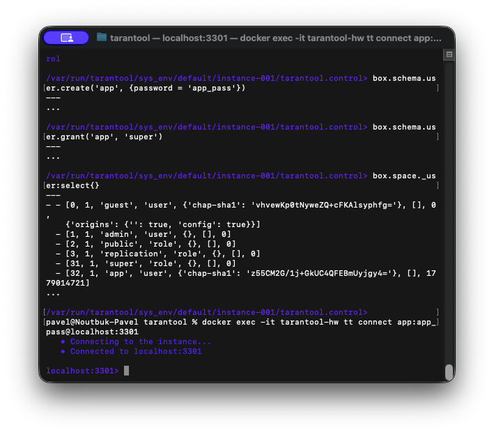

**Web UI на `localhost:8000`:**

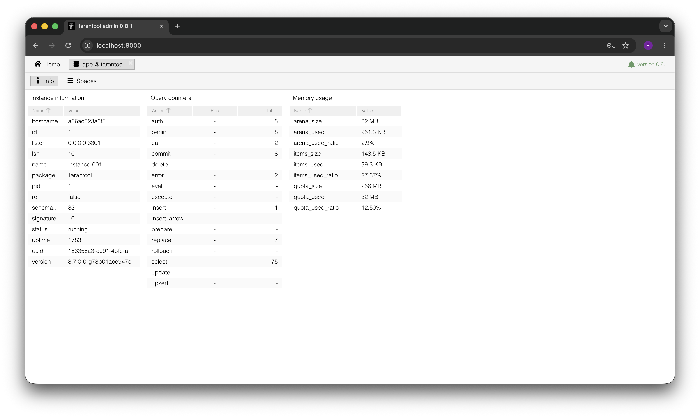

---

## 3. Создание спейса `flights`

Спейс создан в дефолтном движке `memtx` (in-memory с WAL-persistence). Формат полей задан явно — это накладывает схему поверх изначально schemaless-подхода Tarantool.

```lua
box.schema.space.create('flights', {if_not_exists = true})

box.space.flights:format({
    {name = 'id',             type = 'unsigned'},
    {name = 'airline',        type = 'string'},
    {name = 'departure_date', type = 'string'},
    {name = 'departure_city', type = 'string'},
    {name = 'arrival_city',   type = 'string'},
    {name = 'min_price',      type = 'unsigned'},
})
```

Дата вылета хранится строкой в формате ISO 8601 (`'2025-01-01'`). Лексикографический порядок такой записи совпадает с хронологическим, поэтому потом можно спокойно использовать `<`, `>`, `BETWEEN` по этому полю в индексных запросах.

Сам спейс я создал через UI, а проверял уже через терминал.

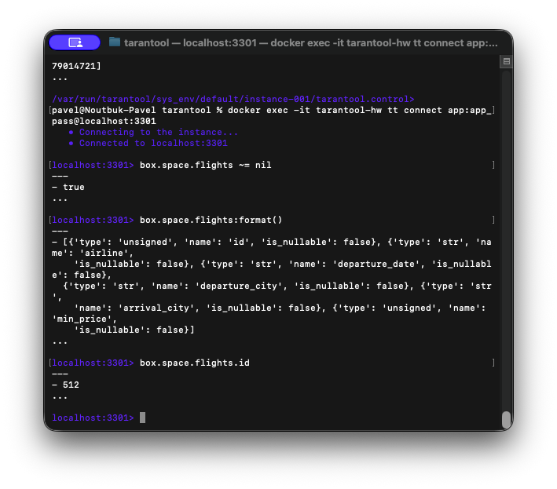

### 3.1. Маленькое расследование: «индекс из ниоткуда»

Хотел проверить, как Tarantool ругается на вставку без индекса. Сделал `:insert{...}` — и запись прошла. Сначала удивился, потом понял: либо UI сам создал primary, либо он автоматически появился при первой вставке (тут я однозначно не разобрался). Чтобы воспроизвести ошибку, удалил индекс руками — и всё, картина стала каноничной:

```
- error: 'No index #0 is defined in space ''flights'''
```

Без primary-индекса невозможны не только вставки, но и чтения:

```
localhost:3301> box.space.flights:select{}
---
- error: 'No index #0 is defined in space ''flights'''
...
```

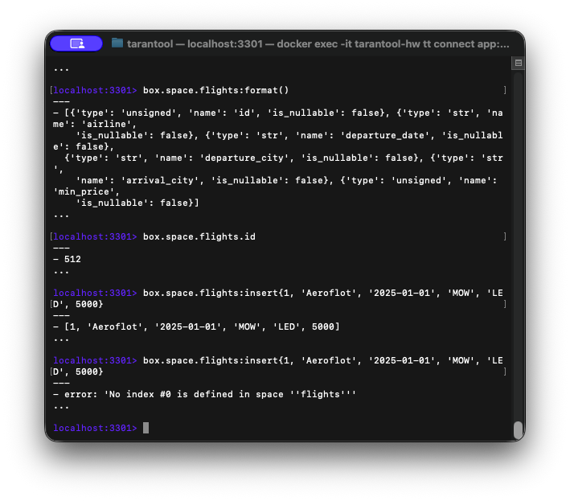

Кстати, поведение Web UI тут показательное: визуальные тулы могут незаметно менять схему. В прод-окружениях это стоит держать в голове.

---

## 4. Первичный индекс

В Tarantool первичный индекс — это не «дополнительная структура поверх таблицы», а **сама структура хранения** (по сути, как clustered index в InnoDB). То, что без primary не работают ни insert, ни select — прямое следствие именно этого.

```lua
box.space.flights:create_index('primary', {
    parts       = {'id'},
    type        = 'tree',
    unique      = true,
    if_not_exists = true,
})
```

Тип `tree` (B+-tree) выбран как самый универсальный — он закрывает и точечные, и range-запросы. После создания индекса selectʼы по спейсу заработали.

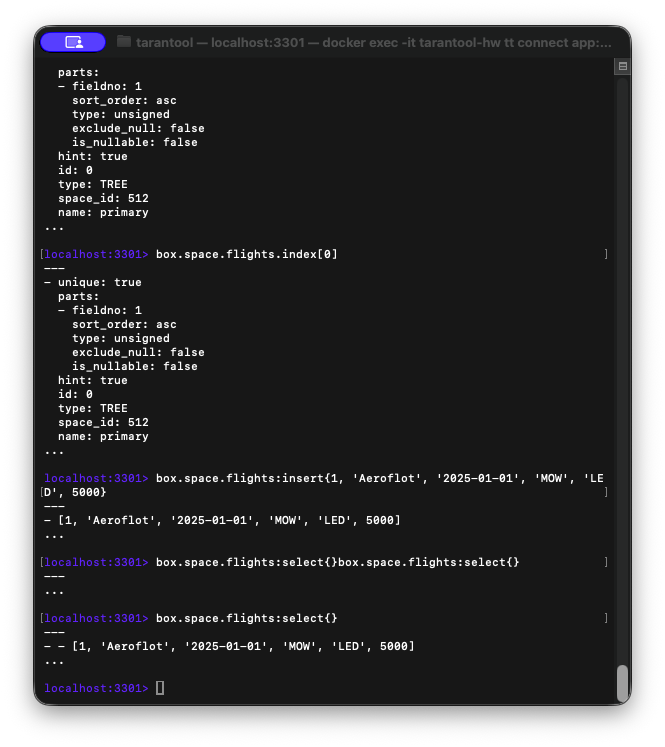

---

## 5. Вторичный композитный индекс

Дальше — индекс по трём полям: `departure_date`, `airline`, `departure_city`. Тип всё тот же `tree`, неуникальный.

```lua
box.space.flights:create_index('by_date_airline_city', {
    parts  = {'departure_date', 'airline', 'departure_city'},
    type   = 'tree',
    unique = false,
    if_not_exists = true,
})
```

Композитный индекс работает по префиксу слева направо: поиск возможен по `departure_date`, по паре `departure_date + airline` или по всем трём полям сразу. А вот запрос, начинающийся со второго или третьего поля, индекс **не использует** — будет полный скан спейса. Это легко увидеть в примере ниже:

```
localhost:3301> box.space.flights.index.by_date_airline_city:select{'2025-01-01'}
---
- - [1, 'Aeroflot', '2025-01-01', 'MOW', 'LED', 5000]
...

localhost:3301> box.space.flights.index.by_date_airline_city:select{'Aeroflot'}
---
- []
...
```

Первый запрос отрабатывает корректно — по префиксу. Второй возвращает пустой результат не потому, что данных нет, а потому что Tarantool ищет в индексе записи, у которых `departure_date == 'Aeroflot'`.

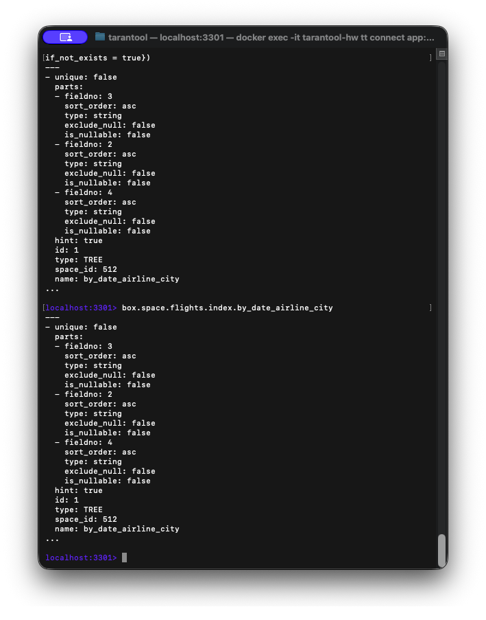

**Индексы в UI:**

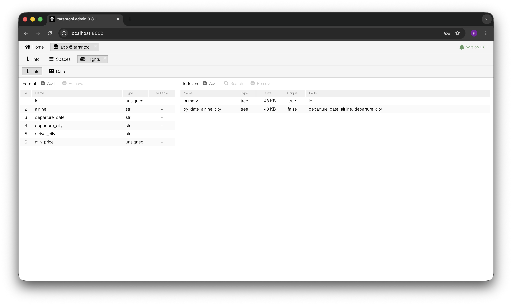

---

## 6. Тестовые данные

Вставил 10 записей. Подбирал их так, чтобы потом было что проверять: на дату 01.01.2025 — четыре рейса с разными ценами (для поиска минимума), и обязательно несколько штук с ценой ниже и выше 3000 руб. (для Lua-функции).

```lua
box.space.flights:insert{1,  'Aeroflot', '2025-01-01', 'MOW', 'LED', 5000}
box.space.flights:insert{2,  'S7',       '2025-01-01', 'MOW', 'AER', 4500}
box.space.flights:insert{3,  'Pobeda',   '2025-01-01', 'MOW', 'LED', 2800}
box.space.flights:insert{4,  'UralAir',  '2025-01-01', 'LED', 'AER', 6200}
box.space.flights:insert{5,  'Pobeda',   '2025-01-02', 'MOW', 'LED', 2500}
box.space.flights:insert{6,  'Aeroflot', '2025-01-02', 'MOW', 'KZN', 3500}
box.space.flights:insert{7,  'S7',       '2025-01-03', 'MOW', 'AER', 4100}
box.space.flights:insert{8,  'Pobeda',   '2025-01-03', 'LED', 'AER', 2900}
box.space.flights:insert{9,  'UralAir',  '2025-01-04', 'MOW', 'LED', 5800}
box.space.flights:insert{10, 'Aeroflot', '2025-01-05', 'LED', 'KZN', 3200}
```

Проверка `box.space.flights:count()` возвращает 10 — всё на месте.

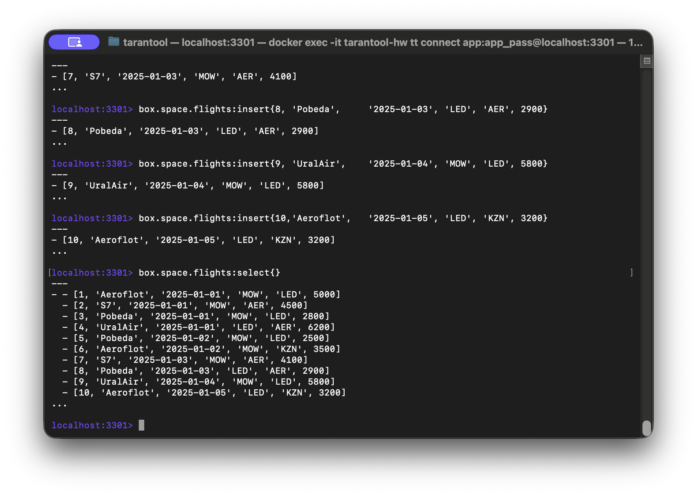

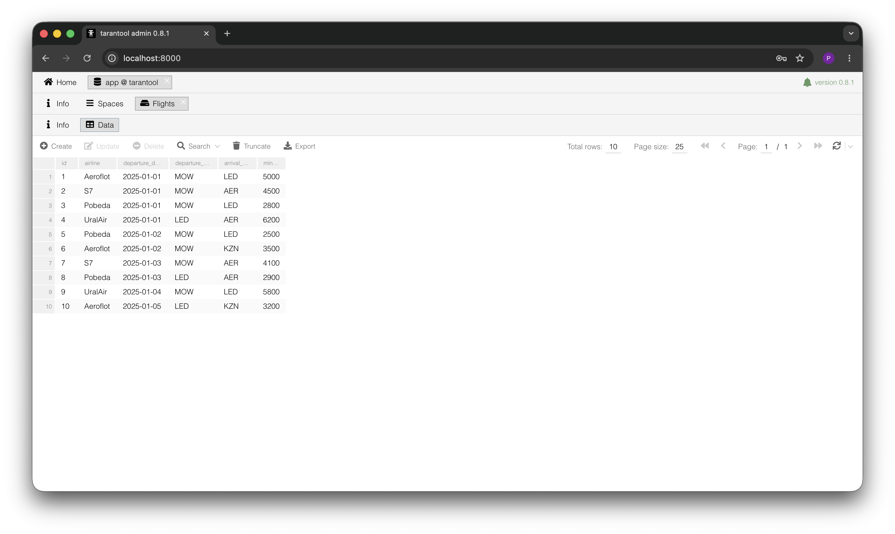

Запрос через вторичный индекс `by_date_airline_city:select{'2025-01-01'}` корректно возвращает четыре записи — то, что и ожидалось.

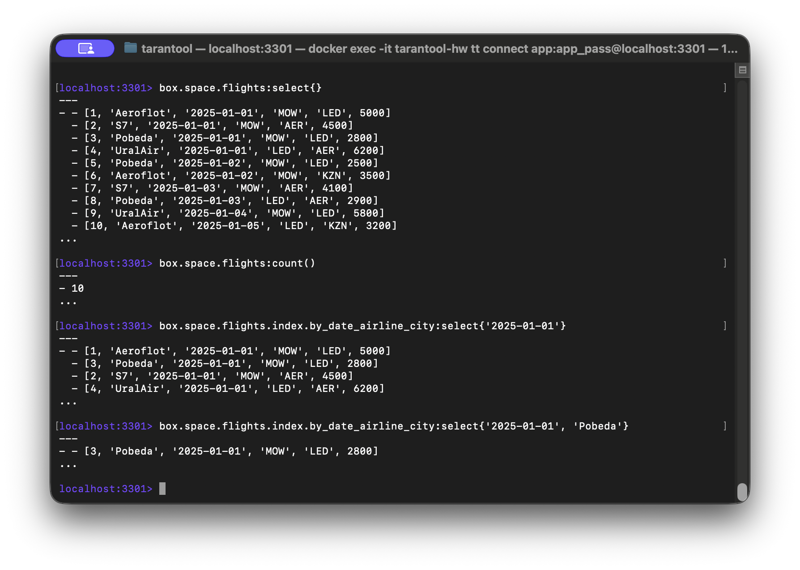

---

## 7. Минимальная цена на 01.01.2025

В Tarantool box API нет агрегатной функции `MIN()` — её обычно реализуют итератором. И тут можно пойти двумя путями.

**Способ 1: полный скан через `:pairs()` с фильтрацией в Lua.** Просто и читаемо, но сложность линейная по размеру спейса.

**Способ 2: итерация по вторичному индексу `by_date_airline_city`.** Он начинается с поля `departure_date`, поэтому можно стартовать сразу с нужной даты и не сканировать всё подряд.

```lua
do
    local mp = nil
    for _, t in box.space.flights.index.by_date_airline_city:pairs({'2025-01-01'}) do
        if t.min_price < (mp or math.huge) then
            mp = t.min_price
        end
    end
    return mp
end
```

**Результат: 2800 руб.** — рейс Pobeda, MOW → LED.

На таком объёме данных оба способа отрабатывают мгновенно, разница станет заметна на сотнях тысяч записей.

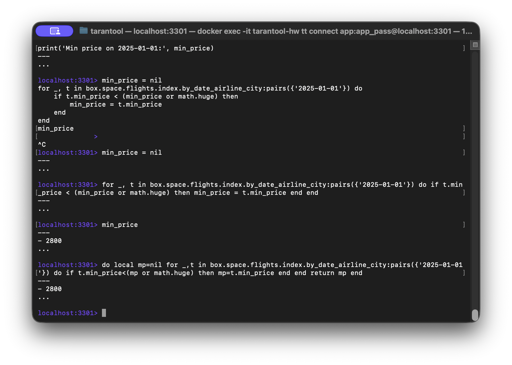

---

## 8. Lua-функция `get_cheap_flights`

### 8.1. Реализация

Функция фильтрует рейсы по условию `min_price < threshold` (значение по умолчанию — 3000 руб.) и возвращает результат как массив объектов с именованными полями.

```lua
function get_cheap_flights(threshold)
    threshold = threshold or 3000
    local result = {}
    for _, t in box.space.flights:pairs() do
        if t.min_price < threshold then
            table.insert(result, t:tomap({names_only = true}))
        end
    end
    return result
end
```

Разберу по строкам, чтобы было понятно, что и зачем:

- `threshold = threshold or 3000` — если параметр не передан, подставляем 3000. Классический Lua-идиом.
- `box.space.flights:pairs()` — итератор по всему спейсу. Полный скан здесь оправдан, потому что `min_price` не лежит ни в одном индексе. Если бы был — можно было бы взять итератор с типом `LT` и обойтись без скана.
- `t:tomap({names_only = true})` — превращает tuple в Lua-таблицу с именами полей. Без этого клиент получил бы безымянный массив `[5, 'Pobeda', '2025-01-02', ...]`. С `tomap` — нормальный объект `{id=5, airline='Pobeda', ...}`, который удобно дальше использовать.

### 8.2. Вызов локально

```
localhost:3301> get_cheap_flights()
---
- - departure_date: 2025-01-01
    id: 3
    departure_city: MOW
    min_price: 2800
    airline: Pobeda
    arrival_city: LED
  - departure_date: 2025-01-02
    id: 5
    departure_city: MOW
    min_price: 2500
    airline: Pobeda
    arrival_city: LED
  - departure_date: 2025-01-03
    id: 8
    departure_city: LED
    min_price: 2900
    airline: Pobeda
    arrival_city: AER
...
```

С порогом по умолчанию выбираются три рейса (все, как видно, у Pobeda). При `get_cheap_flights(5000)` в результат попадают уже семь записей.

### 8.3. Удалённый вызов

Чтобы функцию можно было дёрнуть по сети через `net.box`, её надо зарегистрировать в системном спейсе `_func` и выдать пользователю права на `execute`:

```lua
box.schema.func.create('get_cheap_flights', {if_not_exists = true})
box.schema.user.grant('app', 'execute', 'function', 'get_cheap_flights',
                     {if_not_exists = true})
```

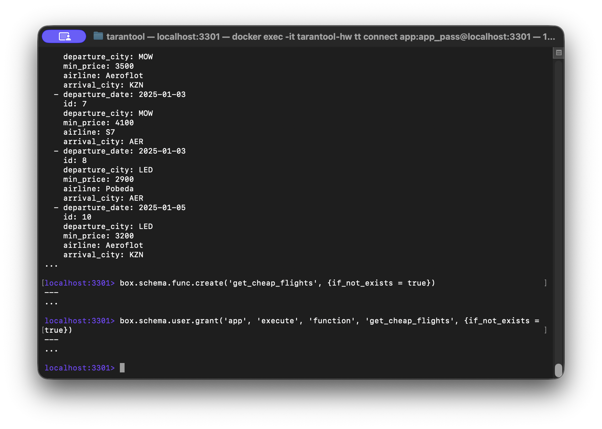

**Удалённый вызов:**

```lua
net.box.connect('app:app_pass@localhost:3301'):call('get_cheap_flights')
```

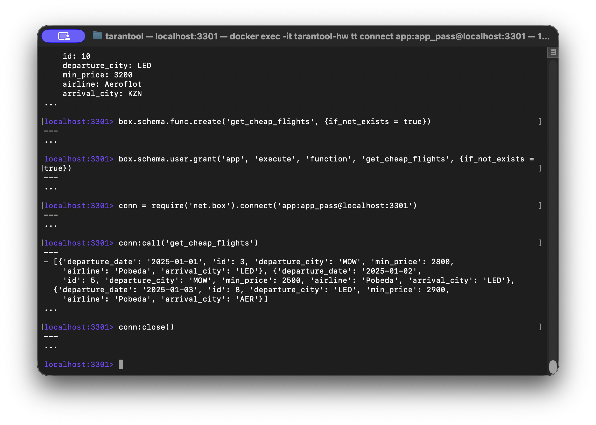

### 8.4. Замечание по оптимизации

Функция честно сканирует весь спейс, потому что `min_price` нет ни в одном индексе. Для редких запросов это абсолютно нормально. Если же такие запросы пошли бы в проде регулярно и спейс был бы большой — стоило бы завести вторичный индекс по `min_price` или составной `(min_price, departure_date)`. Тогда можно было бы пройтись итератором с типом `LT` (less than) и не трогать лишние записи. Это типичный trade-off «память под индекс vs скорость запроса».

---

## 9. Выводы

### 9.1. Что было сделано

- Tarantool 3.7 поднят в Docker на ARM64 вместе с веб-интерфейсом `tarantool-admin`.
- Спейс `flights` создан с явно заданным форматом из шести полей.
- Созданы первичный индекс по `id` и вторичный композитный индекс по `(departure_date, airline, departure_city)`.
- Вставлено 10 тестовых записей, проверена работа индекса по префиксу.
- Минимальная цена на 01.01.2025 найдена двумя способами (полный скан и итерация по индексу), результат — 2800 руб.
- Реализована Lua-функция `get_cheap_flights(threshold)` с дефолтом 3000, зарегистрирована как stored procedure, проверен удалённый вызов через `net.box`.

### 9.2. Наблюдения и инсайты

Несколько вещей, которые в процессе показались любопытными.

Во-первых, в Tarantool primary index — это и есть таблица. Не получится «временно отключить индекс, чтобы быстрее залить данные» — без него спейс попросту нечитаем и непишем. Это сильно отличается от привычной модели в реляционках, где индексы — отдельные структуры.

Во-вторых, веб-интерфейс автоматически создал primary при работе со спейсом. Это удобно, но в реальных проектах такая «магия» может всплыть в самый неудобный момент — особенно если кто-то полез править схему через UI на проде. Лучше держать схему в коде и в репозитории.

В-третьих, отсутствие готовых агрегатных функций — это не баг, а часть философии: ты сам решаешь, как обходить данные. Тот же `MIN` через индекс работает быстро, но писать его руками всё равно надо. На таком объёме (10 записей) это незаметно, но если бы их было миллион, разница между «итерация по индексу» и «фуллскан» стала бы драматической.

Ну и про композитные индексы: префиксное правило не интуитивно для тех, кто пришёл из MS SQL Server, где оптимизатор иногда сам разбирается. В Tarantool — нет, индекс работает строго слева направо, и про это надо помнить ещё на этапе проектирования схемы.

---
