# Отчет по домашней работе: Qdrant (векторный поиск)

## 1. Установка и настройка окружения

### 1.1. Установка Qdrant в Docker

Развёрнут контейнер с Qdrant. Открыты два порта: `6333` под REST API и веб-дашборд, `6334` под gRPC. Хранилище вынесено в том, чтобы данные переживали перезапуск контейнера.

**docker-compose.yml:**

```yaml
services:
  qdrant:
    image: qdrant/qdrant:latest
    container_name: qdrant
    restart: unless-stopped
    ports:
      - "6333:6333"   # REST API + веб-дашборд
      - "6334:6334"   # gRPC
    volumes:
      - ./qdrant_storage:/qdrant/storage
```

**Скриншоты:**

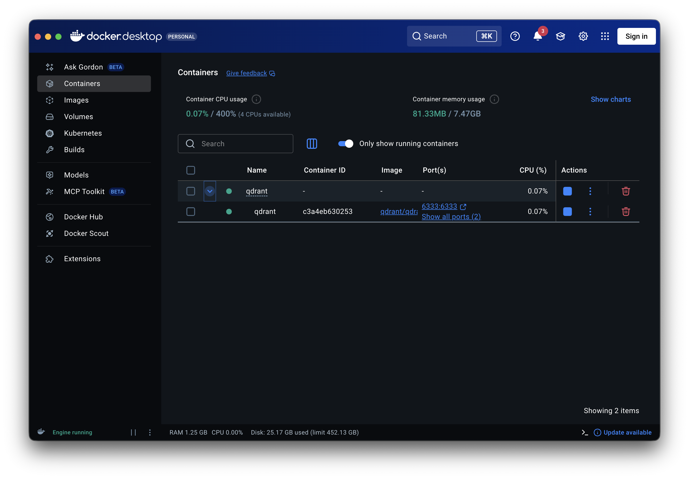

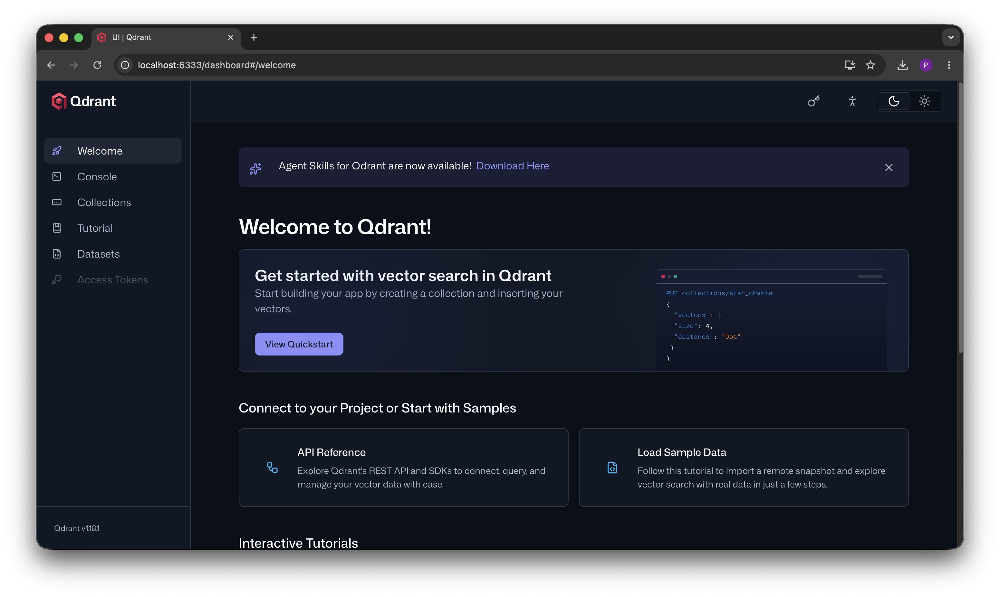

---

## 2. Создание коллекции `bank_support`

Создана коллекция для хранения обращений в техподдержку. Ключевые параметры — размерность вектора `size: 384` и метрика близости `Cosine`. Размерность выбрана не случайно: она должна совпадать с тем, что выдаёт embedding-модель.

**Создание коллекции:**

```http
PUT collections/bank_support
{
  "vectors": {
    "size": 384,
    "distance": "Cosine"
  }
}
```

**Проверка результата:**

```http
GET collections/bank_support
```

**Ответ сервера:**

```json
{
  "result": {
    "status": "green",
    "optimizer_status": "ok",
    "indexed_vectors_count": 0,
    "points_count": 0,
    "segments_count": 2,
    "config": {
      "params": {
        "vectors": {
          "size": 384,
          "distance": "Cosine"
        },
        "shard_number": 1,
        "replication_factor": 1,
        "write_consistency_factor": 1,
        "on_disk_payload": true
      },
      "hnsw_config": {
        "m": 16,
        "ef_construct": 100,
        "full_scan_threshold": 10000,
        "max_indexing_threads": 0,
        "on_disk": false
      },
      "optimizer_config": {
        "deleted_threshold": 0.2,
        "vacuum_min_vector_number": 1000,
        "default_segment_number": 0,
        "max_segment_size": null,
        "memmap_threshold": null,
        "indexing_threshold": 10000,
        "flush_interval_sec": 5,
        "max_optimization_threads": null,
        "prevent_unoptimized": null
      },
      "wal_config": {
        "wal_capacity_mb": 32,
        "wal_segments_ahead": 0,
        "wal_retain_closed": 1
      },
      "quantization_config": null
    },
    "payload_schema": {},
    "update_queue": {
      "length": 0
    }
  },
  "status": "ok",
  "time": 0.000604083
}
```

Статус `green` и `points_count: 0` — коллекция создана, но ещё пустая.

**Скриншот:**

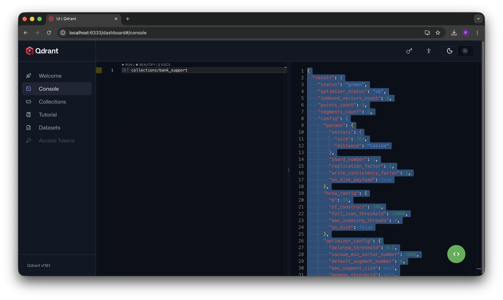

---

## 3. Настройка Python-клиента

Для удобной работы с кодом и embedding-моделью развёрнут Jupyter.

**Скриншот окружения:**

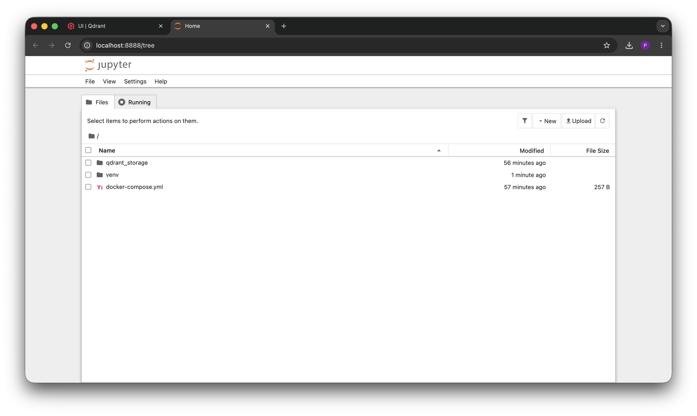

Тестовый запрос к коллекции прошёл — не с первого раза, но в итоге всё поднялось. На этом моменте контур замкнулся: контейнер работает, Python подключён, коллекция на месте.

**Скриншот проверки подключения:**

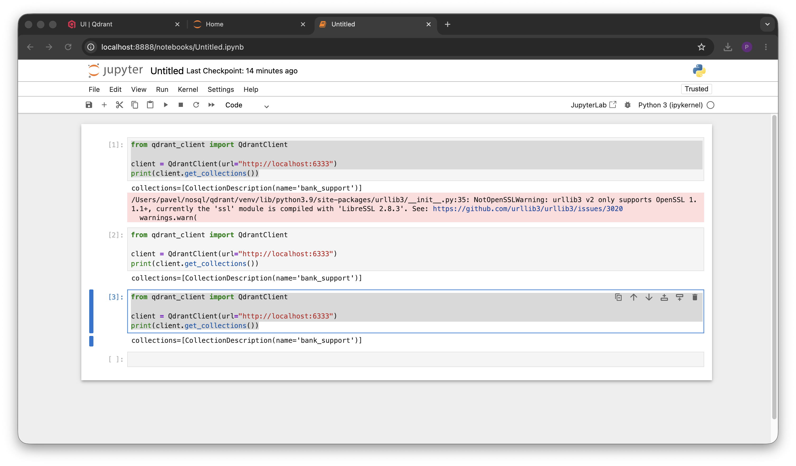

---

## 4. Выбор embedding-модели

Взята модель `paraphrase-multilingual-MiniLM-L12-v2`. Логика выбора такая:

- **многоязычная** — обучена на 50+ языках, включая русский. Для наших данных это критично, потому что обращения на русском;
- **заточена под semantic similarity** — то есть ровно под задачу «насколько две фразы близки по смыслу», а это и есть суть семантического поиска;
- **даёт 384 измерения** — ровно столько, сколько заложено в коллекцию на этапе 2. Связка сходится без пересоздания коллекции;
- **лёгкая и быстрая** — на локальной машине отрабатывает практически мгновенно.

Что ещё рассматривалось: `intfloat/multilingual-e5-small` (тоже 384, чуть точнее, но требует служебных префиксов `query:` / `passage:`) и `sberbank-ai/sbert_large_nlu_ru` (хорошо заточена под русский, но выдаёт 1024 измерения — пришлось бы переделывать коллекцию). Для учебного прототипа MiniLM — оптимальный баланс скорости и качества.

**Загрузка модели и проверка размерности:**

```python
from sentence_transformers import SentenceTransformer

model = SentenceTransformer("paraphrase-multilingual-MiniLM-L12-v2")
print("Размерность вектора:", model.get_sentence_embedding_dimension())
```

**Скриншот:**

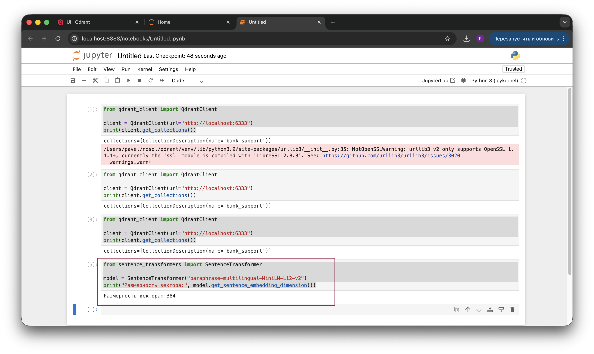

Вывод `384` — подтверждение, что модель совпадает с конфигурацией коллекции. Если бы тут было другое число, это был бы сигнал пересоздавать коллекцию под новую размерность.

---

## 5. Построение embeddings для всех обращений

У каждого обращения есть `title` и `text`. Можно было бы кодировать только `text`, но я склеил `title + text` — заголовок добавляет смысла («Ошибка CRM», «Ошибка входа»), и вектор получается богаче. А вот поля `department` и `category` в вектор не идут — они уезжают в payload как метаданные для фильтрации и отображения. Принцип простой: в вектор — смысловой текст, в payload — структурные атрибуты.

**Код:**

```python
docs = [
    {"id": 1, "title": "Ошибка CRM",
     "text": "Система оформления кредитных заявок закрывается после открытия карточки клиента",
     "department": "credit", "category": "crm"},
    {"id": 2, "title": "Не печатается документ",
     "text": "После отправки договора на печать устройство не отвечает",
     "department": "operations", "category": "printing"},
    {"id": 3, "title": "Ошибка входа",
     "text": "Сотрудник не может войти в систему обработки платежей",
     "department": "finance", "category": "authentication"},
    {"id": 4, "title": "Проблема Outlook",
     "text": "Письма остаются в исходящих и не отправляются получателям",
     "department": "office", "category": "mail"},
    {"id": 5, "title": "Сбой документооборота",
     "text": "Система электронного согласования зависает при открытии вложений",
     "department": "legal", "category": "edms"},
    {"id": 6, "title": "Ошибка клиентского приложения",
     "text": "Приложение для оформления банковских продуктов аварийно завершается после авторизации",
     "department": "credit", "category": "crm"},
]

# Склеиваем title + text для каждого обращения
texts = [f"{d['title']}. {d['text']}" for d in docs]

# Строим embeddings (список из 6 векторов по 384 числа)
embeddings = model.encode(texts)

print("Количество векторов:", len(embeddings))
print("Размерность одного вектора:", embeddings.shape[1])
print("Первые 5 чисел вектора обращения №1:", embeddings[0][:5])
```

**Скриншот:**

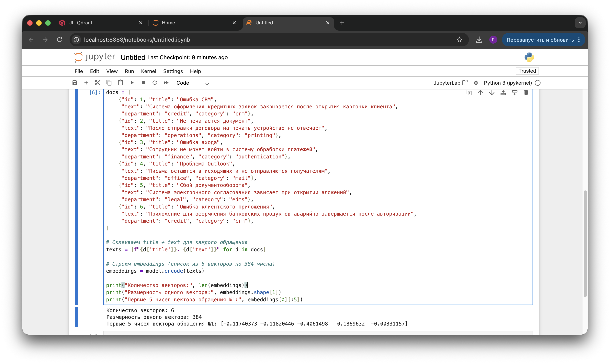

---

## 6. Загрузка данных в Qdrant

Дальше из векторов и метаданных собираются «точки» (points) и заливаются в коллекцию. Точка в Qdrant — это `id` + `vector` (наш embedding) + `payload` (метаданные: title, text, department, category).

**Код:**

```python
from qdrant_client.models import PointStruct

# Собираем точки: id + вектор + payload с метаданными
points = [
    PointStruct(
        id=doc["id"],
        vector=embeddings[i].tolist(),   # numpy -> обычный список
        payload={
            "title": doc["title"],
            "text": doc["text"],
            "department": doc["department"],
            "category": doc["category"],
        },
    )
    for i, doc in enumerate(docs)
]

# Загружаем в коллекцию
client.upsert(collection_name="bank_support", points=points)

print("Загружено точек:", client.count(collection_name="bank_support").count)
```

**Скриншот загрузки:**

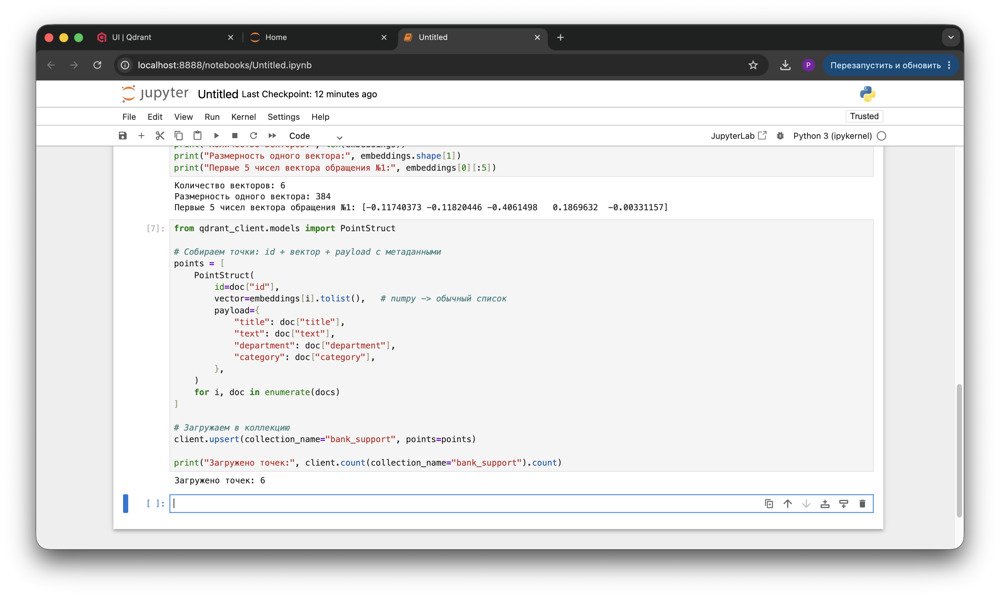

**Проверка данных через дашборд:**

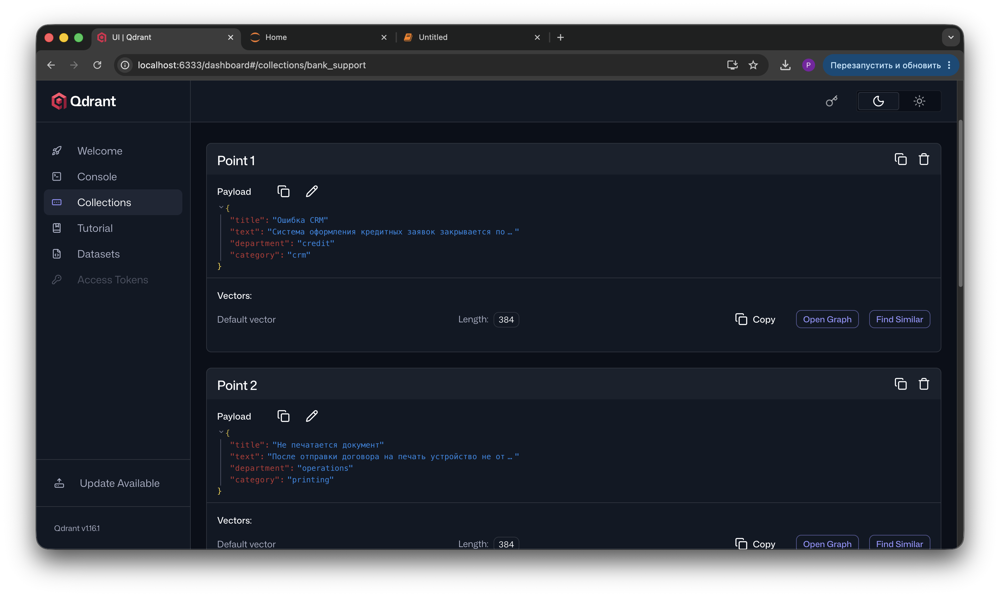

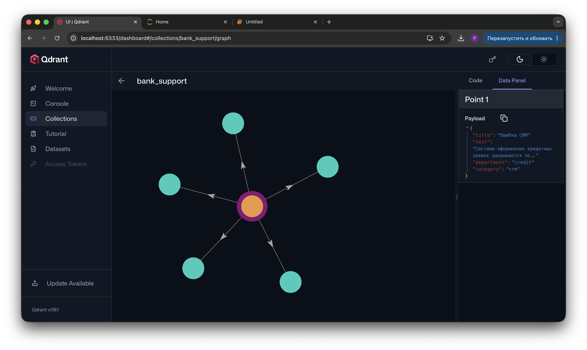

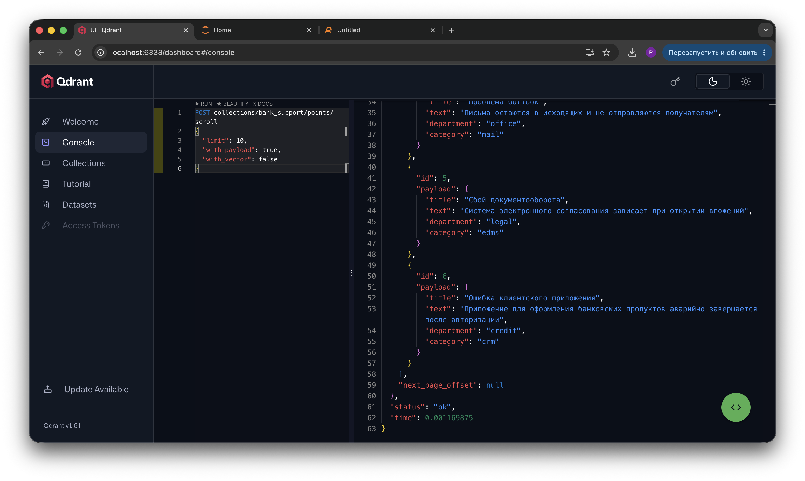

---

## 7. Выполнение поисковых запросов

Логика семантического поиска: запрос пользователя прогоняется через ту же самую модель → получается вектор запроса → Qdrant ищет точки с ближайшими векторами по косинусу. Важный момент — слова в запросе и в найденном тексте могут вообще не совпадать, потому что сравнивается смысл, а не буквы.

**Код:**

```python
queries = [
    "закрывается программа кредитов",
    "не отправляется электронная почта",
    "невозможно войти в платежную систему",
    "зависает система согласования документов",
]

for q in queries:
    q_vector = model.encode(q).tolist()          # вектор запроса той же моделью
    result = client.query_points(
        collection_name="bank_support",
        query=q_vector,
        limit=3,                                  # топ-3 ближайших
        with_payload=True,
    )

    print("=" * 70)
    print(f"ЗАПРОС: «{q}»")
    print("-" * 70)
    for point in result.points:
        p = point.payload
        print(f"  score={point.score:.3f} | id={point.id} | "
              f"[{p['category']}] {p['title']} — {p['text']}")
    print()
```

**Результат выполнения:**

```text
======================================================================
ЗАПРОС: «закрывается программа кредитов»
----------------------------------------------------------------------
  score=0.715 | id=1 | [crm] Ошибка CRM — Система оформления кредитных заявок закрывается после открытия карточки клиента
  score=0.495 | id=6 | [crm] Ошибка клиентского приложения — Приложение для оформления банковских продуктов аварийно завершается после авторизации
  score=0.435 | id=3 | [authentication] Ошибка входа — Сотрудник не может войти в систему обработки платежей

======================================================================
ЗАПРОС: «не отправляется электронная почта»
----------------------------------------------------------------------
  score=0.701 | id=4 | [mail] Проблема Outlook — Письма остаются в исходящих и не отправляются получателям
  score=0.483 | id=2 | [printing] Не печатается документ — После отправки договора на печать устройство не отвечает
  score=0.369 | id=3 | [authentication] Ошибка входа — Сотрудник не может войти в систему обработки платежей

======================================================================
ЗАПРОС: «невозможно войти в платежную систему»
----------------------------------------------------------------------
  score=0.740 | id=3 | [authentication] Ошибка входа — Сотрудник не может войти в систему обработки платежей
  score=0.488 | id=1 | [crm] Ошибка CRM — Система оформления кредитных заявок закрывается после открытия карточки клиента
  score=0.405 | id=6 | [crm] Ошибка клиентского приложения — Приложение для оформления банковских продуктов аварийно завершается после авторизации

======================================================================
ЗАПРОС: «зависает система согласования документов»
----------------------------------------------------------------------
  score=0.740 | id=5 | [edms] Сбой документооборота — Система электронного согласования зависает при открытии вложений
  score=0.445 | id=2 | [printing] Не печатается документ — После отправки договора на печать устройство не отвечает
  score=0.318 | id=1 | [crm] Ошибка CRM — Система оформления кредитных заявок закрывается после открытия карточки клиента
```

**Скриншот:**

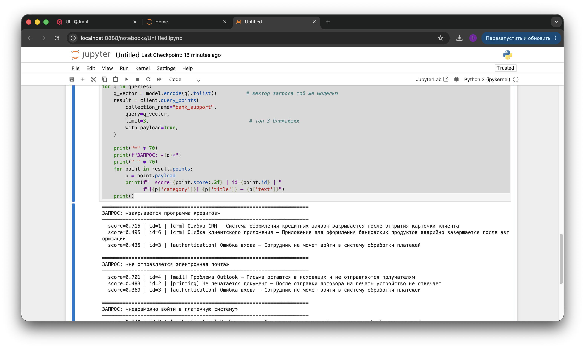

Что бросается в глаза: у победителя по каждому запросу score держится в районе 0.70–0.74, а у второго места уже 0.44–0.50. Разрыв заметный — это «уверенное» срабатывание, модель чётко отделяет нужное обращение от похожих, но не тех.

---

## 8. Анализ результатов

Дальше — разбор по каждому запросу: почему сработала именно семантика и почему обычный поиск по ключевым словам тут спотыкался бы.

**Запрос 1: «закрывается программа кредитов» → №1** «Система оформления кредитных заявок закрывается после открытия карточки клиента»

Модель распознала, что «программа кредитов» и «система оформления кредитных заявок» — это про одно и то же ПО, а «закрывается» легло на «закрывается после открытия». При этом в исходном тексте нет слов «программа» и «кредитов» (есть «кредитных заявок» — другая форма). Поиск по ключам искал бы точную фразу «программа кредитов», не нашёл бы её и пропустил бы нужное обращение.

**Запрос 2: «не отправляется электронная почта» → №4** «Письма остаются в исходящих и не отправляются получателям»

«Электронная почта» ≈ «письма / исходящие», а «не отправляется» совпало напрямую. Но в тексте нет ни слова «электронная», ни «почта» — только «письма» и «исходящие». Для ключевого поиска это ноль совпадений, хотя запись ровно про это.

**Запрос 3: «невозможно войти в платежную систему» → №3** «Сотрудник не может войти в систему обработки платежей»

Тут разные словоформы: «невозможно войти» ≈ «не может войти», «платежную систему» ≈ «систему обработки платежей». Слов «невозможно» и «платежную» в точной форме в тексте нет (есть «платежей» и «не может»). Из-за этого ключевой поиск сработал бы частично или вообще не сработал.

**Запрос 4: «зависает система согласования документов» → №5** «Система электронного согласования зависает при открытии вложений»

«Система согласования документов» ≈ «система электронного согласования», а «зависает» совпало слово в слово. Слова «документов» в исходнике нет (есть «вложений», «электронного»). Поиск по точной фразе «согласования документов» снова дал бы пусто.

### Общий вывод

Семантический поиск сравнивает не слова, а смысл, закодированный в 384-мерные векторы многоязычной модели. Именно поэтому он находит обращения с другой формулировкой, синонимами и иными словоформами — там, где поиск по ключевым словам выдаёт ноль из-за отсутствия точных совпадений. На банковской техподдержке это, по сути, главное преимущество: одна и та же проблема описывается разными сотрудниками десятками непохожих формулировок, и привязываться к точным словам — заведомо проигрышная стратегия.

---

## 9. Итоги

По ходу работы получилось:

- развернуть Qdrant в Docker с проброшенными портами и постоянным хранилищем;
- создать коллекцию `bank_support` с правильной размерностью (384) и косинусной метрикой;
- подобрать и подключить многоязычную embedding-модель `paraphrase-multilingual-MiniLM-L12-v2`, у которой размерность совпала с коллекцией без переделок;
- закодировать обращения в векторы (склейка `title + text`) и загрузить их как points с метаданными в payload;
- прогнать четыре поисковых запроса и убедиться, что семантика находит нужные обращения даже при полном расхождении словоформ.

Главный практический урок: размерность модели и размерность коллекции должны совпадать ещё до загрузки данных — иначе всё придётся пересоздавать. И второй — для живой техподдержки векторный поиск даёт ощутимо более релевантную выдачу, чем поиск по ключевым словам, потому что ловит смысл, а не буквальные совпадения.
