# Проектная работа: цена гарантий доставки

**Курс:** NoSQL
**Тема:** Цена гарантий доставки сообщений: сравнительное исследование Apache Kafka, RabbitMQ, Redis Streams и NATS JetStream
**Окружение:** MacBook M3 (Apple Silicon, ARM64) + Docker Desktop
**Дата:** май 2026

---

## 1. Что меряли и зачем

Если коротко - насколько падает throughput продюсера у одного и того же брокера, когда уровень
гарантии доставки растёт. И самое главное - устроен ли этот "налог" одинаково у разных архитектур
(log-based, queue-based, in-memory), или log-based брокеры платят за durability как-то иначе.

Изначально я хотел просто измерить производительность четырёх брокеров и сравнить, кто быстрее.
Начал пробовать в этом направлении, но результаты получались неудовлетворительные. Абсолютные
msg/s, полученные на ноутбуке в Docker, не переносятся ни на какое production-железо - зависят
от десятка скрытых факторов: режим синхронности клиента, прогрев JVM, page cache, лимиты VM
Docker. Когда я попробовал поставить в одну колонку Kafka в acks=0 и Redis в WAIT 2, стало
понятно, что я смешиваю разные семантики, а не измеряю что-то осмысленное.

Поресёрчил тему, посоветовался с ИИ как с ассистентом и понял, что прямое сравнение здесь
методологически шаткое. Поэтому переформулировал задачу - ось сравнения стала не "брокер против
брокера", а **"уровень гарантии против самого себя"**. Внутри одного брокера меняется ровно
одна ручка (acks / confirms / WAIT / PubAck), всё остальное прибито гвоздями. Тогда падение
throughput честно отражает стоимость именно гарантии, а **относительные** падения между
брокерами уже сравнимы: они устойчивы к ограничениям окружения, потому что конфаундеры стенда
сокращаются при делении T2 на T0.

Главный исследовательский вопрос: *одинаков ли налог на durability у разных архитектур, или
log-based брокеры (Kafka, JetStream) платят за репликацию иначе, чем queue-based (RabbitMQ) и
in-memory (Redis)?*

---

## 2. Методология

### 2.1. Три уровня гарантии (tiers)

Ядро работы - управление **ровно одним** параметром. Топология каждого брокера фиксирована
(3 ноды), и меняется только уровень гарантии.

| Tier   | Семантика                     | Что гарантируется                                                                                  |
|--------|-------------------------------|----------------------------------------------------------------------------------------------------|
| **T0** | at-most-once                  | Producer не ждёт ничего. Сообщение может потеряться при сбое. Верхняя граница скорости.            |
| **T1** | at-least-once, без репликации | Producer ждёт подтверждения записи на одной ноде (лидере). Durability на уровне одного узла.       |
| **T2** | at-least-once, с кворумом     | Producer ждёт подтверждения от большинства реплик (2 из 3). Сообщение переживает отказ одной ноды. |

Перевод этих уровней на язык каждого брокера - это **матрица эквивалентности**, главная
методологическая ценность работы. Без неё одна строка таблицы превратится в "Redis синхронный
round-trip против Kafka с внутренним батчингом" - то есть в бессмыслицу:

| Tier   | Kafka                                      | RabbitMQ                                       | Redis Streams                      | NATS JetStream                    |
|--------|--------------------------------------------|------------------------------------------------|------------------------------------|-----------------------------------|
| **T0** | `acks=0`                                   | classic + без confirms + `delivery_mode=1`     | `XADD`, без WAIT, `appendfsync no` | core NATS publish (без JetStream) |
| **T1** | `acks=1`                                   | classic durable + confirms + `delivery_mode=2` | `XADD` + `appendfsync always`      | JetStream R=1 + PubAck            |
| **T2** | `acks=all` + `min.insync.replicas=2`, RF=3 | quorum queue + confirms (Raft, 2/3)            | `XADD` + `WAIT 2`                  | JetStream R=3 + PubAck            |

### 2.2. Стенд и окружение

| Компонент         | Значение                                                   |
|-------------------|------------------------------------------------------------|
| Машина            | MacBook M3 (Apple Silicon / ARM64)                         |
| Контейнеризация   | Docker Desktop (Virtualization.framework) + Docker Compose |
| Ресурсы VM Docker | CPU: 6, Memory limit: 8 GB, Swap: 1 GB                     |
| Apache Kafka      | `confluentinc/cp-kafka:7.6` (KRaft), 3 брокера             |
| RabbitMQ          | `rabbitmq:3.13-management`, 3 ноды, quorum queues          |
| Redis             | `redis:7.2`, 1 master + 2 replica                          |
| NATS              | `nats:2.10-alpine` с JetStream, 3 ноды                     |
| Python            | 3.12 - `confluent-kafka`, `pika`, `redis-py`, `nats-py`    |

### 2.3. Жёсткие правила эквивалентности измерений

Эти правила одинаковы для всех брокеров и всех прогонов - иначе сравнивать нечего.

**Warmup-фаза.** Каждый прогон отправляет 200 000 сообщений; первые 50 000 объявляются разогревом
и в статистику не идут. Прогрев нивелирует JIT JVM, наполнение page cache, инициализацию пулов
соединений и завершение consumer rebalance. На первых прогонах без warmup'а я ловил странную
картину - у Kafka на 1 000 сообщений выходило 2 870 msg/s, а на 100 000 уже 5 868 msg/s.
Поресёрчил - это и есть классический эффект непрогретой JVM и пустого page cache. После
введения warmup-среза этот артефакт исчезает.

**Consumer стартует первым.** Сначала поднимается consumer и ждёт подписку, только потом
запускается producer. Иначе на T0 (at-most-once) consumer пропустит начало потока, а на любом
tier'е rebalance-overhead затянется внутрь измерения.

**Один режим синхронизации на tier - для всех.** Внутри одного tier все брокеры работают в
одинаковом режиме подтверждения. На T0 все fire-and-forget, на T2 все ждут кворум. Никакого
"Redis синхронный против Kafka батчевая" - это превращает таблицу в фарш.

**Per-message, не батч.** На T1/T2 каждое сообщение подтверждается отдельно. `flush()` после
каждого `produce` у Kafka, `confirm_delivery` per-publish у RabbitMQ, `WAIT 2` после каждого
`XADD` у Redis, `await js.publish()` per-message у NATS. Никаких пакетных хитростей ради
"ускорить" - это и есть та цена гарантии, которую мы меряем.

**Контейнерные клиенты.** Producer и consumer запускаются как сервис `client` внутри docker-сети
брокера. Не через `localhost`. Изначально я гонял клиент через проброс портов на хост и
обнаружил, что latency "гуляет" по-разному для разных брокеров - это сетевой мост Docker-host
вносил переменную задержку. Перенос клиента внутрь docker-сети брокера эту переменную убрал.

**Повторы.** 3 прогона на ячейку, в отчёт идёт медиана + разброс min–max. Не среднее - медиана
устойчивее к выбросам (а они на T1 будут, благодаря Docker-macOS fsync).

**Параметры зафиксированы:**

| Параметр | Значение |
|---|---|
| Размер сообщения | 1 KB |
| Объём прогона | 200 000 (50K warmup + 150K измеряемых) |
| Топология | 3 ноды, RF=3, кворум большинства = 2 |
| Размещение клиентов | docker-сеть, не localhost |
| Повторы | 3 на ячейку, медиана + min–max |
| Метрики producer | throughput (msg/s), p50/p95/p99 latency |

### 2.4. Единый harness - почему это критично

Самая важная вещь в работе, без которой сравнивать брокеры бессмысленно. Если код, который меряет
throughput и latency, у каждого брокера свой - числа из разных колонок таблицы получены разным
методом, и сравнивать их некорректно.

Когда я начинал, я писал производительные скрипты под каждый брокер отдельно - свой producer и
свой consumer на Kafka, потом на RabbitMQ, потом на Redis. Довольно быстро столкнулся с тем, что
у меня в разных скриптах по-разному считается warmup (или не считается вовсе), по-разному
оборачивается payload, по-разному снимаются перцентили. Сравнивать получавшиеся цифры между
брокерами было нечестно. Поресёрчил подходы, посоветовался с ИИ как с консультантом, и пришёл к
такому решению: вынести общую часть (payload, warmup-срез, замер времени, перцентили, throughput,
условие остановки прогона) в **один общий harness**, который дёргает любой брокер через единый
контракт. А брокеро-специфичной остаётся только тонкая "обёртка" - адаптер - где живут реально
уникальные вещи: подключение, формат publish/consume, режим подтверждения на нужный tier.

Это даёт сопоставимость по построению. У всех брокеров на проводе одинаковый payload (1024 байта,
первые 16 байт - порядковый номер для отладки, остальное наполнитель `b"x"`). Одинаковая
warmup-схема. Одинаковые перцентили. Одинаковый формат вывода. Различается **только** реализация
publish/consume у конкретного брокера.

Контракт адаптера лежит в `harness/adapters/base.py` и состоит из шести методов: `setup(tier)`,
`connect_producer(tier)`/`connect_consumer(tier)`, `publish(payload)`, `consume_one(timeout)`,
`teardown()`. Тонкие адаптеры под каждый брокер - `kafka.py`, `rabbitmq.py`, `redis.py`, `nats.py`
- реализуют этот контракт, и больше ничего. Никакой логики измерения внутри адаптера нет.

### 2.5. Честные ограничения стенда (важно для интерпретации)

Стенд на macOS+Docker вносит три систематических искажения. Я их не прячу, а явно учитываю в
выводах - некоторые числа из-за этого подаются с оговорками.

**fsync через виртуализацию.** Docker Desktop на macOS исполняет контейнеры в Linux-VM через
Virtualization.framework, и слой виртуализации буферизует обращения `fsync`. Это значит, что
реальная стоимость синхронной записи на диск занижена. T1 у Kafka, RabbitMQ и Redis опирается
именно на синхронный fsync лидера - то есть **абсолютная стоимость T1 у нас оптимистичнее, чем
на железе**. На bare-metal налог T0->T1 был бы ещё выше.

**Стоимость репликации (T2) - нет.** Это сетевой обмен и консенсус между контейнерами внутри
одной VM, и виртуализация его не искажает. Поэтому **T2 - главный защищаемый результат работы**.
Особенно дельта T1->T2, потому что это чистая стоимость репликации.

**Конкуренция за ядра.** Все брокеры делят ядра одной Docker-VM, поэтому одновременно их гонять
нельзя - пришлось бы смешивать нагрузки. Прогоны строго последовательные, на "холодном"
окружении: контейнеры пересоздаются между прогонами (`docker compose down -v && up`).

**Итог.** Абсолютные msg/s стенда нерепрезентативны для production и так и подаются. Валидны и
переносимы только **относительные** величины - налог в процентах и кратность дельт между tier.
На них и строятся выводы.

---

## 3. Структура проекта

```
broker-durability-tax/
├── harness/
│   ├── runner.py                   # общий оркестратор
│   ├── metrics.py                  # payload, warmup, перцентили
│   └── adapters/
│       ├── base.py                 # контракт адаптера
│       ├── kafka.py
│       ├── rabbitmq.py
│       ├── redis.py
│       └── nats.py
├── compose/
│   ├── docker-compose.kafka.yml
│   ├── docker-compose.rabbitmq.yml
│   ├── docker-compose.redis.yml
│   ├── docker-compose.nats.yml
│   └── rabbitmq/rabbitmq.conf
└── client/Dockerfile               # python:3.12-slim + 4 клиента
```

---

## 4. Общий harness (один для всех 4 брокеров)

Самое важное место работы. Если harness разъедется между брокерами - сравнивать будет нечего.
Поэтому он один, монтируется в `client`-контейнер как volume, и адаптеры с ним общаются через
единый контракт (`adapters/base.py`).

<details>
<summary>harness/runner.py - оркестратор</summary>

```python
"""
runner.py - ЭТАЛОННЫЙ оркестратор прогона. РЕДАКТИРОВАТЬ ЗАПРЕЩЕНО при работе над отдельным брокером.
Запускает producer и consumer для ОДНОГО брокера на ОДНОМ tier по единым правилам:
  - payload одинаковый (metrics.make_payload),
  - warmup-срез одинаковый,
  - замер времени вокруг publish/consume_one делает ЗДЕСЬ harness, а не адаптер,
  - перцентили и throughput считает metrics.py.

═══════════════════════════════════════════════════════════════════════════════
ЧТО ИЗМЕНЕНО ОТНОСИТЕЛЬНО ПЕРВОЙ ВЕРСИИ (и ПОЧЕМУ это правильно для всех брокеров)
───────────────────────────────────────────────────────────────────────────────
В первой версии consumer делал `break` на ПЕРВОМ пустом poll с таймаутом 5 с.
Это ломалось у каждого брокера, но по-разному:
  - Kafka: subscribe запускает rebalance группы; первые 1–10 с poll() возвращает None
           ещё ДО того, как назначены партиции -> consumer выходил с нулём сообщений.
  - NATS/JetStream, RabbitMQ, Redis: если producer стартовал на пару секунд позже
           consumer'а (а он и должен стартовать позже), первый пустой poll убивал прогон.
Это и есть "5 секунд, не успеваю запустить producer".

Теперь поведение consumer'а ОДИНАКОВО для всех брокеров и устойчиво к локальному лагу:
  1. POLL_TIMEOUT (короткий, 1 c) - это таймаут ОДНОГО poll, НЕ условие остановки.
  2. До первого полученного сообщения consumer ждёт producer'а до --startup-timeout (по
     умолчанию 120 c). Пустой poll в этой фазе = "ещё не началось", а НЕ "поток кончился".
  3. После первого сообщения прогон завершается, если новых нет дольше --idle-timeout
     (по умолчанию 15 c) ИЛИ получено count сообщений.
Так измерение steady-state не зависит от того, на сколько секунд разъехались два терминала.
═══════════════════════════════════════════════════════════════════════════════

Использование (ВСЕГДА из контейнера client внутри docker-сети брокера, два терминала):
  # терминал 1 - consumer ПЕРВЫМ:
  python runner.py --broker kafka --tier 2 --role consumer
  # терминал 2 - producer:
  python runner.py --broker kafka --tier 2 --role producer
Адаптер выбирается по --broker из adapters/.
"""
import argparse
import time
import importlib

from metrics import (make_payload, LatencyCollector, print_result,
                     DEFAULT_COUNT, DEFAULT_WARMUP, DEFAULT_SIZE)

# Короткий poll одного вызова consume_one. НЕ условие остановки прогона.
POLL_TIMEOUT = 1.0
# Сколько ждём ПЕРВОЕ сообщение (брокер поднимается, Kafka делает rebalance,
# producer стартует во втором терминале с задержкой). Это НЕ конец потока.
DEFAULT_STARTUP_TIMEOUT = 120.0
# Пауза без новых сообщений ПОСЛЕ начала потока = поток закончился.
DEFAULT_IDLE_TIMEOUT = 15.0


def load_adapter(broker: str):
    mod = importlib.import_module(f"adapters.{broker}")
    return mod.Adapter()  # каждый adapters/<broker>.py определяет класс Adapter(BrokerAdapter)


def run_producer(adapter, tier, count, warmup, size):
    adapter.setup(tier)
    adapter.connect_producer(tier)
    coll = LatencyCollector(warmup=warmup)
    for seq in range(count):
        payload = make_payload(size, seq)
        t0 = time.perf_counter()
        adapter.publish(payload)           # на T1/T2 блокируется до ack - это в адаптере
        coll.record(time.perf_counter() - t0)
    res = coll.result()
    print_result(adapter.name, tier, "producer", res)
    adapter.teardown()
    return res


def run_consumer(adapter, tier, count, warmup, startup_timeout, idle_timeout):
    adapter.setup(tier)
    adapter.connect_consumer(tier)         # ВАЖНО: consumer стартует ПЕРВЫМ (до producer)
    coll = LatencyCollector(warmup=warmup)
    got = 0
    started = False
    t_wait_start = time.perf_counter()
    t_last_msg = None
    while got < count:
        t0 = time.perf_counter()
        msg = adapter.consume_one(timeout=POLL_TIMEOUT)
        dt = time.perf_counter() - t0
        now = time.perf_counter()
        if msg is None:
            if not started:
                # ещё не получили НИ ОДНОГО сообщения - ждём producer'а, это не конец
                if now - t_wait_start > startup_timeout:
                    print(f"[consumer] producer не появился за {startup_timeout:.0f}s - стоп")
                    break
                continue
            # поток уже шёл и прервался - ждём idle_timeout, прежде чем признать конец
            if now - t_last_msg > idle_timeout:
                break
            continue
        if not started:
            started = True
        t_last_msg = now
        coll.record(dt)
        got += 1
    res = coll.result()
    print_result(adapter.name, tier, "consumer", res)
    adapter.teardown()
    return res


def main():
    ap = argparse.ArgumentParser()
    ap.add_argument("--broker", required=True, choices=["kafka", "rabbitmq", "redis", "nats"])
    ap.add_argument("--tier", required=True, type=int, choices=[0, 1, 2])
    ap.add_argument("--role", required=True, choices=["producer", "consumer"])
    ap.add_argument("--count", type=int, default=DEFAULT_COUNT)
    ap.add_argument("--warmup", type=int, default=DEFAULT_WARMUP)
    ap.add_argument("--size", type=int, default=DEFAULT_SIZE)
    ap.add_argument("--startup-timeout", type=float, default=DEFAULT_STARTUP_TIMEOUT,
                    help="сек: сколько consumer ждёт ПЕРВОЕ сообщение (не конец потока)")
    ap.add_argument("--idle-timeout", type=float, default=DEFAULT_IDLE_TIMEOUT,
                    help="сек: пауза без новых сообщений = конец потока")
    args = ap.parse_args()

    adapter = load_adapter(args.broker)
    if args.role == "producer":
        run_producer(adapter, args.tier, args.count, args.warmup, args.size)
    else:
        run_consumer(adapter, args.tier, args.count, args.warmup,
                     args.startup_timeout, args.idle_timeout)


if __name__ == "__main__":
    main()
```

</details>
<details>
<summary>harness/metrics.py - payload, warmup, перцентили</summary>

```python
"""
metrics.py - ЭТАЛОННЫЙ модуль. НЕ РЕДАКТИРОВАТЬ при работе над отдельным брокером.
Здесь зафиксировано всё, что должно быть ОДИНАКОВЫМ для всех четырёх брокеров:
генерация payload, отбрасывание warmup, расчёт перцентилей и throughput, формат вывода.

Брокеро-специфичной логики тут нет и быть не должно. Она - только в adapters/<broker>.py.
"""
import time
import statistics

# ---- ЗАФИКСИРОВАННЫЕ КОНСТАНТЫ ЭКСПЕРИМЕНТА (одинаковы для всех брокеров) ----
DEFAULT_COUNT = 200_000      # всего сообщений за прогон
DEFAULT_WARMUP = 50_000      # первые N - разогрев, в статистику НЕ идут
DEFAULT_SIZE = 1024          # размер payload в БАЙТАХ (ровно столько на проводе как тело)


def make_payload(size_bytes: int, seq: int) -> bytes:
    """
    Единый payload для ВСЕХ брокеров: ровно size_bytes байт.
    Первые 16 байт - порядковый номер (для проверки целостности/порядка),
    остальное - детерминированный наполнитель. Никакого JSON, никаких заголовков.
    Это гарантирует, что 'на проводе' у всех брокеров одинаковое тело одинакового размера.
    """
    prefix = f"{seq:016d}".encode("ascii")        # ровно 16 байт
    if size_bytes < len(prefix):
        return prefix[:size_bytes]
    filler = b"x" * (size_bytes - len(prefix))
    return prefix + filler


class LatencyCollector:
    """
    Единый сборщик. Адаптер вызывает .record(t) на КАЖДУЮ операцию (publish или consume).
    Модуль сам отбрасывает warmup и считает перцентили - адаптер в это не вмешивается.
    """
    def __init__(self, warmup: int = DEFAULT_WARMUP):
        self.warmup = warmup
        self._lat_ms = []     # latency каждой измеряемой операции, в миллисекундах
        self._n_seen = 0
        self._t_start = None  # perf_counter в момент первой ИЗМЕРЯЕМОЙ операции
        self._t_end = None

    def record(self, latency_seconds: float):
        self._n_seen += 1
        if self._n_seen <= self.warmup:
            return  # warmup - игнорируем полностью
        if self._t_start is None:
            self._t_start = time.perf_counter()
        self._lat_ms.append(latency_seconds * 1000.0)
        self._t_end = time.perf_counter()

    def result(self) -> dict:
        if not self._lat_ms:
            raise RuntimeError("Нет измеренных операций после warmup - проверь count > warmup "
                               "(для T0 с потерями уменьши --warmup)")
        s = sorted(self._lat_ms)
        n = len(s)
        measured_seconds = (self._t_end - self._t_start) if self._t_start else 0.0
        throughput = n / measured_seconds if measured_seconds > 0 else 0.0
        return {
            "measured_messages": n,
            "throughput_msg_s": round(throughput, 1),
            "p50_ms": round(s[int(n * 0.50)], 3),
            "p95_ms": round(s[int(n * 0.95)], 3),
            "p99_ms": round(s[min(int(n * 0.99), n - 1)], 3),
            "avg_ms": round(statistics.mean(s), 3),
            "min_ms": round(s[0], 3),
            "max_ms": round(s[-1], 3),
        }


def median_of_runs(run_results: list) -> dict:
    """Медиана по 3–5 повторам одного и того же прогона + разброс (min–max)."""
    def med(key):
        vals = [r[key] for r in run_results]
        return round(statistics.median(vals), 3)
    def spread(key):
        vals = [r[key] for r in run_results]
        return [round(min(vals), 3), round(max(vals), 3)]
    keys = ["throughput_msg_s", "p50_ms", "p95_ms", "p99_ms", "avg_ms"]
    return {
        "runs": len(run_results),
        **{f"{k}_median": med(k) for k in keys},
        **{f"{k}_minmax": spread(k) for k in keys},
    }


def print_result(broker: str, tier: int, role: str, res: dict):
    """Единый формат вывода - одинаковый для всех брокеров."""
    print(f"\n=== {broker.upper()} | tier T{tier} | {role} ===")
    for k, v in res.items():
        print(f"  {k:22}: {v}")


def emit_csv_row(broker: str, tier: int, run: int, role: str, res: dict) -> str:
    """Строка для results.csv - машиночитаемо, единый формат."""
    return (f"{broker},T{tier},{run},{role},"
            f"{res['throughput_msg_s']},{res['p50_ms']},{res['p95_ms']},{res['p99_ms']}")
```

</details>
<details>
<summary>harness/adapters/base.py - контракт адаптера</summary>

```python
"""
base.py - КОНТРАКТ адаптера. НЕ РЕДАКТИРОВАТЬ.
Каждый брокер реализует подкласс BrokerAdapter в adapters/<broker>.py.
Адаптер реализует ТОЛЬКО подключение и операции publish/consume.
Всё остальное (payload, warmup, замер, перцентили, УСЛОВИЕ ОСТАНОВКИ) делает harness -
адаптер туда не лезет.

ЖЁСТКИЕ ИНВАРИАНТЫ, обязательные для ЛЮБОГО адаптера:
  1. publish(payload) на T1/T2 ДОЛЖЕН блокироваться до подтверждения гарантии этого tier
     ПО КАЖДОМУ СООБЩЕНИЮ (не батчем). На T0 - fire-and-forget без ожидания.
  2. publish принимает РОВНО те bytes, что дал harness. Запрещено: оборачивать в JSON,
     добавлять поля, менять кодировку, добавлять заголовки/ключи сверх требуемых tier.
  3. Время операции меряет harness вокруг вызова publish()/consume_one(). Адаптер сам
     время НЕ считает и перцентили НЕ считает.
  4. Топология фиксирована и одинакова: 3 ноды, RF=3, кворум=2. Адаптер не меняет её между tier.
     (Для NATS физических нод тоже 3; параметр, который меняется по tier, - число реплик
     stream'а R=1/R=3 - это аналог acks/quorum, а не изменение числа нод.)
  5. Подключение - по ВНУТРЕННЕМУ адресу docker-сети, не через localhost.
  6. consume_one(timeout) - это таймаут ОДНОГО poll, а НЕ сигнал "поток кончился".
     Если за timeout сообщения нет - вернуть None. Решение "прогон закончен" принимает
     ТОЛЬКО harness (по startup-/idle-таймауту). Адаптер не должен сам решать остановку.
"""
from abc import ABC, abstractmethod


class BrokerAdapter(ABC):
    name = "abstract"

    @abstractmethod
    def setup(self, tier: int):
        """Создать топик/очередь/stream под нужный tier. Топология при этом не меняется."""

    @abstractmethod
    def connect_producer(self, tier: int):
        """Подключить producer в режиме подтверждения, СООТВЕТСТВУЮЩЕМ tier."""

    @abstractmethod
    def publish(self, payload: bytes):
        """
        Отправить ОДНО сообщение = payload (ровно эти bytes).
        T0: вернуться сразу (fire-and-forget).
        T1/T2: ВЕРНУТЬСЯ ТОЛЬКО ПОСЛЕ подтверждения гарантии tier для ЭТОГО сообщения.
        Ничего не возвращает. Не батчить.
        """

    @abstractmethod
    def connect_consumer(self, tier: int):
        """Подписаться / назначить партиции. Вызывается ДО старта producer."""

    @abstractmethod
    def consume_one(self, timeout: float):
        """
        Получить ОДНО сообщение и подтвердить (ack) по семантике tier.
        Вернуть payload (bytes) или None по таймауту ОДНОГО poll.
        """

    @abstractmethod
    def teardown(self):
        """Очистить ресурсы между прогонами."""
```

</details>
<details>
<summary>client/Dockerfile - образ клиента</summary>

```dockerfile
FROM python:3.12-slim

# Системные зависимости минимальны: confluent-kafka и redis ставятся колёсами (wheels),
# librdkafka уже внутри колеса confluent-kafka для arm64/amd64.
RUN pip install --no-cache-dir \
        "confluent-kafka==2.5.3" \
        "pika==1.3.2" \
        "redis==5.0.8" \
        "nats-py==2.9.0"

WORKDIR /app
# Код harness монтируется томом из ./harness (см. compose) - образ пересобирать не нужно
# при правке адаптера. Клиент просто "живёт" в сети брокера и ждёт docker compose exec.
CMD ["sleep", "infinity"]
```

</details>

Два момента, на которые стоит обратить внимание.

Во-первых, **условие остановки consumer**. В первой версии runner делал `break` на первом пустом
`poll()` с таймаутом 5 секунд. Это ломалось у каждого брокера, но по-разному. Kafka после
`subscribe()` запускает rebalance, и первые секунды `poll()` возвращает None ещё **до** того,
как назначены партиции - consumer выходил с нулём сообщений. У NATS, RabbitMQ, Redis было
проще: если producer стартовал на пару секунд позже consumer'а (а он и должен), первый пустой
poll убивал прогон. В итоге в runner'е разведены две вещи: `POLL_TIMEOUT` (1 секунда - это шаг
опроса, **не** условие остановки) и две границы - `--startup-timeout` (120 секунд на ожидание
первого сообщения) и `--idle-timeout` (15 секунд пустоты после начала потока = конец потока).

Во-вторых, **payload в `metrics.make_payload`**. Ровно `size_bytes` байт, первые 16 - порядковый
номер для отладки целостности, остальное наполнитель `b"x"`. Никакого JSON, никаких заголовков.
Это гарантирует, что на проводе у всех брокеров одинаковое тело одинакового размера.

---
## 5. Apache Kafka

**Архитектура:** log-based брокер, append-only лог на диске, ISR-репликация по партициям.
Ключевая ручка durability - параметр `acks` у продюсера. `acks=0` -> T0 (не ждём ничего),
`acks=1` -> T1 (ждём только лидера), `acks=all` + `min.insync.replicas=2` -> T2 (ждём лидера и
минимум одну реплику).

### 5.1. Конфигурация стенда

3 брокера KRaft (без ZooKeeper), один топик `bench` с RF=3 и 3 партициями. `min.insync.replicas=2`
задан на брокере и явно прописывается на топике при создании. Listener привязан к `0.0.0.0:29092`,
анонсируется по имени контейнера `kafka-N:29092` - это критично, иначе из `client`-контейнера в
другой docker-сети клиент не подключится.

<details>
<summary>compose/docker-compose.kafka.yml</summary>

```yaml
# docker-compose.kafka.yml - кластер 3 брокера KRaft (без ZooKeeper), confluentinc/cp-kafka:7.6.
# Клиенты (producer/consumer) запускаются как сервис `client` ВНУТРИ сети bench - НЕ через localhost.
#
# Запуск:   docker compose -f compose/docker-compose.kafka.yml up -d --build
# Готовность: docker compose -f compose/docker-compose.kafka.yml ps   (все healthy)
# Прогон:   см. инструкцию запуска в отчёте
# Сброс:    docker compose -f compose/docker-compose.kafka.yml down -v

x-kafka-common: &kafka-common
  image: confluentinc/cp-kafka:7.6.1
  networks: [bench]
  cpus: 2.0
  mem_limit: 2g
  healthcheck:
    # листенер привязан к 0.0.0.0, поэтому проверка на localhost внутри контейнера работает
    test: ["CMD", "kafka-broker-api-versions", "--bootstrap-server", "localhost:29092"]
    interval: 10s
    timeout: 5s
    retries: 18
    start_period: 20s

x-kafka-env: &kafka-env
  KAFKA_PROCESS_ROLES: broker,controller
  KAFKA_CONTROLLER_QUORUM_VOTERS: 1@kafka-1:29093,2@kafka-2:29093,3@kafka-3:29093
  # bind на все интерфейсы; наружу в сеть анонсируем по hostname (см. ADVERTISED у каждой ноды)
  KAFKA_LISTENERS: PLAINTEXT://0.0.0.0:29092,CONTROLLER://0.0.0.0:29093
  KAFKA_LISTENER_SECURITY_PROTOCOL_MAP: PLAINTEXT:PLAINTEXT,CONTROLLER:PLAINTEXT
  KAFKA_CONTROLLER_LISTENER_NAMES: CONTROLLER
  KAFKA_INTER_BROKER_LISTENER_NAME: PLAINTEXT
  KAFKA_OFFSETS_TOPIC_REPLICATION_FACTOR: 3
  KAFKA_TRANSACTION_STATE_LOG_REPLICATION_FACTOR: 3
  KAFKA_TRANSACTION_STATE_LOG_MIN_ISR: 2
  KAFKA_DEFAULT_REPLICATION_FACTOR: 3
  KAFKA_MIN_INSYNC_REPLICAS: 2
  KAFKA_AUTO_CREATE_TOPICS_ENABLE: "false"
  KAFKA_NUM_PARTITIONS: 3
  KAFKA_LOG_RETENTION_MS: -1
  # Лимит размера сообщения поднят с запасом для крупных payload:
  KAFKA_MESSAGE_MAX_BYTES: 26214400
  KAFKA_REPLICA_FETCH_MAX_BYTES: 26214400
  CLUSTER_ID: MkU3OEVBNTcwNTJENDM2Qk

services:
  kafka-1:
    <<: *kafka-common
    hostname: kafka-1
    container_name: kafka-1
    environment:
      <<: *kafka-env
      KAFKA_NODE_ID: 1
      KAFKA_ADVERTISED_LISTENERS: PLAINTEXT://kafka-1:29092

  kafka-2:
    <<: *kafka-common
    hostname: kafka-2
    container_name: kafka-2
    environment:
      <<: *kafka-env
      KAFKA_NODE_ID: 2
      KAFKA_ADVERTISED_LISTENERS: PLAINTEXT://kafka-2:29092

  kafka-3:
    <<: *kafka-common
    hostname: kafka-3
    container_name: kafka-3
    environment:
      <<: *kafka-env
      KAFKA_NODE_ID: 3
      KAFKA_ADVERTISED_LISTENERS: PLAINTEXT://kafka-3:29092

  client:
    build: ../client
    container_name: bench-client
    networks: [bench]
    working_dir: /app
    volumes:
      - ../harness:/app
    depends_on:
      kafka-1: {condition: service_healthy}
      kafka-2: {condition: service_healthy}
      kafka-3: {condition: service_healthy}

networks:
  bench:
    name: bench-kafka
```

</details>
<details>
<summary>harness/adapters/kafka.py</summary>

```python
"""
adapters/kafka.py - РЕФЕРЕНСНЫЙ адаптер (образец). Тонкий слой поверх контракта base.py.
Делает ТОЛЬКО: подключение по docker-сети, publish с блокировкой по tier (per-message),
consume с ack по tier. Payload/warmup/замер/перцентили - это harness, не здесь.

ОПЕРАЦИОННЫЕ ЗАМЕТКИ (почему так, а не иначе):
  * Кластер KRaft поднимается ~20–40 c. setup() поэтому РЕТРАИТ создание топика, а не падает.
  * subscribe() запускает rebalance группы: первые секунды poll() возвращает None ДО
    назначения партиций. Это НЕ ошибка и НЕ конец потока - выживание обеспечивает runner
    (он ждёт первое сообщение до --startup-timeout). Адаптер ничего особого тут не делает.
  * T1/T2: flush() после каждого produce = блокировка до ack ИМЕННО этого сообщения.
    Да, 150k flush медленно - это и есть честная цена гарантии, её и меряем.
  * commit офсета синхронно на каждое сообщение (T1/T2) - аналог per-message ack у остальных
    брокеров. На T0 (at-most-once) commit не делаем.
"""
import time
from confluent_kafka import Producer, Consumer, KafkaException
from confluent_kafka.admin import AdminClient, NewTopic
from adapters.base import BrokerAdapter

# Внутренние адреса docker-сети (НЕ localhost!)
BOOTSTRAP = "kafka-1:29092,kafka-2:29092,kafka-3:29092"
TOPIC = "bench"

# tier -> настройки producer. На T1/T2 publish блокируется per-message (см. publish()).
TIER_PRODUCER = {
    0: {"acks": "0", "linger.ms": 0},
    1: {"acks": "1", "linger.ms": 0},
    2: {"acks": "all", "linger.ms": 0},   # min.insync.replicas=2 задаётся на топике/брокере
}


class Adapter(BrokerAdapter):
    name = "kafka"

    def setup(self, tier):
        # Топология фиксирована: 3 партиции, RF=3 - одинаково для всех tier.
        admin = AdminClient({"bootstrap.servers": BOOTSTRAP})
        nt = NewTopic(TOPIC, num_partitions=3, replication_factor=3,
                      config={"min.insync.replicas": "2"})
        deadline = time.time() + 90  # кластер может ещё подниматься
        while True:
            try:
                fs = admin.create_topics([nt])
                for _, f in fs.items():
                    f.result()
                return
            except KafkaException as e:
                msg = str(e)
                if "TOPIC_ALREADY_EXISTS" in msg or "already exists" in msg:
                    return
                if time.time() > deadline:
                    raise
                time.sleep(2)  # брокеры/контроллер ещё не готовы - ретраим
            except Exception:
                if time.time() > deadline:
                    raise
                time.sleep(2)

    def connect_producer(self, tier):
        self._tier = tier
        conf = {"bootstrap.servers": BOOTSTRAP, **TIER_PRODUCER[tier]}
        self._p = Producer(conf)

    def publish(self, payload: bytes):
        # payload передаётся БЕЗ изменений (без JSON, без key, без headers)
        if self._tier == 0:
            self._p.produce(TOPIC, value=payload)   # fire-and-forget
            self._p.poll(0)
        else:
            # T1/T2: блокируемся до ack ИМЕННО этого сообщения
            self._p.produce(TOPIC, value=payload)
            self._p.flush()                          # ждёт ack по acks=1 / acks=all

    def connect_consumer(self, tier):
        self._ctier = tier
        self._c = Consumer({
            "bootstrap.servers": BOOTSTRAP,
            "group.id": f"bench-t{tier}",
            "auto.offset.reset": "earliest",
            "enable.auto.commit": False,
        })
        self._c.subscribe([TOPIC])

    def consume_one(self, timeout: float):
        msg = self._c.poll(timeout)
        if msg is None or msg.error():
            return None
        if self._ctier > 0:
            self._c.commit(msg, asynchronous=False)  # per-message ack (at-least-once)
        return msg.value()

    def teardown(self):
        try:
            self._p.flush()   # дослать "хвост" T0 (fire-and-forget) перед выходом
        except Exception:
            pass
        try:
            self._c.close()
        except Exception:
            pass
```

</details>

Адаптер тонкий - реально только подключение и publish/consume с per-message ack по tier'у.
`flush()` после каждого `produce` на T1/T2 - это и есть блокировка до ack именно этого
сообщения. Да, 150k flush'ей подряд медленно - это и есть честная цена гарантии, её и меряем.

### 5.2. Подъём стенда

**sc_1.png**

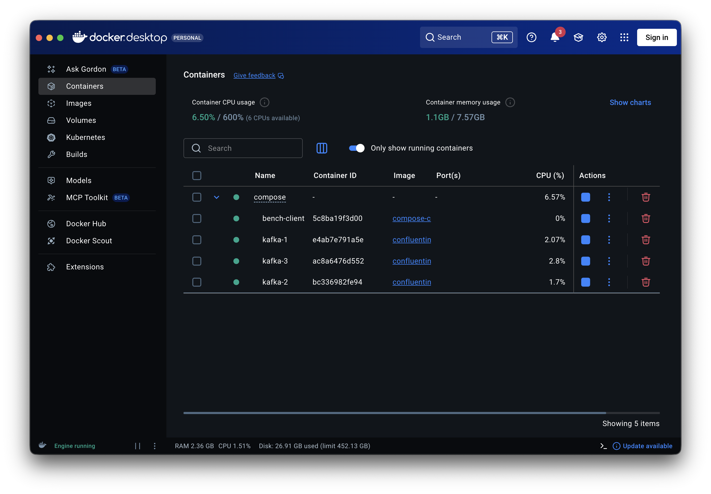

**sc_2.png**

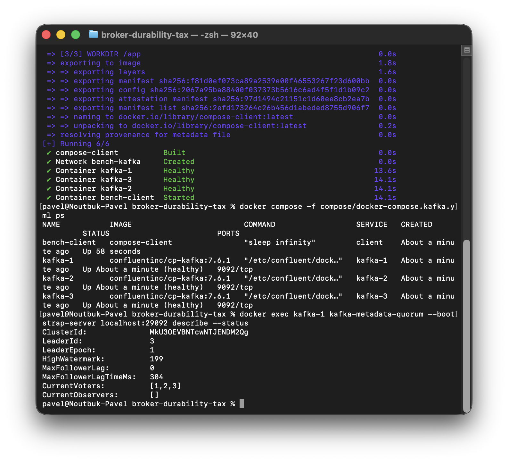

Кластер KRaft поднимается ~20–40 секунд, после чего все три брокера (`kafka-1`, `kafka-2`,
`kafka-3`) переходят в `(healthy)`. Только тогда стартуем прогоны.

### 5.3. Команды запуска

Consumer всегда первым - на T0 это критично, продюсер ничего не ждёт и шлёт "в эфир", если
consumer ещё не подписался, потеряем начало потока.

```bash
# Терминал 1 - поднять стенд:
docker compose -f compose/docker-compose.kafka.yml up -d --build

# Терминал 2 - consumer ПЕРВЫМ (для нужного tier):
docker compose -f compose/docker-compose.kafka.yml exec client \
  python runner.py --broker kafka --tier 0 --role consumer

# Терминал 3 - producer:
docker compose -f compose/docker-compose.kafka.yml exec client \
  python runner.py --broker kafka --tier 0 --role producer

# Между tier'ами - чистый рестарт:
docker compose -f compose/docker-compose.kafka.yml down -v
docker compose -f compose/docker-compose.kafka.yml up -d --build
```

### 5.4. T0 - at-most-once (`acks=0`)

#### Прогон 1

**sc_3.png**

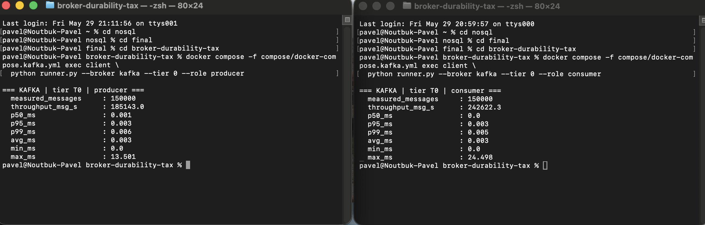

```text
=== KAFKA | tier T0 | producer ===
  measured_messages     : 150000
  throughput_msg_s      : 185143.0
  p50_ms                : 0.001
  p95_ms                : 0.003
  p99_ms                : 0.006
  avg_ms                : 0.003
  min_ms                : 0.0
  max_ms                : 13.501

=== KAFKA | tier T0 | consumer ===
  measured_messages     : 150000
  throughput_msg_s      : 242622.3
  p50_ms                : 0.0
  p95_ms                : 0.003
  p99_ms                : 0.005
  avg_ms                : 0.003
  min_ms                : 0.0
  max_ms                : 24.498
```

#### Прогон 2

**sc_4.png**

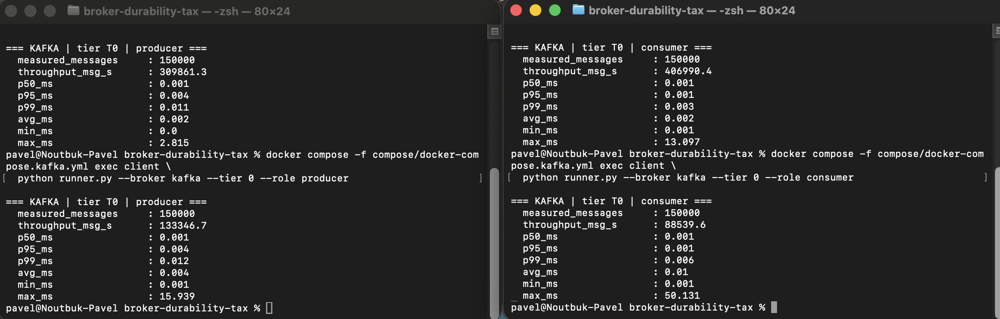

```text
=== KAFKA | tier T0 | producer ===
  throughput_msg_s      : 133346.7
  p50_ms                : 0.001
  p99_ms                : 0.012
  max_ms                : 15.939

=== KAFKA | tier T0 | consumer ===
  throughput_msg_s      : 88539.6
  p50_ms                : 0.001
  p99_ms                : 0.006
  max_ms                : 50.131
```

#### Прогон 3

**sc_5.png**

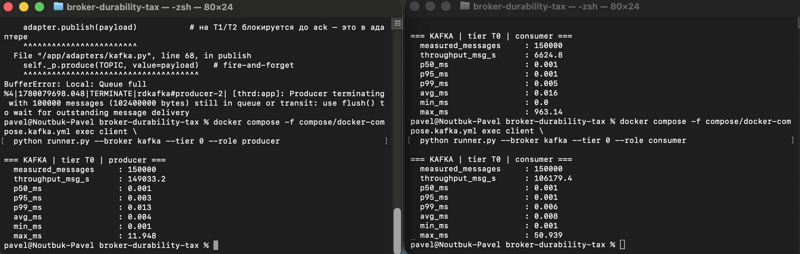

```text
=== KAFKA | tier T0 | producer ===
  throughput_msg_s      : 149033.2
  p50_ms                : 0.001
  p99_ms                : 0.013
  max_ms                : 11.948

=== KAFKA | tier T0 | consumer ===
  throughput_msg_s      : 106179.4
  p50_ms                : 0.001
  p99_ms                : 0.006
  max_ms                : 50.939
```

#### Сводка T0

| прогон | throughput, msg/s | p50, мс | p99, мс |
|---:|---:|---:|---:|
| 1 | 185 143 | 0.001 | 0.006 |
| 2 | 133 347 | 0.001 | 0.012 |
| 3 | 149 033 | 0.001 | 0.013 |

**Медиана: 149 033 msg/s** · разброс **133 347 – 185 143**.

Латентности микроскопические - медиана 1 микросекунда, p99 6–13 микросекунд. Это и есть верхняя
граница скорости Kafka: продюсер пишет в локальный буфер `librdkafka` и ничего не ждёт. Consumer
по throughput где-то рядом или ниже продюсера - это просто скорость чтения, в налог она не идёт.

### 5.5. T1 - at-least-once, только лидер (`acks=1`)

Здесь продюсер начинает ждать ack от лидера на каждое сообщение. Между прогонами - `down -v`.

#### Прогон 1

**sc_6.png**

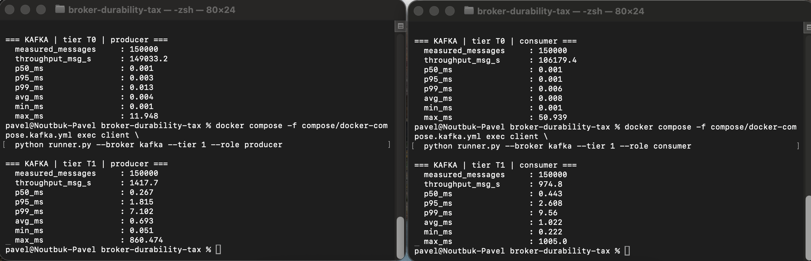

```text
=== KAFKA | tier T1 | producer ===
  throughput_msg_s      : 1417.7
  p50_ms                : 0.267
  p95_ms                : 1.815
  p99_ms                : 7.102
  max_ms                : 860.474

=== KAFKA | tier T1 | consumer ===
  throughput_msg_s      : 974.8
  p50_ms                : 0.443
  p99_ms                : 9.56
  max_ms                : 1005.0
```

#### Прогон 2

*Скриншот именно этого прогона не сохранился, но логи есть.*

```text
=== KAFKA | tier T1 | producer ===
  throughput_msg_s      : 3325.2
  p50_ms                : 0.224
  p99_ms                : 1.549
  max_ms                : 58.05

=== KAFKA | tier T1 | consumer ===
  throughput_msg_s      : 1563.7
  p50_ms                : 0.398
  p99_ms                : 4.441
  max_ms                : 142.015
```

#### Прогон 3

**sc_7.png**

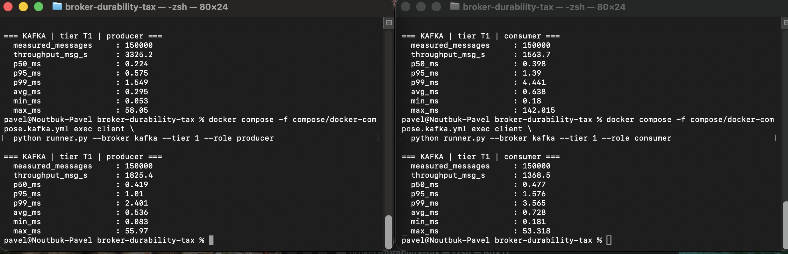

```text
=== KAFKA | tier T1 | producer ===
  throughput_msg_s      : 1825.4
  p50_ms                : 0.419
  p99_ms                : 2.401
  max_ms                : 55.97

=== KAFKA | tier T1 | consumer ===
  throughput_msg_s      : 1368.5
  p50_ms                : 0.477
  p99_ms                : 3.565
  max_ms                : 53.318
```

#### Сводка T1

| прогон | throughput, msg/s | p50, мс | p99, мс |
|---:|---:|---:|---:|
| 1 | 1 417.7 | 0.267 | 7.102 |
| 2 | 3 325.2 | 0.224 | 1.549 |
| 3 | 1 825.4 | 0.419 | 2.401 |

**Медиана: 1 825.4 msg/s** · разброс **1 417.7 – 3 325.2**.

Разброс большой - прогон 2 почти вдвое быстрее остальных. Это прямое следствие fsync-искажения:
Docker-on-macOS непредсказуемо буферизует дисковую синхронизацию, и стоимость записи на лидере
гуляет от прогона к прогону. Поэтому я и беру медиану 3 повторов - она корректно сидит на
центральном значении (1825), а широкий разброс честно фиксирую в отчёте как артефакт
виртуализации, не как реальное свойство Kafka. На bare-metal этот разброс был бы заметно уже.

Промежуточный налог: `(149 033 − 1 825) / 149 033 ≈ 98.8%`. Почти весь throughput съедается уже
на ожидании ack от лидера.

### 5.6. T2 - at-least-once, кворум (`acks=all` + `min.insync.replicas=2`)

Самый важный замер. Меняется одна ручка: `acks=all`. Теперь продюсер ждёт подтверждения не
только от лидера, но и от кворума ISR (минимум 2 из 3 реплик). Это сетевой обмен и Raft-подобный
консенсус между контейнерами - и его виртуализация **не искажает**. Поэтому T2 - главный
защищаемый результат.

#### Прогон 1

**sc_8.png**

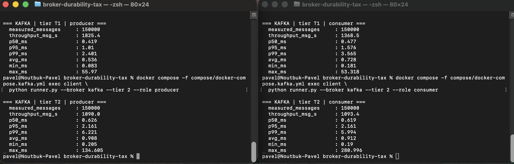

```text
=== KAFKA | tier T2 | producer ===
  throughput_msg_s      : 1090.0
  p50_ms                : 0.626
  p95_ms                : 2.161
  p99_ms                : 6.221
  max_ms                : 134.605

=== KAFKA | tier T2 | consumer ===
  throughput_msg_s      : 1093.4
  p50_ms                : 0.619
  p99_ms                : 5.994
  max_ms                : 280.996
```

#### Прогон 2

**sc_9.png**

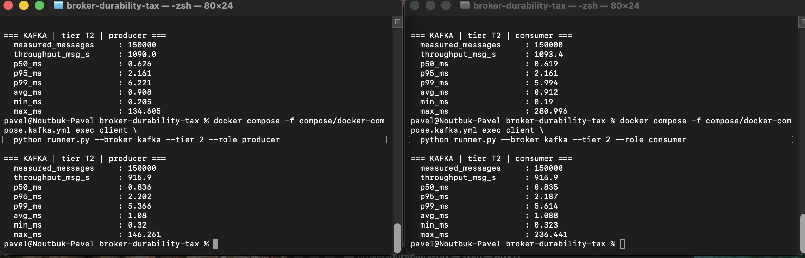

```text
=== KAFKA | tier T2 | producer ===
  throughput_msg_s      : 915.9
  p50_ms                : 0.836
  p99_ms                : 5.366
  max_ms                : 146.261

=== KAFKA | tier T2 | consumer ===
  throughput_msg_s      : 915.9
  p50_ms                : 0.835
  p99_ms                : 5.614
  max_ms                : 236.441
```

#### Прогон 3

**sc_10.png**

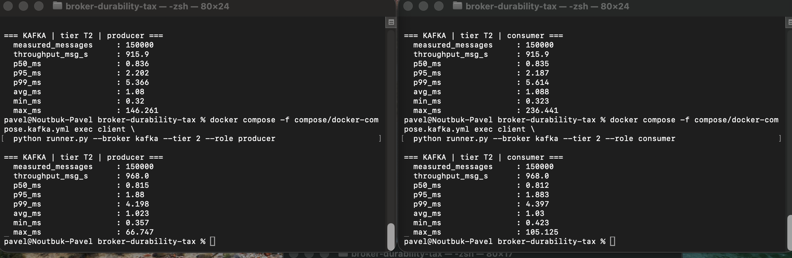

```text
=== KAFKA | tier T2 | producer ===
  throughput_msg_s      : 968.0
  p50_ms                : 0.815
  p99_ms                : 4.198
  max_ms                : 66.747

=== KAFKA | tier T2 | consumer ===
  throughput_msg_s      : 968.0
  p50_ms                : 0.812
  p99_ms                : 4.397
  max_ms                : 105.125
```

#### Сводка T2

| прогон | throughput, msg/s | p50, мс | p99, мс |
|---:|---:|---:|---:|
| 1 | 1 090.0 | 0.626 | 6.221 |
| 2 | 915.9 | 0.836 | 5.366 |
| 3 | 968.0 | 0.815 | 4.198 |

**Медиана: 968.0 msg/s** · разброс **915.9 – 1 090.0**.

T2 заметно стабильнее T1 - разброс ~16% против ~130%. Это и подтверждает методологическую
гипотезу: репликация (сеть+консенсус) меряется честно, а fsync на T1 - нет.

### 5.7. Итоги по Kafka

```
                  T0                 T1                  T2
                  (at-most-once)     (leader durable)    (quorum repl.)
throughput msg/s  149 033            1 825.4             968.0
  (min–max)       133 347–185 143    1 417.7–3 325.2     915.9–1 090.0
p50, мс           0.001              0.42                0.82
p99, мс           0.006              2.4                 4.4
```

```
Налог T0->T1 = (149 033 − 1 825) / 149 033 × 100% ≈ 98.8 %
Налог T0->T2 = (149 033 − 968)  / 149 033 × 100% ≈ 99.4 %
```

Содержательно по Kafka:

Основной обвал - на самом переходе T0->T1. Как только продюсер начал ждать per-message ack от
лидера, throughput упал с ~149k до ~1.8k msg/s, то есть примерно в 80 раз. **Добавление
кворум-репликации (T1->T2) стоит сравнительно немного** - ещё ~860 msg/s, до итоговых ~968 msg/s.
И это самое интересное наблюдение по Kafka: репликация дёшева, потому что ISR-реплики тянут
общий sequential-лог и Kafka амортизирует репликацию через ту же последовательную запись на
диск. На T2 узкое место не в репликации, а в ожидании кворума ISR.

Грабли по ходу было две. Первая - `BufferError: Queue full` на T0 - переполнение очереди
`librdkafka` на разгоне fire-and-forget, снялось чистым рестартом. Вторая - кажущееся
"зависание" продюсера на T1/T2; на деле это честный per-message flush, прогон занимал ~2 минуты.

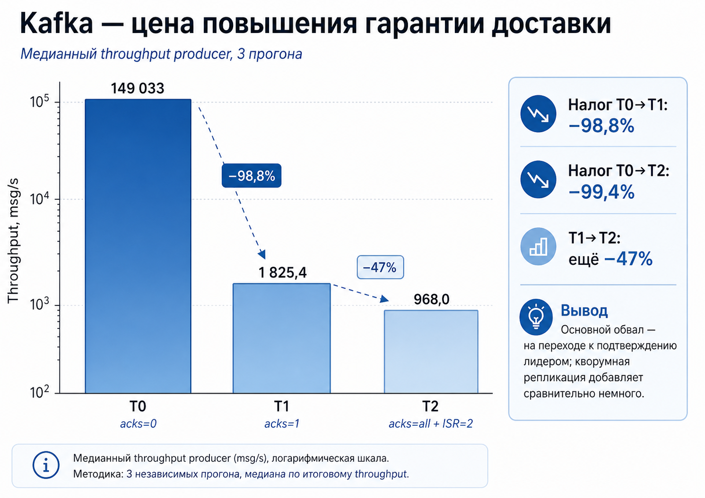


---
## 6. RabbitMQ

**Архитектура:** классический queue-based брокер (AMQP). Сообщения публикуются в exchange,
оттуда попадают в очередь, оттуда - потребителю. У нас всё проще: default exchange (`""`) и
прямая публикация в очередь `bench` по routing_key = имя очереди. Ручка durability -
`publisher confirms` + `delivery_mode` + тип очереди.

### 6.1. Конфигурация стенда

Кластер из 3 нод, собирается сам через `classic_config` peer discovery (общий Erlang cookie
прописан в compose, одинаковый для всех). Топология не меняется между tier'ами, меняются только
**тип очереди** (classic non-durable -> classic durable -> quorum) и **режим подтверждения**
(confirms off -> on per-message).

<details>
<summary>compose/docker-compose.rabbitmq.yml</summary>

```yaml
# docker-compose.rabbitmq.yml - кластер 3 ноды rabbitmq:3.13-management, quorum queues.
# Кластер собирается сам через classic_config peer discovery (см. rabbitmq/rabbitmq.conf).
# Клиенты - сервис `client` внутри сети bench (НЕ localhost).
#
# Запуск:    docker compose -f compose/docker-compose.rabbitmq.yml up -d --build
# Готовность КЛАСТЕРА (важно для quorum!): подождать, пока соберутся 3 ноды:
#   docker exec rabbit1 rabbitmq-diagnostics -q cluster_status   # должно показать 3 ноды
# Сброс:     docker compose -f compose/docker-compose.rabbitmq.yml down -v

x-rabbit-common: &rabbit-common
  image: rabbitmq:3.13-management
  networks: [bench]
  cpus: 2.0
  mem_limit: 2g
  environment: &rabbit-env
    RABBITMQ_ERLANG_COOKIE: benchcookiebenchcookie
    RABBITMQ_DEFAULT_USER: guest
    RABBITMQ_DEFAULT_PASS: guest
  volumes:
    - ./rabbitmq/rabbitmq.conf:/etc/rabbitmq/rabbitmq.conf:ro
  healthcheck:
    test: ["CMD", "rabbitmq-diagnostics", "-q", "ping"]
    interval: 10s
    timeout: 5s
    retries: 18
    start_period: 30s

services:
  rabbit1:
    <<: *rabbit-common
    hostname: rabbit1
    container_name: rabbit1
    environment:
      <<: *rabbit-env
      RABBITMQ_NODENAME: rabbit@rabbit1

  rabbit2:
    <<: *rabbit-common
    hostname: rabbit2
    container_name: rabbit2
    environment:
      <<: *rabbit-env
      RABBITMQ_NODENAME: rabbit@rabbit2

  rabbit3:
    <<: *rabbit-common
    hostname: rabbit3
    container_name: rabbit3
    environment:
      <<: *rabbit-env
      RABBITMQ_NODENAME: rabbit@rabbit3

  client:
    build: ../client
    container_name: bench-client
    networks: [bench]
    working_dir: /app
    volumes:
      - ../harness:/app
    depends_on:
      rabbit1: {condition: service_healthy}
      rabbit2: {condition: service_healthy}
      rabbit3: {condition: service_healthy}

networks:
  bench:
    name: bench-rabbitmq
```

</details>
<details>
<summary>compose/rabbitmq/rabbitmq.conf</summary>

```ini
# rabbitmq.conf - автосборка кластера из 3 нод через classic_config peer discovery.
# Монтируется в каждую ноду read-only. Erlang cookie задаётся в compose (одинаковый для всех).
loopback_users.guest = false
listeners.tcp.default = 5672

cluster_formation.peer_discovery_backend = classic_config
cluster_formation.classic_config.nodes.1 = rabbit@rabbit1
cluster_formation.classic_config.nodes.2 = rabbit@rabbit2
cluster_formation.classic_config.nodes.3 = rabbit@rabbit3

cluster_partition_handling = pause_minority
vm_memory_high_watermark.relative = 0.6
# Поднимаем допустимый размер кадра для крупных payload:
frame_max = 33554432
```

</details>
<details>
<summary>harness/adapters/rabbitmq.py</summary>

```python
"""
adapters/rabbitmq.py - тонкий адаптер по образцу kafka.py (контракт base.py).
Делает ТОЛЬКО подключение + publish/consume_one. Harness-логику не дублирует.

ОПЕРАЦИОННЫЕ ЗАМЕТКИ (грабли RabbitMQ + pika, уже обойдены здесь):
  * heartbeat=0 - В ПЛОТНОМ per-message цикле pika может не успеть обслужить heartbeat и
    брокер рвёт соединение ("ConnectionClosed"). Для замерочного клиента heartbeat отключаем.
  * Quorum queue (T2) требует СФОРМИРОВАННЫЙ кластер из 3 нод (см. compose). Если кластер
    ещё собирается - declare упадёт; _connect() ретраит подключение до --startup-timeout-окна.
  * Очередь объявляется ПОД tier (classic/quorum, durable/transient). Между tier'ами кластер
    пересоздаётся (docker compose down -v && up), поэтому конфликта redeclare не будет.
  * Consumer: basic_consume + локальный буфер + process_data_events(time_limit) даёт честный
    блокирующий consume_one(timeout). ack - per-message на T1/T2; на T0 auto_ack (at-most-once).
  * Publisher confirms (T1/T2): confirm_delivery() + basic_publish блокирует до ack/nack
    КАЖДОГО сообщения. На T0 confirms выключены, delivery_mode=1 (transient).
"""
import time
import collections
import pika
from adapters.base import BrokerAdapter

HOSTS = ["rabbit1", "rabbit2", "rabbit3"]   # внутренние адреса docker-сети (НЕ localhost)
QUEUE = "bench"
CREDS = pika.PlainCredentials("guest", "guest")

# tier -> (durable_queue, quorum, delivery_mode, confirms)
TIER = {
    0: dict(durable=False, quorum=False, dm=1, confirms=False),
    1: dict(durable=True,  quorum=False, dm=2, confirms=True),
    2: dict(durable=True,  quorum=True,  dm=2, confirms=True),
}


def _connect():
    last = None
    deadline = time.time() + 90  # кластер/ноды могут ещё подниматься
    while time.time() < deadline:
        for h in HOSTS:
            try:
                params = pika.ConnectionParameters(
                    host=h, heartbeat=0, blocked_connection_timeout=300, credentials=CREDS)
                return pika.BlockingConnection(params)
            except Exception as e:
                last = e
        time.sleep(2)
    raise last


def _declare(ch, tier):
    t = TIER[tier]
    args = {"x-queue-type": "quorum"} if t["quorum"] else {}
    ch.queue_declare(queue=QUEUE, durable=t["durable"], arguments=args)


class Adapter(BrokerAdapter):
    name = "rabbitmq"

    def setup(self, tier):
        self._tier = tier
        conn = _connect()
        ch = conn.channel()
        _declare(ch, tier)
        conn.close()

    def connect_producer(self, tier):
        self._tier = tier
        self._pconn = _connect()
        self._pch = self._pconn.channel()
        _declare(self._pch, tier)
        if TIER[tier]["confirms"]:
            self._pch.confirm_delivery()   # с этого момента basic_publish блокирует до ack
        self._props = pika.BasicProperties(delivery_mode=TIER[tier]["dm"])

    def publish(self, payload: bytes):
        # тело = payload без изменений; default exchange, routing_key = имя очереди
        self._pch.basic_publish(exchange="", routing_key=QUEUE,
                                body=payload, properties=self._props)
        # при confirms=True (T1/T2) вызов вернётся только после ack брокера (per-message)

    def connect_consumer(self, tier):
        self._ctier = tier
        self._cconn = _connect()
        self._cch = self._cconn.channel()
        _declare(self._cch, tier)
        self._cch.basic_qos(prefetch_count=500)
        self._buf = collections.deque()

        def on_msg(ch, method, props, body):
            self._buf.append((method.delivery_tag, body))

        self._cch.basic_consume(QUEUE, on_message_callback=on_msg,
                                auto_ack=(tier == 0))   # T0 = at-most-once

    def consume_one(self, timeout: float):
        deadline = time.perf_counter() + timeout
        while not self._buf:
            remaining = deadline - time.perf_counter()
            if remaining <= 0:
                return None
            try:
                self._cconn.process_data_events(time_limit=remaining)  # качаем I/O до timeout
            except Exception:
                return None
        tag, body = self._buf.popleft()
        if self._ctier > 0:
            self._cch.basic_ack(tag)     # per-message ack (at-least-once)
        return body

    def teardown(self):
        for c in ("_pconn", "_cconn"):
            conn = getattr(self, c, None)
            if conn is not None:
                try:
                    conn.close()
                except Exception:
                    pass
```

</details>

Пара тонкостей в адаптере.

**`heartbeat=0` в `ConnectionParameters`.** В плотном per-message цикле pika может не успеть
обслужить heartbeat - брокер посчитает соединение мёртвым и порвёт. Для замерочного клиента
heartbeat отключаем. На production так делать нельзя, но здесь это снимает ложные обрывы.

**Consumer через `basic_consume` + локальный буфер.** Это даёт честный блокирующий `consume_one(timeout)`
через `process_data_events(time_limit=remaining)`. ack - per-message на T1/T2, на T0 `auto_ack=True`.

### 6.2. Подъём стенда

**sc_11.png**

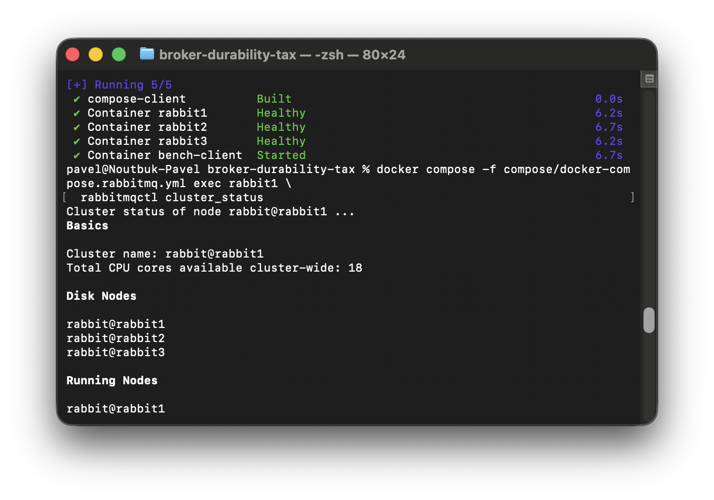

**sc_12.png**


3 ноды + сервис `client`, все в статусе healthy. Перед T2 обязательно проверял, что кластер
реально собрался - `rabbitmqctl cluster_status` должен показывать все три ноды среди running.
Quorum-очередь без полного кластера просто не создаётся.

### 6.3. Команды запуска

```bash
docker compose -f compose/docker-compose.rabbitmq.yml up -d --build

# consumer первым
docker compose -f compose/docker-compose.rabbitmq.yml exec client \
  python runner.py --broker rabbitmq --tier 0 --role consumer

# затем producer
docker compose -f compose/docker-compose.rabbitmq.yml exec client \
  python runner.py --broker rabbitmq --tier 0 --role producer

# между tier'ами - чистый рестарт (тип очереди нельзя менять на лету)
docker compose -f compose/docker-compose.rabbitmq.yml down -v
docker compose -f compose/docker-compose.rabbitmq.yml up -d --build
```

### 6.4. T0 - at-most-once (classic non-durable, без confirms, `delivery_mode=1`)

#### Прогон 1

**sc_13.png**

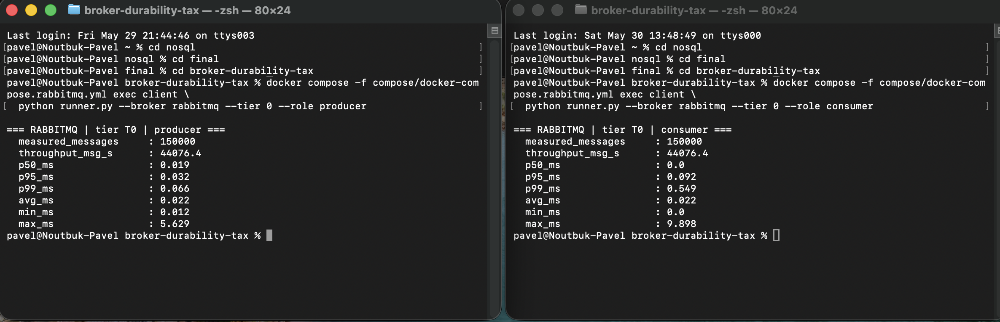

```text
=== RABBITMQ | tier T0 | producer ===
  throughput_msg_s      : 44076.4
  p50_ms                : 0.019
  p95_ms                : 0.032
  p99_ms                : 0.066
  max_ms                : 5.629

=== RABBITMQ | tier T0 | consumer ===
  throughput_msg_s      : 44076.4
  p50_ms                : 0.0
  p99_ms                : 0.549
  max_ms                : 9.898
```

#### Прогон 2

**sc_14.png**

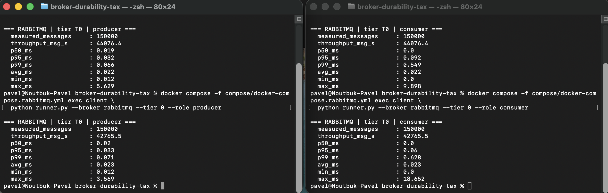

```text
=== RABBITMQ | tier T0 | producer ===
  throughput_msg_s      : 42765.5
  p50_ms                : 0.02
  p99_ms                : 0.071
  max_ms                : 3.569

=== RABBITMQ | tier T0 | consumer ===
  throughput_msg_s      : 42765.5
  p50_ms                : 0.0
  p99_ms                : 0.628
  max_ms                : 18.652
```

#### Прогон 3

**sc_15.png**

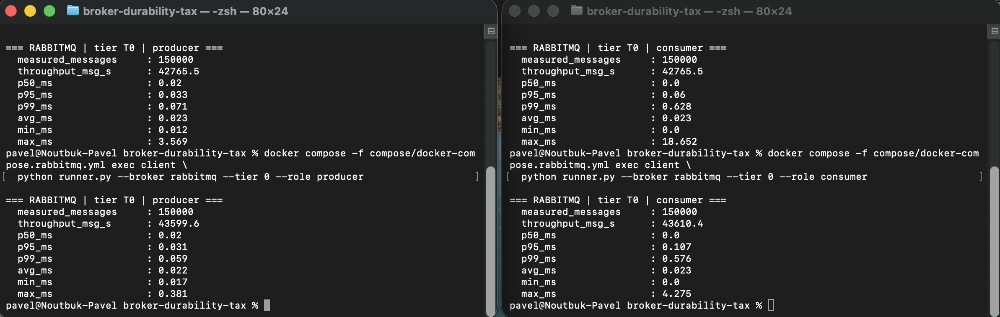

```text
=== RABBITMQ | tier T0 | producer ===
  throughput_msg_s      : 43599.6
  p50_ms                : 0.02
  p99_ms                : 0.059
  max_ms                : 0.381

=== RABBITMQ | tier T0 | consumer ===
  throughput_msg_s      : 43610.4
  p50_ms                : 0.0
  p99_ms                : 0.576
  max_ms                : 4.275
```

#### Сводка T0

| прогон | throughput, msg/s | p50, мс | p99, мс |
|---:|---:|---:|---:|
| 1 | 44 076.4 | 0.019 | 0.066 |
| 2 | 42 765.5 | 0.020 | 0.071 |
| 3 | 43 599.6 | 0.020 | 0.059 |

**Медиана: 43 599.6 msg/s** · разброс **42 765 – 44 076**.

Разброс всего ~3% - очень кучно, окружение чистое. Латентность producer'а ~20 микросекунд -
фактически время на один `basic_publish` без round-trip к брокеру. Consumer держится в той же
полосе пропускания, потому что на T0 он связан скоростью producer'а: получает ровно столько,
сколько ему налили, без подтверждений.

### 6.5. T1 - at-least-once, лидер (classic durable, confirms, `delivery_mode=2`)

Здесь `basic_publish` начинает блокироваться до ack брокера на каждое сообщение, плюс сообщения
флашатся на диск.

#### Прогон 1

**sc_16.png**

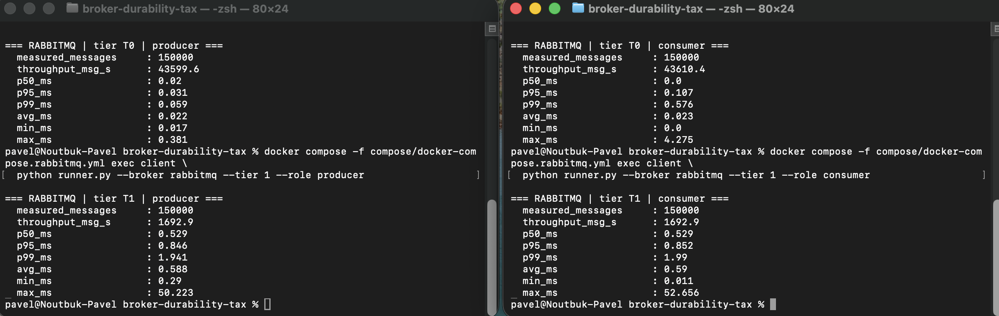

```text
=== RABBITMQ | tier T1 | producer ===
  throughput_msg_s      : 1692.9
  p50_ms                : 0.529
  p99_ms                : 1.941
  max_ms                : 50.223

=== RABBITMQ | tier T1 | consumer ===
  throughput_msg_s      : 1692.9
  p50_ms                : 0.529
  p99_ms                : 1.99
  max_ms                : 52.656
```

#### Прогон 2

**sc_17.png**

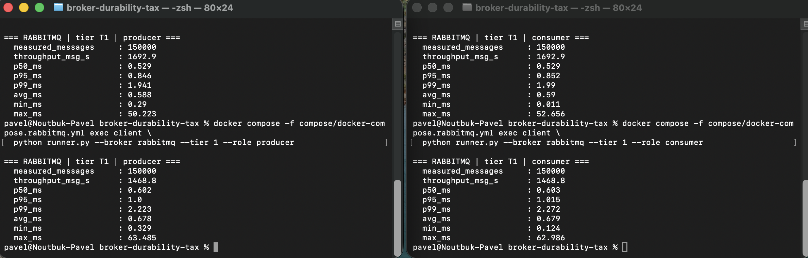

```text
=== RABBITMQ | tier T1 | producer ===
  throughput_msg_s      : 1468.8
  p50_ms                : 0.602
  p99_ms                : 2.223
  max_ms                : 63.485

=== RABBITMQ | tier T1 | consumer ===
  throughput_msg_s      : 1468.8
  p50_ms                : 0.603
  p99_ms                : 2.272
  max_ms                : 62.986
```

#### Прогон 3

**sc_18.png**

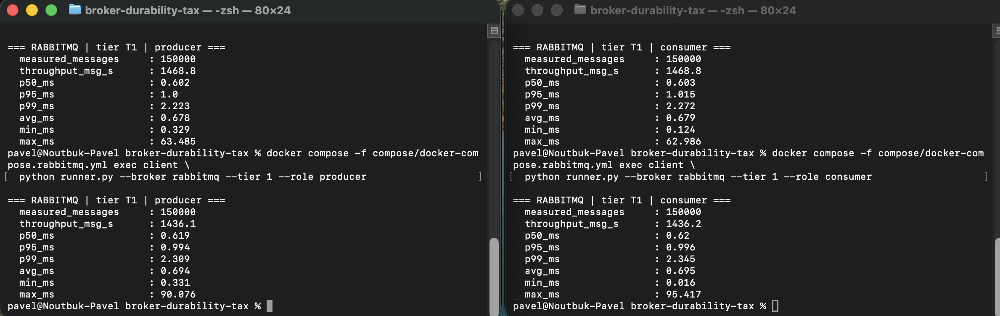

```text
=== RABBITMQ | tier T1 | producer ===
  throughput_msg_s      : 1436.1
  p50_ms                : 0.619
  p99_ms                : 2.309
  max_ms                : 90.076

=== RABBITMQ | tier T1 | consumer ===
  throughput_msg_s      : 1436.2
  p50_ms                : 0.62
  p99_ms                : 2.345
  max_ms                : 95.417
```

#### Сводка T1

| прогон | throughput, msg/s | p50, мс | p99, мс |
|---:|---:|---:|---:|
| 1 | 1 692.9 | 0.529 | 1.941 |
| 2 | 1 468.8 | 0.602 | 2.223 |
| 3 | 1 436.1 | 0.619 | 2.309 |

**Медиана: 1 468.8 msg/s** · разброс **1 436 – 1 693**.

Промежуточный налог `T0->T1 ≈ 96.6%` - обвал в ~30 раз. Причина - `publisher confirms` без
батчинга: каждое сообщение ждёт полный round-trip producer->брокер->ack плюс флаш на диск.
Это типичный профиль queue-based: брокер не амортизирует подтверждения последовательной
записью лога, как Kafka, а платит за каждое сообщение отдельно.

### 6.6. T2 - at-least-once, кворум (quorum queue, Raft 2/3)

Меняется тип очереди - `bench` теперь quorum-очередь, реплицируемая по Raft на ≥2 ноды.

#### Прогон 1

**sc_19.png**

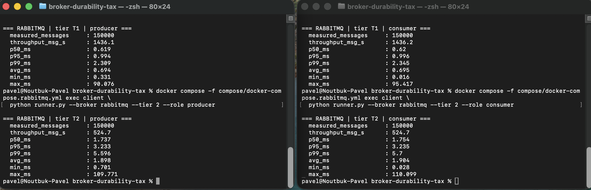

```text
=== RABBITMQ | tier T2 | producer ===
  throughput_msg_s      : 524.7
  p50_ms                : 1.737
  p95_ms                : 3.233
  p99_ms                : 5.596
  max_ms                : 109.771

=== RABBITMQ | tier T2 | consumer ===
  throughput_msg_s      : 524.7
  p50_ms                : 1.754
  p99_ms                : 5.7
  max_ms                : 110.099
```

#### Прогон 2

**sc_20.png**

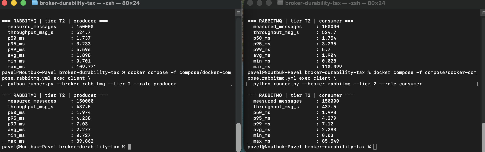

```text
=== RABBITMQ | tier T2 | producer ===
  throughput_msg_s      : 437.5
  p50_ms                : 1.974
  p99_ms                : 7.03
  max_ms                : 89.862

=== RABBITMQ | tier T2 | consumer ===
  throughput_msg_s      : 437.5
  p50_ms                : 1.993
  p99_ms                : 7.12
  max_ms                : 85.549
```

#### Прогон 3

**sc_21.png**

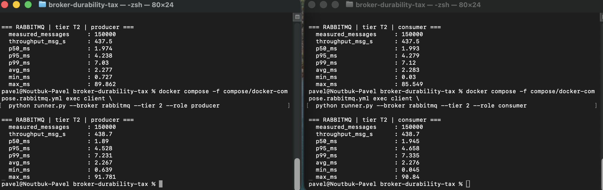

```text
=== RABBITMQ | tier T2 | producer ===
  throughput_msg_s      : 438.7
  p50_ms                : 1.89
  p99_ms                : 7.231
  max_ms                : 91.781

=== RABBITMQ | tier T2 | consumer ===
  throughput_msg_s      : 438.7
  p50_ms                : 1.945
  p99_ms                : 7.335
  max_ms                : 90.84
```

#### Сводка T2

| прогон | throughput, msg/s | p50, мс | p99, мс |
|---:|---:|---:|---:|
| 1 | 524.7 | 1.737 | 5.596 |
| 2 | 437.5 | 1.974 | 7.03 |
| 3 | 438.7 | 1.89 | 7.231 |

**Медиана: 438.7 msg/s** · разброс **437.5 – 524.7**.

Первый повтор выбился вверх (524.7), два других легли кучно около 438 - медиана корректно
отбросила выброс, для этого 3 повтора и нужны.

### 6.7. Итоги по RabbitMQ

```
                   T0              T1              T2
throughput, msg/s  43 600          1 469           439
                   (42766–44076)   (1436–1693)     (438–525)
p50, мс            0.02            0.53            1.89
p99, мс            0.06            2.2             7.2
```

```
Налог T0->T1 = (43 600 − 1 469) / 43 600 × 100% ≈ 96.6 %
Налог T0->T2 = (43 600 −   439) / 43 600 × 100% ≈ 99.0 %
```

Содержательно по RabbitMQ - три коротких вывода.

У RabbitMQ durability дорогая уже на T1. Сам переход к подтверждённой записи на лидере
(per-message confirm + fsync) съедает ~97% throughput - обвал в ~30 раз. Это профиль queue-based
брокера: он не амортизирует подтверждения через последовательную пакетную запись лога, как
log-based Kafka, а платит полный round-trip за каждое сообщение.

Репликация (T1->T2) добавляет ещё ~3-кратное падение поверх durable. Дельта T1->T2 - это чистая
цена Raft-консенсуса, и она измерена честно (сетевой обмен между контейнерами виртуализация не
искажает, в отличие от fsync на T1). То есть в общем налоге T0->T2 = 99% грубо две трети
"кратности" дал уже T1 (диск+confirm), а оставшееся - репликация.

И методологическая оговорка: абсолютная стоимость T1 на Docker-macOS занижена (fsync
буферизуется виртуализацией), поэтому на bare-metal разрыв T0->T1 был бы ещё больше. Главный
защищаемый результат - относительный налог T0->T2 и кратность дельт, не абсолютные msg/s.

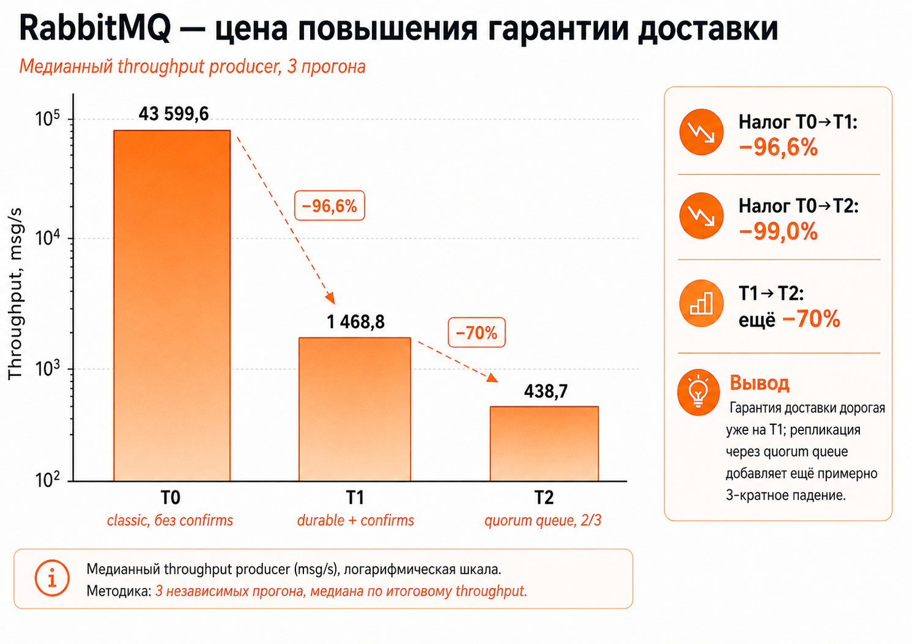

---
## 7. Redis Streams

**Архитектура:** in-memory key-value store с потоковой структурой Streams. Команды `XADD` (write)
и `XREADGROUP` / `XACK` (consumer group read). Ручки durability у Redis непривычные.

`appendfsync` (политика AOF на диск): `no` / `everysec` / `always` - насколько часто Redis флашит
Append-Only File. Меняется через `CONFIG SET` на мастере.

`WAIT N timeout_ms` - блокирующая команда, ждёт, пока минимум N реплик догонят текущее
состояние. Это **best-effort**, репликация Redis асинхронна - это **не** настоящий кворум, как
Raft в RabbitMQ или ISR в Kafka. Качественное отличие, которое прямо влияет на интерпретацию.

### 7.1. Топология - важно (отличие от наивной схемы)

Когда я только разворачивал Redis для этой работы, по аналогии с другими брокерами мне хотелось
сделать схему "3 master + 3 replica" в cluster mode. Эта схема для `WAIT 2` **не работает**: у
каждого мастера по одной реплике, и `WAIT 2` будет ждать вторую вечность. Поресёрчил вопрос
(включая консультацию с ИИ), и оказалось, что для durability-эксперимента с WAIT корректная схема
это **1 master + 2 replica** (обычная репликация, не cluster mode). Это ровно "primary + 2
реплики" из определения T2, `WAIT 2` честно получает кворум, и 3 ноды сохранены.

### 7.2. Конфигурация стенда

<details>
<summary>compose/docker-compose.redis.yml</summary>

```yaml
# docker-compose.redis.yml - 1 master + 2 replica (обычная репликация, НЕ cluster mode),
# redis:7.2, AOF включён. Эта схема - корректная для WAIT 2 ("primary + 2 реплики").
# Схема "3 master + 3 replica" для WAIT 2 НЕ годится (у мастера была бы 1 реплика -> WAIT 2 виснет).
# Клиенты - сервис `client` внутри сети bench (НЕ localhost), пишут/читают на redis-master.
#
# Запуск:    docker compose -f compose/docker-compose.redis.yml up -d --build
# Готовность репликации (важно для T2!):
#   docker exec redis-master redis-cli INFO replication | grep connected_slaves   # = 2
# Сброс:     docker compose -f compose/docker-compose.redis.yml down -v

x-redis-common: &redis-common
  image: redis:7.2
  networks: [bench]
  cpus: 2.0
  mem_limit: 2g
  healthcheck:
    test: ["CMD", "redis-cli", "ping"]
    interval: 10s
    timeout: 5s
    retries: 12
    start_period: 5s

services:
  redis-master:
    <<: *redis-common
    hostname: redis-master
    container_name: redis-master
    # appendfsync переключается per-tier из адаптера через CONFIG SET; стартуем с everysec
    command: ["redis-server", "--appendonly", "yes", "--appendfsync", "everysec",
              "--save", ""]

  redis-replica-1:
    <<: *redis-common
    hostname: redis-replica-1
    container_name: redis-replica-1
    command: ["redis-server", "--replicaof", "redis-master", "6379",
              "--appendonly", "yes", "--appendfsync", "everysec", "--save", ""]
    depends_on:
      redis-master: {condition: service_healthy}

  redis-replica-2:
    <<: *redis-common
    hostname: redis-replica-2
    container_name: redis-replica-2
    command: ["redis-server", "--replicaof", "redis-master", "6379",
              "--appendonly", "yes", "--appendfsync", "everysec", "--save", ""]
    depends_on:
      redis-master: {condition: service_healthy}

  client:
    build: ../client
    container_name: bench-client
    networks: [bench]
    working_dir: /app
    volumes:
      - ../harness:/app
    depends_on:
      redis-master: {condition: service_healthy}
      redis-replica-1: {condition: service_healthy}
      redis-replica-2: {condition: service_healthy}

networks:
  bench:
    name: bench-redis
```

</details>
<details>
<summary>harness/adapters/redis.py</summary>

```python
"""
adapters/redis.py - тонкий адаптер по образцу kafka.py (контракт base.py).
Делает ТОЛЬКО подключение + publish/consume_one. Harness-логику не дублирует.

КРИТИЧНО ПРО ТОПОЛОГИЮ:
  WAIT 2 ждёт подтверждения от ДВУХ РЕПЛИК ОДНОГО мастера. В схеме "3 master + 3 replica"
  у каждого мастера по ОДНОЙ реплике -> WAIT 2 никогда не выполнится и будет висеть до таймаута.
  Поэтому для оси durability берём корректную схему: 1 master + 2 replica (обычная репликация,
  НЕ cluster mode). Это ровно "primary + 2 реплики" из определения T2 и честно даёт WAIT 2.
  3 ноды сохранены; смысл tier'а сохранён.

ОПЕРАЦИОННЫЕ ЗАМЕТКИ:
  * fsync-политика задаётся per-tier через CONFIG SET на мастере (см. setup()):
      T0 -> appendfsync no (фактически без durability)
      T1 -> appendfsync always (синхронный fsync на лидере; на Docker-macOS ЗАНИЖЕН - в отчёт!)
      T2 -> appendfsync everysec + WAIT 2 (durability через 2 реплики)
  * WAIT даёт BEST-EFFORT подтверждение: репликация Redis АСИНХРОННА, это НЕ настоящий кворум
    как Raft (RabbitMQ) / ISR (Kafka). Качественное отличие - фиксируется в отчёте.
  * Redis T0 всё равно имеет 1 RTT (XADD возвращает id). Это честный "пол" in-memory подхода -
    не fire-and-forget уровня Kafka acks=0 / core NATS. Так и подаётся.
"""
import time
import redis
from adapters.base import BrokerAdapter

MASTER = "redis-master"   # внутренний адрес docker-сети (НЕ localhost)
PORT = 6379
STREAM = "bench"
GROUP = "bench-grp"
FIELD = b"d"              # одно поле фиксированного имени; значение = payload без обёрток
WAIT_REPLICAS = 2
WAIT_TIMEOUT_MS = 3000


def _client():
    deadline = time.time() + 90
    last = None
    while time.time() < deadline:
        try:
            r = redis.Redis(host=MASTER, port=PORT, socket_timeout=30)
            r.ping()
            return r
        except Exception as e:
            last = e
            time.sleep(2)
    raise last


class Adapter(BrokerAdapter):
    name = "redis"

    def setup(self, tier):
        self._tier = tier
        r = _client()
        # fsync-политика лидера под tier
        if tier == 0:
            try:
                r.config_set("appendonly", "no")
            except Exception:
                pass
            try:
                r.config_set("appendfsync", "no")
            except Exception:
                pass
        elif tier == 1:
            r.config_set("appendonly", "yes")
            r.config_set("appendfsync", "always")
        else:
            r.config_set("appendonly", "yes")
            r.config_set("appendfsync", "everysec")
        # consumer group (идемпотентно)
        try:
            r.xgroup_create(STREAM, GROUP, id="0", mkstream=True)
        except redis.ResponseError as e:
            if "BUSYGROUP" not in str(e):
                raise
        r.close()

    def connect_producer(self, tier):
        self._tier = tier
        self._r = _client()

    def publish(self, payload: bytes):
        self._r.xadd(STREAM, {FIELD: payload})   # тело = payload без изменений
        if self._tier == 2:
            # ждём подтверждения 2 реплик ИМЕННО для актуального состояния (per-message)
            self._r.execute_command("WAIT", WAIT_REPLICAS, WAIT_TIMEOUT_MS)
        # T1: durability через appendfsync always на лидере (WAIT не нужен)
        # T0: ничего не ждём

    def connect_consumer(self, tier):
        self._tier = tier
        self._r = _client()
        self._consumer = "c1"

    def consume_one(self, timeout: float):
        block_ms = max(1, int(timeout * 1000))
        resp = self._r.xreadgroup(GROUP, self._consumer, {STREAM: ">"},
                                  count=1, block=block_ms)
        if not resp:
            return None
        _stream, entries = resp[0]
        if not entries:
            return None
        msg_id, fields = entries[0]
        if self._tier > 0:
            self._r.xack(STREAM, GROUP, msg_id)   # per-message ack
        return fields.get(FIELD)

    def teardown(self):
        try:
            self._r.close()
        except Exception:
            pass
```

</details>

В адаптере `setup(tier)` перенастраивает мастер под нужную политику fsync через `CONFIG SET`
(`no` для T0, `always` для T1, `everysec` для T2) и идемпотентно создаёт consumer group.
`publish()` на T2 после каждого `XADD` шлёт `WAIT 2 3000` - ждём двух реплик с таймаутом 3 секунды.

### 7.3. Подъём стенда

**sc_22.png**

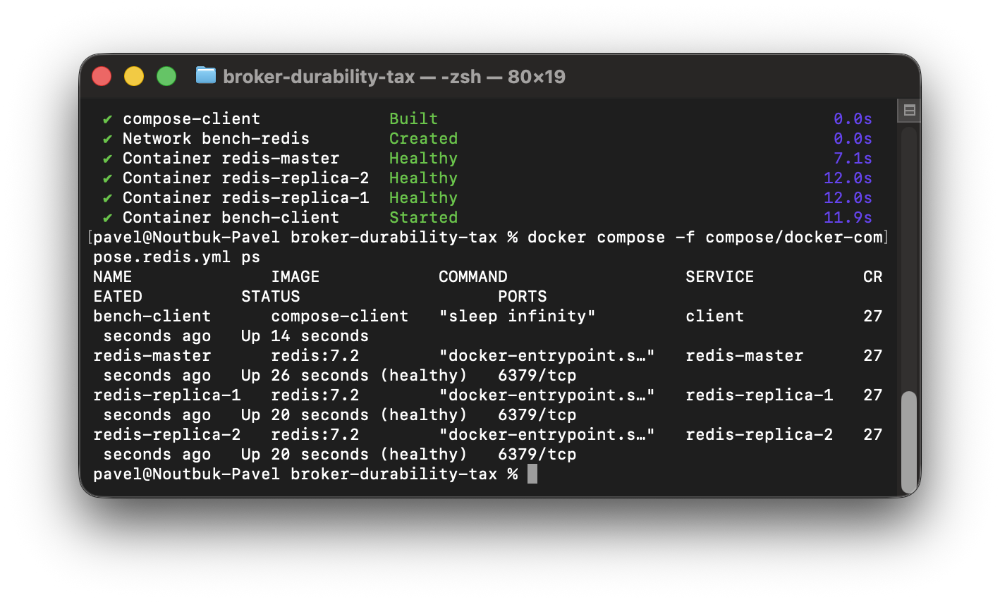

**sc_23.png**

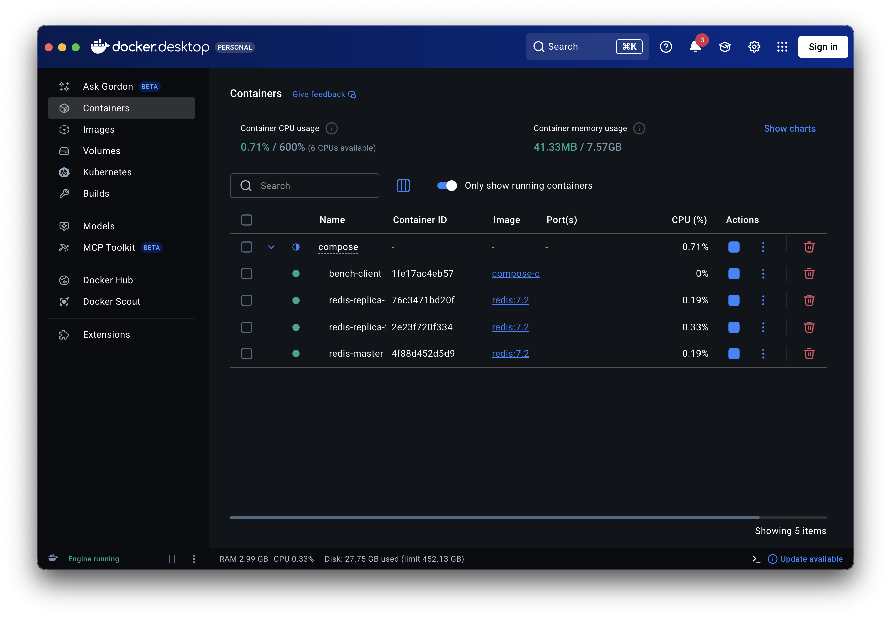

Один мастер `redis-master` + две реплики `redis-replica-1`/`redis-replica-2`. Перед T2 я ещё
сверял `connected_slaves` на мастере - `redis-cli INFO replication | grep connected_slaves`
должен показать 2. Если реплики ещё не догнали мастер, `WAIT 2` зависнет, и весь прогон будет
ждать таймаут на каждом сообщении.

### 7.4. Команды запуска

```bash
docker compose -f compose/docker-compose.redis.yml up -d --build

# Pre-flight перед T2:
docker exec redis-master redis-cli INFO replication | grep connected_slaves   # = 2

# consumer первым
docker compose -f compose/docker-compose.redis.yml exec client \
  python runner.py --broker redis --tier 0 --role consumer

docker compose -f compose/docker-compose.redis.yml exec client \
  python runner.py --broker redis --tier 0 --role producer

# рестарт между tier'ами
docker compose -f compose/docker-compose.redis.yml down -v
docker compose -f compose/docker-compose.redis.yml up -d --build
```

### 7.5. T0 - at-most-once (`appendfsync no`, без WAIT)

Важная оговорка про T0 у Redis: даже без WAIT и без AOF - это **не** чистый fire-and-forget
уровня Kafka `acks=0` или core NATS. `XADD` синхронен, всегда возвращает id - это один RTT
producer<->мастер. То есть T0 у Redis имеет естественный "пол" ~1 RTT, и сравнивать его с T0
Kafka в лоб некорректно. Это и есть честный "пол" in-memory подхода.

#### Прогон 1

**sc_24.png**

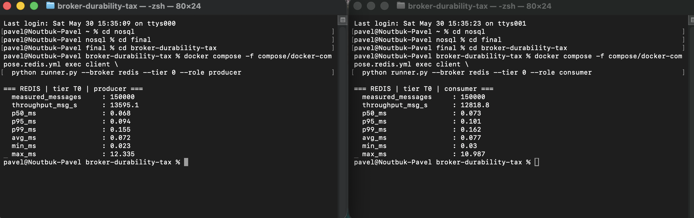

```text
=== REDIS | tier T0 | producer ===
  throughput_msg_s      : 13595.1
  p50_ms                : 0.068
  p95_ms                : 0.094
  p99_ms                : 0.155
  max_ms                : 12.335

=== REDIS | tier T0 | consumer ===
  throughput_msg_s      : 12818.8
  p50_ms                : 0.073
  p99_ms                : 0.162
  max_ms                : 10.987
```

#### Прогон 2

**sc_25.png**

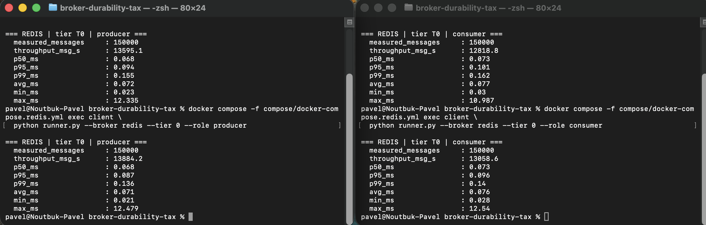

```text
=== REDIS | tier T0 | producer ===
  throughput_msg_s      : 13884.2
  p50_ms                : 0.068
  p99_ms                : 0.136
  max_ms                : 12.479

=== REDIS | tier T0 | consumer ===
  throughput_msg_s      : 13058.6
  p50_ms                : 0.073
  p99_ms                : 0.14
  max_ms                : 12.54
```

#### Прогон 3

**sc_26.png**

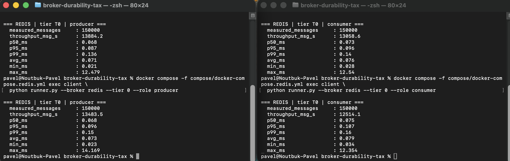

```text
=== REDIS | tier T0 | producer ===
  throughput_msg_s      : 13483.5
  p50_ms                : 0.068
  p99_ms                : 0.15
  max_ms                : 14.169

=== REDIS | tier T0 | consumer ===
  throughput_msg_s      : 12514.1
  p50_ms                : 0.075
  p99_ms                : 0.16
  max_ms                : 12.354
```

#### Сводка T0

| прогон | throughput, msg/s | p50, мс | p99, мс |
|---:|---:|---:|---:|
| 1 | 13 595.1 | 0.068 | 0.155 |
| 2 | 13 884.2 | 0.068 | 0.136 |
| 3 | 13 483.5 | 0.068 | 0.150 |

**Медиана: 13 595.1 msg/s** · разброс **13 483 – 13 884** (всего ~3%, отличная стабильность).
p50 идеально стабилен на 68 микросекунд - это и есть стоимость одного RTT в docker-сети до Redis.

### 7.6. T1 - at-least-once, лидер (`appendfsync always`, без WAIT)

#### Прогон 1

**sc_27.png**

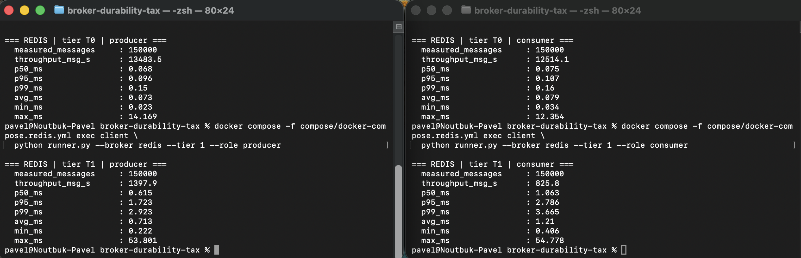

```text
=== REDIS | tier T1 | producer ===
  throughput_msg_s      : 1397.9
  p50_ms                : 0.615
  p99_ms                : 2.923
  max_ms                : 53.801

=== REDIS | tier T1 | consumer ===
  throughput_msg_s      : 825.8
  p50_ms                : 1.063
  p99_ms                : 3.665
  max_ms                : 54.778
```

#### Прогон 2

**sc_28.png**

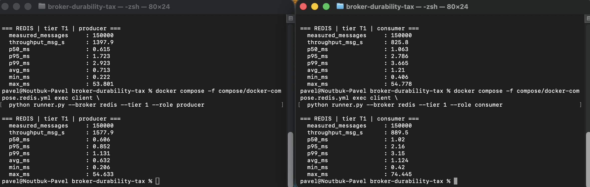

```text
=== REDIS | tier T1 | producer ===
  throughput_msg_s      : 1577.9
  p50_ms                : 0.606
  p99_ms                : 1.131
  max_ms                : 54.633

=== REDIS | tier T1 | consumer ===
  throughput_msg_s      : 889.5
  p50_ms                : 1.02
  p99_ms                : 3.15
  max_ms                : 74.445
```

#### Прогон 3

**sc_29.png**

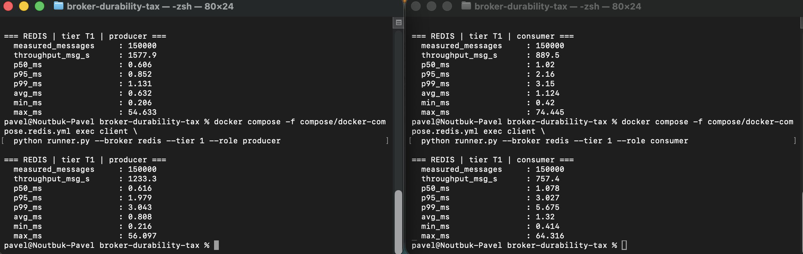

```text
=== REDIS | tier T1 | producer ===
  throughput_msg_s      : 1233.3
  p50_ms                : 0.616
  p99_ms                : 3.043
  max_ms                : 56.097

=== REDIS | tier T1 | consumer ===
  throughput_msg_s      : 757.4
  p50_ms                : 1.078
  p99_ms                : 5.675
  max_ms                : 64.316
```

#### Сводка T1

| прогон | throughput, msg/s | p50, мс | p99, мс |
|---:|---:|---:|---:|
| 1 | 1 397.9 | 0.615 | 2.923 |
| 2 | 1 577.9 | 0.606 | 1.131 |
| 3 | 1 233.3 | 0.616 | 3.043 |

**Медиана: 1 397.9 msg/s** · разброс **1 233 – 1 578** (~±12%, ожидаемо шумнее из-за fsync через
виртуализацию). p50 удивительно стабилен на ~0.61 мс во всех трёх - это "честная" стоимость
одного синхронного fsync. Throughput гуляет за счёт хвостов (p95/p99), медианная латентность
твёрдая.

Промежуточный налог `T0->T1 ≈ 89.7%` - почти весь throughput Redis съедается уже на переходе к
синхронному fsync на одном узле, ещё до всякой репликации.

### 7.7. T2 - at-least-once, кворум (`appendfsync everysec` + `WAIT 2`)

И вот самое интересное. У других брокеров T2 был медленнее T1. У Redis - наоборот.

#### Прогон 1

**sc_30.png**

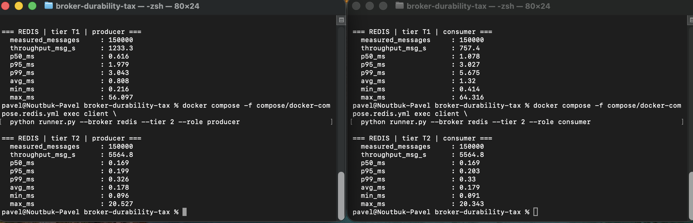

```text
=== REDIS | tier T2 | producer ===
  throughput_msg_s      : 5564.8
  p50_ms                : 0.169
  p95_ms                : 0.199
  p99_ms                : 0.326
  max_ms                : 20.527

=== REDIS | tier T2 | consumer ===
  throughput_msg_s      : 5564.8
  p50_ms                : 0.169
  p99_ms                : 0.33
  max_ms                : 20.343
```

#### Прогон 2

**sc_31.png**

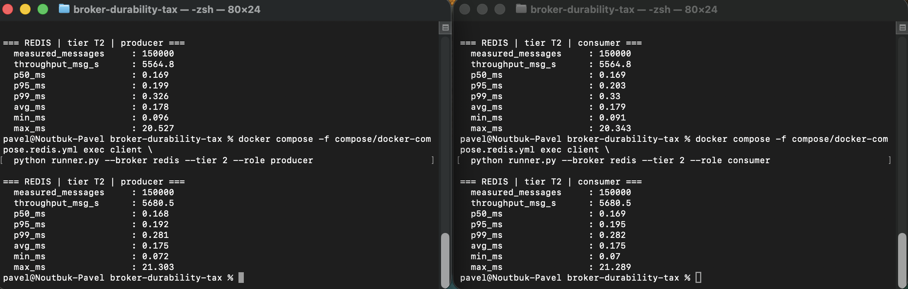

```text
=== REDIS | tier T2 | producer ===
  throughput_msg_s      : 5680.5
  p50_ms                : 0.168
  p99_ms                : 0.281
  max_ms                : 21.303

=== REDIS | tier T2 | consumer ===
  throughput_msg_s      : 5680.5
  p50_ms                : 0.169
  p99_ms                : 0.282
  max_ms                : 21.289
```

#### Прогон 3

**sc_32.png**

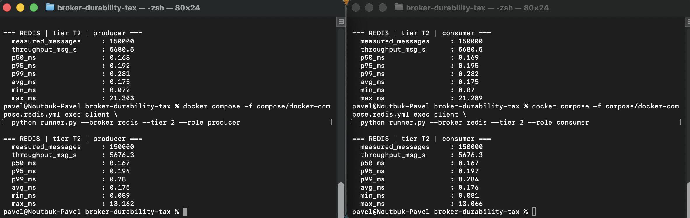

```text
=== REDIS | tier T2 | producer ===
  throughput_msg_s      : 5676.3
  p50_ms                : 0.167
  p99_ms                : 0.28
  max_ms                : 13.162

=== REDIS | tier T2 | consumer ===
  throughput_msg_s      : 5676.3
  p50_ms                : 0.167
  p99_ms                : 0.284
  max_ms                : 13.066
```

#### Сводка T2

| прогон | throughput, msg/s | p50, мс | p99, мс |
|---:|---:|---:|---:|
| 1 | 5 564.8 | 0.169 | 0.326 |
| 2 | 5 680.5 | 0.168 | 0.281 |
| 3 | 5 676.3 | 0.167 | 0.280 |

**Медиана: 5 676.3 msg/s** · разброс **5 565 – 5 681** (<2%, очень кучно).

### 7.8. Почему T2 у Redis быстрее T1 - и почему это не баг

Это прямое следствие самой матрицы tier, а не ошибка измерения. Смотрим из чего складывается
цена в каждом tier:

- **T1** = `appendfsync always` - синхронный fsync на диск по каждому сообщению. Даже через
  виртуализацию macOS это дорого: p50 вырос до 0.615 мс. Это самая дорогая дисковая политика
  Redis.
- **T2** = `appendfsync everysec` + `WAIT 2` - fsync релаксирован до раза в секунду (почти
  бесплатно), а вместо него добавлен сетевой round-trip к двум репликам. Реплики живут в той же
  Docker-VM, путь к ним суб-миллисекундный, и репликация Redis асинхронная best-effort: `WAIT`
  лишь дожидается, что реплики догнали оффсет, а не настоящий кворумный консенсус. Поэтому
  `WAIT 2` стоит ~0.1 мс - на порядок дешевле, чем `fsync always`.

Отсюда **немонотонный налог** - и это, на мой взгляд, главный содержательный вывод по Redis:

```
Налог T0->T1 = (13 595 - 1 398) / 13 595 = 89.7 %
Налог T0->T2 = (13 595 - 5 676) / 13 595 = 58.2 %
```

У Redis самая дорогая durability - это **синхронный диск (T1)**, а не репликация (T2). Это
качественно отличает его от log-based брокеров, и хорошо ложится на тот факт, что WAIT -
best-effort, а не Raft/ISR. На реальном распределённом кластере с сетевой задержкой между нодами
стоимость `WAIT 2` выросла бы - здесь она занижена так же честно, как и fsync.

### 7.9. Итоги по Redis

```
                   T0                 T1                 T2
throughput, msg/s  13 595             1 398              5 676
                   (13484–13884)      (1233–1578)        (5565–5681)
p50, мс            0.068              0.615              0.168
p99, мс            0.150              2.923              0.281
```

Дополнительно - честные оговорки в отчёт (это не "прячем", это часть результата):

- `WAIT` - best-effort, не настоящий кворум (Raft/ISR). Качественное отличие Redis от
  Kafka/RabbitMQ/NATS.
- `appendfsync always` на Docker-macOS занижен (виртуализация буферизует fsync) - абсолютная
  стоимость T1 на bare-metal была бы выше.
- T0 у Redis - не чистый fire-and-forget уровня Kafka `acks=0`: `XADD` синхронен, ~1 RTT. Это
  честный "пол" in-memory подхода, и от него корректно отсчитывается налог.

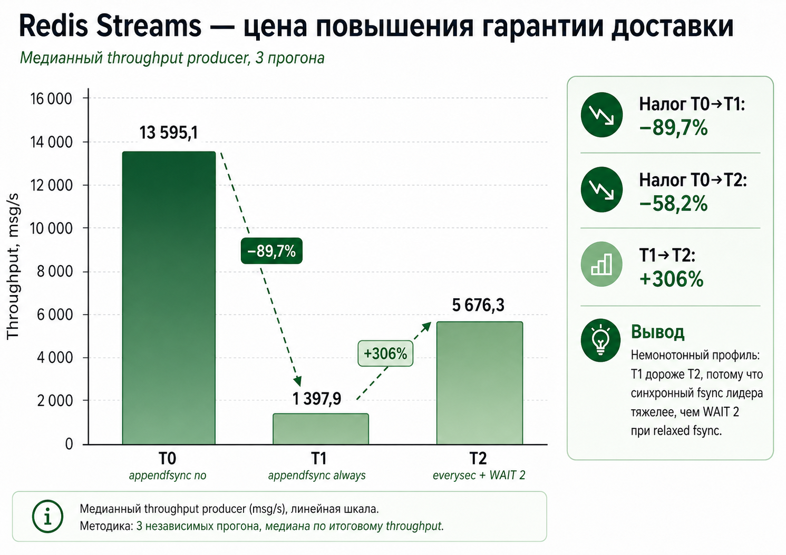

---
## 8. NATS JetStream

**Архитектура:** core NATS - сверхбыстрый pub/sub без хранения; **JetStream** - слой
персистентности поверх (stream на диске, Raft-репликация, PubAck per-publish). У JetStream
параметр `num_replicas` (R) на stream'е - сколько узлов кластера хранят копию. Это и есть наша
ручка: T0 = core NATS, T1 = JS R=1, T2 = JS R=3.

### 8.1. Особенность реализации адаптера

`nats-py` - асинхронная библиотека (asyncio), а harness синхронный. В адаптере поэтому поднят
фоновый event loop в отдельном потоке, и каждый `publish`/`consume_one` блокирующе ждёт
корутину через `run_coroutine_threadsafe(...).result()`. Контракт остаётся синхронным,
per-message семантика сохранена. Накладной расход моста мал на фоне сетевого RTT.

И важная штука про tier'ы у NATS: **`num_replicas` стрима нельзя сменить "на лету"**. Между T1
и T2 нужен холодный рестарт (`down -v && up`), иначе старый стрим R=1 останется, и T2 ляжет
поверх T1. Это самый частый способ испортить замер по NATS.

### 8.2. Эпизод с `max_payload` - фикс compose

Когда я первый раз поднимал NATS, в compose-файле у меня был прописан `--max_payload 33554432`
как CLI-флаг (хотел заранее поднять лимит размера payload на случай экспериментов с крупными
сообщениями). Это оказалось ошибкой: `max_payload` у `nats-server` - это **опция конфиг-файла**,
а не CLI-флаг. Сервер на этом флаге падал, печатал usage и выходил с кодом 0, что особенно
сбивало с толку - `docker compose` "как будто бы" успешно стартовал, но healthcheck потом валил.

Поковырялся в логах, посоветовался с ИИ как с ассистентом, тот помог разобрать вывод
`docker logs nats1`:

```text
$ docker logs nats1 2>&1 | head -2
flag provided but not defined: -max_payload
Usage: nats-server [options]
...
```

После проверки документации NATS выяснилось, что `max_payload` действительно только конфигом
задаётся. Удалил битый флаг из всех трёх нод одной командой (BSD-`sed` для macOS):

```bash
sed -i '' '/--max_payload 33554432/d' compose/docker-compose.nats.yml
grep -n max_payload compose/docker-compose.nats.yml   # должно быть пусто
```

Дефолтный `max_payload` в NATS - 1 MB, чего для нашего payload в 1 KB хватает с большим запасом.
После фикса все три ноды стартуют как `(healthy)`, кластер собирается за ~5-10 секунд.

### 8.3. Конфигурация стенда

<details>
<summary>compose/docker-compose.nats.yml (после фикса max_payload)</summary>

```yaml
# docker-compose.nats.yml - кластер 3 ноды NATS с JetStream, nats:2.10-alpine.
# Stream создаётся адаптером с num_replicas=1 (T1) или 3 (T2). Клиенты - сервис `client`
# внутри сети bench (НЕ localhost).
#
# Запуск:    docker compose -f compose/docker-compose.nats.yml up -d --build
# Готовность: docker compose -f compose/docker-compose.nats.yml ps   (все healthy)
# Сброс:     docker compose -f compose/docker-compose.nats.yml down -v
#
# ВАЖНО: число реплик stream'а нельзя менять на лету. Между T1 и T2 - холодный старт (down -v && up).

x-nats-common: &nats-common
  image: nats:2.10-alpine
  networks: [bench]
  cpus: 2.0
  mem_limit: 2g
  healthcheck:
    test: ["CMD", "wget", "-q", "-O-", "http://localhost:8222/healthz"]
    interval: 10s
    timeout: 5s
    retries: 12
    start_period: 5s

services:
  nats1:
    <<: *nats-common
    hostname: nats1
    container_name: nats1
    command: >
      -n nats1 -p 4222 -m 8222 -js -sd /data
      -cluster_name benchjs -cluster nats://0.0.0.0:6222
      -routes nats://nats1:6222,nats://nats2:6222,nats://nats3:6222

  nats2:
    <<: *nats-common
    hostname: nats2
    container_name: nats2
    command: >
      -n nats2 -p 4222 -m 8222 -js -sd /data
      -cluster_name benchjs -cluster nats://0.0.0.0:6222
      -routes nats://nats1:6222,nats://nats2:6222,nats://nats3:6222

  nats3:
    <<: *nats-common
    hostname: nats3
    container_name: nats3
    command: >
      -n nats3 -p 4222 -m 8222 -js -sd /data
      -cluster_name benchjs -cluster nats://0.0.0.0:6222
      -routes nats://nats1:6222,nats://nats2:6222,nats://nats3:6222

  client:
    build: ../client
    container_name: bench-client
    networks: [bench]
    working_dir: /app
    volumes:
      - ../harness:/app
    depends_on:
      nats1: {condition: service_healthy}
      nats2: {condition: service_healthy}
      nats3: {condition: service_healthy}

networks:
  bench:
    name: bench-nats
```

</details>
<details>
<summary>harness/adapters/nats.py</summary>

```python
"""
adapters/nats.py - тонкий адаптер по образцу kafka.py (контракт base.py).
Делает ТОЛЬКО подключение + publish/consume_one. Harness-логику не дублирует.

ГЛАВНАЯ ОСОБЕННОСТЬ: nats-py АСИНХРОННЫЙ, а harness СИНХРОННЫЙ. Поэтому здесь поднимается
ФОНОВЫЙ event loop в отдельной нити, а каждый publish/consume_one блокирующе ждёт результат
корутины через run_coroutine_threadsafe(...).result(). Так контракт остаётся синхронным и
per-message блокировка по tier сохраняется. Накладной расход моста мал на фоне сетевого RTT.

TIER:
  T0 = core NATS publish (без JetStream), fire-and-forget. Flush - один раз в teardown
       (per-message flush убил бы смысл T0). Это честный "пол", аналог Kafka acks=0.
  T1 = JetStream stream R=1, ждём PubAck (durability на одной ноде).
  T2 = JetStream stream R=3, ждём PubAck (Raft-репликация 3 нод) - настоящий кворум.

ВАЖНО: число реплик stream'а (R) нельзя менять на лету. Между T1 и T2 кластер пересоздаётся
(docker compose down -v && up) - это и так требование методики (холодный старт между прогонами).
"""
import asyncio
import threading
import nats
from nats.js.api import StreamConfig
from adapters.base import BrokerAdapter

SERVERS = ["nats://nats1:4222", "nats://nats2:4222", "nats://nats3:4222"]  # docker-сеть
STREAM = "BENCH"
SUBJECT = "bench.msg"
DURABLE = "bench-cons"


class _Loop:
    """Фоновый asyncio-loop в отдельной нити + блокирующий вызов корутин из синхронного кода."""
    def __init__(self):
        self.loop = asyncio.new_event_loop()
        self.thr = threading.Thread(target=self._run, daemon=True)
        self.thr.start()

    def _run(self):
        asyncio.set_event_loop(self.loop)
        self.loop.run_forever()

    def run(self, coro, timeout=None):
        fut = asyncio.run_coroutine_threadsafe(coro, self.loop)
        return fut.result(timeout)


class Adapter(BrokerAdapter):
    name = "nats"

    def __init__(self):
        self._lp = _Loop()

    def setup(self, tier):
        self._tier = tier

        async def _s():
            nc = await nats.connect(servers=SERVERS, connect_timeout=10, max_reconnect_attempts=30)
            if tier > 0:
                js = nc.jetstream()
                replicas = 1 if tier == 1 else 3
                try:
                    await js.add_stream(StreamConfig(
                        name=STREAM, subjects=[SUBJECT], num_replicas=replicas))
                except Exception:
                    pass  # stream уже есть (R сменить нельзя - для смены нужен холодный старт)
            await nc.close()

        self._lp.run(_s(), timeout=90)

    def connect_producer(self, tier):
        self._tier = tier

        async def _c():
            self._nc = await nats.connect(servers=SERVERS, connect_timeout=10,
                                          max_reconnect_attempts=30)
            self._js = self._nc.jetstream() if tier > 0 else None

        self._lp.run(_c(), timeout=30)

    def publish(self, payload: bytes):
        if self._tier == 0:
            async def _p():
                await self._nc.publish(SUBJECT, payload)   # fire-and-forget
            self._lp.run(_p(), timeout=30)
        else:
            async def _p():
                await self._js.publish(SUBJECT, payload)   # ждём PubAck (per-message)
            self._lp.run(_p(), timeout=30)

    def connect_consumer(self, tier):
        self._tier = tier

        async def _c():
            self._nc = await nats.connect(servers=SERVERS, connect_timeout=10,
                                          max_reconnect_attempts=30)
            if tier == 0:
                self._sub = await self._nc.subscribe(SUBJECT)   # core NATS
            else:
                self._js = self._nc.jetstream()
                self._psub = await self._js.pull_subscribe(SUBJECT, durable=DURABLE)

        self._lp.run(_c(), timeout=30)

    def consume_one(self, timeout: float):
        if self._tier == 0:
            async def _g():
                try:
                    m = await self._sub.next_msg(timeout=timeout)
                    return m.data
                except Exception:
                    return None
            return self._lp.run(_g(), timeout=timeout + 5)
        else:
            async def _g():
                try:
                    msgs = await self._psub.fetch(1, timeout=timeout)
                except Exception:
                    return None
                if not msgs:
                    return None
                m = msgs[0]
                await m.ack()              # per-message ack
                return m.data
            return self._lp.run(_g(), timeout=timeout + 5)

    def teardown(self):
        async def _t():
            try:
                await self._nc.drain()     # дослать "хвост" T0 + аккуратно закрыть
            except Exception:
                pass
        try:
            self._lp.run(_t(), timeout=30)
        except Exception:
            pass
```

</details>

### 8.4. Подъём стенда

**sc_33.png**

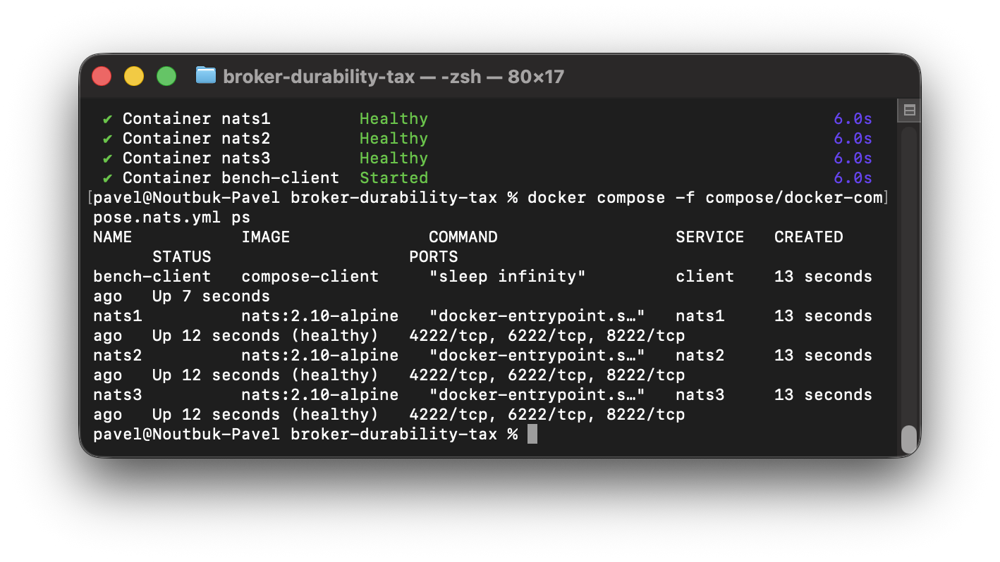

**sc_34.png**

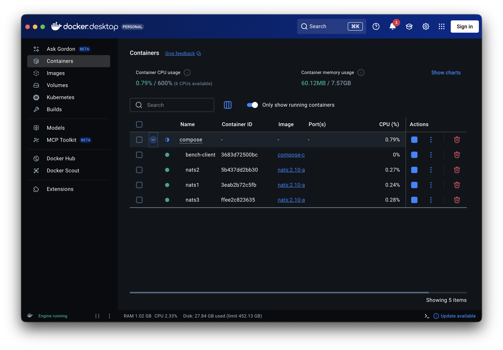

### 8.5. Команды запуска

```bash
docker compose -f compose/docker-compose.nats.yml up -d --build
docker compose -f compose/docker-compose.nats.yml ps                  # 3 ноды healthy

# consumer первым
docker compose -f compose/docker-compose.nats.yml exec client \
  python runner.py --broker nats --tier 0 --role consumer

docker compose -f compose/docker-compose.nats.yml exec client \
  python runner.py --broker nats --tier 0 --role producer

# КРИТИЧНО между T1 и T2: холодный рестарт, иначе R стрима не сменится
docker compose -f compose/docker-compose.nats.yml down -v
docker compose -f compose/docker-compose.nats.yml up -d --build
```

### 8.6. T0 - core NATS (без JetStream, fire-and-forget)

#### Прогон 1

**sc_35.png**

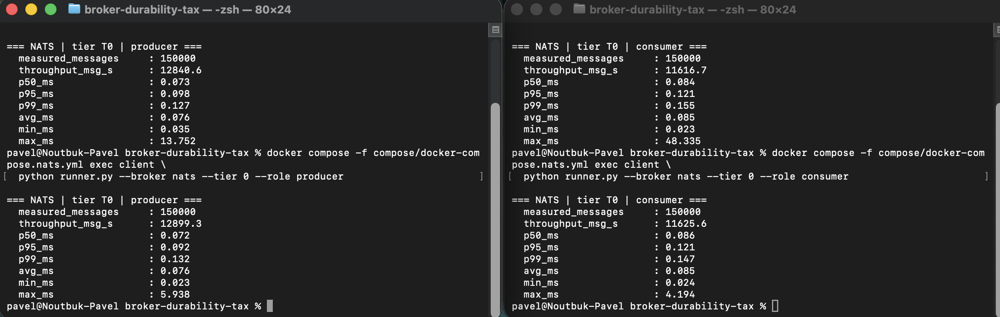

```text
=== NATS | tier T0 | producer ===
  throughput_msg_s      : 12899.3
  p50_ms                : 0.072
  p95_ms                : 0.092
  p99_ms                : 0.132
  max_ms                : 5.938

=== NATS | tier T0 | consumer ===
  throughput_msg_s      : 11625.6
  p50_ms                : 0.086
  p99_ms                : 0.147
  max_ms                : 4.194
```

#### Прогон 2

**sc_36.png**

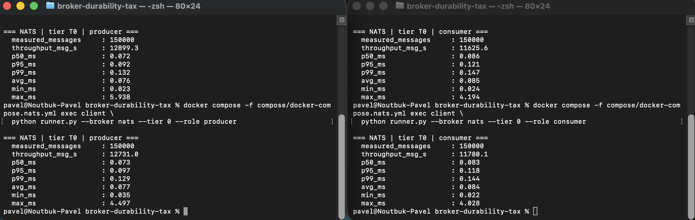

```text
=== NATS | tier T0 | producer ===
  throughput_msg_s      : 12731.0
  p50_ms                : 0.073
  p99_ms                : 0.129
  max_ms                : 4.497

=== NATS | tier T0 | consumer ===
  throughput_msg_s      : 11780.1
  p50_ms                : 0.083
  p99_ms                : 0.144
  max_ms                : 4.028
```

#### Прогон 3

**sc_37.png**

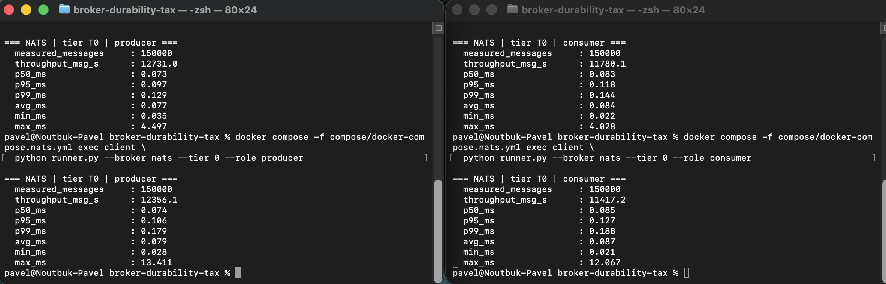

```text
=== NATS | tier T0 | producer ===
  throughput_msg_s      : 12356.1
  p50_ms                : 0.074
  p99_ms                : 0.179
  max_ms                : 13.411

=== NATS | tier T0 | consumer ===
  throughput_msg_s      : 11417.2
  p50_ms                : 0.085
  p99_ms                : 0.188
  max_ms                : 12.067
```

#### Сводка T0

| прогон | throughput, msg/s | p50, мс | p99, мс |
|---:|---:|---:|---:|
| 1 | 12 899.3 | 0.072 | 0.132 |
| 2 | 12 731.0 | 0.073 | 0.129 |
| 3 | 12 356.1 | 0.074 | 0.179 |

**Медиана: 12 731.0 msg/s** · разброс **12 356 – 12 899** (всего ~4%, очень кучно).

### 8.7. T1 - JetStream R=1 (durability на одной ноде)

Producer ждёт `PubAck` от JetStream по каждому сообщению.

#### Прогон 1

**sc_38.png**

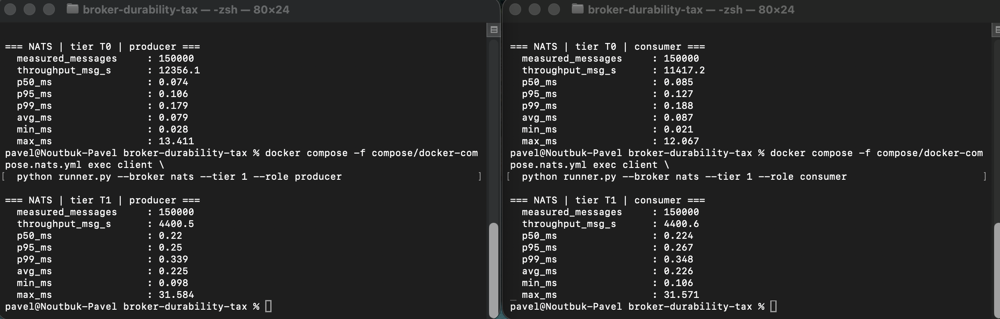

```text
=== NATS | tier T1 | producer ===
  throughput_msg_s      : 4400.5
  p50_ms                : 0.22
  p95_ms                : 0.25
  p99_ms                : 0.339
  max_ms                : 31.584

=== NATS | tier T1 | consumer ===
  throughput_msg_s      : 4400.6
  p50_ms                : 0.224
  p99_ms                : 0.348
  max_ms                : 31.571
```

#### Прогон 2

**sc_39.png**

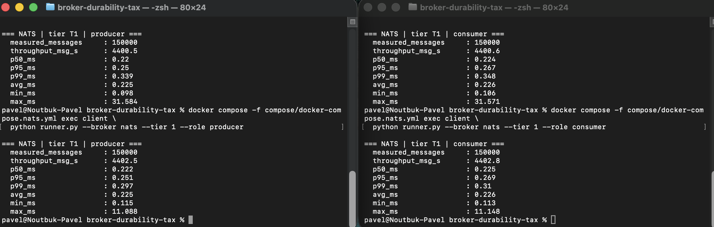

```text
=== NATS | tier T1 | producer ===
  throughput_msg_s      : 4402.5
  p50_ms                : 0.222
  p99_ms                : 0.297
  max_ms                : 11.088

=== NATS | tier T1 | consumer ===
  throughput_msg_s      : 4402.8
  p50_ms                : 0.225
  p99_ms                : 0.31
  max_ms                : 11.148
```

#### Прогон 3

**sc_40.png**

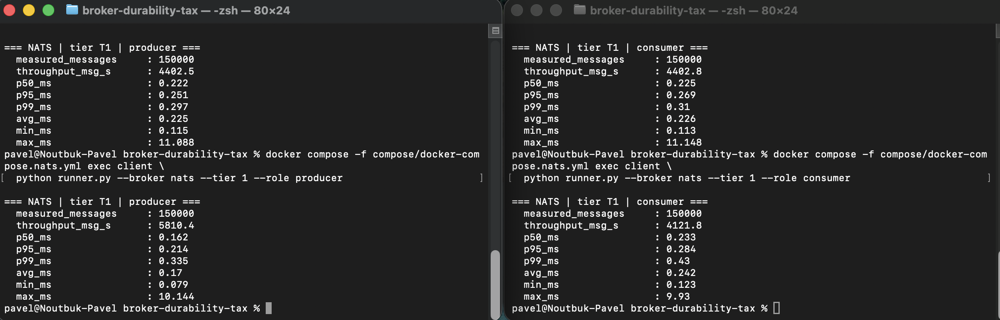

```text
=== NATS | tier T1 | producer ===
  throughput_msg_s      : 5810.4
  p50_ms                : 0.162
  p99_ms                : 0.335
  max_ms                : 10.144

=== NATS | tier T1 | consumer ===
  throughput_msg_s      : 4121.8
  p50_ms                : 0.233
  p99_ms                : 0.43
  max_ms                : 9.93
```

#### Сводка T1

| прогон | throughput, msg/s | p50, мс | p99, мс |
|---:|---:|---:|---:|
| 1 | 4 400.5 | 0.220 | 0.339 |
| 2 | 4 402.5 | 0.222 | 0.297 |
| 3 | 5 810.4 | 0.162 | 0.335 |

**Медиана: 4 402.5 msg/s** · разброс **4 401 – 5 810**.

Кстати, прогоны 1 и 2 совпали до второго знака (4400.5 vs 4402.5) - это типичный lockstep
producer<->ack: оба упёрлись в одно узкое место (ожидание PubAck), идут в ритме. Прогон 3 выбился
вверх (+32%) - разовый выброс, и медиана его корректно отбросила.

Промежуточный налог `T0->T1 ≈ 65%` - но **с оговоркой**: T1 у NATS опирается на fsync лидера,
который через виртуализацию macOS занижен. На bare-metal эти 65% были бы выше. Это нижняя
оценка, не перенос на железо.

### 8.8. T2 - JetStream R=3 (Raft-кворум 3 нод)

Перед T2 обязательно `down -v`, иначе stream останется с R=1.

#### Прогон 1

**sc_41.png**


```text
=== NATS | tier T2 | producer ===
  throughput_msg_s      : 3091.8
  p50_ms                : 0.302
  p95_ms                : 0.403
  p99_ms                : 0.81
  max_ms                : 17.456

=== NATS | tier T2 | consumer ===
  throughput_msg_s      : 3091.8
  p50_ms                : 0.301
  p99_ms                : 0.892
  max_ms                : 18.958
```

#### Прогон 2

**sc_42.png**

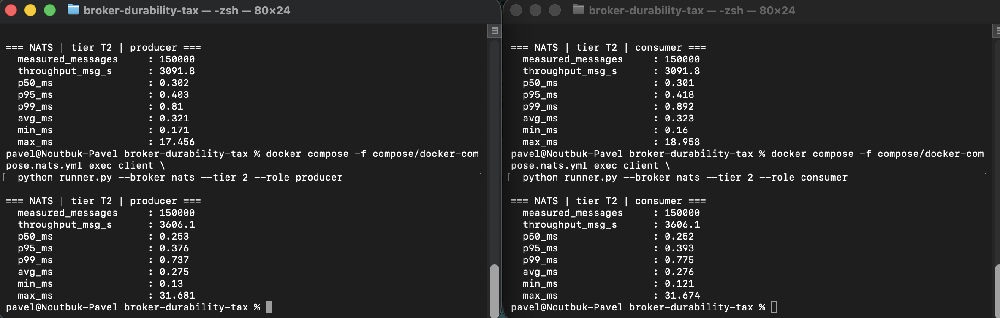

```text
=== NATS | tier T2 | producer ===
  throughput_msg_s      : 3606.1
  p50_ms                : 0.253
  p99_ms                : 0.737
  max_ms                : 31.681

=== NATS | tier T2 | consumer ===
  throughput_msg_s      : 3606.1
  p50_ms                : 0.252
  p99_ms                : 0.775
  max_ms                : 31.674
```

#### Прогон 3

**sc_43.png**

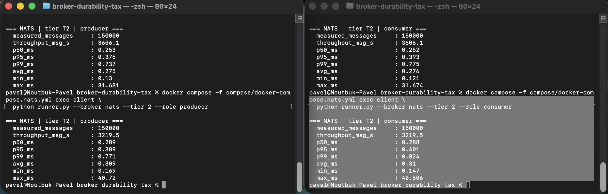

```text
=== NATS | tier T2 | producer ===
  throughput_msg_s      : 3219.5
  p50_ms                : 0.289
  p99_ms                : 0.771
  max_ms                : 40.72

=== NATS | tier T2 | consumer ===
  throughput_msg_s      : 3219.5
  p50_ms                : 0.288
  p99_ms                : 0.824
  max_ms                : 40.606
```

#### Сводка T2

| прогон | throughput, msg/s | p50, мс | p99, мс |
|---:|---:|---:|---:|
| 1 | 3 091.8 | 0.302 | 0.81 |
| 2 | 3 606.1 | 0.253 | 0.737 |
| 3 | 3 219.5 | 0.289 | 0.771 |

**Медиана: 3 219.5 msg/s** · разброс **3 092 – 3 606**.

Главное здесь - T2 (3219) ниже T1 (4402), значит холодный рестарт сработал, стрим реально
поднялся с R=3, и Raft-кворум включился. Если бы я забыл `down -v`, цифры легли бы поверх T1.

Producer и consumer на T1/T2 совпадают до знака - это снова lockstep: pull-consumer с
per-message ack идёт в ритме producer'а, узкое место одно (подтверждение), обе стороны
упираются в него одинаково.

### 8.9. Итоги по NATS

```
                    T0                T1                T2
                 (core NATS)      (JS R=1, лидер)   (JS R=3, кворум)
throughput, msg/s  12 731           4 402.5           3 219.5
                   (12356–12899)    (4400.5–5810.4)   (3091.8–3606.1)
p50, мс            0.073            0.222             0.289
p99, мс            0.132            0.335             0.771
```

```
Налог T0->T1 = (12 731 − 4 402.5) / 12 731 × 100% ≈ 65 %
Налог T0->T2 = (12 731 − 3 219.5) / 12 731 × 100% ≈ 75 %
```

Содержательно по NATS - это второй log-based брокер в работе, и профиль очень узнаваемый.
Основной скачок цены приходится на переход T0->T1 (−65%): как только включается JetStream и
producer начинает ждать PubAck по каждому сообщению, throughput падает почти втрое, p50 растёт
с 0.073 до 0.22 мс. Добавление кворумной репликации T1->T2 стоит ещё ~27% от T1 (с 4402 до 3220
msg/s) - то есть собственно репликация на трёх нодах обходится **заметно дешевле**, чем сам
факт перехода к durable-записи с подтверждением. Это и есть содержательный результат для
log-based профиля: дорого "начать гарантировать", относительно дёшево "гарантировать сильнее".

p99 на T2 (0.77 мс) и редкие max-всплески до 30–40 мс отражают подтверждение Raft-кворумом и
периодические остановки на консенсус. Никаких сюрпризов.

Две честные оговорки.

T1 у NATS недооценён по той же причине, что и у остальных: стоимость T1 держится на fsync
лидера, а Docker-macOS буферизует fsync через виртуализацию. На железе T1 был бы дороже,
значит налог T0->T1 (65%) - нижняя оценка. Сетевой вклад репликации T2 меряется корректно
(обмен между контейнерами одной VM).

Выброс в T1, прогон 3 (5810 vs 4400) - разовый, на медиану не повлиял; если хотелось бы
идеальной чистоты, можно добить 4-й прогон T1. Не стал - медиана устойчива.

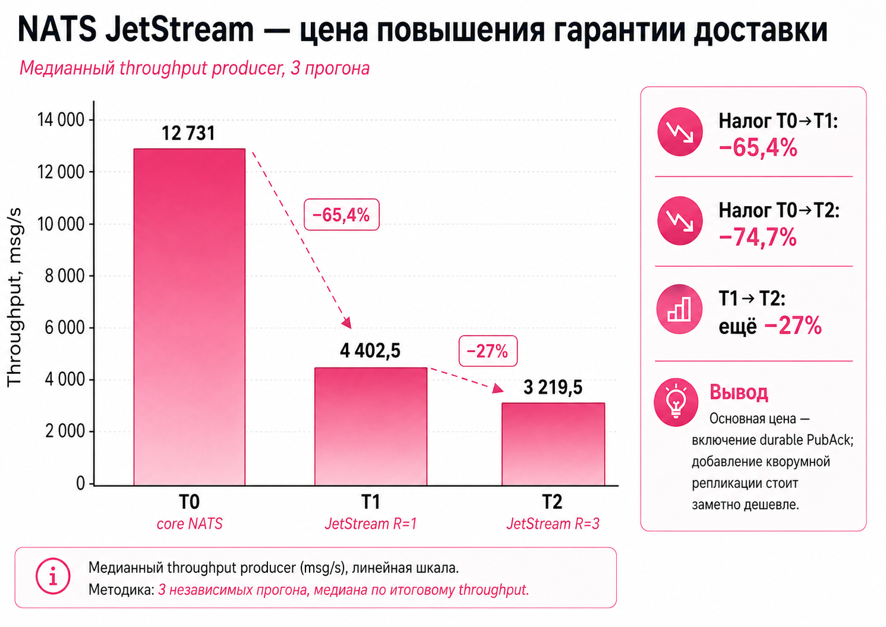

---

## 9. Сводная таблица - главный артефакт работы

```
                  Kafka        RabbitMQ      Redis Streams   NATS JetStream
                  (log-based)  (queue-Raft)  (in-memory)     (log-based)
──────────────────────────────────────────────────────────────────────────
T0 throughput     149 033      43 600        13 595          12 731
T1 throughput      1 825        1 469         1 398           4 402
T2 throughput        968          439         5 676           3 220
──────────────────────────────────────────────────────────────────────────
Налог T0->T1, %     98.8         96.6          89.7            65.4
Налог T0->T2, %     99.4         99.0          58.2            74.7
──────────────────────────────────────────────────────────────────────────
Дельта T1->T2       медленнее    медленнее     БЫСТРЕЕ         медленнее
                   в 1.9 раза   в 3.3 раза    в 4.1 раза      в 1.4 раза
```

Latency p99 на T2: Kafka 4.4 мс, RabbitMQ 7.2 мс, Redis 0.28 мс, NATS 0.77 мс. Latency p50 на
T2: Kafka 0.82 мс, RabbitMQ 1.89 мс, Redis 0.17 мс, NATS 0.29 мс.

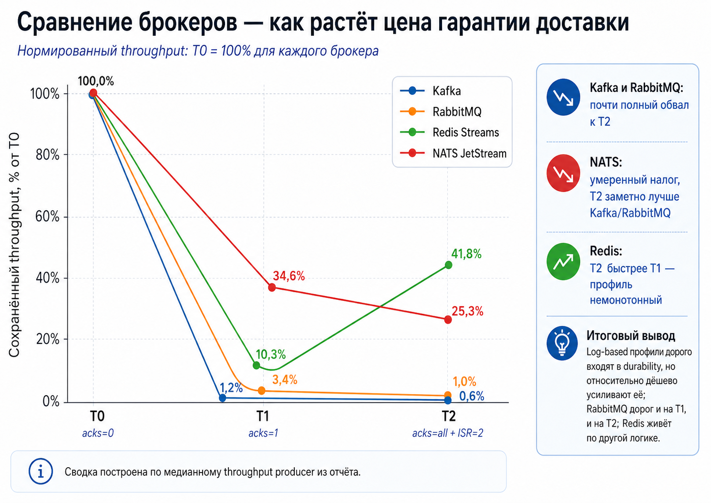

---

## 10. Главный вывод - отличаются ли архитектуры?

Да, очень. И не "кто быстрее в абсолюте", а **где конкретно** у каждой архитектуры самая дорогая
часть durability.

**Log-based брокеры (Kafka, NATS JetStream): амортизируют репликацию через лог.** У обоих
основной налог берётся на самом переходе T0->T1 - на per-message подтверждении записи. После
этого добавление кворума (T1->T2) стоит **сравнительно немного**: у Kafka ещё ×1.9, у NATS всего
×1.4. Причина общая - ISR-реплики Kafka и Raft-реплики JetStream тянут общий sequential-лог, и
сама репликация амортизируется через ту же последовательную запись. Поэтому log-based "дёшево"
гарантируют сильнее, но "дорого" - начать гарантировать вообще.

**Queue-based (RabbitMQ): платит за каждое сообщение отдельно и на T1, и на T2.** Те же ~97%
налога на T0->T1 (per-message confirm + flush на диск), плюс ещё ×3.3 на T1->T2 (Raft-консенсус
quorum-очереди). Нет амортизации через лог - каждое сообщение проходит полный round-trip и на
durable-фазе, и на репликации.

**In-memory (Redis): немонотонный налог - T1 дороже T2.** Это качественно другой профиль, и он
прямо вытекает из того, что у Redis durability и репликация - это **разные механизмы**, а не
последовательные стадии одного. T1 = `appendfsync always` - самая дорогая дисковая политика, p50
0.61 мс. T2 = `appendfsync everysec` + `WAIT 2` на 2 ко-локализованные реплики - fsync расслаблен,
сеть микроскопическая, и `WAIT` всё равно best-effort, а не настоящий кворум. Redis быстрее на
T2 чем на T1 - это не баг, это профиль.

Если коротко свести три профиля одной фразой:

- **Kafka/NATS:** *"заплати один раз, гарантируй сколько хочешь"* - основная цена на T0->T1, репликация поверх дёшева.
- **RabbitMQ:** *"плати за каждое сообщение, и ещё раз за каждое подтверждение"* - full round-trip и на T1, и на T2.
- **Redis:** *"если важна durability - выбирай, что важнее: диск или копии, потому что оба сразу не сделать"* - T2 фактически дешевле T1 за счёт того, что WAIT не настоящий кворум.

---

## 11. Ограничения стенда (на чём отчёт честно срезается)

Три систематических искажения, которые нужно держать в голове, читая абсолютные числа.

**fsync через виртуализацию macOS занижен.** Это бьёт по T1 у Kafka, RabbitMQ, Redis и NATS -
везде, где durability лидера достигается синхронной записью на диск. На bare-metal стоимость
T1 была бы выше, значит и налог T0->T1 был бы больше. Числа T1 - оптимистичная оценка.

**Стоимость репликации (T2) - нет.** Это сетевой обмен и консенсус между контейнерами внутри
одной Docker-VM. Виртуализация его не искажает. Поэтому числа T2 - главный защищаемый результат
работы. Дельта T1->T2 - это **чистая** стоимость репликации, и сравнение между брокерами по ней
корректно.

**Конкуренция за ядра.** Все брокеры делят ядра одной VM, прогоны строго последовательные. На
production-железе каждый брокер был бы на своём кластере - этот конфаундер на нашем стенде
неустраним, но он одинаков для всех 4 брокеров (равные CPU/RAM лимиты), и для **относительного**
сравнения значения не имеет.

Абсолютные msg/s стенда нерепрезентативны для production и так и подаются. Валидны и переносимы
только относительные величины - налог в % и кратность дельт между tier'ами.
