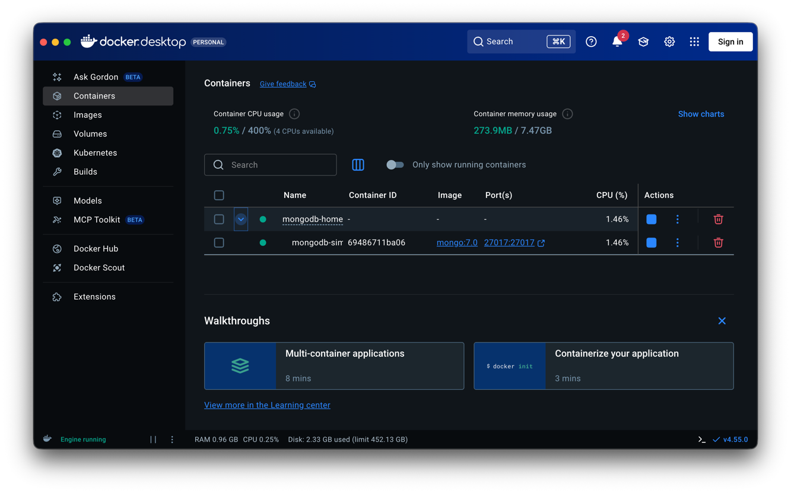
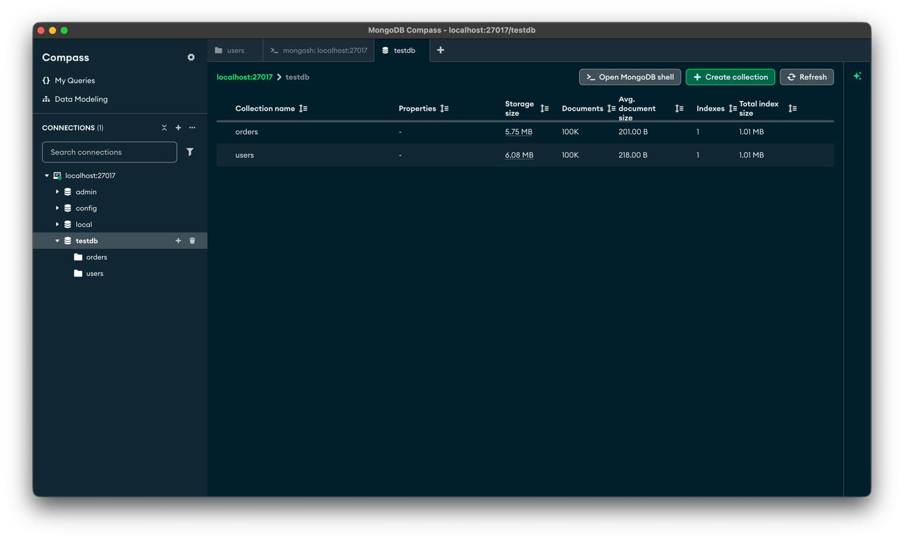
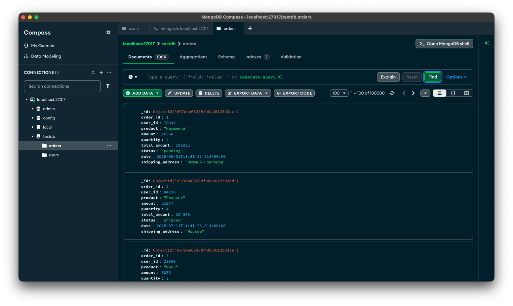
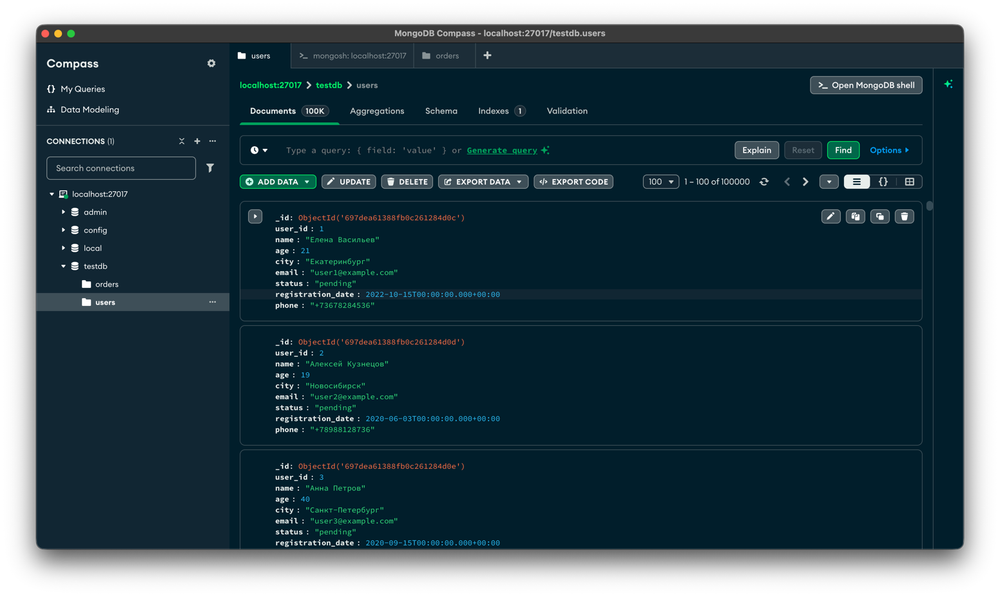
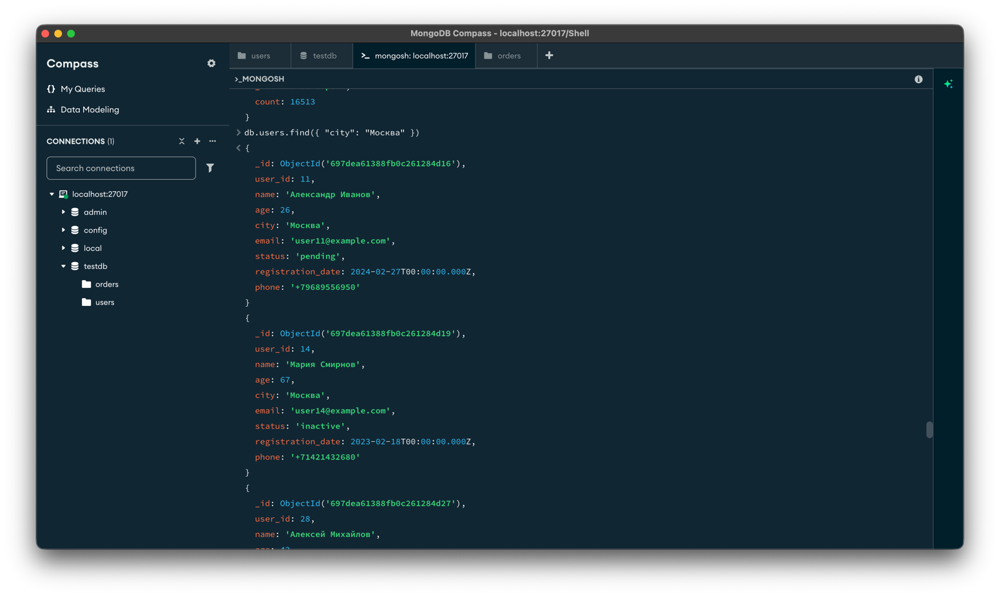
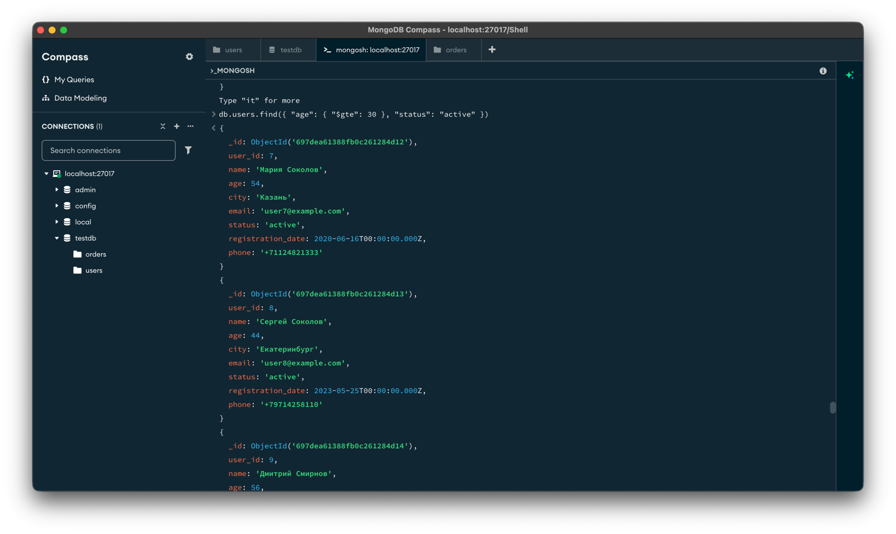

# Отчет по домашней работе: MongoDB

## 1. Установка и настройка окружения

### 1.1. Установка Docker и развертывание MongoDB

Установлен Docker и развернут контейнер с MongoDB.

**Dockerfile:**

```dockerfile
version: '3.8'

services:
  mongodb:
    image: mongo:7.0
    container_name: mongodb-simple
    ports:
      - "27017:27017"
    environment:
      MONGO_INITDB_ROOT_USERNAME: admin
      MONGO_INITDB_ROOT_PASSWORD: password123
    volumes:
      - mongodb_data:/data/db
    networks:
      - mongo-network

volumes:
  mongodb_data:

networks:
  mongo-network:
    driver: bridge
```

**Запуск контейнера MongoDB**
```
docker compose up -d
```

**Скриншот запущенного Docker-контейнера:**



---

## 2. Настройка MongoDB Compass

Установлен MongoDB Compass для визуальной работы с базой данных.

### 2.1. Создание структуры базы данных

Создана база данных `testdb` со следующими коллекциями:
- `users` - информация о пользователях
- `orders` - информация о заказах

**Скриншот**


---

## 3. Генерация тестовых данных

Для наполнения коллекций тестовыми данными использован скрипт, сгенерированный с помощью инструментов искусственного интеллекта. Каждая коллекция содержит 100,000 записей.

### 3.1. Скрипт генерации данных

```javascript
db = db.getSiblingDB('testdb');

db.users.deleteMany({});
db.orders.deleteMany({});

print("Генерация пользователей...");

var cities = ["Москва", "Санкт-Петербург", "Новосибирск", "Екатеринбург", "Казань", "Нижний Новгород"];
var firstNames = ["Александр", "Дмитрий", "Максим", "Сергей", "Андрей", "Алексей", "Анна", "Мария", "Елена", "Ольга"];
var lastNames = ["Иванов", "Смирнов", "Кузнецов", "Попов", "Васильев", "Петров", "Соколов", "Михайлов"];
var statuses = ["active", "inactive", "pending", "blocked"];

var usersBatch = [];
var batchSize = 1000;

for (var i = 1; i <= 100000; i++) {
  var firstName = firstNames[Math.floor(Math.random() * firstNames.length)];
  var lastName = lastNames[Math.floor(Math.random() * lastNames.length)];
  
  usersBatch.push({
    user_id: i,
    name: firstName + " " + lastName,
    age: Math.floor(Math.random() * 50) + 18,
    city: cities[Math.floor(Math.random() * cities.length)],
    email: "user" + i + "@example.com",
    status: statuses[Math.floor(Math.random() * statuses.length)],
    registration_date: new Date(2020 + Math.floor(Math.random() * 5), Math.floor(Math.random() * 12), Math.floor(Math.random() * 28) + 1),
    phone: "+7" + (Math.floor(Math.random() * 9000000000) + 1000000000)
  });
  
  if (usersBatch.length === batchSize) {
    db.users.insertMany(usersBatch);
    usersBatch = [];
    if (i % 10000 === 0) {
      print("Создано пользователей: " + i);
    }
  }
}

if (usersBatch.length > 0) {
  db.users.insertMany(usersBatch);
}

print("Создано 100000 пользователей");
print("Генерация заказов...");

var products = [
  { name: "Ноутбук", minPrice: 40000, maxPrice: 150000 },
  { name: "Смартфон", minPrice: 15000, maxPrice: 100000 },
  { name: "Планшет", minPrice: 20000, maxPrice: 80000 },
  { name: "Наушники", minPrice: 2000, maxPrice: 30000 },
  { name: "Монитор", minPrice: 10000, maxPrice: 60000 },
  { name: "Клавиатура", minPrice: 1000, maxPrice: 15000 },
  { name: "Мышь", minPrice: 500, maxPrice: 8000 }
];

var orderStatuses = ["pending", "processing", "shipped", "delivered", "cancelled"];
var ordersBatch = [];

for (var j = 1; j <= 100000; j++) {
  var userId = Math.floor(Math.random() * 100000) + 1;
  var product = products[Math.floor(Math.random() * products.length)];
  var amount = Math.floor(Math.random() * (product.maxPrice - product.minPrice) + product.minPrice);
  var quantity = Math.floor(Math.random() * 5) + 1;
  var randomDate = new Date();
  randomDate.setDate(randomDate.getDate() - Math.floor(Math.random() * 730));
  
  ordersBatch.push({
    order_id: j,
    user_id: userId,
    product: product.name,
    amount: amount,
    quantity: quantity,
    total_amount: amount * quantity,
    status: orderStatuses[Math.floor(Math.random() * orderStatuses.length)],
    date: randomDate,
    shipping_address: cities[Math.floor(Math.random() * cities.length)]
  });
  
  if (ordersBatch.length === batchSize) {
    db.orders.insertMany(ordersBatch);
    ordersBatch = [];
    if (j % 10000 === 0) {
      print("Создано заказов: " + j);
    }
  }
}

if (ordersBatch.length > 0) {
  db.orders.insertMany(ordersBatch);
}

print("Создано 100000 заказов");
print("Пользователей в базе: " + db.users.countDocuments());
print("Заказов в базе: " + db.orders.countDocuments());
print("Готово!");
```

### 3.2. Результат генерации данных

**Скриншот выполнения скрипта генерации:**





---

## 4. Выполнение запросов к базе данных

Для изучения возможностей MongoDB выполнен ряд запросов различных типов. 

### 4.1. Запросы на выборку (SELECT)

#### 4.1.1. Поиск пользователей из Москвы

**Запрос:**
```javascript
db.users.find({ "city": "Москва" })
```

**Описание:** Выборка всех пользователей, проживающих в Москве.

**Результат выполнения:**



---

#### 4.1.2. Поиск активных пользователей старше 30 лет

**Запрос:**
```javascript
db.users.find({ "age": { "$gte": 30 }, "status": "active" })
```

**Описание:** Выборка активных пользователей в возрасте 30 лет и старше.

**Результат выполнения:**



---

### 4.2. Запросы на агрегацию

#### 4.2.1. Подсчет пользователей по городам

**Запрос:**
```javascript
db.users.aggregate([
  { $group: { _id: "$city", count: { $sum: 1 } } },
  { $sort: { count: -1 } }
])
```

**Описание:** Группировка пользователей по городам с подсчетом количества и сортировкой по убыванию.

**Результат выполнения:**


---
## 5. Оценка производительности и работа с индексами

### 5.1. Введение

Для оценки влияния индексов на производительность запросов были проведены тесты производительности с использованием метода `explain("executionStats")`. Замеры выполнялись на коллекции orders, содержащей 100,000 документов.

### 5.2. Тест 1: Поиск по полю user_id

#### 5.2.1. Запрос без индекса

**Команда проверки индексов:**
```javascript
db.orders.getIndexes()
```

**Тестовый запрос:**
```javascript
db.orders.explain("executionStats").find({ user_id: 50000 })
```

**Результаты выполнения:**
```javascript
db.orders.getIndexes()
db.orders.explain("executionStats").find({ user_id: 50000 })
{
  explainVersion: '1',
  queryPlanner: {
    namespace: 'testdb.orders',
    indexFilterSet: false,
    parsedQuery: {
      user_id: {
        '$eq': 50000
      }
    },
    queryHash: '6FA4800E',
    planCacheKey: '6FA4800E',
    optimizationTimeMillis: 0,
    maxIndexedOrSolutionsReached: false,
    maxIndexedAndSolutionsReached: false,
    maxScansToExplodeReached: false,
    winningPlan: {
      stage: 'COLLSCAN',
      filter: {
        user_id: {
          '$eq': 50000
        }
      },
      direction: 'forward'
    },
    rejectedPlans: []
  },
  executionStats: {
    executionSuccess: true,
    nReturned: 0,
    executionTimeMillis: 42,
    totalKeysExamined: 0,
    totalDocsExamined: 100000,
    executionStages: {
      stage: 'COLLSCAN',
      filter: {
        user_id: {
          '$eq': 50000
        }
      },
      nReturned: 0,
      executionTimeMillisEstimate: 0,
      works: 100001,
      advanced: 0,
      needTime: 100000,
      needYield: 0,
      saveState: 100,
      restoreState: 100,
      isEOF: 1,
      direction: 'forward',
      docsExamined: 100000
    }
  },
  command: {
    find: 'orders',
    filter: {
      user_id: 50000
    },
    '$db': 'testdb'
  },
  serverInfo: {
    host: '69486711ba06',
    port: 27017,
    version: '7.0.29',
    gitVersion: '415cc13e900a82a2e00e4f4417dc7159a883e975'
  },
  serverParameters: {
    internalQueryFacetBufferSizeBytes: 104857600,
    internalQueryFacetMaxOutputDocSizeBytes: 104857600,
    internalLookupStageIntermediateDocumentMaxSizeBytes: 104857600,
    internalDocumentSourceGroupMaxMemoryBytes: 104857600,
    internalQueryMaxBlockingSortMemoryUsageBytes: 104857600,
    internalQueryProhibitBlockingMergeOnMongoS: 0,
    internalQueryMaxAddToSetBytes: 104857600,
    internalDocumentSourceSetWindowFieldsMaxMemoryBytes: 104857600,
    internalQueryFrameworkControl: 'forceClassicEngine'
  },
  ok: 1
}

```


#### 5.2.2. Создание индекса

**Команда создания индекса:**
```javascript
db.orders.createIndex({ user_id: 1 })
```

**Проверка созданного индекса:**
```javascript
db.orders.getIndexes()
```

#### 5.2.3. Запрос с индексом

**Тестовый запрос:**
```javascript
db.orders.explain("executionStats").find({ user_id: 50000 })
```

**Результаты выполнения:**
**Тестовый запрос:**
```javascript
{
  explainVersion: '1',
  queryPlanner: {
    namespace: 'testdb.orders',
    indexFilterSet: false,
    parsedQuery: {
      user_id: {
        '$eq': 50000
      }
    },
    queryHash: '6FA4800E',
    planCacheKey: '8CA2CB9B',
    optimizationTimeMillis: 0,
    maxIndexedOrSolutionsReached: false,
    maxIndexedAndSolutionsReached: false,
    maxScansToExplodeReached: false,
    winningPlan: {
      stage: 'FETCH',
      inputStage: {
        stage: 'IXSCAN',
        keyPattern: {
          user_id: 1
        },
        indexName: 'user_id_1',
        isMultiKey: false,
        multiKeyPaths: {
          user_id: []
        },
        isUnique: false,
        isSparse: false,
        isPartial: false,
        indexVersion: 2,
        direction: 'forward',
        indexBounds: {
          user_id: [
            '[50000, 50000]'
          ]
        }
      }
    },
    rejectedPlans: []
  },
  executionStats: {
    executionSuccess: true,
    nReturned: 0,
    executionTimeMillis: 2,
    totalKeysExamined: 0,
    totalDocsExamined: 0,
    executionStages: {
      stage: 'FETCH',
      nReturned: 0,
      executionTimeMillisEstimate: 0,
      works: 1,
      advanced: 0,
      needTime: 0,
      needYield: 0,
      saveState: 0,
      restoreState: 0,
      isEOF: 1,
      docsExamined: 0,
      alreadyHasObj: 0,
      inputStage: {
        stage: 'IXSCAN',
        nReturned: 0,
        executionTimeMillisEstimate: 0,
        works: 1,
        advanced: 0,
        needTime: 0,
        needYield: 0,
        saveState: 0,
        restoreState: 0,
        isEOF: 1,
        keyPattern: {
          user_id: 1
        },
        indexName: 'user_id_1',
        isMultiKey: false,
        multiKeyPaths: {
          user_id: []
        },
        isUnique: false,
        isSparse: false,
        isPartial: false,
        indexVersion: 2,
        direction: 'forward',
        indexBounds: {
          user_id: [
            '[50000, 50000]'
          ]
        },
        keysExamined: 0,
        seeks: 1,
        dupsTested: 0,
        dupsDropped: 0
      }
    }
  },
  command: {
    find: 'orders',
    filter: {
      user_id: 50000
    },
    '$db': 'testdb'
  },
  serverInfo: {
    host: '69486711ba06',
    port: 27017,
    version: '7.0.29',
    gitVersion: '415cc13e900a82a2e00e4f4417dc7159a883e975'
  },
  serverParameters: {
    internalQueryFacetBufferSizeBytes: 104857600,
    internalQueryFacetMaxOutputDocSizeBytes: 104857600,
    internalLookupStageIntermediateDocumentMaxSizeBytes: 104857600,
    internalDocumentSourceGroupMaxMemoryBytes: 104857600,
    internalQueryMaxBlockingSortMemoryUsageBytes: 104857600,
    internalQueryProhibitBlockingMergeOnMongoS: 0,
    internalQueryMaxAddToSetBytes: 104857600,
    internalDocumentSourceSetWindowFieldsMaxMemoryBytes: 104857600,
    internalQueryFrameworkControl: 'forceClassicEngine'
  },
  ok: 1
}

```


### 5.3. Тест 2: Поиск по составным условиям (status и total_amount)

#### 5.3.1. Запрос без индекса

**Тестовый запрос:**
```javascript
db.orders.explain("executionStats").find({ 
  status: "delivered", 
  total_amount: { $gt: 100000 } 
})
```

**Результаты выполнения:**

```javascript
db.orders.explain("executionStats").find({ status: "delivered", total_amount: { $gt: 100000 } })
{
explainVersion: '1',
queryPlanner: {
namespace: 'testdb.orders',
indexFilterSet: false,
parsedQuery: {
'$and': [
{
status: {
'$eq': 'delivered'
}
},
{
total_amount: {
'$gt': 100000
}
}
]
},
queryHash: 'E5E855DD',
planCacheKey: 'E5E855DD',
optimizationTimeMillis: 0,
maxIndexedOrSolutionsReached: false,
maxIndexedAndSolutionsReached: false,
maxScansToExplodeReached: false,
winningPlan: {
stage: 'COLLSCAN',
filter: {
'$and': [
{
status: {
'$eq': 'delivered'
}
},
{
total_amount: {
'$gt': 100000
}
}
]
},
direction: 'forward'
},
rejectedPlans: []
},
executionStats: {
executionSuccess: true,
nReturned: 7728,
executionTimeMillis: 48,
totalKeysExamined: 0,
totalDocsExamined: 100000,
executionStages: {
stage: 'COLLSCAN',
filter: {
'$and': [
{
status: {
'$eq': 'delivered'
}
},
{
total_amount: {
'$gt': 100000
}
}
]
},
nReturned: 7728,
executionTimeMillisEstimate: 1,
works: 100001,
advanced: 7728,
needTime: 92272,
needYield: 0,
saveState: 100,
restoreState: 100,
isEOF: 1,
direction: 'forward',
docsExamined: 100000
}
},
command: {
find: 'orders',
filter: {
status: 'delivered',
total_amount: {
'$gt': 100000
}
},
'$db': 'testdb'
},
serverInfo: {
host: '69486711ba06',
port: 27017,
version: '7.0.29',
gitVersion: '415cc13e900a82a2e00e4f4417dc7159a883e975'
},
serverParameters: {
internalQueryFacetBufferSizeBytes: 104857600,
internalQueryFacetMaxOutputDocSizeBytes: 104857600,
internalLookupStageIntermediateDocumentMaxSizeBytes: 104857600,
internalDocumentSourceGroupMaxMemoryBytes: 104857600,
internalQueryMaxBlockingSortMemoryUsageBytes: 104857600,
internalQueryProhibitBlockingMergeOnMongoS: 0,
internalQueryMaxAddToSetBytes: 104857600,
internalDocumentSourceSetWindowFieldsMaxMemoryBytes: 104857600,
internalQueryFrameworkControl: 'forceClassicEngine'
},
ok: 1
}
```

#### 5.3.2. Создание составного индекса

**Команда создания составного индекса:**
```javascript
db.orders.createIndex({ status: 1, total_amount: -1 })
```

**Проверка созданного индекса:**
```javascript
db.orders.getIndexes()
```

#### 5.3.3. Запрос с составным индексом

**Тестовый запрос:**
```javascript
db.orders.explain("executionStats").find({ 
  status: "delivered", 
  total_amount: { $gt: 100000 } 
})
```

**Результаты выполнения:**

```javascript

  explainVersion: '1',
  queryPlanner: {
    namespace: 'testdb.orders',
    indexFilterSet: false,
    parsedQuery: {
      '$and': [
        {
          status: {
            '$eq': 'delivered'
          }
        },
        {
          total_amount: {
            '$gt': 100000
          }
        }
      ]
    },
    queryHash: 'E5E855DD',
    planCacheKey: '4E73F3D3',
    optimizationTimeMillis: 2,
    maxIndexedOrSolutionsReached: false,
    maxIndexedAndSolutionsReached: false,
    maxScansToExplodeReached: false,
    winningPlan: {
      stage: 'FETCH',
      inputStage: {
        stage: 'IXSCAN',
        keyPattern: {
          status: 1,
          total_amount: -1
        },
        indexName: 'status_1_total_amount_-1',
        isMultiKey: false,
        multiKeyPaths: {
          status: [],
          total_amount: []
        },
        isUnique: false,
        isSparse: false,
        isPartial: false,
        indexVersion: 2,
        direction: 'forward',
        indexBounds: {
          status: [
            '["delivered", "delivered"]'
          ],
          total_amount: [
            '[inf.0, 100000)'
          ]
        }
      }
    },
    rejectedPlans: []
  },
  executionStats: {
    executionSuccess: true,
    nReturned: 7728,
    executionTimeMillis: 50,
    totalKeysExamined: 7728,
    totalDocsExamined: 7728,
    executionStages: {
      stage: 'FETCH',
      nReturned: 7728,
      executionTimeMillisEstimate: 33,
      works: 7729,
      advanced: 7728,
      needTime: 0,
      needYield: 0,
      saveState: 8,
      restoreState: 8,
      isEOF: 1,
      docsExamined: 7728,
      alreadyHasObj: 0,
      inputStage: {
        stage: 'IXSCAN',
        nReturned: 7728,
        executionTimeMillisEstimate: 0,
        works: 7729,
        advanced: 7728,
        needTime: 0,
        needYield: 0,
        saveState: 8,
        restoreState: 8,
        isEOF: 1,
        keyPattern: {
          status: 1,
          total_amount: -1
        },
        indexName: 'status_1_total_amount_-1',
        isMultiKey: false,
        multiKeyPaths: {
          status: [],
          total_amount: []
        },
        isUnique: false,
        isSparse: false,
        isPartial: false,
        indexVersion: 2,
        direction: 'forward',
        indexBounds: {
          status: [
            '["delivered", "delivered"]'
          ],
          total_amount: [
            '[inf.0, 100000)'
          ]
        },
        keysExamined: 7728,
        seeks: 1,
        dupsTested: 0,
        dupsDropped: 0
      }
    }
  },
  command: {
    find: 'orders',
    filter: {
      status: 'delivered',
      total_amount: {
        '$gt': 100000
      }
    },
    '$db': 'testdb'
  },
  serverInfo: {
    host: '69486711ba06',
    port: 27017,
    version: '7.0.29',
    gitVersion: '415cc13e900a82a2e00e4f4417dc7159a883e975'
  },
  serverParameters: {
    internalQueryFacetBufferSizeBytes: 104857600,
    internalQueryFacetMaxOutputDocSizeBytes: 104857600,
    internalLookupStageIntermediateDocumentMaxSizeBytes: 104857600,
    internalDocumentSourceGroupMaxMemoryBytes: 104857600,
    internalQueryMaxBlockingSortMemoryUsageBytes: 104857600,
    internalQueryProhibitBlockingMergeOnMongoS: 0,
    internalQueryMaxAddToSetBytes: 104857600,
    internalDocumentSourceSetWindowFieldsMaxMemoryBytes: 104857600,
    internalQueryFrameworkControl: 'forceClassicEngine'
  },
  ok: 1
}
```

---

### 5.4. Сравнительная таблица результатов

#### Таблица 1: Время выполнения запросов

| Запрос                                              | Без индекса (ms)  | С индексом (ms) | Ускорение      |
|-----------------------------------------------------|-------------------|-----------------|----------------|
| Поиск по user_id = 50000                            | 42                | 2 | **21x**        |
| Поиск по status="delivered" AND total_amount>100000 | 48                | 50 | **0.96x**      |

#### Таблица 2: Детальная статистика

| Метрика | Тест 1 (без индекса) | Тест 1 (с индексом) | Тест 2 (без индекса) | Тест 2 (с индексом) |
|---------|---------------------|--------------------|--------------------|-------------------|
| Тип сканирования | COLLSCAN | IXSCAN | COLLSCAN | IXSCAN |
| Проверено документов | 100,000 | 0 | 100,000 | 7,728 |
| Возвращено документов | 0 | 0 | 7,728 | 7,728 |
| Время выполнения (ms) | 42 | 2 | 48 | 50 |

---

### 5.5. Анализ результатов

#### 5.5.1. Тест 1: Высокая селективность запроса

При поиске по `user_id = 50000` наблюдается **драматическое улучшение производительности в 21 раз**:
- Без индекса MongoDB вынужден просканировать все 100,000 документов (COLLSCAN)
- С индексом выполняется точечный поиск (IXSCAN), который не требует проверки документов
- Время выполнения снизилось с 42 ms до 2 ms

**Вывод:** Индексы критически важны для запросов с высокой селективностью (когда возвращается небольшое количество или отсутствуют результаты).

#### 5.5.2. Тест 2: Низкая селективность запроса

При поиске заказов со статусом "delivered" и суммой более 100,000 наблюдается **отсутствие улучшения производительности**:
- Запрос возвращает 7,728 документов из 100,000 (около 7.7%)
- Время выполнения практически идентично: 48 ms vs 50 ms
- С индексом просматривается 7,728 документов вместо 100,000

**Причина:** Когда запрос возвращает значительный процент документов, индекс не дает преимущества, так как:
1. MongoDB должен выполнить IXSCAN по индексу
2. Затем выполнить FETCH для получения полных документов
3. Суммарная работа может быть сопоставима с простым COLLSCAN

**Вывод:** Индексы наиболее эффективны для высокоселективных запросов. При низкой селективности (>10-15% результатов) индексы могут не давать преимущества или даже замедлять выполнение.

---

## 6. Выводы

В ходе выполнения домашней работы были освоены следующие навыки:

### 6.1. Технические навыки
- **Установка и настройка MongoDB в Docker-контейнере** - успешно развернута база данных версии 7.0.29 в изолированном окружении
- **Работа с MongoDB Compass** - освоен графический инструмент для визуального управления базой данных
- **Генерация больших объемов тестовых данных** - создано 200,000 документов (по 100,000 в каждой коллекции) с использованием батч-вставки для оптимизации производительности
- **Выполнение различных типов запросов:**
    - Выборка данных (find) с различными условиями фильтрации
    - Агрегация данных с группировкой и сортировкой
    - Обновление и удаление данных
- **Использование инструментов искусственного интеллекта** для ускорения процесса обучения и генерации скриптов

### 6.2. Работа с индексами и оптимизация производительности
- **Создание индексов:** освоены техники создания как простых, так и составных индексов
- **Анализ производительности:** использован метод `explain("executionStats")` для детального анализа выполнения запросов
- **Понимание механизмов работы индексов:**
    - COLLSCAN (полное сканирование) vs IXSCAN (сканирование по индексу)
    - Влияние селективности запроса на эффективность индексов
    - Важность правильного выбора полей для индексирования

### 6.3. Ключевые выводы по производительности
1. **Индексы критически важны** для высокоселективных запросов - ускорение может достигать 20x и более
2. **Селективность имеет значение** - при запросах, возвращающих более 10-15% данных, индексы могут не давать преимущества
3. **Составные индексы** требуют тщательного проектирования с учетом паттернов запросов
4. **Мониторинг производительности** должен быть неотъемлемой частью работы с базой данных

### 6.4. Общие впечатления
MongoDB показала себя как:
- **Гибкая** NoSQL база данных, удобная для работы с документо-ориентированными данными
- **Производительная** система при правильной настройке индексов
- **Удобная** в использовании благодаря инструментам вроде MongoDB Compass и встроенным средствам анализа
- **Масштабируемая** платформа для работы с большими объемами данных

Выполнение домашней работы позволило получить практический опыт работы с MongoDB, понимание принципов работы NoSQL баз данных и важности оптимизации производительности через индексирование.

---
