# Отчёт: Построение шардированного кластера MongoDB

---

## 1. Архитектура кластера

Кластер развёрнут в Docker и включает следующие компоненты:

| Компонент | Количество инстансов | Роль | Порты (host) |
|---|---|---|---|
| Config Server Replica Set | 3 | Хранение метаданных кластера | 40001–40003 |
| Shard 1 Replica Set | 3 | Хранение данных (шард 1) | 40011–40013 |
| Shard 2 Replica Set | 3 | Хранение данных (шард 2) | 40021–40023 |
| Shard 3 Replica Set | 3 | Хранение данных (шард 3) | 40031–40033 |
| Mongos Router | 1 | Маршрутизация запросов | 27017 |

**Итого:** 13 контейнеров, объединённых в единую Docker-сеть `mongo-cluster` (bridge).

---

## 2. Развёртывание кластера в Docker

### 2.1. Docker Compose файл

Создал `docker-compose.yml`, описывающий все компоненты кластера:

```yaml
version: '3.8'

services:
  # ============================================
  # Config Server Replica Set (3 инстанса)
  # ============================================
  mongo-configsvr-1:
    image: mongo:7.0
    container_name: mongo-configsvr-1
    command: mongod --configsvr --replSet config-replica-set --port 27019 --bind_ip_all
    ports:
      - "40001:27019"
    volumes:
      - configsvr1_data:/data/db
    networks:
      - mongo-cluster

  mongo-configsvr-2:
    image: mongo:7.0
    container_name: mongo-configsvr-2
    command: mongod --configsvr --replSet config-replica-set --port 27019 --bind_ip_all
    ports:
      - "40002:27019"
    volumes:
      - configsvr2_data:/data/db
    networks:
      - mongo-cluster

  mongo-configsvr-3:
    image: mongo:7.0
    container_name: mongo-configsvr-3
    command: mongod --configsvr --replSet config-replica-set --port 27019 --bind_ip_all
    ports:
      - "40003:27019"
    volumes:
      - configsvr3_data:/data/db
    networks:
      - mongo-cluster

  # ============================================
  # Shard 1 Replica Set (3 инстанса)
  # ============================================
  mongo-shard-1-rs-1:
    image: mongo:7.0
    container_name: mongo-shard-1-rs-1
    command: mongod --shardsvr --replSet shard-replica-set-1 --port 27018 --bind_ip_all
    ports:
      - "40011:27018"
    volumes:
      - shard1_rs1_data:/data/db
    networks:
      - mongo-cluster

  mongo-shard-1-rs-2:
    image: mongo:7.0
    container_name: mongo-shard-1-rs-2
    command: mongod --shardsvr --replSet shard-replica-set-1 --port 27018 --bind_ip_all
    ports:
      - "40012:27018"
    volumes:
      - shard1_rs2_data:/data/db
    networks:
      - mongo-cluster

  mongo-shard-1-rs-3:
    image: mongo:7.0
    container_name: mongo-shard-1-rs-3
    command: mongod --shardsvr --replSet shard-replica-set-1 --port 27018 --bind_ip_all
    ports:
      - "40013:27018"
    volumes:
      - shard1_rs3_data:/data/db
    networks:
      - mongo-cluster

  # ============================================
  # Shard 2 Replica Set (3 инстанса)
  # ============================================
  mongo-shard-2-rs-1:
    image: mongo:7.0
    container_name: mongo-shard-2-rs-1
    command: mongod --shardsvr --replSet shard-replica-set-2 --port 27018 --bind_ip_all
    ports:
      - "40021:27018"
    volumes:
      - shard2_rs1_data:/data/db
    networks:
      - mongo-cluster

  mongo-shard-2-rs-2:
    image: mongo:7.0
    container_name: mongo-shard-2-rs-2
    command: mongod --shardsvr --replSet shard-replica-set-2 --port 27018 --bind_ip_all
    ports:
      - "40022:27018"
    volumes:
      - shard2_rs2_data:/data/db
    networks:
      - mongo-cluster

  mongo-shard-2-rs-3:
    image: mongo:7.0
    container_name: mongo-shard-2-rs-3
    command: mongod --shardsvr --replSet shard-replica-set-2 --port 27018 --bind_ip_all
    ports:
      - "40023:27018"
    volumes:
      - shard2_rs3_data:/data/db
    networks:
      - mongo-cluster

  # ============================================
  # Shard 3 Replica Set (3 инстанса)
  # ============================================
  mongo-shard-3-rs-1:
    image: mongo:7.0
    container_name: mongo-shard-3-rs-1
    command: mongod --shardsvr --replSet shard-replica-set-3 --port 27018 --bind_ip_all
    ports:
      - "40031:27018"
    volumes:
      - shard3_rs1_data:/data/db
    networks:
      - mongo-cluster

  mongo-shard-3-rs-2:
    image: mongo:7.0
    container_name: mongo-shard-3-rs-2
    command: mongod --shardsvr --replSet shard-replica-set-3 --port 27018 --bind_ip_all
    ports:
      - "40032:27018"
    volumes:
      - shard3_rs2_data:/data/db
    networks:
      - mongo-cluster

  mongo-shard-3-rs-3:
    image: mongo:7.0
    container_name: mongo-shard-3-rs-3
    command: mongod --shardsvr --replSet shard-replica-set-3 --port 27018 --bind_ip_all
    ports:
      - "40033:27018"
    volumes:
      - shard3_rs3_data:/data/db
    networks:
      - mongo-cluster

  # ============================================
  # Mongos Router
  # ============================================
  mongos:
    image: mongo:7.0
    container_name: mongos-router
    command: >
      mongos --configdb config-replica-set/mongo-configsvr-1:27019,mongo-configsvr-2:27019,mongo-configsvr-3:27019
      --bind_ip_all --port 27017
    ports:
      - "27017:27017"
    depends_on:
      - mongo-configsvr-1
      - mongo-configsvr-2
      - mongo-configsvr-3
    networks:
      - mongo-cluster

volumes:
  configsvr1_data:
  configsvr2_data:
  configsvr3_data:
  shard1_rs1_data:
  shard1_rs2_data:
  shard1_rs3_data:
  shard2_rs1_data:
  shard2_rs2_data:
  shard2_rs3_data:
  shard3_rs1_data:
  shard3_rs2_data:
  shard3_rs3_data:

networks:
  mongo-cluster:
    driver: bridge
```

### 2.2. Запуск кластера

Запускаю все контейнеры:

```bash
docker compose up -d
```

Проверка статуса:

```bash
docker ps
```

Все 13 контейнеров успешно поднялись и работают.

---

## 3. Инициализация компонентов кластера

### 3.1. Инициализация Config Server Replica Set

Подключаюсь к первому config-серверу:

```bash
docker exec -it mongo-configsvr-1 mongosh --port 27019
```

Инициализирую реплика-сет:

```javascript
rs.initiate({
  "_id": "config-replica-set",
  "configsvr": true,
  members: [
    { "_id": 0, "host": "mongo-configsvr-1:27019" },
    { "_id": 1, "host": "mongo-configsvr-2:27019" },
    { "_id": 2, "host": "mongo-configsvr-3:27019" }
  ]
})
```

MongoDB вернул `{ ok: 1 }` — Config Server Replica Set инициализирован.

### 3.2. Инициализация Replica Set каждого шарда

**Shard 1:**

```bash
docker exec -it mongo-shard-1-rs-1 mongosh --port 27018
```

```javascript
rs.initiate({
  "_id": "shard-replica-set-1",
  members: [
    { "_id": 0, "host": "mongo-shard-1-rs-1:27018" },
    { "_id": 1, "host": "mongo-shard-1-rs-2:27018" },
    { "_id": 2, "host": "mongo-shard-1-rs-3:27018" }
  ]
})
```

**Shard 2:**

```bash
docker exec -it mongo-shard-2-rs-1 mongosh --port 27018
```

```javascript
rs.initiate({
  "_id": "shard-replica-set-2",
  members: [
    { "_id": 0, "host": "mongo-shard-2-rs-1:27018" },
    { "_id": 1, "host": "mongo-shard-2-rs-2:27018" },
    { "_id": 2, "host": "mongo-shard-2-rs-3:27018" }
  ]
})
```

**Shard 3:**

```bash
docker exec -it mongo-shard-3-rs-1 mongosh --port 27018
```

```javascript
rs.initiate({
  "_id": "shard-replica-set-3",
  members: [
    { "_id": 0, "host": "mongo-shard-3-rs-1:27018" },
    { "_id": 1, "host": "mongo-shard-3-rs-2:27018" },
    { "_id": 2, "host": "mongo-shard-3-rs-3:27018" }
  ]
})
```

Все три Replica Set инициализированы успешно.

### 3.3. Добавление шардов в кластер через Mongos Router

Подключаюсь к роутеру:

```bash
docker exec -it mongos-router mongosh
```

Добавляю каждый шард:

```javascript
sh.addShard("shard-replica-set-1/mongo-shard-1-rs-1:27018,mongo-shard-1-rs-2:27018,mongo-shard-1-rs-3:27018")
sh.addShard("shard-replica-set-2/mongo-shard-2-rs-1:27018,mongo-shard-2-rs-2:27018,mongo-shard-2-rs-3:27018")
sh.addShard("shard-replica-set-3/mongo-shard-3-rs-1:27018,mongo-shard-3-rs-2:27018,mongo-shard-3-rs-3:27018")
```

Проверяю статус кластера:

```javascript
sh.status()
```

MongoDB вернул информацию о кластере с тремя активными шардами (state: 1 у каждого). Вот что показал ответ:

```javascript
{
  _id: 1,
  clusterId: ObjectId('698630281da4b505e12cbc8a')
}
```

И список шардов:

```javascript
[
  {
    _id: 'shard-replica-set-1',
    host: 'shard-replica-set-1/mongo-shard-1-rs-1:27018,mongo-shard-1-rs-2:27018,mongo-shard-1-rs-3:27018',
    state: 1,
    topologyTime: Timestamp({ t: 1770402209, i: 2 })
  },
  {
    _id: 'shard-replica-set-2',
    host: 'shard-replica-set-2/mongo-shard-2-rs-1:27018,mongo-shard-2-rs-2:27018,mongo-shard-2-rs-3:27018',
    state: 1,
    topologyTime: Timestamp({ t: 1770402209, i: 6 })
  },
  {
    _id: 'shard-replica-set-3',
    host: 'shard-replica-set-3/mongo-shard-3-rs-1:27018,mongo-shard-3-rs-2:27018,mongo-shard-3-rs-3:27018',
    state: 1,
    topologyTime: Timestamp({ t: 1770402209, i: 19 })
  }
]
```

Все три шарда успешно добавлены в кластер.

### 3.4. Подключение к кластеру через MongoDB Compass

Подключился к кластеру через GUI-клиент MongoDB Compass по адресу `mongodb://localhost:27017`.

> **Скриншот:** *Подключение к кластеру через MongoDB Compass*
>
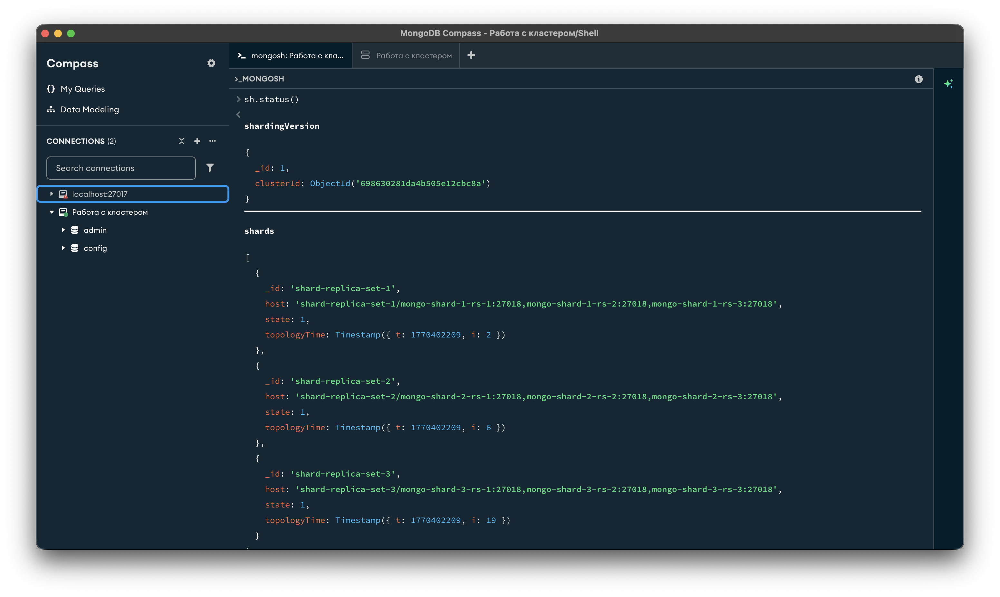

---

## 4. Создание базы данных и наполнение тестовыми данными

### 4.1. Создание базы данных

```javascript
use shopdb
```

Включаю шардирование для базы данных:

```javascript
sh.enableSharding("shopdb")
```

### 4.2. Генерация тестовых данных

Для тестирования сгенерировал **100 000 документов** (заказов) в коллекции `tickets`:

```javascript
print("Генерация тестовых данных...");

var cities = ["Москва", "Санкт-Петербург", "Новосибирск", "Екатеринбург", "Казань"];
var products = ["Ноутбук", "Смартфон", "Планшет", "Наушники", "Монитор"];
var statuses = ["pending", "processing", "shipped", "delivered"];

var batch = [];
var batchSize = 1000;

for (var i = 1; i <= 100000; i++) {
    batch.push({
        ticket_id: i,
        user_id: Math.floor(Math.random() * 10000) + 1,
        amount: Math.floor(Math.random() * 150000) + 1000,
        product: products[Math.floor(Math.random() * products.length)],
        city: cities[Math.floor(Math.random() * cities.length)],
        status: statuses[Math.floor(Math.random() * statuses.length)],
        created_at: new Date(Date.now() - Math.floor(Math.random() * 365 * 24 * 60 * 60 * 1000))
    });

    if (batch.length === batchSize) {
        db.tickets.insertMany(batch);
        batch = [];
        if (i % 10000 === 0) {
            print("Создано: " + i);
        }
    }
}

if (batch.length > 0) {
    db.tickets.insertMany(batch);
}

print("Создано 100,000 документов");
print("Количество в коллекции: " + db.tickets.countDocuments());
```

В коллекции `shopdb.tickets` создано 100 000 документов.

---

## 5. Настройка шардирования и балансировки

### 5.1. Выбор ключа шардирования

Перед выбором ключа проанализировал распределение данных по полю `user_id`:

```javascript
db.tickets.aggregate([
  { $group: { _id: "$user_id", count: { $sum: 1 } } },
  { $sort: { count: -1 } },
  { $limit: 5 }
])
```

> **Скриншот:** *Анализ распределения данных по user_id*
>
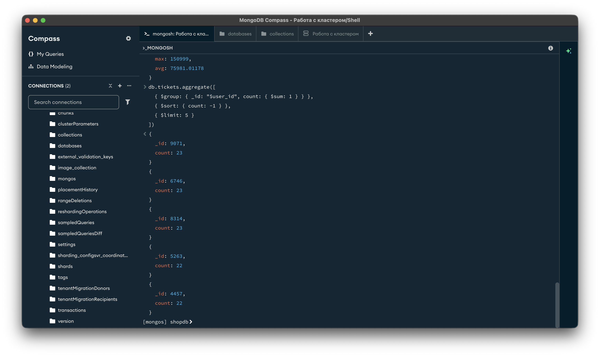

В качестве ключа шардирования выбрал **хешированный индекс по полю `user_id`** (`hashed`). В реальной практике распределение данных по хешу клиента обеспечивает равномерное размещение документов по шардам и исключает «горячие точки».

Выполняю команду шардирования коллекции:

```javascript
sh.shardCollection("shopdb.tickets", { user_id: "hashed" })
```

MongoDB вернул:

```javascript
{
  collectionsharded: 'shopdb.tickets',
  ok: 1,
  '$clusterTime': {
    clusterTime: Timestamp({ t: 1770404001, i: 7 }),
    signature: {
      hash: Binary.createFromBase64('AAAAAAAAAAAAAAAAAAAAAAAAAAA=', 0),
      keyId: Long('0')
    }
  },
  operationTime: Timestamp({ t: 1770404001, i: 7 })
}
```

Коллекция успешно зашардирована.

### 5.2. Настройка размера чанков

Для ускорения процесса балансировки на тестовом датасете уменьшил размер чанка с 128 МБ (по умолчанию) до 1 МБ:

```javascript
use config

db.settings.updateOne(
  { _id: "chunksize" },
  { $set: { _id: "chunksize", value: 1 } },
  { upsert: true }
)
```

Проверка:

```javascript
db.settings.findOne({ _id: "chunksize" })
```

Получил:

```javascript
{ _id: "chunksize", value: 1 }
```

Размер чанка установлен в 1 МБ.

### 5.3. Ручное разбиение чанков (split)

Для более равномерного распределения данных выполнил операции ручного разбиения чанков:

```javascript
sh.splitFind("shopdb.tickets", { user_id: 5000 })
sh.splitFind("shopdb.tickets", { user_id: 2000 })
sh.splitFind("shopdb.tickets", { user_id: 3000 })
sh.splitFind("shopdb.tickets", { user_id: 7000 })
sh.splitFind("shopdb.tickets", { user_id: 8000 })
```

Каждая операция вернула что-то вроде:

```javascript
{
  ok: 1,
  '$clusterTime': {
    clusterTime: Timestamp({ t: 1770487234, i: 11 }),
    signature: {
      hash: Binary.createFromBase64('AAAAAAAAAAAAAAAAAAAAAAAAAAA=', 0),
      keyId: Long('0')
    }
  },
  operationTime: Timestamp({ t: 1770487234, i: 11 })
}
```

Количество чанков увеличилось с 9 до 14.

### 5.4. Проверка работы балансировщика

```javascript
sh.balancerCollectionStatus("shopdb.tickets")
```

MongoDB ответил:

```javascript
{
  chunkSize: 1,
  balancerCompliant: true,
  ok: 1,
  '$clusterTime': {
    clusterTime: Timestamp({ t: 1770485859, i: 1 }),
    signature: {
      hash: Binary.createFromBase64('AAAAAAAAAAAAAAAAAAAAAAAAAAA=', 0),
      keyId: Long('0')
    }
  },
  operationTime: Timestamp({ t: 1770485859, i: 1 })
}
```

Статус `balancerCompliant: true` подтверждает, что распределение чанков соответствует настройкам кластера.

---

## 6. Анализ распределения данных

### 6.1. Распределение чанков по шардам

Получаю UUID коллекции и анализирую чанки:

```javascript
use config

var ticketsCollection = db.collections.findOne({ _id: "shopdb.tickets" })
var ticketsUUID = ticketsCollection.uuid

var chunksCount = db.chunks.find({ uuid: ticketsUUID }).count()
print("Общее количество chunks: " + chunksCount)
```

Общее количество чанков — **14**.

Распределение чанков по шардам:

```javascript
db.chunks.aggregate([
  { $match: { uuid: ticketsUUID } },
  { $group: { _id: "$shard", count: { $sum: 1 } } },
  { $sort: { count: -1 } }
])
```

До балансировки:

```javascript
{
  _id: 'shard-replica-set-2',
  count: 4
}
{
  _id: 'shard-replica-set-1',
  count: 4
}
{
  _id: 'shard-replica-set-3',
  count: 1
}
```

После балансировки:

```javascript
{
  _id: 'shard-replica-set-1',
  count: 6
}
{
  _id: 'shard-replica-set-2',
  count: 4
}
{
  _id: 'shard-replica-set-3',
  count: 4
}
```

Количество мигрировавших чанков:

```javascript
var migratedChunks = db.chunks.find({
  uuid: ticketsUUID,
  "history.1": { $exists: true }
}).count()
print("Количество мигрировавших chunks: " + migratedChunks)
```

9 чанков были мигрированы балансировщиком между шардами.

### 6.2. Распределение документов по шардам

```javascript
use shopdb
db.tickets.getShardDistribution()
```

> **Скриншот:** *Распределение данных по шардам (getShardDistribution)*
>
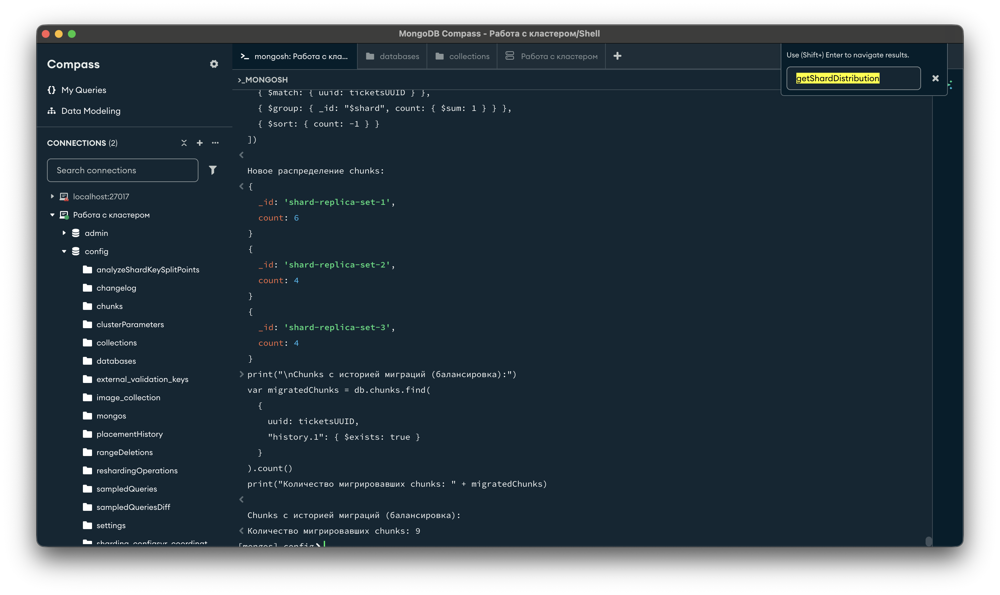

Вот что вернул MongoDB:

```
Shard shard-replica-set-1 at shard-replica-set-1/mongo-shard-1-rs-1:27018,mongo-shard-1-rs-2:27018,mongo-shard-1-rs-3:27018
{
  data: '5.01MiB',
  docs: 32321,
  chunks: 6,
  'estimated data per chunk': '856KiB',
  'estimated docs per chunk': 5386
}

Shard shard-replica-set-3 at shard-replica-set-3/mongo-shard-3-rs-1:27018,mongo-shard-3-rs-2:27018,mongo-shard-3-rs-3:27018
{
  data: '6.49MiB',
  docs: 41816,
  chunks: 4,
  'estimated data per chunk': '1.62MiB',
  'estimated docs per chunk': 10454
}

Shard shard-replica-set-2 at shard-replica-set-2/mongo-shard-2-rs-1:27018,mongo-shard-2-rs-2:27018,mongo-shard-2-rs-3:27018
{
  data: '4.01MiB',
  docs: 25863,
  chunks: 4,
  'estimated data per chunk': '1MiB',
  'estimated docs per chunk': 6465
}

Totals
{
  data: '15.53MiB',
  docs: 100000,
  chunks: 14,
  'Shard shard-replica-set-1': [
    '32.32 % data',
    '32.32 % docs in cluster',
    '162B avg obj size on shard'
  ],
  'Shard shard-replica-set-3': [
    '41.81 % data',
    '41.81 % docs in cluster',
    '162B avg obj size on shard'
  ],
  'Shard shard-replica-set-2': [
    '25.86 % data',
    '25.86 % docs in cluster',
    '162B avg obj size on shard'
  ]
}
```

> **Скриншот:** *Сводная статистика распределения*
>
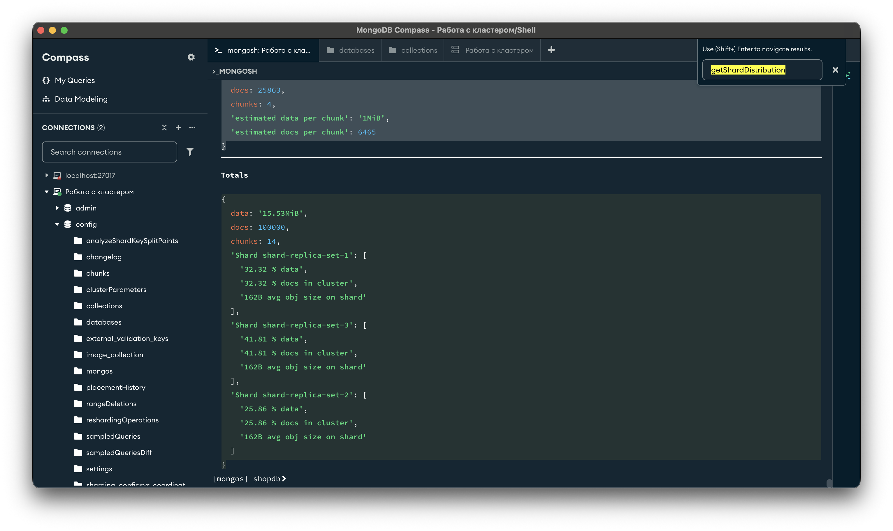

### 6.3. Выводы по балансировке

**Ключ шардирования:** хешированный индекс по полю `user_id`.

**Процесс балансировки:**

После включения шардирования MongoDB создал **9 чанков**. Операции `sh.splitFind()` разбили крупные чанки, увеличив их количество до **14**. Балансировщик автоматически мигрировал **9 чанков** между шардами. Распределение чанков изменилось с **4–4–1** на **6–4–4**.

**Анализ неравномерности:**

Несмотря на миграцию чанков, распределение данных осталось неравномерным (отклонение до ~16% от идеального значения 33.3%). Это обусловлено характером хеш-функции и относительно небольшим объёмом данных (100 000 документов). При увеличении объёма данных до миллионов документов распределение станет более равномерным благодаря статистическим свойствам хеш-функции.

Балансировщик работает корректно. Неравномерность в пределах нормы для тестового датасета. Система работоспособна.

---

## 7. Тестирование отказоустойчивости

### 7.1. Тест 1: Отключение PRIMARY-ноды одного шарда

#### 7.1.1. Состояние ДО отключения

Подключаюсь к первой ноде Shard 1 для проверки текущего статуса:

```bash
docker exec -it mongo-shard-1-rs-1 mongosh --port 27018
```

```javascript
rs.status()
```

Вот фрагмент ответа (сокращённо):

```javascript
{
  set: 'shard-replica-set-1',
  members: [
    {
      _id: 0,
      name: 'mongo-shard-1-rs-1:27018',
      health: 1,
      state: 2,
      stateStr: 'SECONDARY',
      ...
    },
    {
      _id: 1,
      name: 'mongo-shard-1-rs-2:27018',
      health: 1,
      state: 1,
      stateStr: 'PRIMARY',
      ...
    },
    {
      _id: 2,
      name: 'mongo-shard-1-rs-3:27018',
      health: 1,
      state: 2,
      stateStr: 'SECONDARY',
      ...
    }
  ],
  ok: 1
}
```

Текущее состояние:
- mongo-shard-1-rs-1: SECONDARY
- mongo-shard-1-rs-2: **PRIMARY**
- mongo-shard-1-rs-3: SECONDARY

> **Скриншот:** *Просмотр документов в БД до отключения ноды*
>
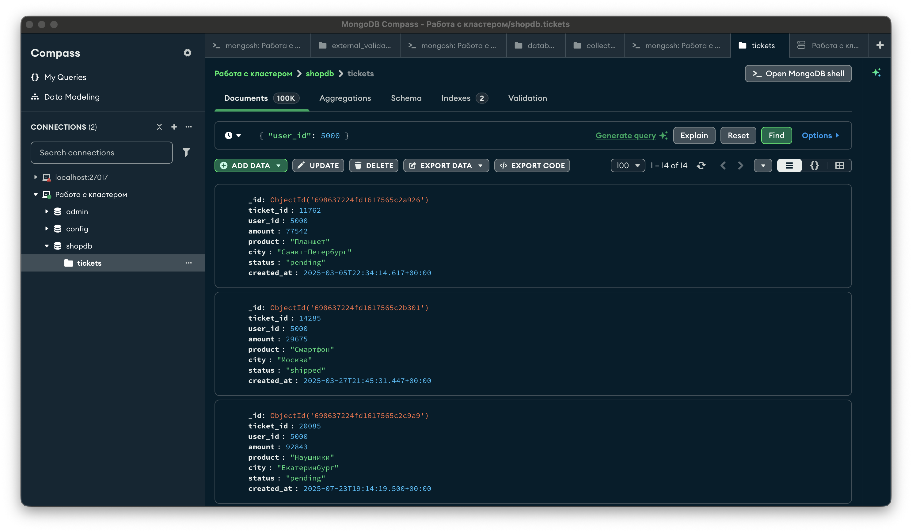

Для проверки добавил тестовый документ **до** отключения:

```javascript
db.tickets.insertOne({
  ticket_id: 200000,
  user_id: 99999,
  amount: 12345,
  product: "Тест ДО отключения",
  city: "Москва",
  status: "pending",
  created_at: new Date("2025-02-07T12:00:00Z")
})
```

#### 7.1.2. Отключение PRIMARY-ноды

Останавливаю контейнер с PRIMARY-нодой:

```bash
docker stop mongo-shard-1-rs-1
```

> **Скриншот:** *Результат остановки PRIMARY-ноды (docker stop)*
>


#### 7.1.3. Состояние ПОСЛЕ отключения

Повторный запрос `rs.status()` с оставшейся ноды показал:

```javascript
{
  set: 'shard-replica-set-1',
  members: [
    {
      _id: 0,
      name: 'mongo-shard-1-rs-1:27018',
      health: 0,
      state: 8,
      stateStr: '(not reachable/healthy)',
      lastHeartbeatMessage: 'Error connecting to mongo-shard-1-rs-1:27018 :: caused by :: Could not find address for mongo-shard-1-rs-1:27018: SocketException: onInvoke :: caused by :: Host not found (authoritative)',
      ...
    },
    {
      _id: 1,
      name: 'mongo-shard-1-rs-2:27018',
      health: 1,
      state: 1,
      stateStr: 'PRIMARY',
      ...
    },
    {
      _id: 2,
      name: 'mongo-shard-1-rs-3:27018',
      health: 1,
      state: 2,
      stateStr: 'SECONDARY',
      ...
    }
  ],
  ok: 1
}
```

Нода `mongo-shard-1-rs-2` осталась PRIMARY. Нода `mongo-shard-1-rs-1` помечена как `(not reachable/healthy)` с ошибкой: `Error connecting to mongo-shard-1-rs-1:27018 :: Host not found`.

#### 7.1.4. Проверка доступности данных

Добавил тестовый документ **после** отключения PRIMARY-ноды:

```javascript
db.tickets.insertOne({
  ticket_id: 200001,
  user_id: 88888,
  amount: 54321,
  product: "Тест ПОСЛЕ отключения PRIMARY",
  city: "Казань",
  status: "delivered",
  created_at: new Date("2025-02-07T12:05:00Z")
})
```

> **Скриншот:** *Тестовый документ успешно добавлен после отключения PRIMARY-ноды*
>
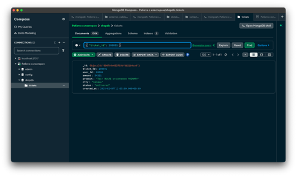

Запись и чтение данных продолжают работать, несмотря на потерю одной ноды.

#### 7.1.5. Восстановление ноды

```bash
docker start mongo-shard-1-rs-1
sleep 15
```

Повторная проверка `rs.status()` показала:

```javascript
{
  set: 'shard-replica-set-1',
  members: [
    {
      _id: 0,
      name: 'mongo-shard-1-rs-1:27018',
      health: 1,
      state: 2,
      stateStr: 'SECONDARY',
      uptime: 364,
      ...
    },
    {
      _id: 1,
      name: 'mongo-shard-1-rs-2:27018',
      health: 1,
      state: 1,
      stateStr: 'PRIMARY',
      ...
    },
    {
      _id: 2,
      name: 'mongo-shard-1-rs-3:27018',
      health: 1,
      state: 2,
      stateStr: 'SECONDARY',
      ...
    }
  ],
  ok: 1
}
```

Нода `mongo-shard-1-rs-1` успешно вернулась в реплика-сет в роли SECONDARY и синхронизировалась с PRIMARY.

---

### 7.2. Тест 2: Отключение целого шарда

#### 7.2.1. Состояние ДО отключения

> **Скриншот:** *Общее количество документов в коллекции до отключения шарда*
>
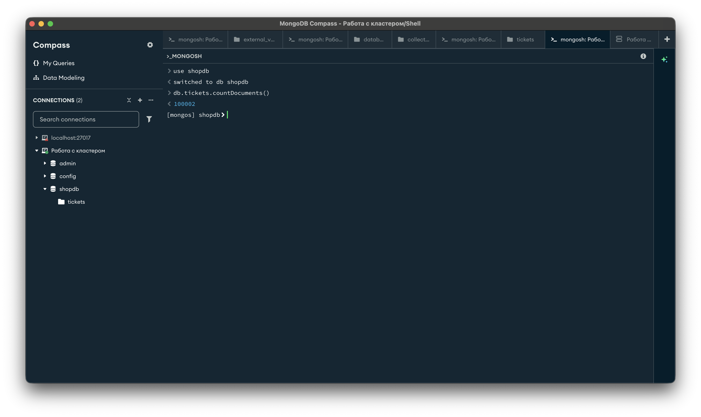

#### 7.2.2. Остановка всех нод Shard 2

```bash
docker stop mongo-shard-2-rs-1 mongo-shard-2-rs-2 mongo-shard-2-rs-3
```

#### 7.2.3. Проверка доступности данных

**Запросы с указанием shard key (user_id):**

```javascript
db.tickets.find({ user_id: 1 }).limit(3)
db.tickets.find({ user_id: 5000 }).limit(3)
db.tickets.find({ user_id: 9999 }).limit(3)
```

> **Скриншот:** *Результат запросов по shard key при отключённом шарде*
>
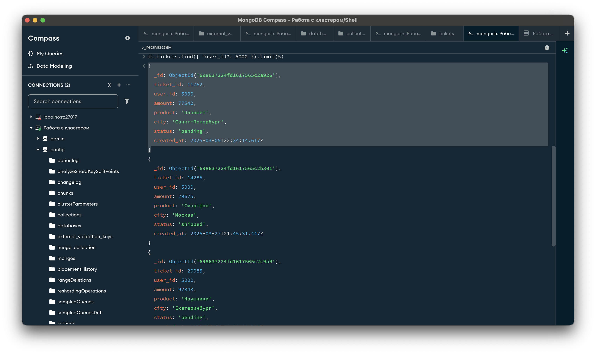

Запросы по `user_id`, данные которых расположены на работающих шардах (shard-1, shard-3), выполнены **успешно**.

**Запрос без фильтра (scatter-gather):**

```javascript
db.tickets.find().limit(10)
```

> **Скриншот:** *Ошибка при scatter-gather запросе с отключённым шардом*
>
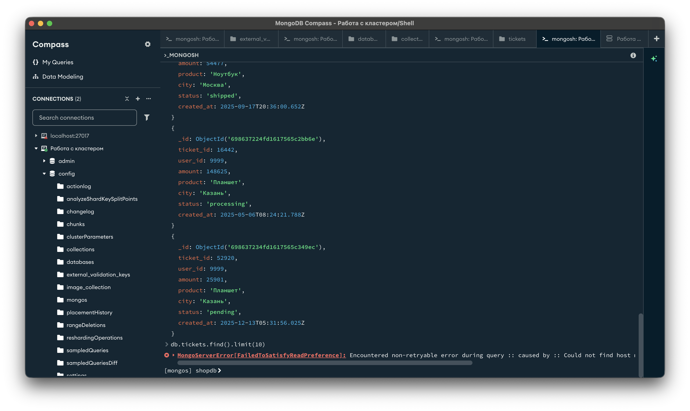

Запрос без указания shard key требует обращения ко всем шардам (scatter-gather) и завершился **ошибкой**, так как shard-2 недоступен.

#### 7.2.4. Восстановление шарда

```bash
docker start mongo-shard-2-rs-1 mongo-shard-2-rs-2 mongo-shard-2-rs-3
```

> **Скриншот:** *Данные после восстановления шарда — всё работает*
>
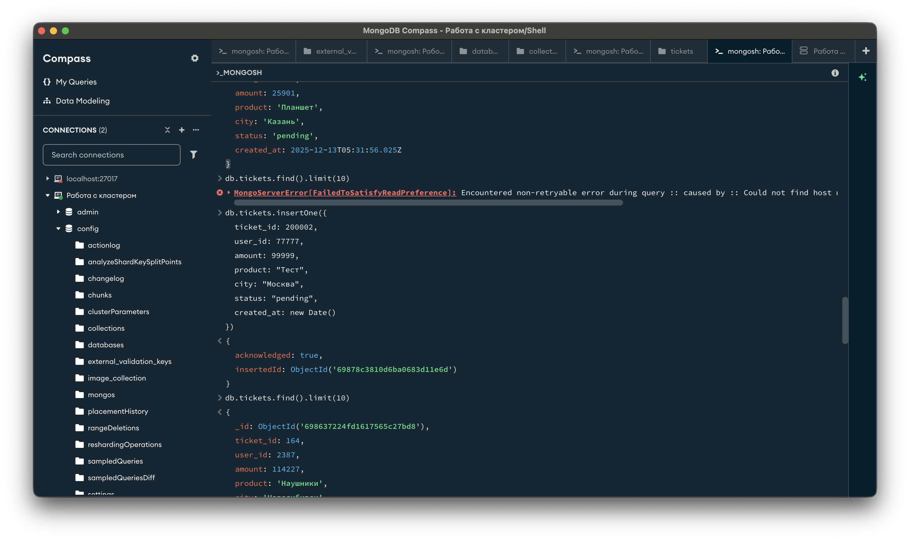

После запуска нод шард полностью восстановился. Все запросы выполняются без ошибок.

### 7.3. Итоги тестирования отказоустойчивости

| Сценарий | Результат | Доступность данных |
|---|---|---|
| Отключение 1 ноды (PRIMARY) из Replica Set | PRIMARY автоматически переизбирается | Полная (чтение + запись) |
| Возврат ноды после отключения | Автоматическая синхронизация как SECONDARY | Полная |
| Отключение всего шарда (3 ноды) | Данные этого шарда недоступны | Частичная (только по shard key на доступных шардах) |
| Scatter-gather запрос при отключённом шарде | Ошибка | Недоступно |
| Восстановление шарда | Автоматическое восстановление | Полная |

---

## 8. Настройка аутентификации и управление пользователями

### 8.1. Создание пользователей

**Администратор кластера (root):**

```javascript
use admin

db.createUser({
  user: "admin",
  pwd: "admin123",
  roles: [
    { role: "root", db: "admin" }
  ]
})
```

> **Скриншот:** *Создание пользователя admin*
>
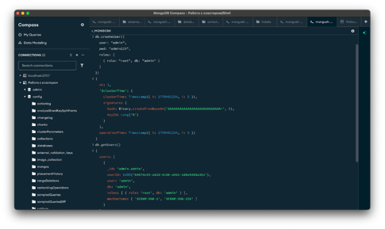

**Пользователи базы данных `shopdb`:**

```javascript
use shopdb

// Только чтение
db.createUser({
  user: "reader",
  pwd: "reader123",
  roles: [
    { role: "read", db: "shopdb" }
  ]
})

// Чтение и запись
db.createUser({
  user: "writer",
  pwd: "writer123",
  roles: [
    { role: "readWrite", db: "shopdb" }
  ]
})
```

> **Скриншот:** *Создание пользователей reader и writer*
>
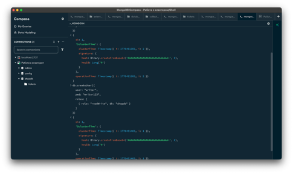

**Администратор БД `shopdb`:**

```javascript
db.createUser({
  user: "dbadmin",
  pwd: "dbadmin123",
  roles: [
    { role: "dbAdmin", db: "shopdb" },
    { role: "readWrite", db: "shopdb" }
  ]
})
```

MongoDB вернул:

```javascript
{
  ok: 1,
  '$clusterTime': {
    clusterTime: Timestamp({ t: 1770491526, i: 1 }),
    signature: {
      hash: Binary.createFromBase64('AAAAAAAAAAAAAAAAAAAAAAAAAAA=', 0),
      keyId: Long('0')
    }
  },
  operationTime: Timestamp({ t: 1770491526, i: 1 })
}
```

**Аналитик (только чтение):**

```javascript
db.createUser({
  user: "analyst",
  pwd: "analyst123",
  roles: [
    { role: "read", db: "shopdb" }
  ]
})
```

### 8.2. Проверка созданных пользователей

```javascript
db.getUsers()
```

MongoDB вернул список всех пользователей:

```javascript
{
  users: [
    {
      _id: 'shopdb.analyst',
      userId: UUID('b7504352-1432-4f03-839b-87f781a4a551'),
      user: 'analyst',
      db: 'shopdb',
      roles: [ { role: 'read', db: 'shopdb' } ],
      mechanisms: [ 'SCRAM-SHA-1', 'SCRAM-SHA-256' ]
    },
    {
      _id: 'shopdb.dbadmin',
      userId: UUID('7f3b4f15-13a5-4e01-8b70-376f75b4c5a0'),
      user: 'dbadmin',
      db: 'shopdb',
      roles: [
        { role: 'dbAdmin', db: 'shopdb' },
        { role: 'readWrite', db: 'shopdb' }
      ],
      mechanisms: [ 'SCRAM-SHA-1', 'SCRAM-SHA-256' ]
    },
    {
      _id: 'shopdb.reader',
      userId: UUID('9dfa0386-45bc-4d8a-a54d-92c77e6b5eff'),
      user: 'reader',
      db: 'shopdb',
      roles: [ { role: 'read', db: 'shopdb' } ],
      mechanisms: [ 'SCRAM-SHA-1', 'SCRAM-SHA-256' ]
    },
    {
      _id: 'shopdb.writer',
      userId: UUID('11ec60ff-d974-44df-8d2f-b1e44779fc2f'),
      user: 'writer',
      db: 'shopdb',
      roles: [ { role: 'readWrite', db: 'shopdb' } ],
      mechanisms: [ 'SCRAM-SHA-1', 'SCRAM-SHA-256' ]
    }
  ],
  ok: 1
}
```

### 8.3. Проверка прав пользователя `admin` (root)

Подключение с аутентификацией:

```bash
docker exec -it mongos-router mongosh -u admin -p admin123 --authenticationDatabase admin
```

Выполняю операции:

```javascript
use shopdb

// Чтение данных
db.tickets.find().limit(3)

// Запись данных
db.tickets.insertOne({
  ticket_id: 300001,
  user_id: 12345,
  amount: 5000,
  product: "Тест админа",
  city: "Москва",
  status: "pending"
})

// Создание индекса
db.tickets.createIndex({ city: 1 })

// Административные команды
db.adminCommand({ listShards: 1 })
```

> **Скриншот:** *Проверка прав admin — все операции успешны*
>
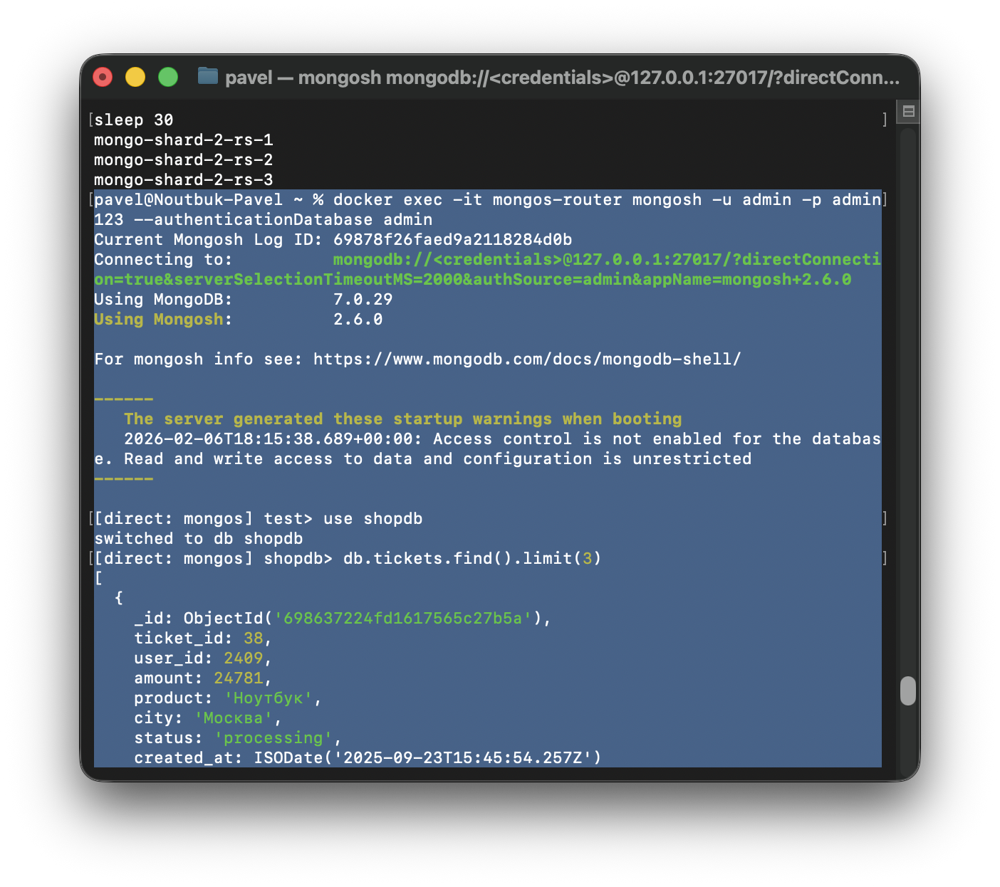

Вот что вернул MongoDB при выполнении различных операций:

**Чтение данных:**

```javascript
[
  {
    _id: ObjectId('698637224fd1617565c27b5a'),
    ticket_id: 38,
    user_id: 2409,
    amount: 24781,
    product: 'Ноутбук',
    city: 'Москва',
    status: 'processing',
    created_at: ISODate('2025-09-23T15:45:54.257Z')
  },
  {
    _id: ObjectId('698637224fd1617565c27b6a'),
    ticket_id: 54,
    user_id: 151,
    amount: 12944,
    product: 'Ноутбук',
    city: 'Екатеринбург',
    status: 'shipped',
    created_at: ISODate('2025-06-07T18:43:51.371Z')
  },
  {
    _id: ObjectId('698637224fd1617565c27b77'),
    ticket_id: 67,
    user_id: 2452,
    amount: 49775,
    product: 'Монитор',
    city: 'Москва',
    status: 'processing',
    created_at: ISODate('2025-12-07T21:41:25.164Z')
  }
]
```

**Запись данных:**

```javascript
{
  acknowledged: true,
  insertedId: ObjectId('69878f56faed9a2118284d0c')
}
```

**Создание индекса:**

```
city_1
```

**Команда listShards:**

```javascript
{
  shards: [
    {
      _id: 'shard-replica-set-1',
      host: 'shard-replica-set-1/mongo-shard-1-rs-1:27018,mongo-shard-1-rs-2:27018,mongo-shard-1-rs-3:27018',
      state: 1,
      topologyTime: Timestamp({ t: 1770402209, i: 2 })
    },
    {
      _id: 'shard-replica-set-2',
      host: 'shard-replica-set-2/mongo-shard-2-rs-1:27018,mongo-shard-2-rs-2:27018,mongo-shard-2-rs-3:27018',
      state: 1,
      topologyTime: Timestamp({ t: 1770402209, i: 6 })
    },
    {
      _id: 'shard-replica-set-3',
      host: 'shard-replica-set-3/mongo-shard-3-rs-1:27018,mongo-shard-3-rs-2:27018,mongo-shard-3-rs-3:27018',
      state: 1,
      topologyTime: Timestamp({ t: 1770402209, i: 19 })
    }
  ],
  ok: 1,
  '$clusterTime': {
    clusterTime: Timestamp({ t: 1770491907, i: 2 }),
    signature: {
      hash: Binary.createFromBase64('AAAAAAAAAAAAAAAAAAAAAAAAAAA=', 0),
      keyId: Long('0')
    }
  },
  operationTime: Timestamp({ t: 1770491907, i: 2 })
}
```

**Результат проверки пользователя `admin`:**

| Операция | Результат |
|---|---|
| Чтение данных | Успешно |
| Запись данных | Успешно |
| Создание индексов | Успешно |
| Доступ к `config` базе | Успешно |
| Выполнение `listShards`, `listDatabases` | Успешно |

Кстати, команда `sh.status()` выдала техническую ошибку (`TypeError: e._id.startsWith is not a function`) — это известный баг mongosh. Альтернативная команда `db.adminCommand({listShards:1})` отработала корректно, подтверждая полные права администратора.

### 8.4. Проверка прав пользователя `reader` (только чтение)

Подключение:

```bash
docker exec -it mongos-router mongosh -u reader -p reader123 --authenticationDatabase shopdb
```

Выполняю запросы:

```javascript
use shopdb

// Чтение — успешно
db.tickets.find({ user_id: 5000 }).limit(3)
```

Вот что MongoDB вернул:

```javascript
[
  {
    _id: ObjectId('698637224fd1617565c2a926'),
    ticket_id: 11762,
    user_id: 5000,
    amount: 77542,
    product: 'Планшет',
    city: 'Санкт-Петербург',
    status: 'pending',
    created_at: ISODate('2025-03-05T22:34:14.617Z')
  },
  {
    _id: ObjectId('698637224fd1617565c2b301'),
    ticket_id: 14285,
    user_id: 5000,
    amount: 29675,
    product: 'Смартфон',
    city: 'Москва',
    status: 'shipped',
    created_at: ISODate('2025-03-27T21:45:31.447Z')
  },
  {
    _id: ObjectId('698637224fd1617565c2c9a9'),
    ticket_id: 20085,
    user_id: 5000,
    amount: 92843,
    product: 'Наушники',
    city: 'Екатеринбург',
    status: 'pending',
    created_at: ISODate('2025-07-23T19:14:19.500Z')
  }
]
```

Пользователь `reader` успешно выполняет операции чтения в базе `shopdb`. Запись и административные операции недоступны — права ограничены ролью `read`.

---

## 9. Выводы

В ходе выполнения работы были решены все поставленные задачи:

Развёрнут шардированный кластер MongoDB из 13 контейнеров в Docker: 3 Config Server, 9 нод данных (3 шарда × 3 реплики), 1 Mongos Router.

Настроено шардирование коллекции `shopdb.tickets` с использованием хешированного ключа по полю `user_id`. Данные (100 000 документов) распределены по трём шардам.

Настроена и проверена балансировка. Балансировщик автоматически мигрировал 9 чанков. Распределение данных: 32.32% / 25.86% / 41.81% — в пределах нормы для тестового объёма.

Протестирована отказоустойчивость. При отключении PRIMARY-ноды происходит автоматическое переизбрание, кластер продолжает работу. При отключении целого шарда запросы с указанием shard key к другим шардам продолжают работать; scatter-gather запросы завершаются ошибкой. При восстановлении ноды/шарда — автоматическая синхронизация.

Настроена аутентификация с разграничением прав: создано 5 пользователей с ролями `root`, `read`, `readWrite`, `dbAdmin`. Проверено корректное ограничение доступа.