# Отчёт: Развёртывание кластера Couchbase

---

## 1. Архитектура кластера

Кластер развёрнут в Docker и включает следующие компоненты:

| Компонент | Количество инстансов | Роль | Порты (host) |
|---|---|---|---|
| Couchbase Node 1 | 1 | Узел кластера (data, index, query) | — |
| Couchbase Node 2 | 1 | Узел кластера (data, index, query) | — |
| Couchbase Node 3 | 1 | Узел кластера (data, index, query) + веб-интерфейс | 8091–8093, 11210 |

**Итого:** 3 контейнера, объединённых в единую Docker-сеть (bridge).

**IP-адреса узлов в кластере:**

| Узел | IP-адрес | Статус |
|---|---|---|
| couchbase1 | 172.19.0.2 | Узел кластера |
| couchbase2 | 172.19.0.4 | Узел кластера |
| couchbase3 | 172.19.0.3 | Узел кластера + точка входа |

---

## 2. Развёртывание кластера в Docker

### 2.1. Docker Compose файл

Создан файл `docker-compose.yml`, описывающий все компоненты кластера:

```yaml
version: '3.9'
services:
  couchbase1:
    image: couchbase/server
    container_name: couchbase1
    volumes:
      - ./node1:/opt/couchbase/var
  couchbase2:
    image: couchbase/server
    container_name: couchbase2
    volumes:
      - ./node2:/opt/couchbase/var
  couchbase3:
    image: couchbase/server
    container_name: couchbase3
    volumes:
      - ./node3:/opt/couchbase/var
    ports:
      - 8091:8091
      - 8092:8092
      - 8093:8093
      - 11210:11210
```

**Описание конфигурации:**

- Каждая нода получила собственный volume для персистентного хранения данных
- Нода `couchbase3` пробрасывает порты для доступа к веб-интерфейсу и API:
    - `8091` — веб-консоль управления
    - `8092` — Views API
    - `8093` — Query API
    - `11210` — Memcached protocol

### 2.2. Запуск кластера

Запуск всех контейнеров:

```bash
docker-compose -f docker_compose.yml up -d
```

Проверка статуса контейнеров:

```bash
docker ps
```

> **Скриншот:** *Запущенные контейнеры Couchbase*
>
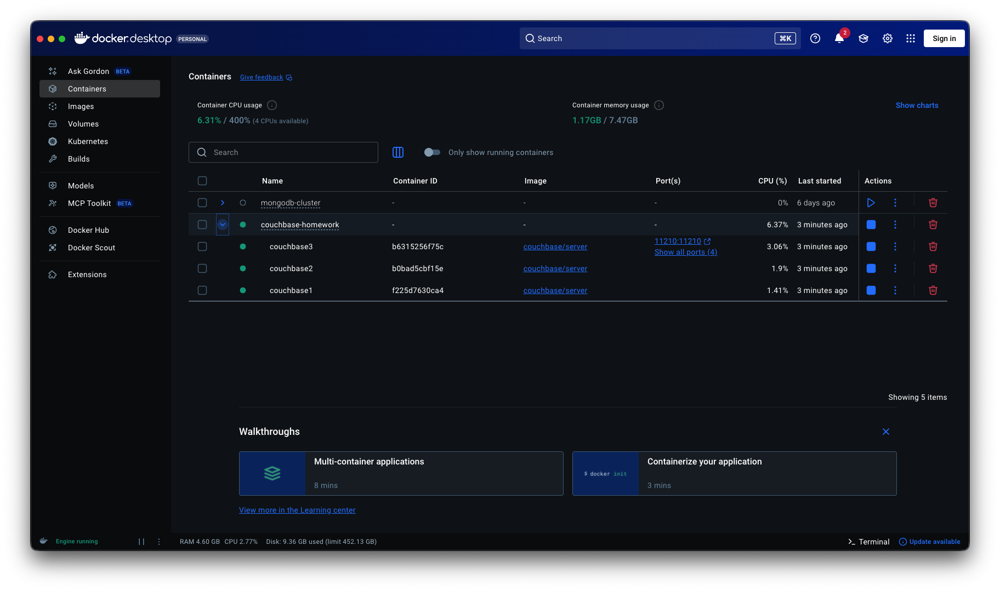

Все 3 контейнера успешно поднялись и находятся в статусе `Up`.

---

## 3. Инициализация кластера

### 3.1. Доступ к веб-интерфейсу

Переход в веб-интерфейс Couchbase по адресу `http://localhost:8091`:

> **Скриншот:** *Начальный экран веб-интерфейса Couchbase*
>
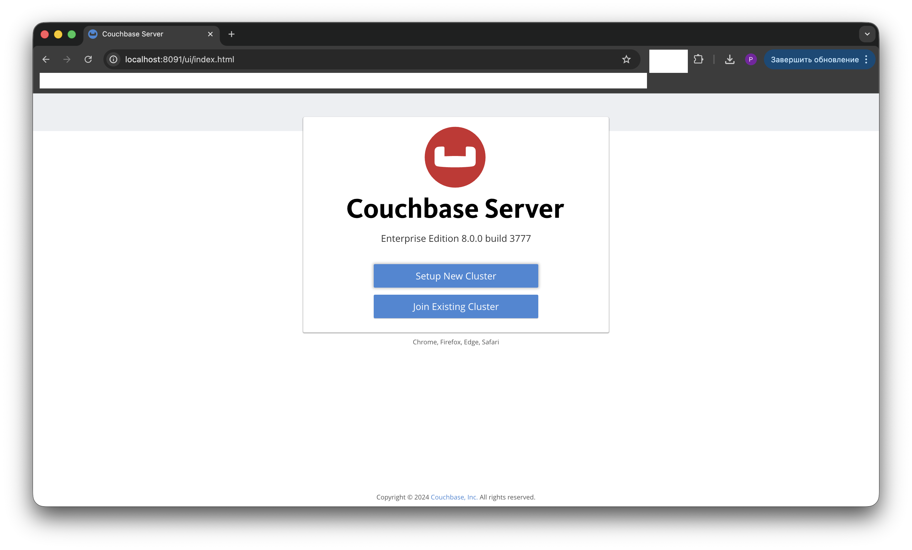

### 3.2. Создание нового кластера

Через мастер настройки выполнена инициализация первого узла кластера:

- Создан новый кластер (Setup New Cluster)
- Настроены сервисы: Data, Query, Index
- Установлены учётные данные администратора
- Принята конфигурация по умолчанию для памяти и дисков

После завершения инициализации открылась главная панель управления:

> **Скриншот:** *Главная панель управления кластером*
>
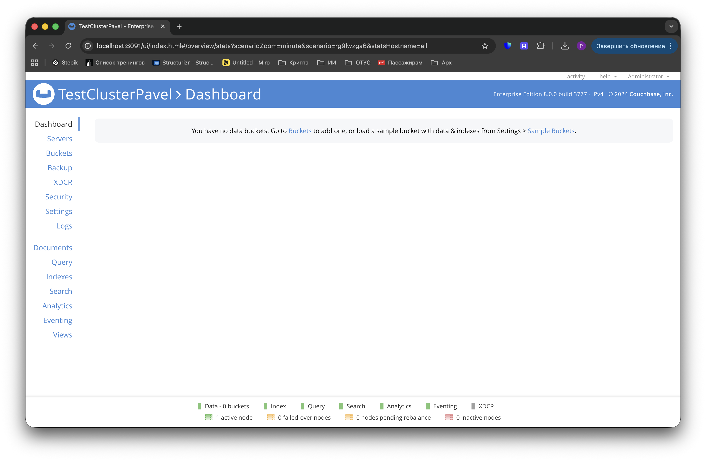

На данном этапе кластер состоит из одной ноды.

---

## 4. Добавление узлов в кластер

### 4.1. Получение IP-адресов контейнеров

Для добавления узлов в кластер получены их IP-адреса внутри Docker-сети:

```bash
docker inspect -f '{{.Name}} - {{range .NetworkSettings.Networks}}{{.IPAddress}}{{end}}' couchbase1 couchbase2 couchbase3
```

Результат:

```
/couchbase1 - 172.19.0.2
/couchbase2 - 172.19.0.4
/couchbase3 - 172.19.0.3
```

### 4.2. Добавление второго узла

При попытке добавить узел `172.19.0.4` (couchbase2) в кластер через веб-интерфейс получена ошибка:

```
Warning: Adding a server to this cluster means any previous Couchbase Server data on that server will be removed.
This cluster is using self-signed certificates. No peer verification between nodes will be done.
Attention: Join completion call failed. Got HTTP status 500 from REST call post to https://172.19.0.4:18091/completeJoin. 
Body was: "[\"Unexpected server error, request logged.\"]"
```

**Причина ошибки:**

HTTP 500 при вызове `/completeJoin` указывает на внутреннюю ошибку сервера при попытке завершить процесс присоединения узла к кластеру. Это может быть вызвано несколькими факторами:

1. Рассинхронизация состояния между узлами
2. Конфликт метаданных кластера
3. Проблемы с сертификатами (self-signed)
4. Недостаточная инициализация узла перед добавлением

### 4.3. Решение проблемы

Проблема решена перезапуском контейнеров и выполнением операции rebalance:

```bash
docker-compose restart
```

После перезапуска узлы успешно добавлены в кластер через веб-интерфейс (Rebalance).

> **Скриншот:** *Кластер из трёх нод после успешного добавления*
>
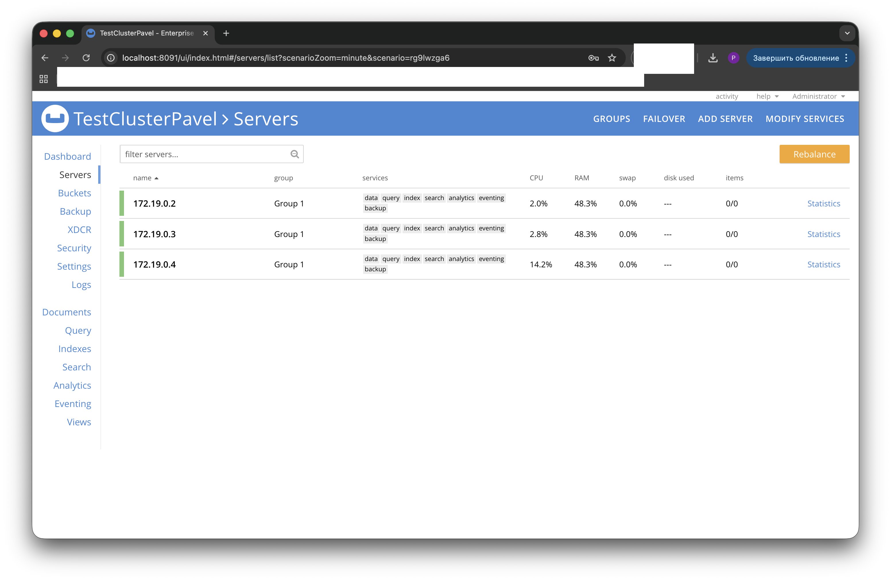

**Статус кластера:**

| Узел | IP-адрес | Сервисы | Статус |
|---|---|---|---|
| couchbase1 | 172.19.0.2 | Data, Query, Index | healthy |
| couchbase2 | 172.19.0.4 | Data, Query, Index | healthy |
| couchbase3 | 172.19.0.3 | Data, Query, Index | healthy |

---

## 5. Создание bucket и работа с данными

### 5.1. Создание bucket

Создан новый bucket через веб-интерфейс:

**Параметры bucket:**

- Имя: `test-bucket`
- Тип: Couchbase
- Memory Quota: 256 MB
- Replicas: 1 (обеспечивает отказоустойчивость)
- Flush: Enabled (для тестирования)

> **Скриншот:** *Созданный bucket*
>
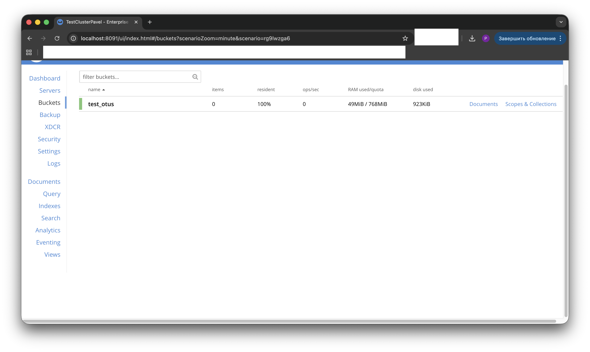

### 5.2. Добавление документов

Через раздел Documents добавлено 3 тестовых документа в JSON-формате:

**Документ 1:**
```json
{
  "id": "user_001",
  "name": "Иван Петров",
  "email": "ivan@example.com",
  "age": 28
}
```

**Документ 2:**
```json
{
  "id": "user_002",
  "name": "Мария Сидорова",
  "email": "maria@example.com",
  "age": 32
}
```

**Документ 3:**
```json
{
  "id": "user_003",
  "name": "Алексей Иванов",
  "email": "alexey@example.com",
  "age": 25
}
```

> **Скриншот:** *Документы в bucket*
>
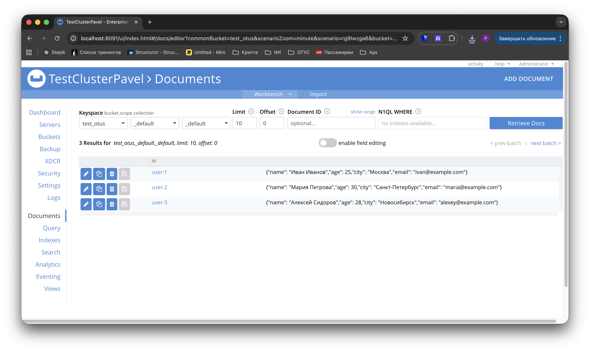

### 5.3. Проверка запросов

Выполнены тестовые запросы через Query Workbench:

**Запрос 1 — Выборка всех документов:**
```sql
SELECT * FROM `test-bucket`;
```

**Запрос 2 — Фильтрация по возрасту:**
```sql
SELECT name, email FROM `test-bucket` WHERE age > 26;
```

> **Скриншот:** *Выполнение запросов*
>
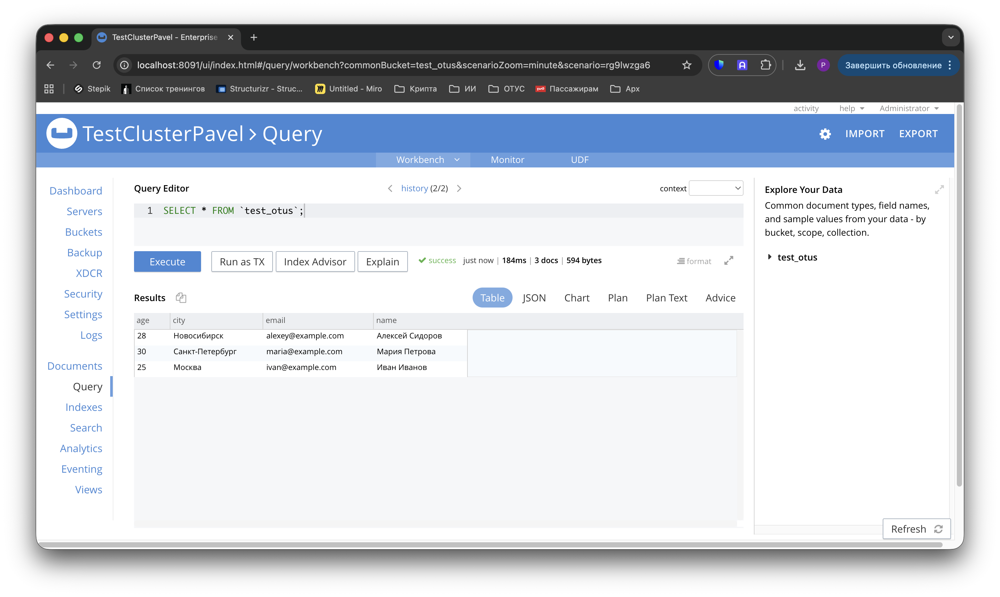

Все запросы выполнены успешно. Данные корректно распределены по узлам кластера с учётом настроенной репликации.

---

## 6. Тестирование отказоустойчивости

### 6.1. Тест 1: Остановка одного узла кластера

#### 6.1.1. Состояние ДО остановки

Все три ноды находятся в статусе `healthy`, данные доступны для чтения и записи.

Для проверки добавлены дополнительные документы (всего 6 документов в bucket):

```json
{
  "id": "user_004",
  "name": "Тестовый пользователь",
  "email": "test@example.com",
  "age": 30
}
```

#### 6.1.2. Остановка узла

Остановлен один из контейнеров:

```bash
docker stop couchbase1
```

> **Скриншот:** *Команда остановки контейнера*
>
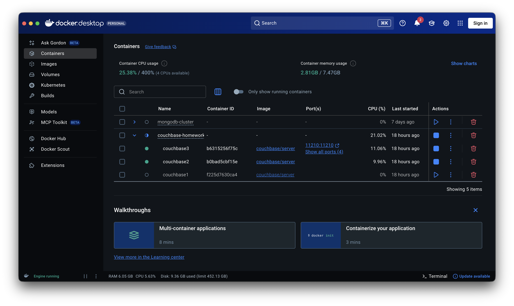

#### 6.1.3. Состояние кластера ПОСЛЕ остановки

В веб-интерфейсе нода `172.19.0.2` (couchbase1) перешла в статус `down`:

> **Скриншот:** *Нода остановлена, кластер показывает предупреждение*
>
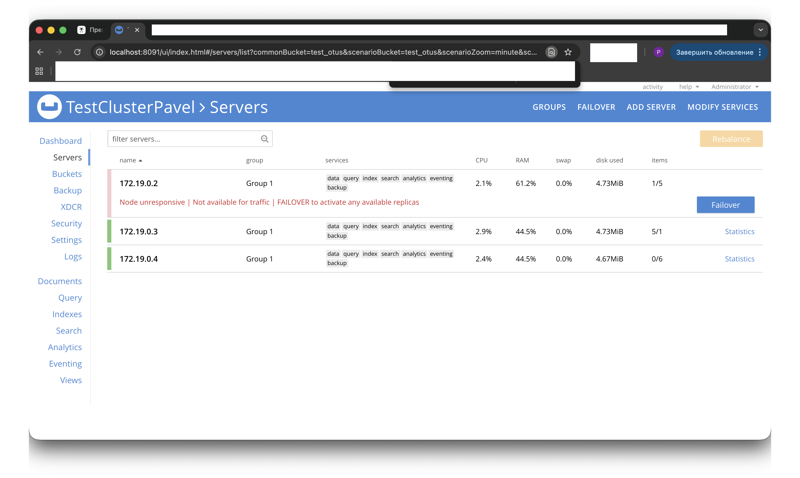

**Статус кластера:**

| Узел | Статус | Сервисы |
|---|---|---|
| 172.19.0.2 | **down** | недоступны |
| 172.19.0.4 | healthy | Data, Query, Index |
| 172.19.0.3 | healthy | Data, Query, Index |

#### 6.1.4. Проверка доступности данных

Несмотря на отказ одной ноды, запросы продолжают выполняться через оставшиеся узлы:

```sql
SELECT * FROM `test-bucket`;
```

> **Скриншот:** *Успешное выполнение запроса при отказе одной ноды*
>
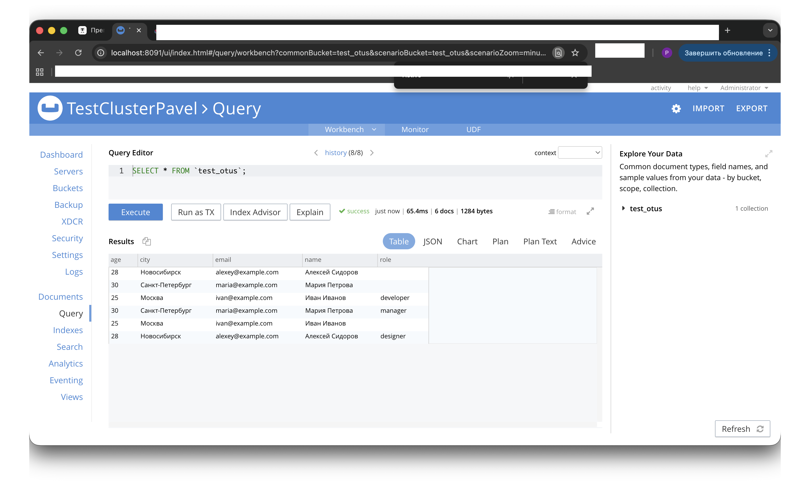

Все 6 документов доступны для чтения. Благодаря репликации данных (replica: 1) информация сохранена на других узлах кластера.

#### 6.1.5. Восстановление узла

Запущен остановленный контейнер:

```bash
docker start couchbase1
```

> **Скриншот:** *Восстановление ноды*
>


#### 6.1.6. Проблема с автоматическим восстановлением

После запуска контейнера нода `172.19.0.2` не вернулась в кластер автоматически. В разделе Servers она отображалась как `failed over`.

При нажатии на ноду запустился процесс rebalance, после чего нода исчезла из списка серверов:

> **Скриншот:** *Нода исчезла после rebalance*
>
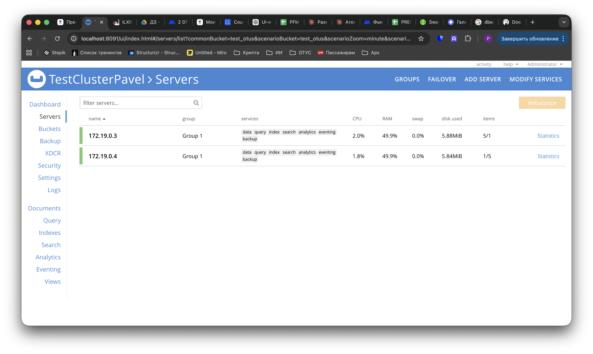

**Анализ проблемы:**

Couchbase использует механизм failover для обработки отказов узлов. Когда нода отваливается, кластер может автоматически пометить её как "failed over" и начать процесс перераспределения данных на оставшиеся узлы. При попытке вернуть такую ноду возникает конфликт состояний:

1. **Автоматический failover:** Кластер считает, что нода необратимо вышла из строя
2. **Рассинхронизация данных:** Во время простоя на активных нодах произошли изменения
3. **Отсутствие явной стратегии recovery:** Couchbase не знает, использовать ли delta recovery или full recovery

В результате при выполнении rebalance система приняла решение полностью удалить проблемную ноду из конфигурации кластера, так как это безопаснее, чем пытаться автоматически восстановить рассинхронизированные данные.

**Правильный подход в продуктивной среде:**

1. Использовать **graceful failover** вместо жёсткой остановки контейнера
2. Явно указывать стратегию восстановления: **delta recovery** (частичная синхронизация) или **full recovery** (полная)
3. Мониторить состояние узла через Couchbase API перед возвратом в кластер

### 6.2. Повторное добавление узла

Нода добавлена в кластер заново через веб-интерфейс (172.19.0.2):

> **Скриншот:** *Добавление ноды вручную*
>
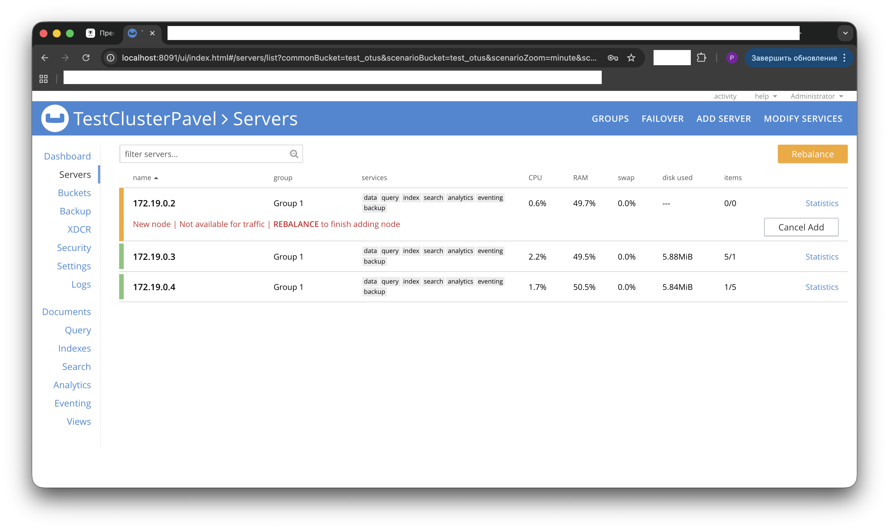

Выполнена операция rebalance для распределения данных:

> **Скриншот:** *Процесс rebalance*
>
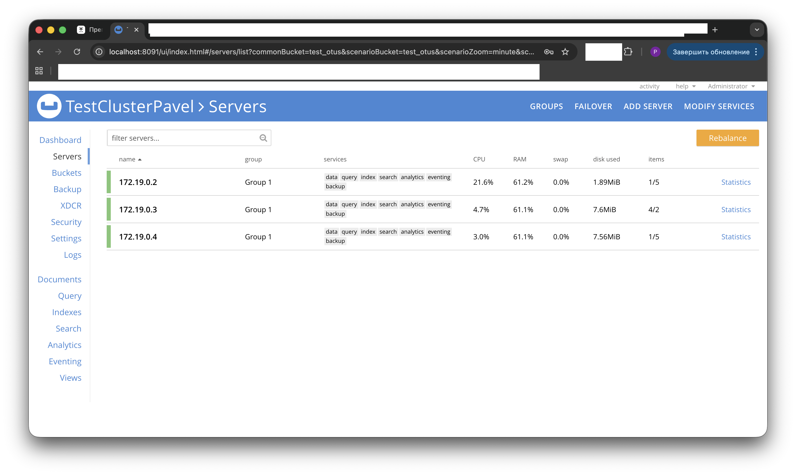

После завершения rebalance все три ноды снова работают в кластере. Данные равномерно распределены, репликация восстановлена.

### 6.3. Итоги тестирования отказоустойчивости

| Сценарий | Результат | Доступность данных |
|---|---|---|
| Остановка 1 ноды из 3 | Кластер продолжает работу | Полная (благодаря replica: 1) |
| Запросы при отказе ноды | Выполняются успешно | Полная |
| Восстановление ноды (автоматическое) | Не происходит | — |
| Восстановление ноды (ручное добавление + rebalance) | Успешно | Полная |

**Ключевые выводы:**

1. **Репликация работает корректно:** При отказе одной ноды данные остаются доступны на других узлах
2. **Автоматическое восстановление требует настройки:** По умолчанию Couchbase не возвращает failed over ноды автоматически
3. **Необходимость мониторинга:** В продуктивной среде критически важен мониторинг состояния узлов и настройка автоматического failover/recovery
4. **Ручное вмешательство:** Для восстановления отказавшей ноды требуется явное указание стратегии recovery

---

## 7. Выводы

В ходе выполнения работы решены следующие задачи:

**Развёрнут кластер Couchbase** из 3 узлов в Docker с использованием Docker Compose. Каждый узел настроен с персистентным хранилищем данных.

**Настроена архитектура кластера:** Узлы объединены в единый кластер с распределением сервисов Data, Query и Index на всех нодах. Процесс добавления узлов выявил проблему с рассинхронизацией при первичной инициализации, решённую через перезапуск контейнеров.

**Создан bucket с репликацией:** Настроен bucket с фактором репликации 1, обеспечивающий сохранность данных при отказе одного узла. Добавлены тестовые документы, проверена работа запросов.

**Протестирована отказоустойчивость:** При остановке одной ноды кластер продолжает обслуживать запросы благодаря репликации данных. Автоматическое восстановление отказавшей ноды не произошло — требуется ручное добавление и rebalance. Это ожидаемое поведение Couchbase при "грязном" failover без явного указания стратегии recovery.

**Выявлены особенности работы Couchbase:**

- Механизм failover требует явной стратегии восстановления (delta/full recovery)
- При рассинхронизации данных система предпочитает безопасное удаление ноды
- Для продуктивной среды необходима настройка graceful failover и автоматического мониторинга

Кластер работоспособен и готов к использованию для дальнейших задач.

