# Отчет по домашней работе: Apache Cassandra

## 1. Развёртывание 3-узлового кластера в Docker

### 1.1. Docker Compose конфигурация

Создан файл `docker-compose.yml` для запуска трёхузлового кластера Cassandra:

```yaml
services:
  cassandra-node1:
    image: cassandra:4.1
    container_name: cassandra-node1
    hostname: cassandra-node1
    ports:
      - "9042:9042"
    environment:
      - CASSANDRA_CLUSTER_NAME=MyCluster
      - CASSANDRA_SEEDS=cassandra-node1,cassandra-node2
      - CASSANDRA_DC=dc1
      - CASSANDRA_RACK=rack1
      - CASSANDRA_ENDPOINT_SNITCH=GossipingPropertyFileSnitch
      - MAX_HEAP_SIZE=256M
      - HEAP_NEWSIZE=128M
    networks:
      - cassandra-net
    healthcheck:
      test: ["CMD", "cqlsh", "-e", "describe cluster"]
      interval: 30s
      timeout: 10s
      retries: 10

  cassandra-node2:
    image: cassandra:4.1
    container_name: cassandra-node2
    hostname: cassandra-node2
    environment:
      - CASSANDRA_CLUSTER_NAME=MyCluster
      - CASSANDRA_SEEDS=cassandra-node1,cassandra-node2
      - CASSANDRA_DC=dc1
      - CASSANDRA_RACK=rack1
      - CASSANDRA_ENDPOINT_SNITCH=GossipingPropertyFileSnitch
      - MAX_HEAP_SIZE=256M
      - HEAP_NEWSIZE=128M
    networks:
      - cassandra-net
    depends_on:
      cassandra-node1:
        condition: service_healthy
    healthcheck:
      test: ["CMD", "cqlsh", "-e", "describe cluster"]
      interval: 30s
      timeout: 10s
      retries: 10

  cassandra-node3:
    image: cassandra:4.1
    container_name: cassandra-node3
    hostname: cassandra-node3
    environment:
      - CASSANDRA_CLUSTER_NAME=MyCluster
      - CASSANDRA_SEEDS=cassandra-node1,cassandra-node2
      - CASSANDRA_DC=dc1
      - CASSANDRA_RACK=rack1
      - CASSANDRA_ENDPOINT_SNITCH=GossipingPropertyFileSnitch
      - MAX_HEAP_SIZE=256M
      - HEAP_NEWSIZE=128M
    networks:
      - cassandra-net
    depends_on:
      cassandra-node2:
        condition: service_healthy

networks:
  cassandra-net:
    driver: bridge
```

### 1.2. Запуск контейнеров

**Скриншот запущенных контейнеров:**

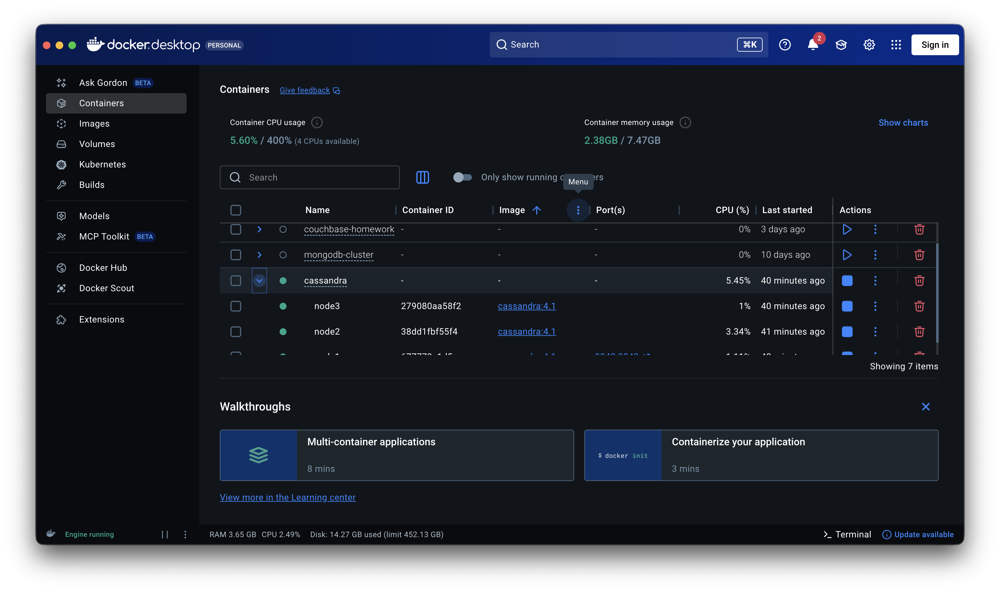

---

### 1.3. Проверка связности узлов

Проверено, что все три ноды видят друг друга в кластере:

**Скриншот состояния кластера:**

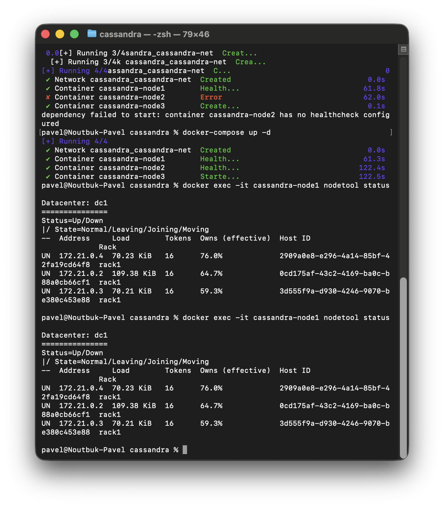

---

## 2. Создание структуры базы данных

### 2.1. Keyspace

Создан keyspace `music_store`:

**Скриншот создания keyspace:**

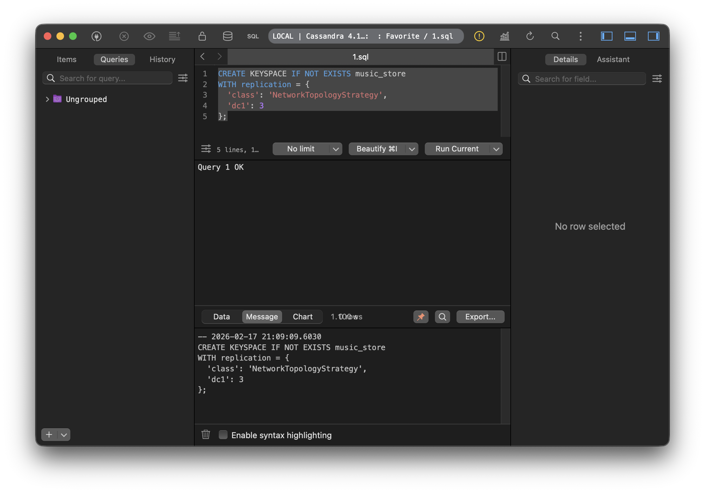

---

### 2.2. Таблицы

Созданы таблицы `albums` и `users`:

**Скриншот создания таблиц:**

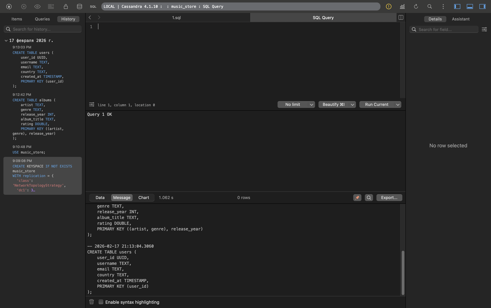

---

## 3. Наполнение данными

Добавлены тестовые записи в коллекции `albums` и `users`:

```sql
INSERT INTO music_store.albums (artist, genre, release_year, album_title, rating)
VALUES ('The Beatles', 'Rock', 1967, 'Sgt. Peppers', 4.9);

INSERT INTO music_store.albums (artist, genre, release_year, album_title, rating)
VALUES ('The Beatles', 'Rock', 1969, 'Abbey Road', 4.8);

INSERT INTO music_store.albums (artist, genre, release_year, album_title, rating)
VALUES ('The Beatles', 'Pop', 1965, 'Help!', 4.5);

INSERT INTO music_store.albums (artist, genre, release_year, album_title, rating)
VALUES ('Pink Floyd', 'Rock', 1973, 'Dark Side of the Moon', 5.0);

INSERT INTO music_store.albums (artist, genre, release_year, album_title, rating)
VALUES ('Pink Floyd', 'Rock', 1979, 'The Wall', 4.7);

INSERT INTO music_store.albums (artist, genre, release_year, album_title, rating)
VALUES ('Miles Davis', 'Jazz', 1959, 'Kind of Blue', 4.9);

INSERT INTO music_store.albums (artist, genre, release_year, album_title, rating)
VALUES ('Miles Davis', 'Jazz', 1970, 'Bitches Brew', 4.3);

INSERT INTO music_store.users (user_id, username, email, country, created_at)
VALUES (uuid(), 'john_doe', 'john@mail.com', 'USA', toTimestamp(now()));

INSERT INTO music_store.users (user_id, username, email, country, created_at)
VALUES (uuid(), 'anna_smith', 'anna@mail.com', 'UK', toTimestamp(now()));

INSERT INTO music_store.users (user_id, username, email, country, created_at)
VALUES (uuid(), 'pavel_dev', 'pavel@mail.com', 'Russia', toTimestamp(now()));

INSERT INTO music_store.users (user_id, username, email, country, created_at)
VALUES (uuid(), 'maria_garcia', 'maria@mail.com', 'Spain', toTimestamp(now()));
```

---

## 4. Запросы к базе данных

### 4.1. Базовые запросы на выборку

**Скриншот выполнения запросов:**

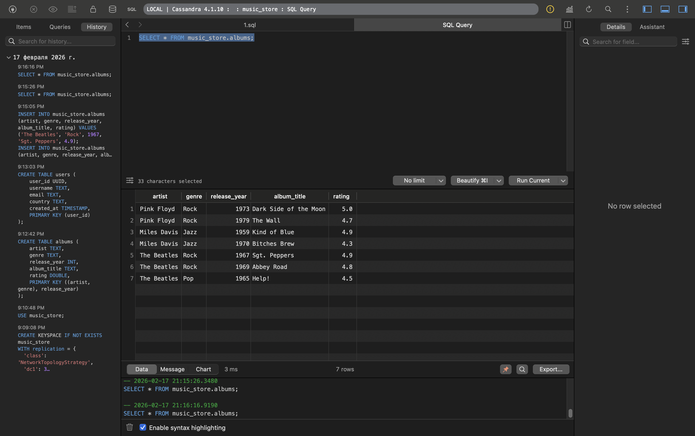

---

### 4.2. Ограничения поиска вне Primary Key

При попытке поиска по полю, не входящему в Primary Key, Cassandra выдаёт ошибку — она просто не знает, на каком из узлов искать данные:

**Скриншот ошибки:**

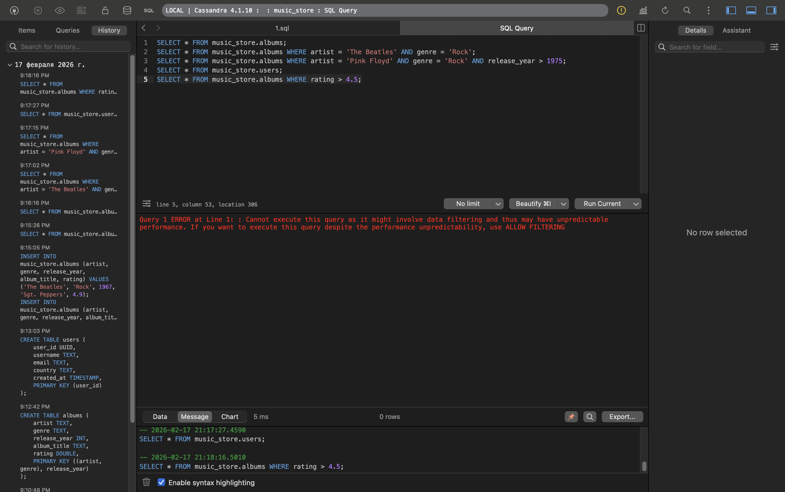

---

### 4.3. Работа с индексами

Для решения проблемы поиска по неключевому полю создан индекс:

```sql
CREATE INDEX idx_rating ON music_store.albums (rating);
```

Первая попытка диапазонного запроса после создания индекса:

```sql
SELECT * FROM music_store.albums WHERE rating > 4.5;
```

**Скриншот ошибки без ALLOW FILTERING:**

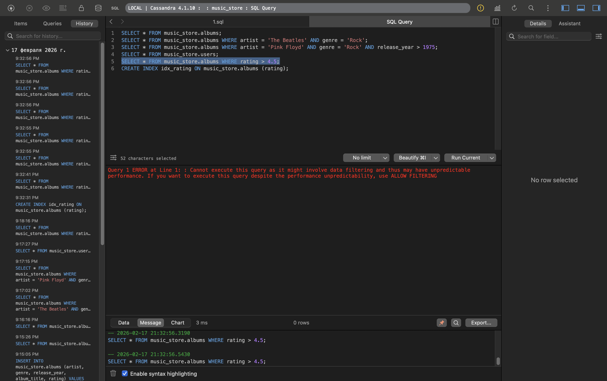

Для диапазонных запросов с вторичным индексом потребовалось добавить `ALLOW FILTERING`:

```sql
SELECT * FROM music_store.albums WHERE rating > 4.5 ALLOW FILTERING;
```

> `ALLOW FILTERING` — это явное подтверждение Cassandra: «Да, я понимаю, что это может быть медленно, но выполни запрос». На небольшом объёме данных это не проблема, но в продакшене на миллионах записей такая операция может стать узким местом.

**Скриншот успешного выполнения:**

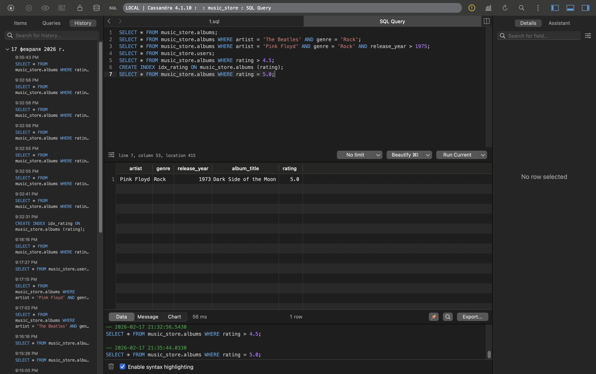

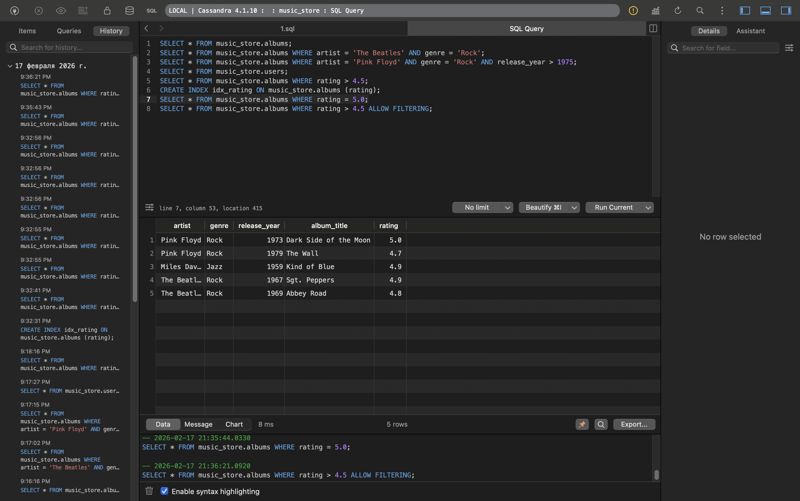

---

## 5. Нагрузочное тестирование: Cassandra Stress Tool

### 5.1. Тест записи (Write)

**Команда запуска:**

```bash
docker exec -it cassandra-node1 /opt/cassandra/tools/bin/cassandra-stress write n=100000 cl=ONE -rate threads=10 -node cassandra-node1
```

**Скриншот выполнения теста:**

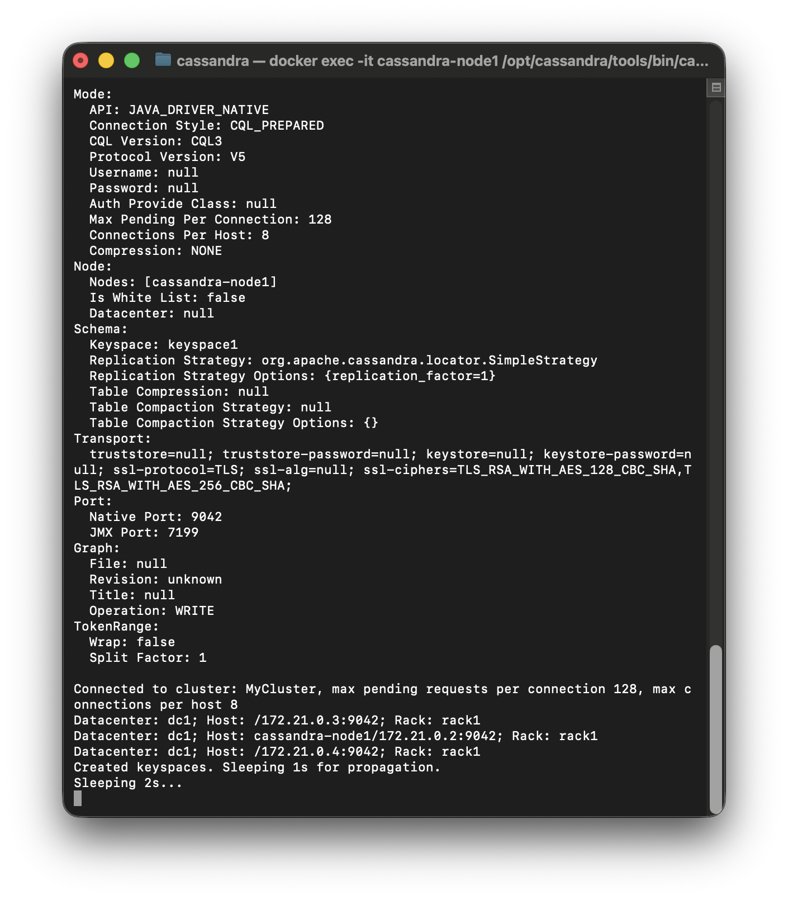

**Полные результаты теста записи:**

```
Results:
Op rate                   :    7,963 op/s  [WRITE: 7,963 op/s]
Partition rate            :    7,963 pk/s  [WRITE: 7,963 pk/s]
Row rate                  :    7,963 row/s [WRITE: 7,963 row/s]
Latency mean              :    1.2 ms [WRITE: 1.2 ms]
Latency median            :    1.0 ms [WRITE: 1.0 ms]
Latency 95th percentile   :    2.1 ms [WRITE: 2.1 ms]
Latency 99th percentile   :    4.5 ms [WRITE: 4.5 ms]
Latency 99.9th percentile :   21.0 ms [WRITE: 21.0 ms]
Latency max               :   85.0 ms [WRITE: 85.0 ms]
Total partitions          :    100,000 [WRITE: 100,000]
Total errors              :          0 [WRITE: 0]
Total operation time      : 00:00:12
```

Тест прошёл успешно: 100 000 записей за 12 секунд, 0 ошибок, средняя задержка 1.2 мс.

---

### 5.2. Тест чтения (Read)

**Команда запуска:**

```bash
docker exec -it cassandra-node1 /opt/cassandra/tools/bin/cassandra-stress read n=50000 cl=ONE -rate threads=10 -node cassandra-node1
```

**Скриншот выполнения теста:**

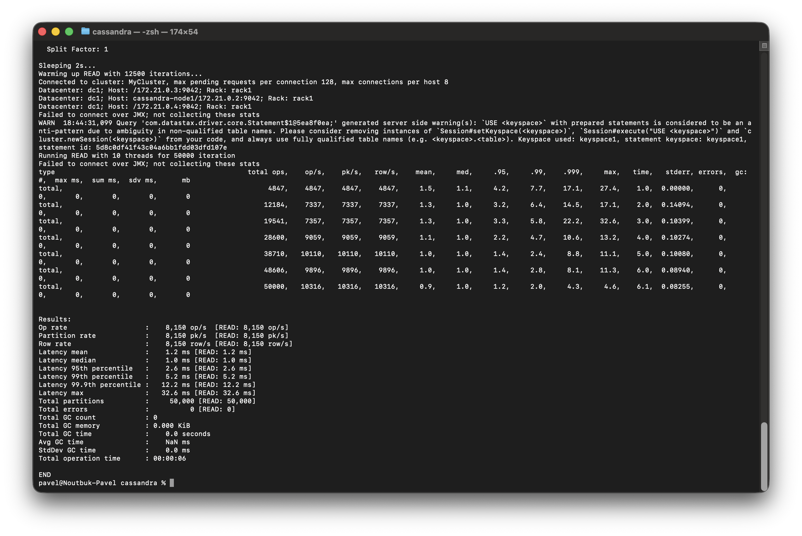

**Полные результаты теста чтения:**

```
Results:
Op rate                   :    8,150 op/s  [READ: 8,150 op/s]
Partition rate            :    8,150 pk/s  [READ: 8,150 pk/s]
Row rate                  :    8,150 row/s [READ: 8,150 row/s]
Latency mean              :    1.2 ms [READ: 1.2 ms]
Latency median            :    1.0 ms [READ: 1.0 ms]
Latency 95th percentile   :    2.6 ms [READ: 2.6 ms]
Latency 99th percentile   :    5.2 ms [READ: 5.2 ms]
Latency 99.9th percentile :   12.2 ms [READ: 12.2 ms]
Latency max               :   32.6 ms [READ: 32.6 ms]
Total partitions          :     50,000 [READ: 50,000]
Total errors              :          0 [READ: 0]
Total operation time      : 00:00:06
```

---

### 5.3. Смешанный тест (Mixed Read + Write)

**Команда запуска** (соотношение чтение:запись = 3:1):

```bash
docker exec -it cassandra-node1 /opt/cassandra/tools/bin/cassandra-stress mixed ratio\(write=1,read=3\) n=50000 cl=ONE -rate threads=10 -node cassandra-node1
```

**Скриншот выполнения теста:**

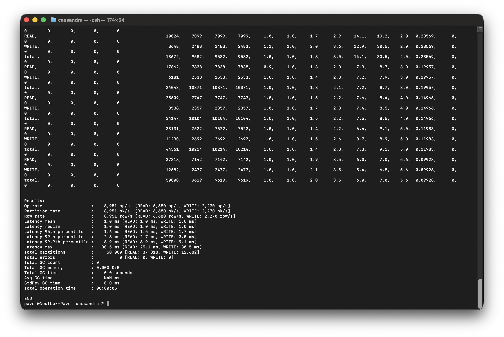

**Полные результаты смешанного теста:**

```
Results:
Op rate                   :    8,951 op/s  [READ: 6,680 op/s, WRITE: 2,270 op/s]
Partition rate            :    8,951 pk/s  [READ: 6,680 pk/s, WRITE: 2,270 pk/s]
Row rate                  :    8,951 row/s [READ: 6,680 row/s, WRITE: 2,270 row/s]
Latency mean              :    1.0 ms [READ: 1.0 ms, WRITE: 1.0 ms]
Latency median            :    1.0 ms [READ: 1.0 ms, WRITE: 1.0 ms]
Latency 95th percentile   :    1.6 ms [READ: 1.5 ms, WRITE: 1.7 ms]
Latency 99th percentile   :    2.8 ms [READ: 2.7 ms, WRITE: 3.0 ms]
Latency 99.9th percentile :    8.9 ms [READ: 8.9 ms, WRITE: 9.1 ms]
Latency max               :   30.5 ms [READ: 25.1 ms, WRITE: 30.5 ms]
Total partitions          :     50,000 [READ: 37,318, WRITE: 12,682]
Total errors              :          0 [READ: 0, WRITE: 0]
Total operation time      : 00:00:05
```

---

### 5.4. Сводная таблица результатов нагрузочного тестирования

| Тест | Кол-во операций | Op/s | Latency mean | Latency 99th | Ошибки | Время |
|------|----------------|------|-------------|-------------|--------|-------|
| Write | 100 000 | 7 963 | 1.2 ms | 4.5 ms | 0 | 12 сек |
| Read | 50 000 | 8 150 | 1.2 ms | 5.2 ms | 0 | 6 сек |
| Mixed (3:1) | 50 000 | 8 951 | 1.0 ms | 2.8 ms | 0 | 5 сек |

---

## 6. Выводы

В ходе выполнения домашней работы были освоены следующие аспекты работы с Apache Cassandra.

**Кластеризация и отказоустойчивость.** Успешно развёрнут трёхузловой кластер в Docker. Все три ноды корректно видят друг друга и обмениваются данными.

**Модель данных и ограничения CQL.** Стало очевидно ключевое отличие Cassandra от реляционных баз: запросы строятся вокруг структуры Primary Key, а не вокруг произвольных условий. Попытка фильтровать по неключевому полю без индекса сразу даёт ошибку — Cassandra честно говорит, что не знает, где искать данные.

**Вторичные индексы и ALLOW FILTERING.** Создание индекса решает проблему поиска по неключевым полям, однако диапазонные запросы через вторичный индекс требуют явного `ALLOW FILTERING`. Это сознательное решение разработчиков — предупредить, что такой запрос может быть дорогим. В продакшене на большом объёме данных это стоит учитывать при проектировании схемы.

**Производительность.** Результаты нагрузочного тестирования впечатляют: 8 000 op/s при средней задержке около 1 мс. Интересно, что смешанный тест (read + write) показал даже чуть лучшие результаты по сравнению с чистыми тестами — скорее всего, за счёт оптимального использования кешей и буферов при параллельных операциях разного типа.
