# Отчет по домашней работе: ClickHouse

## 1. Установка и настройка окружения

### 1.1. Развертывание ClickHouse в Docker

Для работы с ClickHouse был подготовлен `docker-compose.yml`, который поднимает один инстанс сервера с проброшенными портами для HTTP-интерфейса (8123) и нативного клиента (9000). Дополнительно монтируются тома для данных, логов и пользовательской конфигурации.

**docker-compose.yml:**

```yaml
version: '3'
services:
  clickhouse:
    image: clickhouse/clickhouse-server:latest
    container_name: clickhouse-single
    ports:
      - "8123:8123"
      - "9000:9000"
    volumes:
      - ./ch-data:/var/lib/clickhouse
      - ./ch-logs:/var/log/clickhouse-server
      - ./ch-config/users.xml:/etc/clickhouse-server/users.d/users.xml
    ulimits:
      nofile:
        soft: 262144
        hard: 262144
```

Для удобства работы пароль у default-пользователя отключён через отдельный конфигурационный файл.

**ch-config/users.xml:**

```xml
<clickhouse>
    <users>
        <default>
            <password></password>
            <networks>
                <ip>::/0</ip>
            </networks>
            <profile>default</profile>
            <quota>default</quota>
            <access_management>1</access_management>
        </default>
    </users>
</clickhouse>
```

**Запуск контейнера:**

```bash
docker compose up -d
```

**Скриншот запущенного контейнера:**

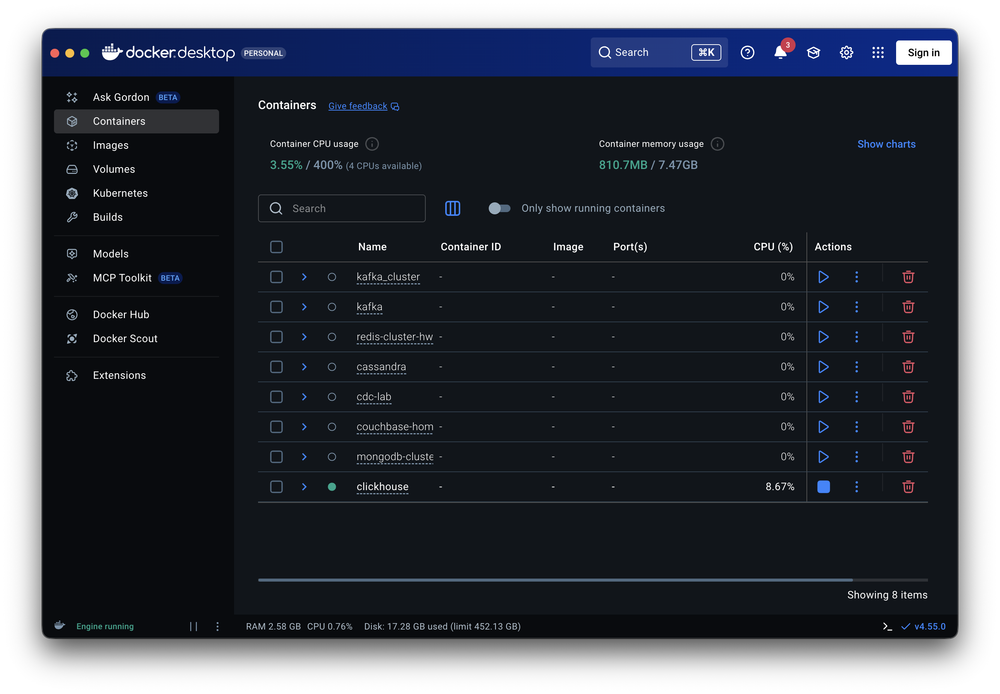

---

### 1.2. Проверка работоспособности

После запуска контейнера доступен веб-клиент ClickHouse Play по адресу `http://localhost:8123/play`.

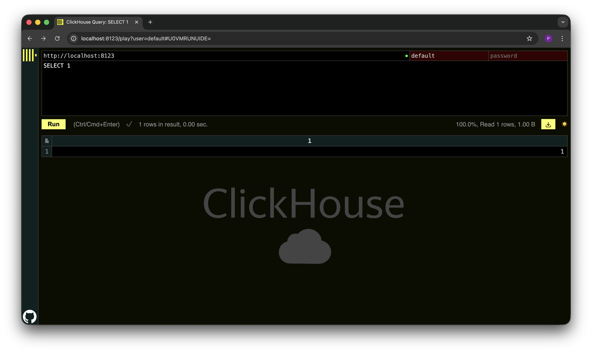

---

## 2. Создание базы данных и загрузка тестового датасета

### 2.1. Создание структуры

Создана база данных и таблица для хранения датасета `hits_v1` — стандартного бенчмарк-датасета ClickHouse с данными о веб-хитах.

```sql
CREATE DATABASE IF NOT EXISTS datasets
```

```sql
CREATE TABLE datasets.hits_v1
(
    WatchID UInt64,
    JavaEnable UInt8,
    Title String,
    GoodEvent Int16,
    EventTime DateTime,
    EventDate Date,
    CounterID UInt32,
    ClientIP UInt32,
    ClientIP6 FixedString(16),
    RegionID UInt32,
    UserID UInt64,
    CounterClass Int8,
    OS UInt8,
    UserAgent UInt8,
    URL String,
    Referer String,
    URLDomain String,
    RefererDomain String,
    Refresh UInt8,
    IsRobot UInt8,
    RefererCategories Array(UInt16),
    URLCategories Array(UInt16),
    URLRegions Array(UInt32),
    RefererRegions Array(UInt32),
    ResolutionWidth UInt16,
    ResolutionHeight UInt16,
    ResolutionDepth UInt8,
    FlashMajor UInt8,
    FlashMinor UInt8,
    FlashMinor2 String,
    NetMajor UInt8,
    NetMinor UInt8,
    UserAgentMajor UInt16,
    UserAgentMinor FixedString(2),
    CookieEnable UInt8,
    JavascriptEnable UInt8,
    IsMobile UInt8,
    MobilePhone UInt8,
    MobilePhoneModel String,
    Params String,
    IPNetworkID UInt32,
    TraficSourceID Int8,
    SearchEngineID UInt16,
    SearchPhrase String,
    AdvEngineID UInt8,
    IsArtifical UInt8,
    WindowClientWidth UInt16,
    WindowClientHeight UInt16,
    ClientTimeZone Int16,
    ClientEventTime DateTime,
    SilverlightVersion1 UInt8,
    SilverlightVersion2 UInt8,
    SilverlightVersion3 UInt32,
    SilverlightVersion4 UInt16,
    PageCharset String,
    CodeVersion UInt32,
    IsLink UInt8,
    IsDownload UInt8,
    IsNotBounce UInt8,
    FUniqID UInt64,
    HID UInt32,
    IsOldCounter UInt8,
    IsEvent UInt8,
    IsParameter UInt8,
    DontCountHits UInt8,
    WithHash UInt8,
    HitColor FixedString(1),
    UTCEventTime DateTime,
    Age UInt8,
    Sex UInt8,
    Income UInt8,
    Interests UInt16,
    Robotness UInt8,
    GeneralInterests Array(UInt16),
    RemoteIP UInt32,
    RemoteIP6 FixedString(16),
    WindowName Int32,
    OpenerName Int32,
    HistoryLength Int16,
    BrowserLanguage FixedString(2),
    BrowserCountry FixedString(2),
    SocialNetwork String,
    SocialAction String,
    HTTPError UInt16,
    SendTiming Int32,
    DNSTiming Int32,
    ConnectTiming Int32,
    ResponseStartTiming Int32,
    ResponseEndTiming Int32,
    FetchTiming Int32,
    RedirectTiming Int32,
    DOMInteractiveTiming Int32,
    DOMContentLoadedTiming Int32,
    DOMCompleteTiming Int32,
    LoadEventStartTiming Int32,
    LoadEventEndTiming Int32,
    NSToDOMContentLoadedTiming Int32,
    FirstPaintTiming Int32,
    RedirectCount Int8,
    SocialSourceNetworkID UInt8,
    SocialSourcePage String,
    ParamPrice Int64,
    ParamOrderID String,
    ParamCurrency FixedString(3),
    ParamCurrencyID UInt16,
    GoalsReached Array(UInt32),
    OpenstatServiceName String,
    OpenstatCampaignID String,
    OpenstatAdID String,
    OpenstatSourceID String,
    UTMSource String,
    UTMMedium String,
    UTMCampaign String,
    UTMContent String,
    UTMTerm String,
    FromTag String,
    HasGCLID UInt8,
    RefererHash UInt64,
    URLHash UInt64,
    CLID UInt32,
    YCLID UInt64,
    ShareService String,
    ShareURL String,
    ShareTitle String,
    ParsedParams Nested(
        Key1 String,
        Key2 String,
        Key3 String,
        Key4 String,
        Key5 String,
        ValueDouble Float64),
    IslandID FixedString(16),
    RequestNum UInt32,
    RequestTry UInt8
)
ENGINE = MergeTree()
PARTITION BY toYYYYMM(EventDate)
ORDER BY (CounterID, EventDate, intHash32(UserID))
SAMPLE BY intHash32(UserID)
```

**Скриншот создания таблицы:**

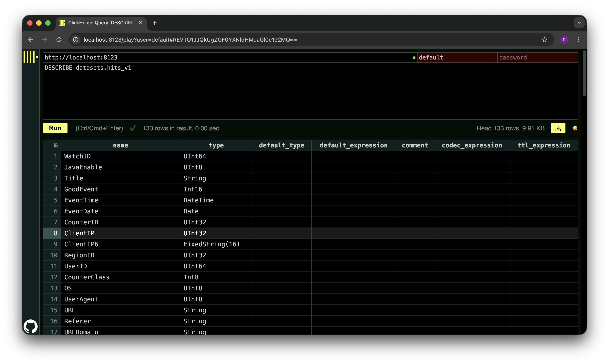

---

### 2.2. Загрузка данных

Первая попытка загрузить данные напрямую с хоста завершилась ошибкой — утилита `unxz` отсутствовала в macOS-окружении:

```bash
curl https://datasets.clickhouse.com/hits/tsv/hits_v1.tsv.xz | unxz | \
  docker exec -i clickhouse-single clickhouse-client \
  --query "INSERT INTO datasets.hits_v1 FORMAT TSV"
```

Ошибка: `zsh: command not found: unxz`.

Решение — установить `curl` внутри контейнера и выполнить загрузку там:

```bash
docker exec -it clickhouse-single bash -c \
  "apt-get update && apt-get install -y curl"
```

```bash
docker exec -it clickhouse-single bash -c \
  "curl https://datasets.clickhouse.com/hits/tsv/hits_v1.tsv.xz | unxz | \
  clickhouse-client --query 'INSERT INTO datasets.hits_v1 FORMAT TSV'"
```

Загрузка завершилась успешно.

**Скриншоты загрузки данных:**

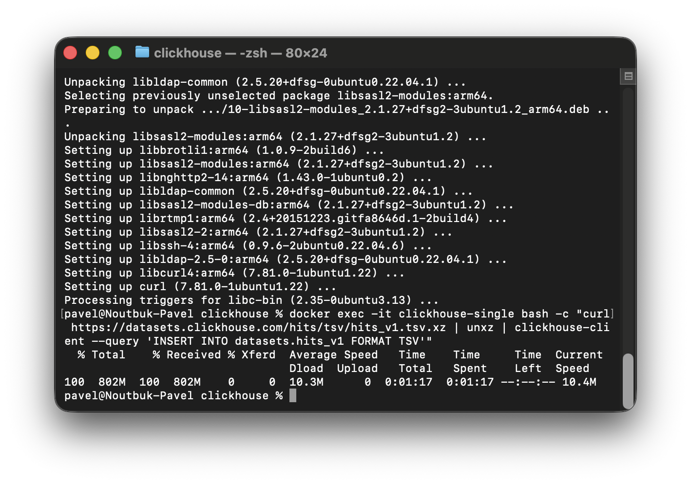

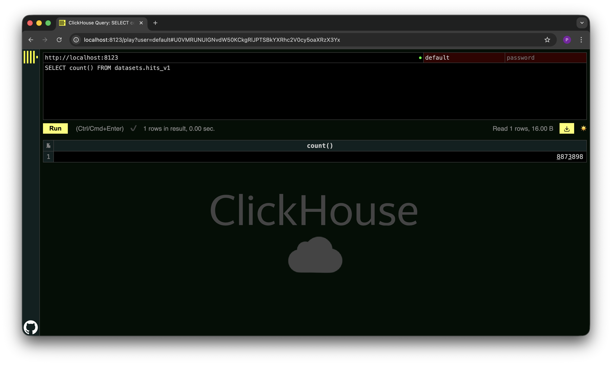

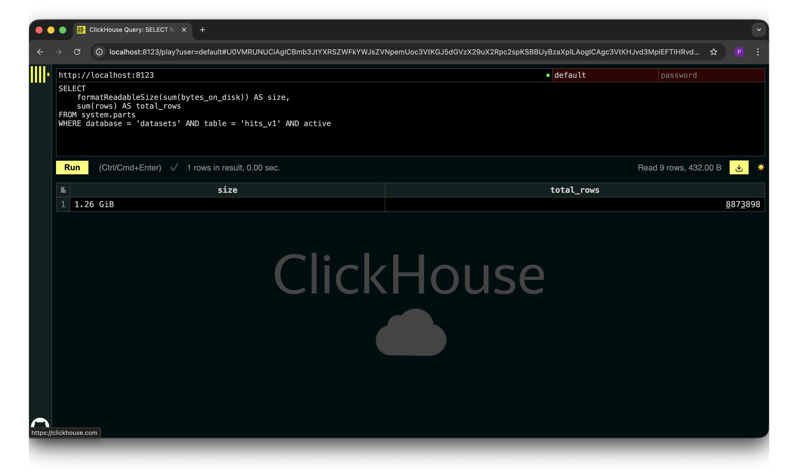

---

### 2.3. Подключение через DBeaver

Встроенный веб-клиент ClickHouse Play оказался не самым удобным для работы с результатами запросов, поэтому дальнейшая работа велась через DBeaver.

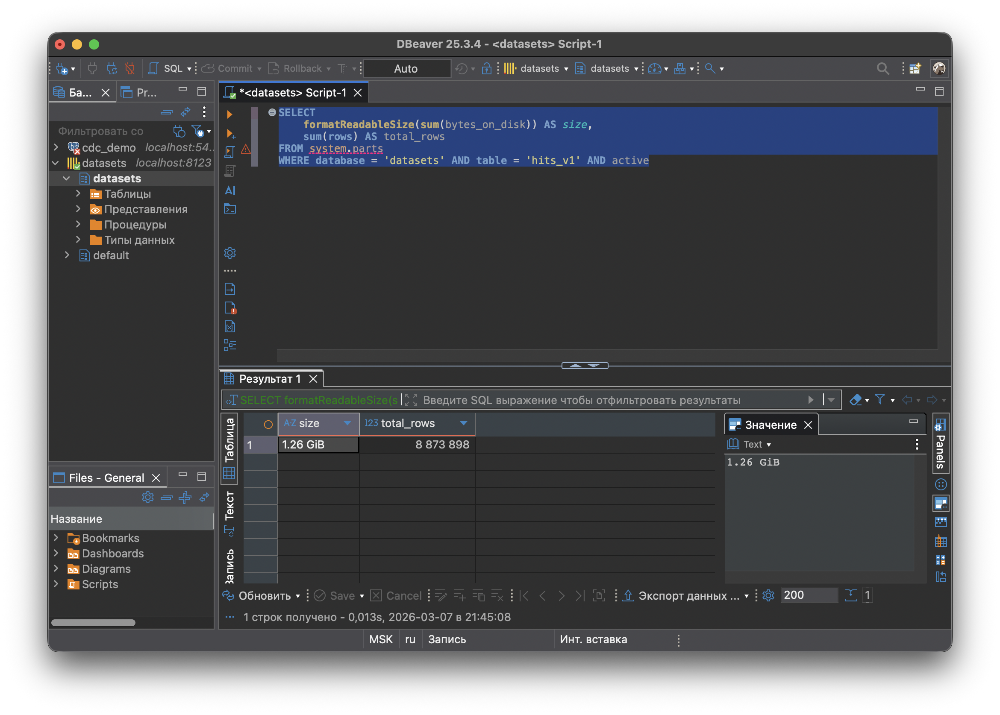

---

## 3. Аналитические запросы с замером скорости

Все запросы выполнены по датасету `hits_v1`, содержащему порядка 9 миллионов строк.

### 3.1. Топ-10 самых посещаемых доменов

```sql
SELECT
    URLDomain,
    count() AS views
FROM datasets.hits_v1
GROUP BY URLDomain
ORDER BY views DESC
LIMIT 10
```

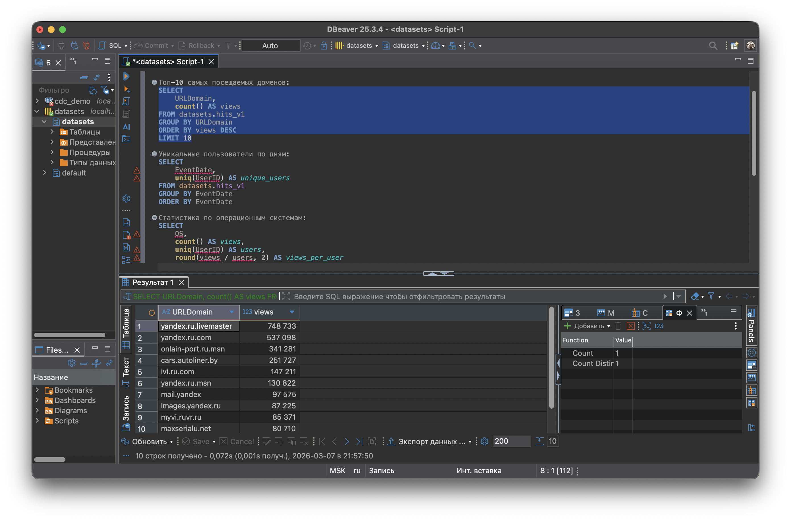

---

### 3.2. Уникальные пользователи по дням

```sql
SELECT
    EventDate,
    uniq(UserID) AS unique_users
FROM datasets.hits_v1
GROUP BY EventDate
ORDER BY EventDate
```

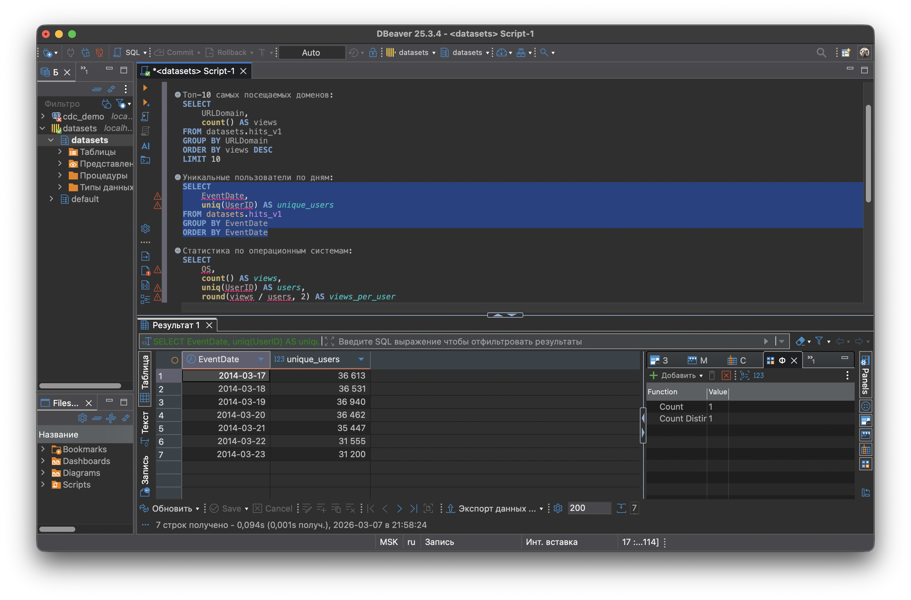

---

### 3.3. Статистика по операционным системам

```sql
SELECT
    OS,
    count() AS views,
    uniq(UserID) AS users,
    round(views / users, 2) AS views_per_user
FROM datasets.hits_v1
GROUP BY OS
ORDER BY views DESC
LIMIT 10
```

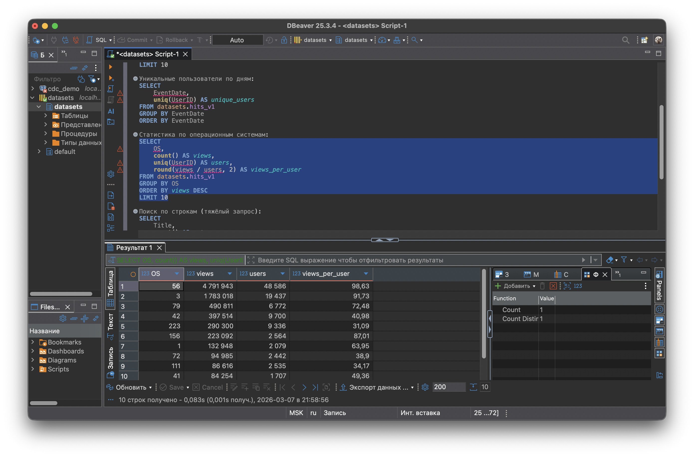

---

### 3.4. Поиск по строкам (тяжёлый запрос)

```sql
SELECT
    Title,
    count() AS cnt
FROM datasets.hits_v1
WHERE Title LIKE '%Google%'
GROUP BY Title
ORDER BY cnt DESC
LIMIT 10
```

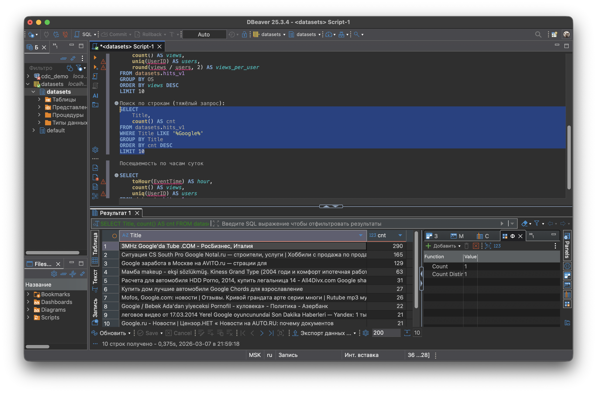

---

### 3.5. Посещаемость по часам суток

```sql
SELECT
    toHour(EventTime) AS hour,
    count() AS views,
    uniq(UserID) AS users
FROM datasets.hits_v1
GROUP BY hour
ORDER BY hour
```

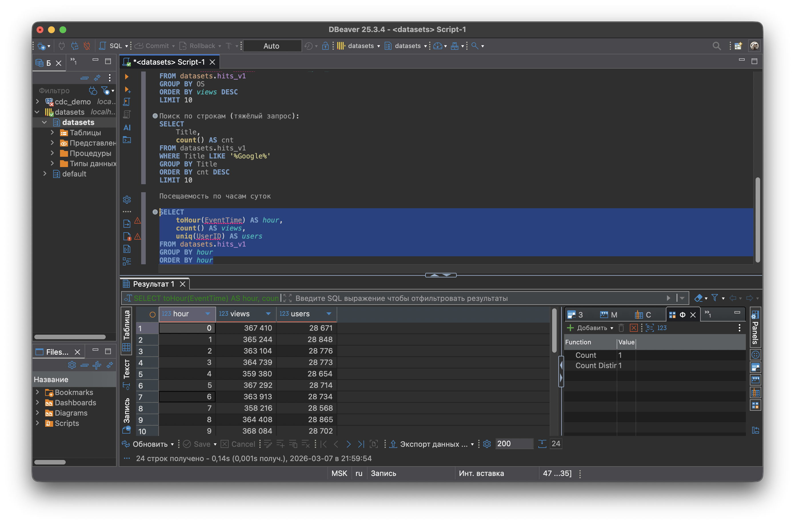

---

### 3.6. Сводная таблица по скорости запросов (hits_v1, ~9 млн строк)

| Запрос | Время |
|--------|-------|
| Топ-10 доменов | 0.072s |
| Уникальные пользователи по дням | 0.094s |
| Статистика по ОС | 0.083s |
| Поиск по строкам (LIKE '%Google%') | 0.375s |
| Посещаемость по часам | 0.14s |

Все запросы по ~9 млн строк выполняются за доли секунды. Поиск по строкам (`LIKE`) ожидаемо самый тяжёлый — 0.375s, поскольку ClickHouse вынужден сканировать всю колонку `Title`. Остальные запросы — агрегации по числовым колонкам — выполняются практически мгновенно.

---

## 4. Дополнительный тестовый датасет: NYC Taxi

### 4.1. Создание таблицы и загрузка данных

Для расширения тестирования был использован датасет поездок такси Нью-Йорка (~3 млн строк).

```sql
CREATE TABLE datasets.trips (
    trip_id             UInt32,
    pickup_datetime     DateTime,
    dropoff_datetime    DateTime,
    pickup_longitude    Nullable(Float64),
    pickup_latitude     Nullable(Float64),
    dropoff_longitude   Nullable(Float64),
    dropoff_latitude    Nullable(Float64),
    passenger_count     UInt8,
    trip_distance       Float32,
    fare_amount         Float32,
    extra               Float32,
    tip_amount          Float32,
    tolls_amount        Float32,
    total_amount        Float32,
    payment_type        Enum('CSH' = 1, 'CRE' = 2, 'NOC' = 3, 'DIS' = 4, 'UNK' = 5),
    pickup_ntaname      LowCardinality(String),
    dropoff_ntaname     LowCardinality(String)
)
ENGINE = MergeTree
PRIMARY KEY (pickup_datetime, dropoff_datetime)
```

```sql
INSERT INTO datasets.trips
SELECT
    trip_id,
    pickup_datetime,
    dropoff_datetime,
    pickup_longitude,
    pickup_latitude,
    dropoff_longitude,
    dropoff_latitude,
    passenger_count,
    trip_distance,
    fare_amount,
    extra,
    tip_amount,
    tolls_amount,
    total_amount,
    payment_type,
    pickup_ntaname,
    dropoff_ntaname
FROM s3(
    'https://datasets-documentation.s3.eu-west-3.amazonaws.com/nyc-taxi/trips_{0..2}.gz',
    'TabSeparatedWithNames'
)
```

**Скриншот загруженных данных:**

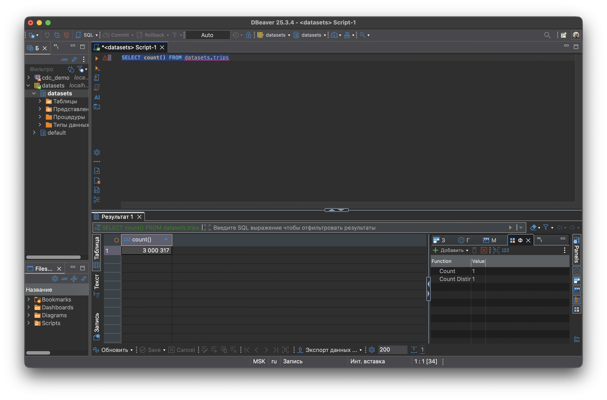

---

### 4.2. Аналитические запросы по NYC Taxi

#### 4.2.1. Средняя стоимость поездки по количеству пассажиров

```sql
SELECT
    passenger_count,
    round(avg(total_amount), 2) AS avg_total,
    round(avg(trip_distance), 2) AS avg_distance,
    count() AS trips
FROM datasets.trips
GROUP BY passenger_count
ORDER BY trips DESC
```

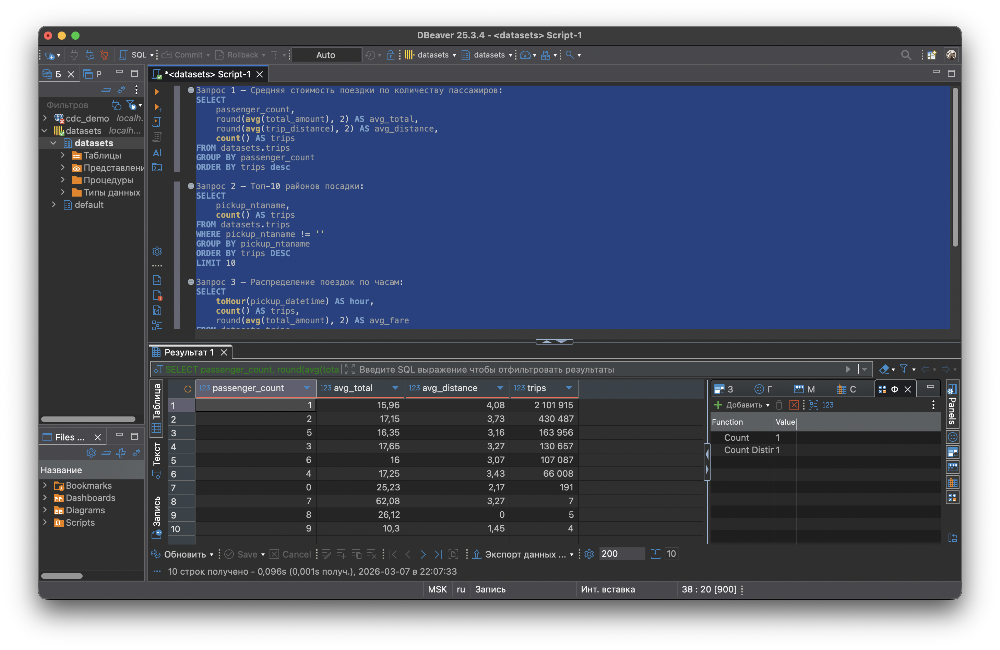

---

#### 4.2.2. Топ-10 районов посадки

```sql
SELECT
    pickup_ntaname,
    count() AS trips
FROM datasets.trips
WHERE pickup_ntaname != ''
GROUP BY pickup_ntaname
ORDER BY trips DESC
LIMIT 10
```

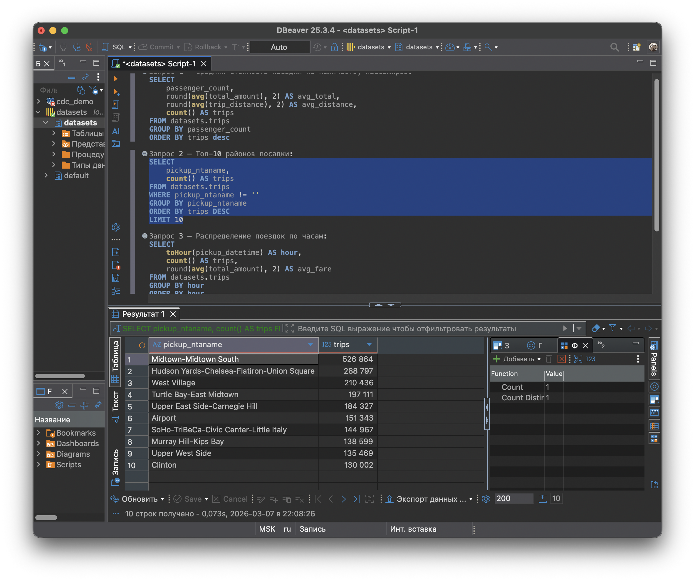

---

#### 4.2.3. Распределение поездок по часам

```sql
SELECT
    toHour(pickup_datetime) AS hour,
    count() AS trips,
    round(avg(total_amount), 2) AS avg_fare
FROM datasets.trips
GROUP BY hour
ORDER BY hour
```

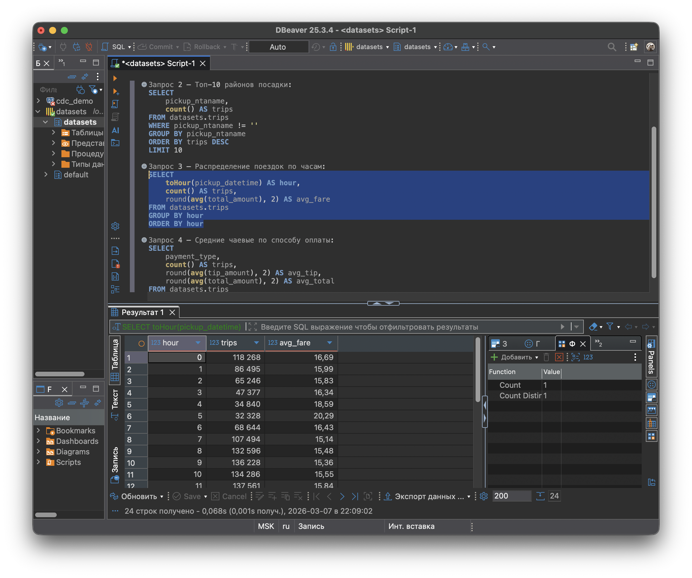

---

#### 4.2.4. Средние чаевые по способу оплаты

```sql
SELECT
    payment_type,
    count() AS trips,
    round(avg(tip_amount), 2) AS avg_tip,
    round(avg(total_amount), 2) AS avg_total
FROM datasets.trips
GROUP BY payment_type
ORDER BY trips DESC
```

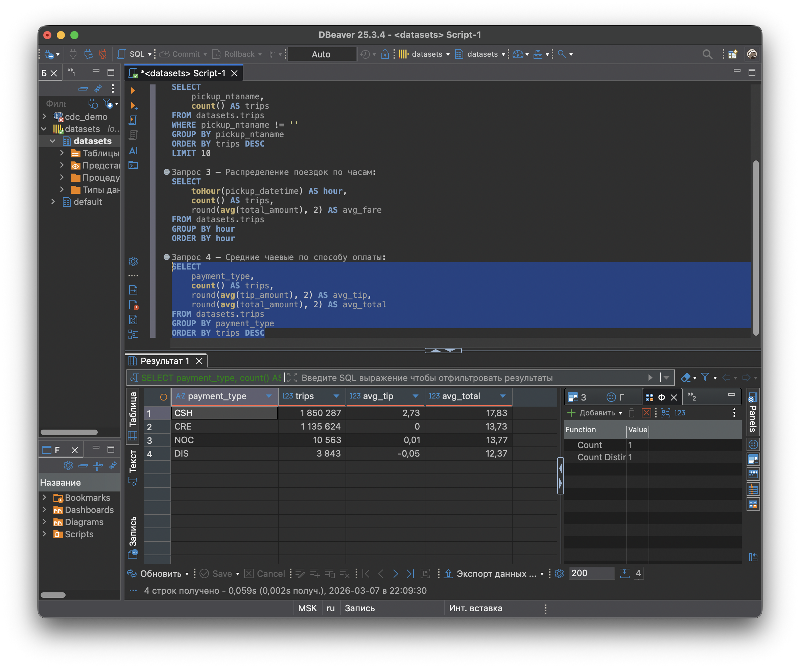

---

### 4.3. Сводная таблица по запросам NYC Taxi (одиночный инстанс, ~3 млн строк)

| # | Запрос | Строк в результате | Время | Данные |
|---|--------|--------------------|-------|--------|
| 1 | Средняя стоимость поездки по кол-ву пассажиров | 10 строк | 0.096s | ~3 млн строк |
| 2 | Топ-10 районов посадки | 10 строк | 0.073s | ~3 млн строк |
| 3 | Распределение поездок по часам | 24 строки | 0.068s | ~3 млн строк |
| 4 | Средние чаевые по способу оплаты | 4 строки | 0.059s | ~3 млн строк |

Все аналитические запросы выполняются за 59–96 мс. ClickHouse обрабатывает десятки миллионов строк в секунду даже на одном инстансе, что подтверждает эффективность колоночного хранения для OLAP-нагрузок.

---

## 5. Развертывание кластера ClickHouse (3 шарда)

### 5.1. Конфигурация кластера

Для тестирования распределённой работы был поднят кластер из трёх нод ClickHouse с ZooKeeper в качестве координатора.

**docker-compose.yml:**

```yaml
version: '3'
services:
  zookeeper:
    image: zookeeper:3.8
    container_name: zookeeper
    ports:
      - "2181:2181"

  clickhouse01:
    image: clickhouse/clickhouse-server:latest
    container_name: clickhouse01
    ports:
      - "8123:8123"
      - "9000:9000"
    volumes:
      - ./config/clickhouse01:/etc/clickhouse-server/users.d
      - ./config/cluster.xml:/etc/clickhouse-server/config.d/cluster.xml
    depends_on:
      - zookeeper

  clickhouse02:
    image: clickhouse/clickhouse-server:latest
    container_name: clickhouse02
    ports:
      - "8124:8123"
      - "9001:9000"
    volumes:
      - ./config/clickhouse02:/etc/clickhouse-server/users.d
      - ./config/cluster.xml:/etc/clickhouse-server/config.d/cluster.xml
    depends_on:
      - zookeeper

  clickhouse03:
    image: clickhouse/clickhouse-server:latest
    container_name: clickhouse03
    ports:
      - "8125:8123"
      - "9002:9000"
    volumes:
      - ./config/clickhouse03:/etc/clickhouse-server/users.d
      - ./config/cluster.xml:/etc/clickhouse-server/config.d/cluster.xml
    depends_on:
      - zookeeper
```

**config/cluster.xml:**

```xml
<clickhouse>
    <remote_servers>
        <my_cluster>
            <shard>
                <replica>
                    <host>clickhouse01</host>
                    <port>9000</port>
                </replica>
            </shard>
            <shard>
                <replica>
                    <host>clickhouse02</host>
                    <port>9000</port>
                </replica>
            </shard>
            <shard>
                <replica>
                    <host>clickhouse03</host>
                    <port>9000</port>
                </replica>
            </shard>
        </my_cluster>
    </remote_servers>
    <zookeeper>
        <node>
            <host>zookeeper</host>
            <port>2181</port>
        </node>
    </zookeeper>
    <macros>
        <cluster>my_cluster</cluster>
    </macros>
</clickhouse>
```

Для каждой ноды создан идентичный `users.xml` с открытым доступом для default-пользователя:

```bash
cd /nosql/clickhouse-cluster

cat > config/clickhouse01/users.xml << 'EOF'
<clickhouse>
    <users>
        <default>
            <password></password>
            <networks><ip>::/0</ip></networks>
            <profile>default</profile>
            <quota>default</quota>
            <access_management>1</access_management>
        </default>
    </users>
</clickhouse>
EOF

cp config/clickhouse01/users.xml config/clickhouse02/users.xml
cp config/clickhouse01/users.xml config/clickhouse03/users.xml
```

**Скриншот запуска кластера:**

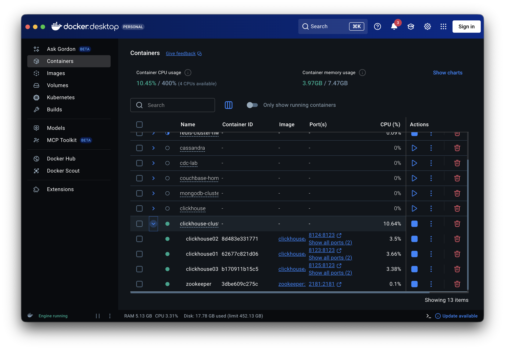

**Проверка кластера:**

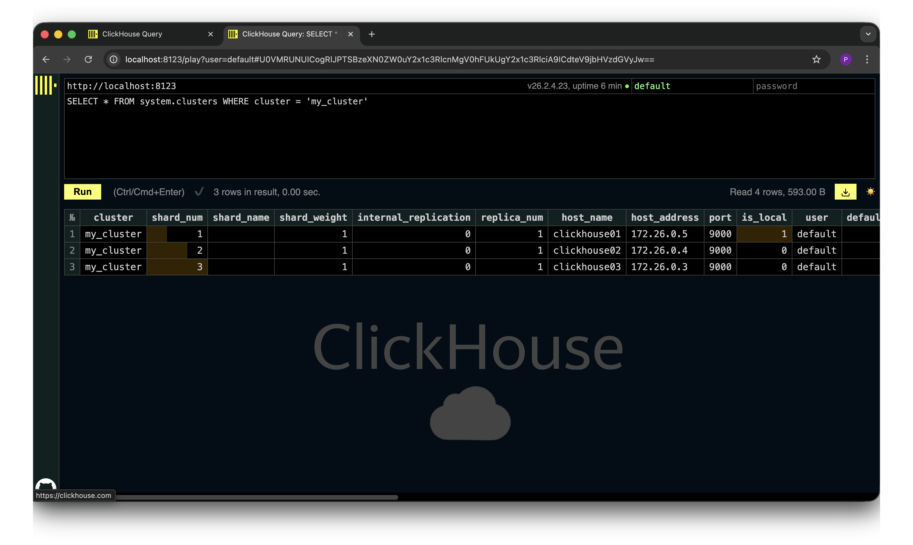

---

### 5.2. Создание распределённой таблицы и загрузка данных

Создана база данных на всех нодах кластера:

```sql
CREATE DATABASE datasets ON CLUSTER my_cluster
```

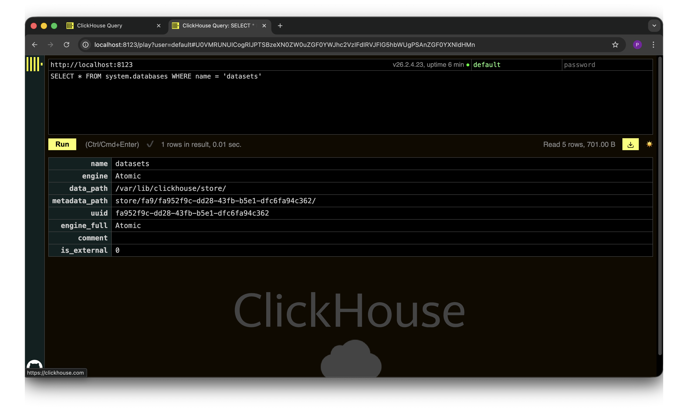

Создана локальная таблица на каждом шарде:

```sql
CREATE TABLE datasets.trips_local ON CLUSTER my_cluster
(
    trip_id             UInt32,
    pickup_datetime     DateTime,
    dropoff_datetime    DateTime,
    pickup_longitude    Nullable(Float64),
    pickup_latitude     Nullable(Float64),
    dropoff_longitude   Nullable(Float64),
    dropoff_latitude    Nullable(Float64),
    passenger_count     UInt8,
    trip_distance       Float32,
    fare_amount         Float32,
    extra               Float32,
    tip_amount          Float32,
    tolls_amount        Float32,
    total_amount        Float32,
    payment_type        Enum('CSH' = 1, 'CRE' = 2, 'NOC' = 3, 'DIS' = 4, 'UNK' = 5),
    pickup_ntaname      LowCardinality(String),
    dropoff_ntaname     LowCardinality(String)
)
ENGINE = MergeTree
PRIMARY KEY (pickup_datetime, dropoff_datetime)
```

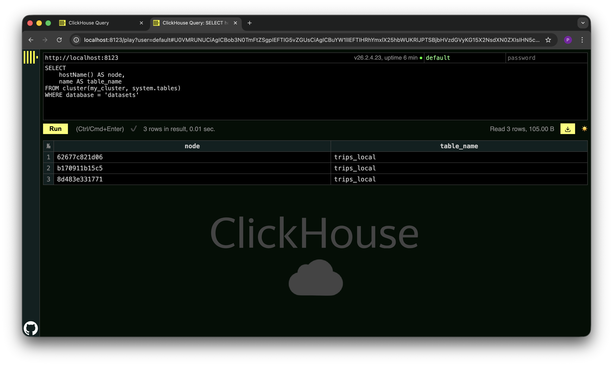

Создана распределённая таблица-обёртка:

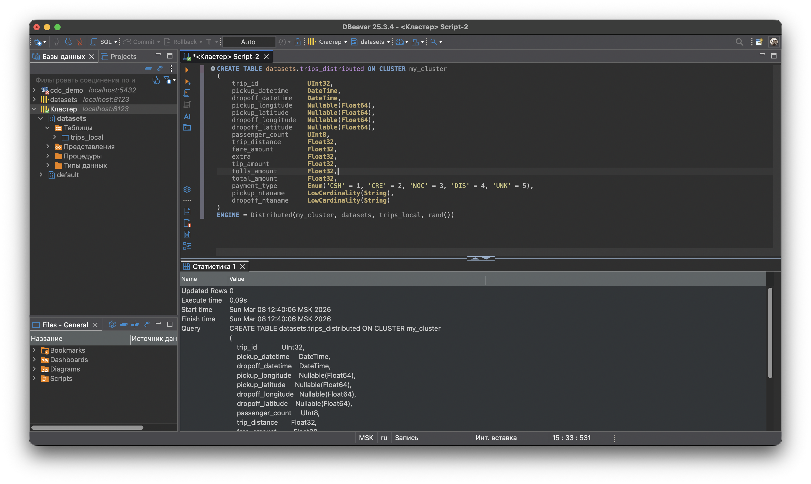

Загрузка данных:

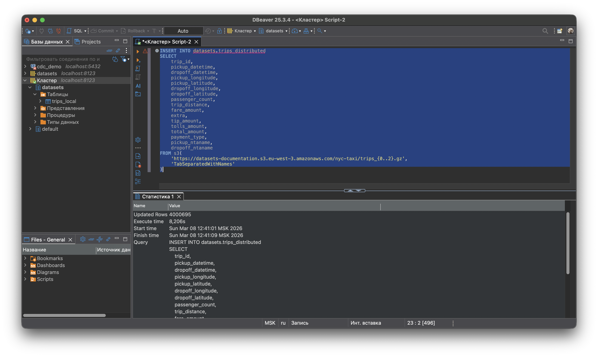

**Проверка распределения данных по шардам:**

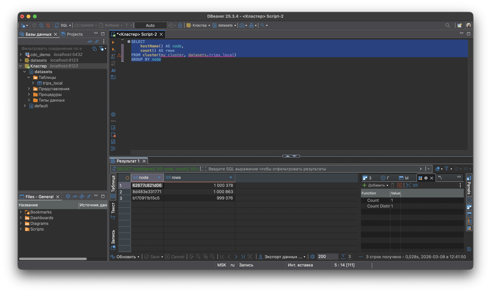

Данные распределились примерно равномерно: нода 1 — 1 000 378 строк, нода 2 — 1 000 863 строки, нода 3 — 999 076 строк.

---

## 6. Сравнение производительности: одиночный инстанс vs кластер

Те же четыре запроса по NYC Taxi были выполнены через распределённую таблицу `trips_distributed`.

### 6.1. Запрос 1 — Средняя стоимость по количеству пассажиров

```sql
SELECT
    passenger_count,
    round(avg(total_amount), 2) AS avg_total,
    round(avg(trip_distance), 2) AS avg_distance,
    count() AS trips
FROM datasets.trips_distributed
GROUP BY passenger_count
ORDER BY trips DESC
```

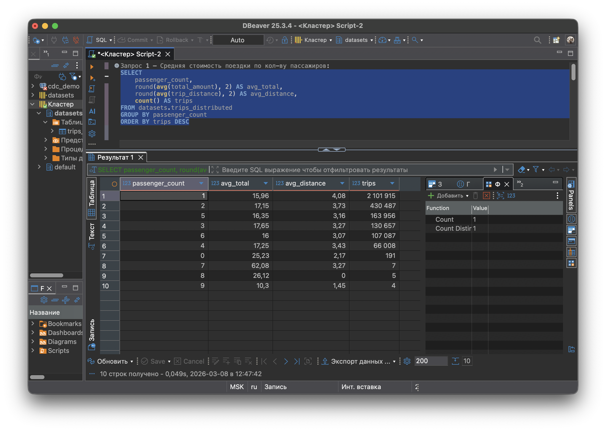

---

### 6.2. Запрос 2 — Топ-10 районов посадки

```sql
SELECT
    pickup_ntaname,
    count() AS trips
FROM datasets.trips_distributed
WHERE pickup_ntaname != ''
GROUP BY pickup_ntaname
ORDER BY trips DESC
LIMIT 10
```

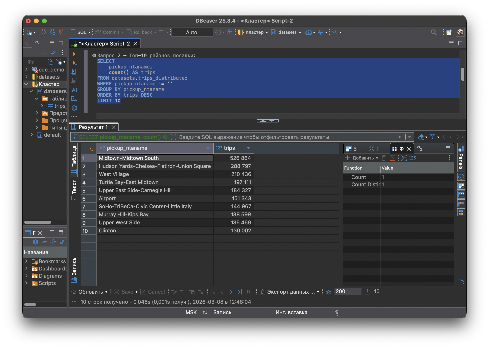

---

### 6.3. Запрос 3 — Распределение поездок по часам

```sql
SELECT
    toHour(pickup_datetime) AS hour,
    count() AS trips,
    round(avg(total_amount), 2) AS avg_fare
FROM datasets.trips_distributed
GROUP BY hour
ORDER BY hour
```

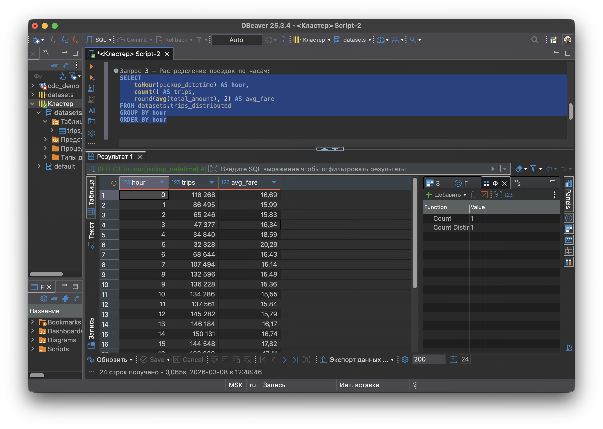

---

### 6.4. Запрос 4 — Средние чаевые по способу оплаты

```sql
SELECT
    payment_type,
    count() AS trips,
    round(avg(tip_amount), 2) AS avg_tip,
    round(avg(total_amount), 2) AS avg_total
FROM datasets.trips_distributed
GROUP BY payment_type
ORDER BY trips DESC
```

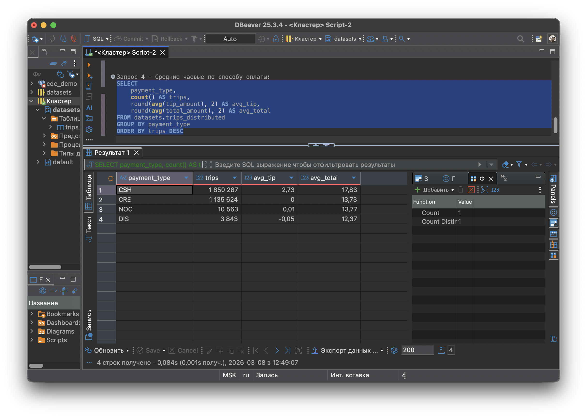

---

### 6.5. Сравнительная таблица: одиночный инстанс vs кластер (3 шарда)

| # | Запрос | Single (s) | Cluster (s) | Разница |
|---|--------|-----------|-------------|---------|
| 1 | Средняя стоимость по пассажирам | 0.096 | 0.049 | **~2x быстрее** |
| 2 | Топ-10 районов посадки | 0.073 | 0.046 | **~1.6x быстрее** |
| 3 | Распределение по часам | 0.068 | 0.065 | ~одинаково |
| 4 | Чаевые по способу оплаты | 0.059 | 0.084 | медленнее |

---

### 6.6. Анализ результатов

Запросы 1 и 2 показали ускорение — каждый шард обрабатывает только свою треть данных параллельно, а координатор собирает результат. Запросы 3 и 4 не показали выигрыша или даже замедлились. На объёме 3 млн строк накладные расходы на координацию между нодами (сетевое взаимодействие, сбор промежуточных результатов) сопоставимы с самим временем выполнения запроса.

Это типичная картина: кластер даёт заметный выигрыш на больших объёмах данных (сотни миллионов строк), а на малых — overhead координации может нивелировать преимущество параллельности.

---

## 7. Выводы

### 7.1. Производительность ClickHouse

ClickHouse продемонстрировал высокую скорость обработки аналитических запросов. Даже на одиночном инстансе запросы по ~9 млн строк выполняются за доли секунды (72–375 мс), а по ~3 млн строк — за 59–96 мс. Колоночное хранение данных и векторизованное выполнение запросов обеспечивают обработку десятков миллионов строк в секунду.

### 7.2. Работа в кластерном режиме

Кластер из трёх шардов показал ускорение до 2x на агрегационных запросах по сравнению с одиночным инстансом. При этом на малых объёмах данных накладные расходы на координацию между нодами могут нивелировать выигрыш от параллельной обработки. Кластерная архитектура ClickHouse наиболее эффективна при работе с большими объёмами данных — от сотен миллионов строк.

### 7.3. Особенности и наблюдения

Самым тяжёлым запросом оказался поиск по строковому полю с `LIKE '%Google%'` (0.375s) — это ожидаемо, поскольку требуется полное сканирование колонки. Агрегации по числовым полям выполняются значительно быстрее за счёт компактного хранения и эффективного сжатия колоночных данных.

ClickHouse показал себя как мощный инструмент для OLAP-аналитики: простота развертывания через Docker, удобный SQL-интерфейс, встроенная поддержка кластеризации и загрузки данных из внешних источников (S3, HTTP).
