# Отчет по домашней работе: Redis

## 1. Установка и настройка окружения

### 1.1. Архитектура стенда

Развёрнут Redis Cluster из 6 нод (3 master + 3 replica) в Docker-контейнерах с подключённым RedisInsight для визуального мониторинга.

**docker-compose.yml:**

```yaml
version: '3.8'

x-redis-common: &redis-common
  image: redis:7.2
  restart: always
  volumes:
    - ./redis.conf:/etc/redis/redis.conf
  command: redis-server /etc/redis/redis.conf
  networks:
    - redis-cluster-net

services:

  redis-node-1:
    <<: *redis-common
    container_name: redis-node-1
    ports:
      - "7001:6379"
    volumes:
      - ./redis.conf:/etc/redis/redis.conf
      - ./data/node1:/data

  redis-node-2:
    <<: *redis-common
    container_name: redis-node-2
    ports:
      - "7002:6379"
    volumes:
      - ./redis.conf:/etc/redis/redis.conf
      - ./data/node2:/data

  redis-node-3:
    <<: *redis-common
    container_name: redis-node-3
    ports:
      - "7003:6379"
    volumes:
      - ./redis.conf:/etc/redis/redis.conf
      - ./data/node3:/data

  redis-node-4:
    <<: *redis-common
    container_name: redis-node-4
    ports:
      - "7004:6379"
    volumes:
      - ./redis.conf:/etc/redis/redis.conf
      - ./data/node4:/data

  redis-node-5:
    <<: *redis-common
    container_name: redis-node-5
    ports:
      - "7005:6379"
    volumes:
      - ./redis.conf:/etc/redis/redis.conf
      - ./data/node5:/data

  redis-node-6:
    <<: *redis-common
    container_name: redis-node-6
    ports:
      - "7006:6379"
    volumes:
      - ./redis.conf:/etc/redis/redis.conf
      - ./data/node6:/data

  redisinsight:
    image: redis/redisinsight:latest
    container_name: redisinsight
    ports:
      - "5540:5540"
    networks:
      - redis-cluster-net
    restart: always

networks:
  redis-cluster-net:
    driver: bridge
```

### 1.2. Конфигурация Redis (redis.conf)

```ini
# Кластер
cluster-enabled yes
cluster-config-file nodes.conf
cluster-node-timeout 5000

# Persistence (AOF)
appendonly yes
appendfsync everysec
save ""

# Память
maxmemory 512mb
maxmemory-policy noeviction

# Репликация
repl-diskless-sync yes
repl-diskless-sync-delay 0

# Логирование
loglevel notice

# Разрешаем подключения отовсюду (для Docker)
bind 0.0.0.0
protected-mode no
```

### 1.3. Запуск и инициализация кластера

**Запуск контейнеров:**
```bash
docker compose up -d
```

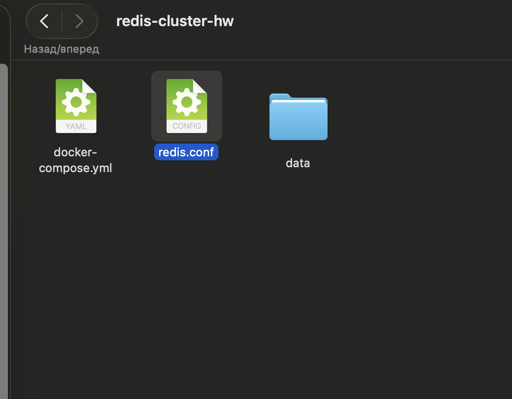

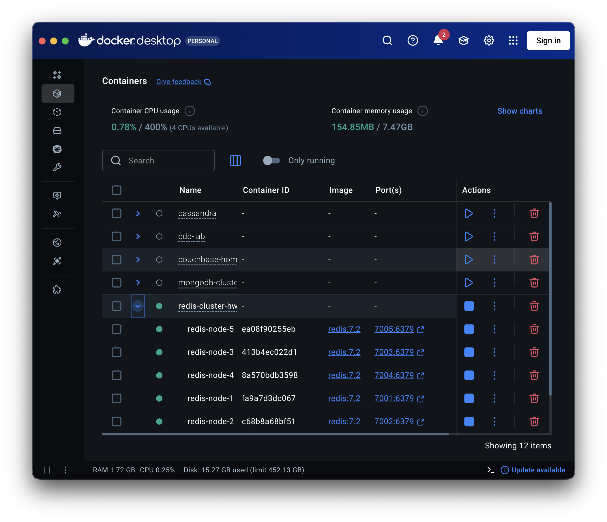

**Инициализация кластера:**
```bash
docker exec -it redis-node-1 redis-cli --cluster create \
  redis-node-1:6379 \
  redis-node-2:6379 \
  redis-node-3:6379 \
  redis-node-4:6379 \
  redis-node-5:6379 \
  redis-node-6:6379 \
  --cluster-replicas 1
```

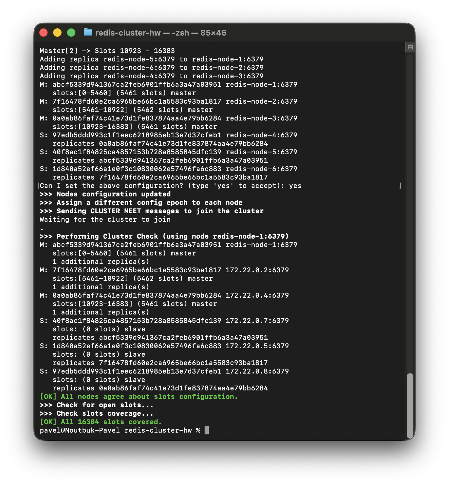

Кластер успешно создан — 3 мастера с распределёнными слотами и 3 реплики.

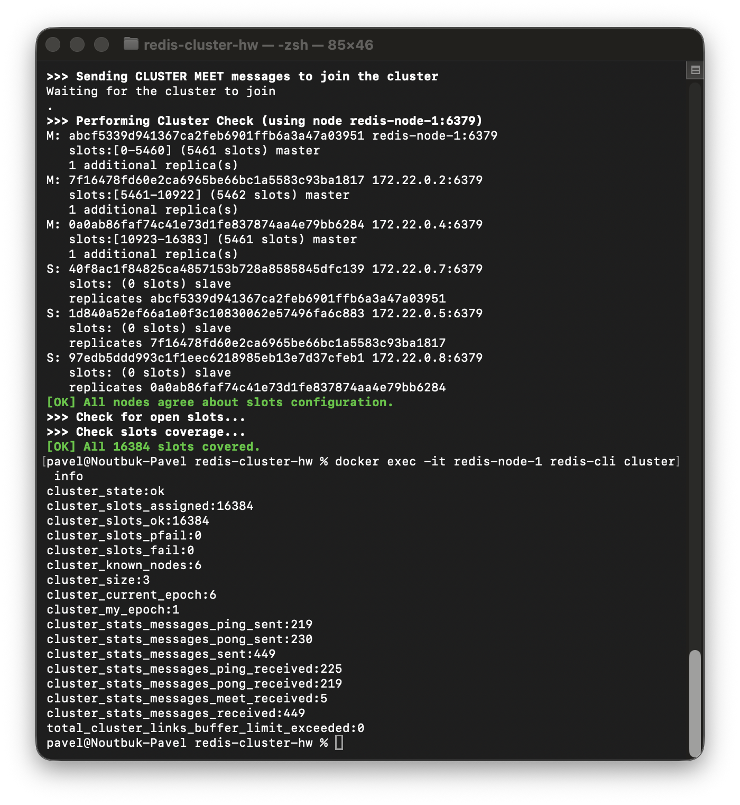

### 1.4. Подключение через RedisInsight

Установлен RedisInsight, подключение к кластеру выполнено через UI.

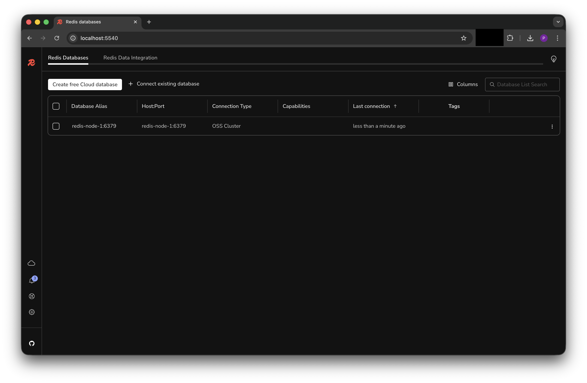

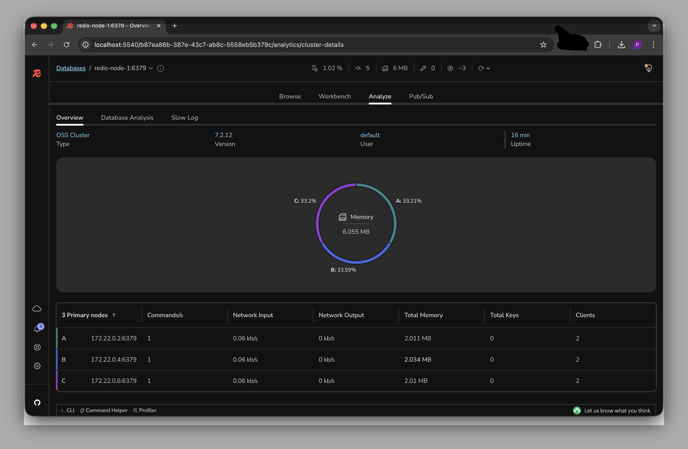

**Итог этапа:** Redis Cluster 3 master + 3 replica запущен в Docker, RedisInsight подключён и отображает кластер. Конфигурация включает AOF-персистентность, `noeviction`-политику и `cluster-node-timeout 5000`.

---

## 2. Подготовка тестовых данных

### 2.1. Скрипт генерации JSON (~20 МБ)

Для наполнения Redis тестовыми данными написан Python-скрипт, генерирующий ~12 000 пользователей со вложенными заказами, предпочтениями и метаданными.

```python
import json
import os
import random
import string
import time
from datetime import datetime, timedelta

def random_string(length):
    return ''.join(random.choices(string.ascii_letters + string.digits, k=length))

def random_date():
    start = datetime(2022, 1, 1)
    delta = timedelta(days=random.randint(0, 1000))
    return (start + delta).isoformat()

def generate_user(user_id):
    return {
        "id": user_id,
        "username": random_string(12),
        "email": f"{random_string(8)}@{random_string(5)}.com",
        "first_name": random_string(8),
        "last_name": random_string(10),
        "age": random.randint(18, 75),
        "country": random.choice(["US", "RU", "DE", "FR", "CN", "BR", "IN", "GB"]),
        "city": random_string(10),
        "address": random_string(30),
        "phone": f"+{random.randint(10000000000, 99999999999)}",
        "balance": round(random.uniform(0, 10000), 2),
        "is_active": random.choice([True, False]),
        "created_at": random_date(),
        "last_login": random_date(),
        "tags": [random_string(5) for _ in range(random.randint(2, 6))],
        "preferences": {
            "language": random.choice(["en", "ru", "de", "fr"]),
            "theme": random.choice(["dark", "light"]),
            "notifications": random.choice([True, False]),
            "newsletter": random.choice([True, False]),
        },
        "orders": [
            {
                "order_id": f"ORD-{random_string(8)}",
                "product": random_string(15),
                "category": random.choice(["electronics", "clothing", "food", "sports", "books"]),
                "amount": round(random.uniform(5, 500), 2),
                "quantity": random.randint(1, 10),
                "status": random.choice(["pending", "shipped", "delivered", "cancelled"]),
                "created_at": random_date(),
                "description": random_string(50),
            }
            for _ in range(random.randint(3, 8))
        ],
        "notes": random_string(200),
    }

print("Generating data...")
start = time.time()

users = [generate_user(i) for i in range(1, 12000)]
data = {"users": users, "generated_at": datetime.now().isoformat(), "total": len(users)}

with open("test_data.json", "w") as f:
    json.dump(data, f)

size_mb = os.path.getsize("test_data.json") / (1024 * 1024)
print(f"Done in {time.time() - start:.2f}s")
print(f"File size: {size_mb:.2f} MB")
print(f"Users generated: {len(users)}")
```

### 2.2. Результат генерации

Сгенерирован файл `test_data.json` размером ~20 МБ, содержащий 12 000 пользователей.

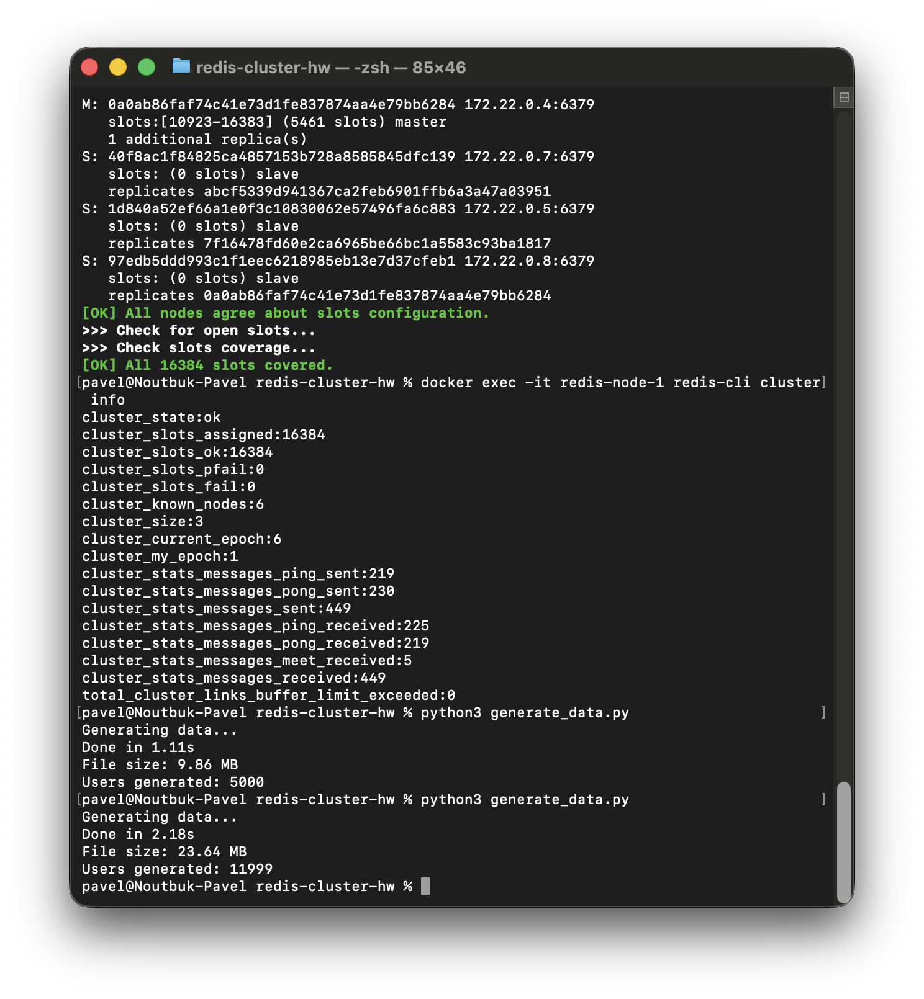

---

## 3. Сохранение JSON в разные структуры данных

### 3.1. Стратегия хранения

Один и тот же набор данных сохранён в Redis четырьмя способами:

| Структура | Ключ | Суть |
|-----------|------|------|
| String | `users:string` | Весь JSON одной строкой |
| Hash | `users:hash` | Каждый пользователь — отдельное поле |
| ZSet | `users:zset` | Пользователи с сортировкой по balance |
| List | `users:list` | Пользователи как элементы списка |

### 3.2. Скрипт загрузки данных

```python
import json
import time
import os
from redis.cluster import RedisCluster, ClusterNode

def address_remap(addr):
    host, port = addr
    mapping = {
        "172.22.0.6": ("localhost", 7001),
        "172.22.0.2": ("localhost", 7002),
        "172.22.0.4": ("localhost", 7003),
        "172.22.0.8": ("localhost", 7004),
        "172.22.0.7": ("localhost", 7005),
        "172.22.0.5": ("localhost", 7006),
    }
    return mapping.get(host, (host, port))

startup_nodes = [ClusterNode("localhost", 7001)]

rc = RedisCluster(
    startup_nodes=startup_nodes,
    decode_responses=True,
    skip_full_coverage_check=True,
    address_remap=address_remap
)

print("Connected to Redis Cluster:", rc.ping())

with open("test_data.json", "r") as f:
    data = json.load(f)

users = data["users"]
print(f"Loaded {len(users)} users from JSON\n")

results = {}

# 1. STRING — весь JSON одной строкой
print("Writing STRING...")
json_string = json.dumps(data)

start = time.time()
rc.set("users:string", json_string)
write_time = time.time() - start

start = time.time()
rc.get("users:string")
read_time = time.time() - start

results["string"] = {"write": write_time, "read": read_time}
print(f"  Write: {write_time:.4f}s | Read: {read_time:.4f}s")

# 2. HASH — каждый юзер отдельным полем
print("Writing HASH...")
rc.delete("users:hash")

pipeline = rc.pipeline(transaction=False)
for user in users:
    pipeline.hset("users:hash", f"user:{user['id']}", json.dumps(user))

start = time.time()
pipeline.execute()
write_time = time.time() - start

start = time.time()
rc.hgetall("users:hash")
read_time = time.time() - start

results["hash"] = {"write": write_time, "read": read_time}
print(f"  Write: {write_time:.4f}s | Read: {read_time:.4f}s")

# 3. ZSET — сортировка по balance
print("Writing ZSET...")
rc.delete("users:zset")

pipeline = rc.pipeline(transaction=False)
for user in users:
    pipeline.zadd("users:zset", {json.dumps({"id": user["id"], "username": user["username"]}): user["balance"]})

start = time.time()
pipeline.execute()
write_time = time.time() - start

start = time.time()
rc.zrange("users:zset", 0, -1, withscores=True)
read_time = time.time() - start

results["zset"] = {"write": write_time, "read": read_time}
print(f"  Write: {write_time:.4f}s | Read: {read_time:.4f}s")

# 4. LIST — каждый юзер как элемент списка
print("Writing LIST...")
rc.delete("users:list")

pipeline = rc.pipeline(transaction=False)
for user in users:
    pipeline.rpush("users:list", json.dumps(user))

start = time.time()
pipeline.execute()
write_time = time.time() - start

start = time.time()
rc.lrange("users:list", 0, -1)
read_time = time.time() - start

results["list"] = {"write": write_time, "read": read_time}
print(f"  Write: {write_time:.4f}s | Read: {read_time:.4f}s")

# Итоговая таблица
print("\n" + "="*50)
print(f"{'Structure':<12} {'Write (s)':<15} {'Read (s)':<15}")
print("="*50)
for name, times in results.items():
    print(f"{name:<12} {times['write']:<15.4f} {times['read']:<15.4f}")
print("="*50)
```

### 3.3. Результаты загрузки и чтения

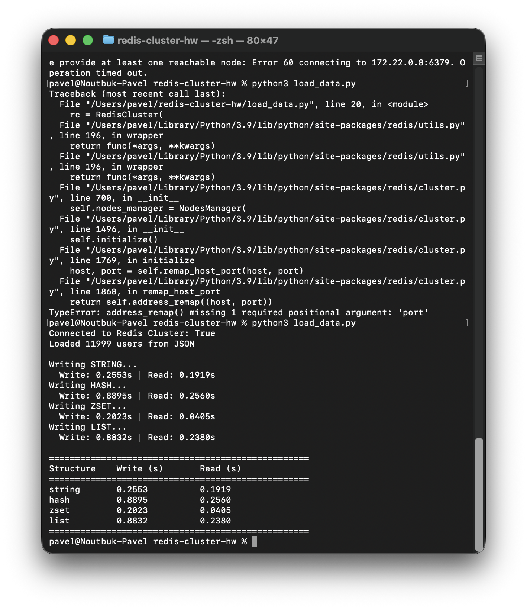

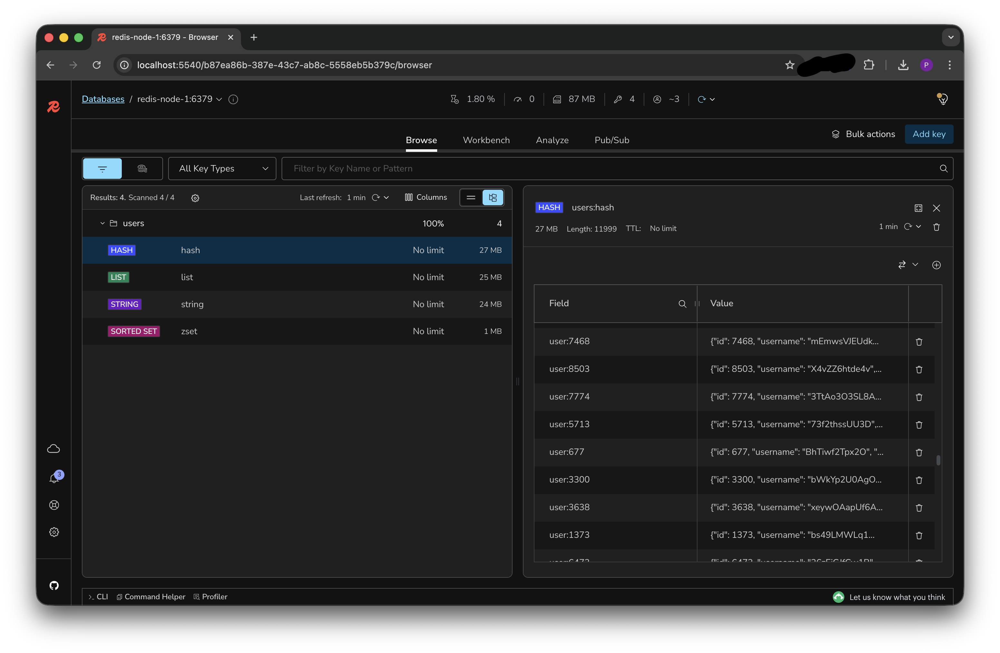

| Структура | Write (s) | Read (s) | Комментарий |
|-----------|-----------|----------|-------------|
| String | 0.2553 | 0.1919 | Один большой объект — один round-trip |
| Hash | 0.8895 | 0.2560 | 12 000 полей через pipeline — много операций |
| ZSet | 0.2023 | 0.0405 | Хранит только id + username, данных меньше |
| List | 0.8832 | 0.2380 | Аналогично Hash — 12 000 элементов |

### 3.4. Анализ результатов

**ZSet** оказался самым быстрым на чтение (0.04 с), поскольку хранит только часть данных (id + username + score). Это не полноценное сравнение «на равных», но наглядно показывает, как выбор структуры и объёма данных влияет на производительность.

**Hash и List** сопоставимы по скорости — оба работают с 12 000 элементами через pipeline. Основной bottleneck — количество операций, а не размер данных.

**String** медленнее ZSet на запись, но быстрее Hash/List — один большой объект вместо тысячи мелких.

### 3.5. Справочная таблица: когда какую структуру использовать

| Тип | Порядок | Уникальность | Лучший сценарий |
|-----|---------|--------------|-----------------|
| String | — | — | Кеш, сессии, счётчики |
| Hash | нет | по полю | Профили, объекты |
| List | по вставке | нет | Очереди, история |
| Set | нет | да | Теги, уникальные значения |
| ZSet | по score | по значению | Рейтинги, range-запросы |
| Stream | по времени | по ID | Events, messaging |

---

## 4. Бенчмарк: замеры throughput и latency

### 4.1. redis-benchmark — базовый тест

```bash
docker exec -it redis-node-1 redis-benchmark \
  -h localhost -p 6379 -n 10000 -c 50 --cluster -q
```

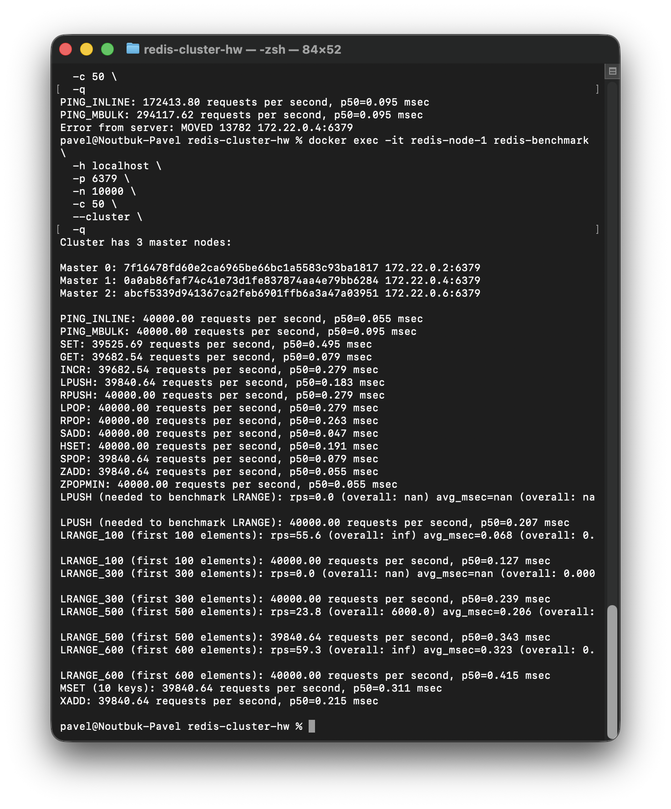

### 4.2. Тесты по размерам сообщений

**1KB:**
```bash
docker exec -it redis-node-1 redis-benchmark \
  -h localhost -p 6379 -n 10000 -c 50 --cluster -d 1024 -t set,get -q
```

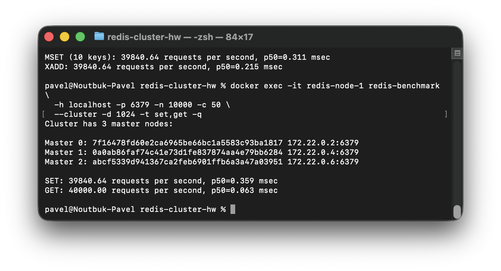

**10KB:**
```bash
docker exec -it redis-node-1 redis-benchmark \
  -h localhost -p 6379 -n 10000 -c 50 --cluster -d 10240 -t set,get -q
```

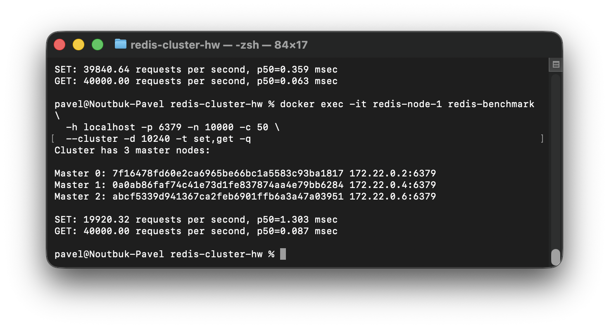

**100KB:**
```bash
docker exec -it redis-node-1 redis-benchmark \
  -h localhost -p 6379 -n 5000 -c 20 --cluster -d 102400 -t set,get -q
```

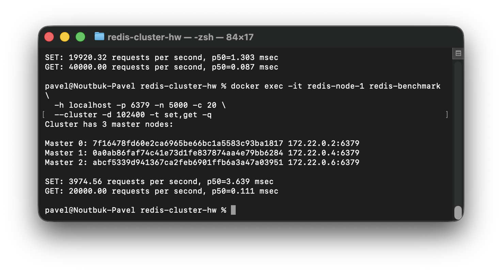

### 4.3. Сводная таблица redis-benchmark

| Размер | SET rps | SET p50 | GET rps | GET p50 |
|--------|---------|---------|---------|---------|
| 1KB | 39 840 | 0.359 мс | 40 000 | 0.063 мс |
| 10KB | 19 920 | 1.303 мс | 40 000 | 0.087 мс |
| 100KB | 3 974 | 3.639 мс | 20 000 | 0.111 мс |

**GET почти не деградирует** при росте размера данных: 0.063 → 0.087 → 0.111 мс. Redis читает из RAM напрямую, и размер объекта слабо влияет на время отклика.

**SET деградирует значительно** — throughput падает с 40K до 4K rps при переходе от 1KB к 100KB. Причина — комбинация AOF-персистентности (`appendonly yes`) и сетевого оверхеда Docker network при передаче крупных объектов.

Конкретно: при переходе 1KB → 10KB (×10 данных) throughput SET упал вдвое, latency выросла в 3.6 раза. При переходе 10KB → 100KB (×10 данных) throughput SET упал в 5 раз, latency выросла в 2.8 раза. Деградация нелинейная — каждый следующий порядок размера бьёт сильнее.

### 4.4. Замер p50/p95/p99 latency (Python-скрипт)

Для детального анализа латентности по перцентилям написан собственный клиент, который замеряет каждую операцию отдельно.

```python
import json
import time
import statistics
from redis.cluster import RedisCluster, ClusterNode

def address_remap(addr):
    host, port = addr
    mapping = {
        "172.22.0.6": ("localhost", 7001),
        "172.22.0.2": ("localhost", 7002),
        "172.22.0.4": ("localhost", 7003),
        "172.22.0.8": ("localhost", 7004),
        "172.22.0.7": ("localhost", 7005),
        "172.22.0.5": ("localhost", 7006),
    }
    return mapping.get(host, (host, port))

rc = RedisCluster(
    startup_nodes=[ClusterNode("localhost", 7001)],
    decode_responses=True,
    skip_full_coverage_check=True,
    address_remap=address_remap
)

def measure_latency(func, iterations=500):
    latencies = []
    for _ in range(iterations):
        start = time.perf_counter()
        func()
        latencies.append((time.perf_counter() - start) * 1000)
    latencies.sort()
    return {
        "p50": round(statistics.median(latencies), 3),
        "p95": round(latencies[int(len(latencies) * 0.95)], 3),
        "p99": round(latencies[int(len(latencies) * 0.99)], 3),
        "avg": round(statistics.mean(latencies), 3),
        "min": round(min(latencies), 3),
        "max": round(max(latencies), 3),
    }

sizes = {
    "1KB":   "x" * 1024,
    "10KB":  "x" * 10240,
    "100KB": "x" * 102400,
}

print("\n" + "="*70)
print(f"{'Test':<20} {'p50':>8} {'p95':>8} {'p99':>8} {'avg':>8} {'min':>8} {'max':>8}")
print(f"{'':20} {'ms':>8} {'ms':>8} {'ms':>8} {'ms':>8} {'ms':>8} {'ms':>8}")
print("="*70)

for size_name, payload in sizes.items():
    stats = measure_latency(lambda p=payload: rc.set(f"bench:str", p))
    print(f"SET {size_name:<16} {stats['p50']:>8} {stats['p95']:>8} {stats['p99']:>8} {stats['avg']:>8} {stats['min']:>8} {stats['max']:>8}")

    stats = measure_latency(lambda: rc.get("bench:str"))
    print(f"GET {size_name:<16} {stats['p50']:>8} {stats['p95']:>8} {stats['p99']:>8} {stats['avg']:>8} {stats['min']:>8} {stats['max']:>8}")

    stats = measure_latency(lambda p=payload: rc.hset("bench:hash", "field1", p))
    print(f"HSET {size_name:<15} {stats['p50']:>8} {stats['p95']:>8} {stats['p99']:>8} {stats['avg']:>8} {stats['min']:>8} {stats['max']:>8}")

    stats = measure_latency(lambda p=payload: rc.zadd("bench:zset", {p[:50]: time.time()}))
    print(f"ZADD {size_name:<15} {stats['p50']:>8} {stats['p95']:>8} {stats['p99']:>8} {stats['avg']:>8} {stats['min']:>8} {stats['max']:>8}")

    print("-"*70)

print("="*70)
```

### 4.5. Результаты замеров латентности

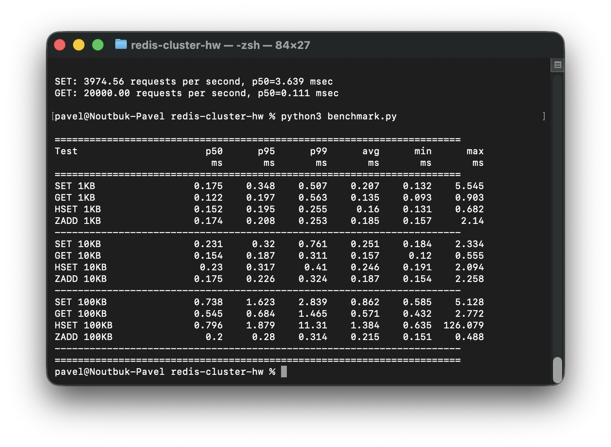

| Операция | 1KB p50 | 10KB p50 | 100KB p50 | Вывод |
|----------|---------|----------|-----------|-------|
| SET | 0.175 мс | 0.231 мс | 0.738 мс | Деградирует с размером |
| GET | 0.122 мс | 0.154 мс | 0.545 мс | Стабильнее SET |
| HSET | 0.152 мс | 0.230 мс | 0.796 мс | Опасные выбросы на 100KB |
| ZADD | 0.174 мс | 0.175 мс | 0.200 мс | Не зависит от размера payload |

### 4.6. Анализ латентности

**ZADD** — абсолютный победитель: latency почти не растёт с размером данных (0.174 → 0.175 → 0.200 мс). Причина в том, что в ZADD хранятся только первые 50 символов payload, а score — просто число. Реальный объём записываемых данных минимален.

**SET vs GET** — на 100KB разрыв становится очевидным: SET p50 = 0.738 мс, p99 = 2.839 мс; GET p50 = 0.545 мс, p99 = 1.465 мс. SET медленнее из-за AOF — каждая запись проходит через буфер на диск.

**HSET 100KB** — аномалия в p99 и max: p99 = 11.31 мс, max = 126 мс. Это редкие, но очень долгие операции. При больших значениях полей Hash Redis иногда перестраивает внутреннюю структуру (ziplist → hashtable). В p50 это не видно (0.796 мс), но p99 выдаёт проблему.

Ключевой вывод: Redis показывает sub-millisecond latency (p50 < 1 мс) для всех операций на данных до 10KB. На 100KB сообщениях p99 начинает расти непредсказуемо, особенно для HSET.

### 4.7. Замер CPU/RAM через docker stats

Параллельно с бенчмарком 100KB зафиксированы метрики ресурсов:

```bash
docker exec -it redis-node-1 redis-benchmark \
  -h localhost -p 6379 -n 10000 -c 20 --cluster -d 102400 -t set,get -q

docker stats redis-node-1 redis-node-2 redis-node-3 \
  --no-stream --format "table {{.Name}}\t{{.CPUPerc}}\t{{.MemUsage}}\t{{.NetIO}}"
```

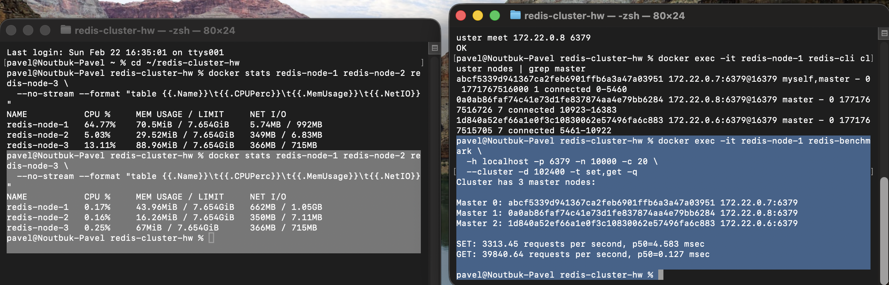

| Нода | CPU % | RAM использование | Лимит |
|------|-------|-------------------|-------|
| redis-node-1 | 0.17% | 43.96 МБ | 7.65 ГБ |
| redis-node-2 | 0.16% | 16.26 МБ | 7.65 ГБ |
| redis-node-3 | 0.25% | 67 МБ | 7.65 ГБ |

CPU потребление крайне низкое (~0.2%) — Redis эффективно использует процессор даже на 100KB сообщениях. RAM потребление умеренное: нода-3 держит 67 МБ, так как на ней хранятся крупные структуры (`users:hash`, `users:list`).

---

## 5. Redis Streams и Pub/Sub

### 5.1. Redis Streams — создание и чтение событий

Созданы события в стриме заказов:

```bash
XADD events:orders * action purchase userId 101 amount 99.90 product "laptop"
XADD events:orders * action purchase userId 202 amount 29.90 product "book"
XADD events:orders * action refund userId 101 amount 99.90 product "laptop"
XADD events:orders * action purchase userId 303 amount 149.00 product "phone"
XADD events:orders * action purchase userId 404 amount 9.99 product "pen"
```

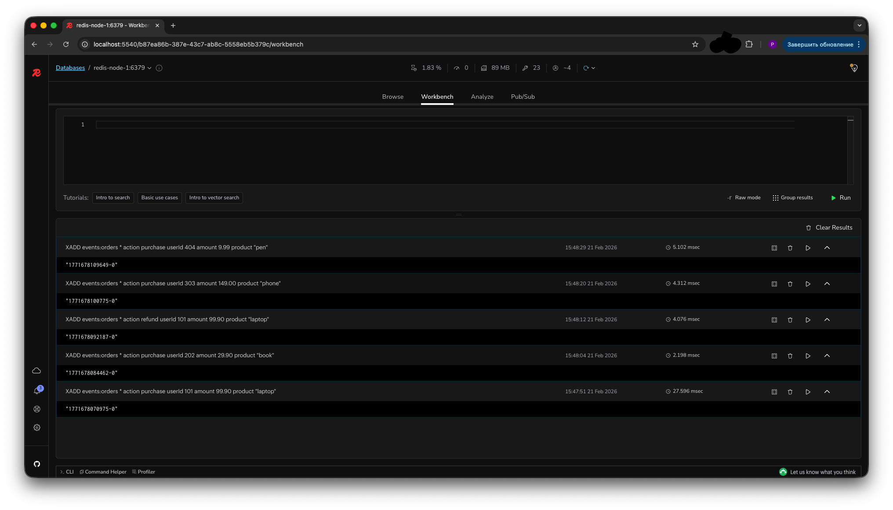

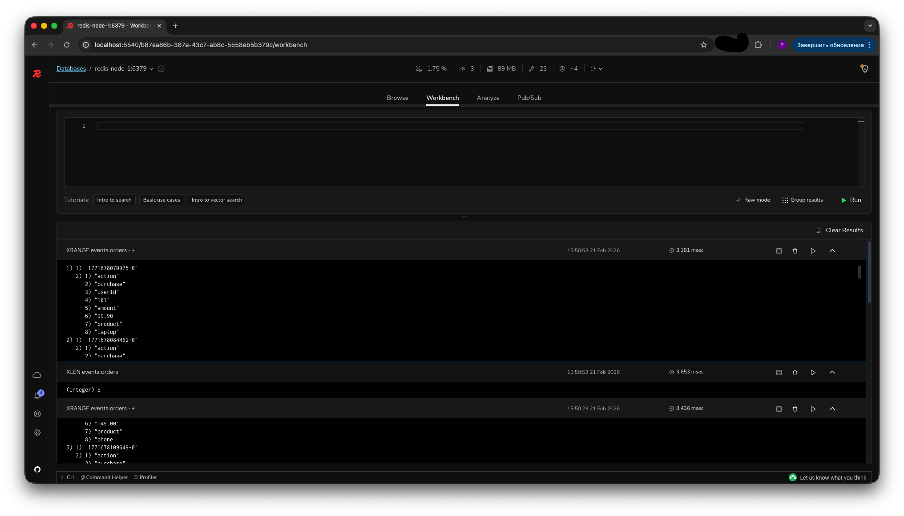

### 5.2. Consumer Groups — распределённая обработка

Создана группа потребителей, два consumer читают события из одной группы:

```bash
XGROUP CREATE events:orders grp:analytics 0

XREADGROUP GROUP grp:analytics consumer-1 COUNT 3 STREAMS events:orders >
XREADGROUP GROUP grp:analytics consumer-2 COUNT 10 STREAMS events:orders >
```

Consumer-1 получил первые 3 сообщения, Consumer-2 — оставшиеся 2. Каждое сообщение обработано ровно одним consumer — это гарантия consumer group.

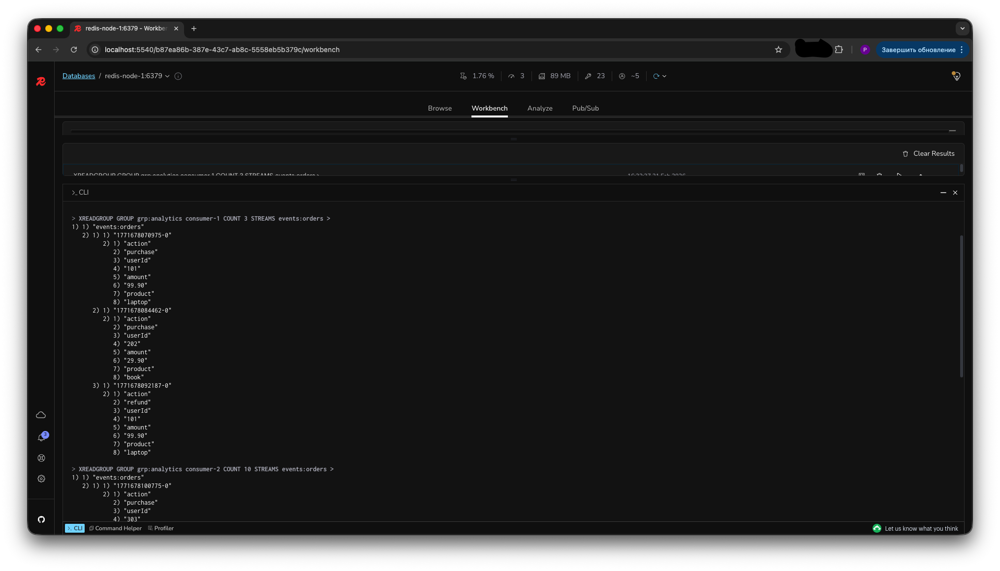

**Проверка pending-сообщений и подтверждение обработки:**

```bash
XPENDING events:orders grp:analytics - + 10
XACK events:orders grp:analytics 1771678070975-0
```

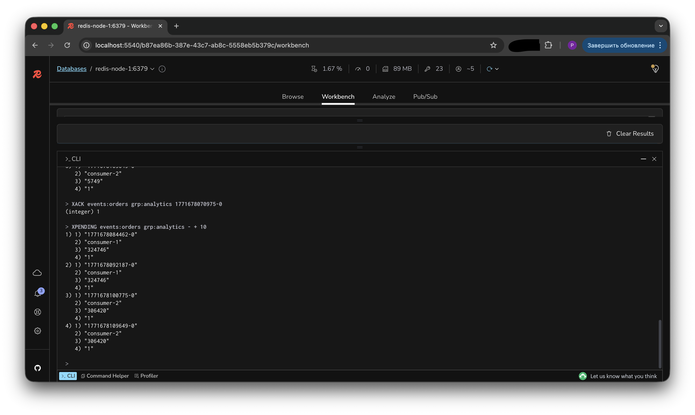

### 5.3. Pub/Sub в реальном времени

Запущен подписчик на канал уведомлений:

```bash
docker exec -it redis-node-1 redis-cli subscribe channel:notifications
```

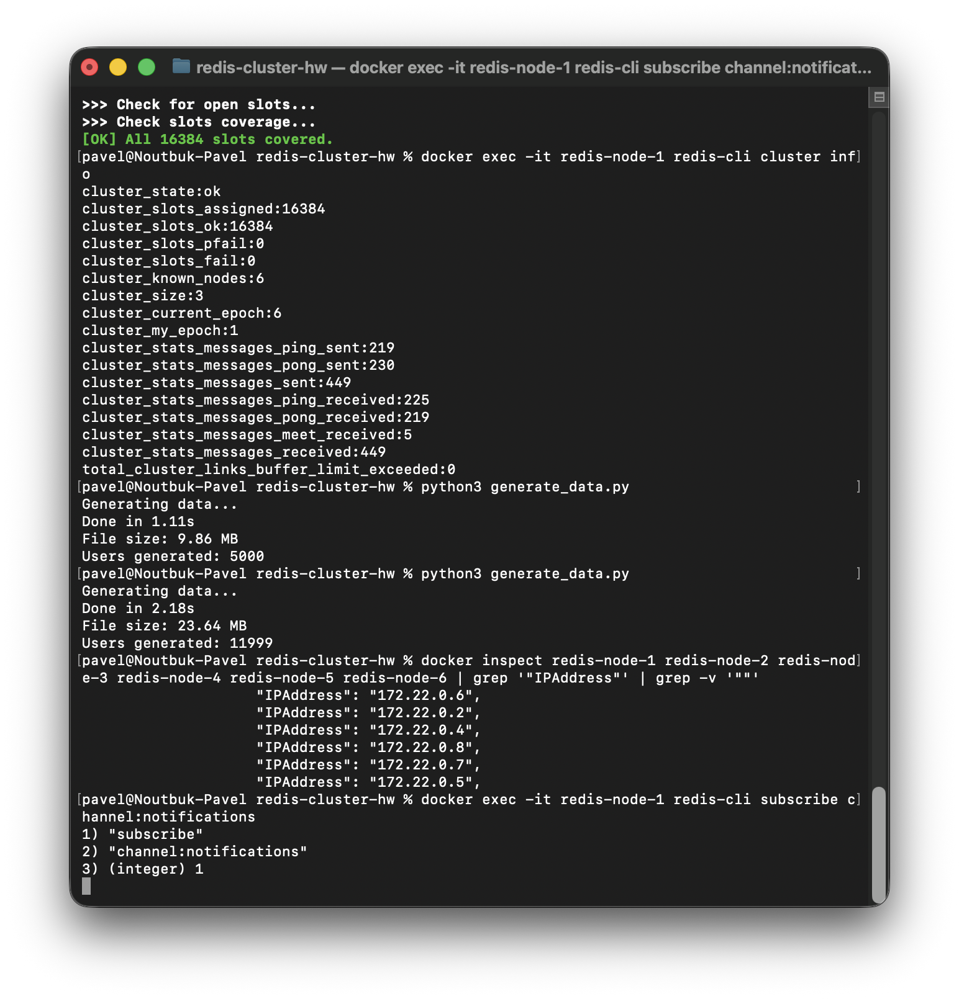

Публикация сообщений с другой ноды:

```bash
docker exec -it redis-node-2 redis-cli publish channel:notifications "New order received: #12345"
docker exec -it redis-node-2 redis-cli publish channel:notifications "Payment confirmed: user 101"
docker exec -it redis-node-2 redis-cli publish channel:notifications "Stock alert: laptop low inventory"
```

Подписчик получает все сообщения в реальном времени.

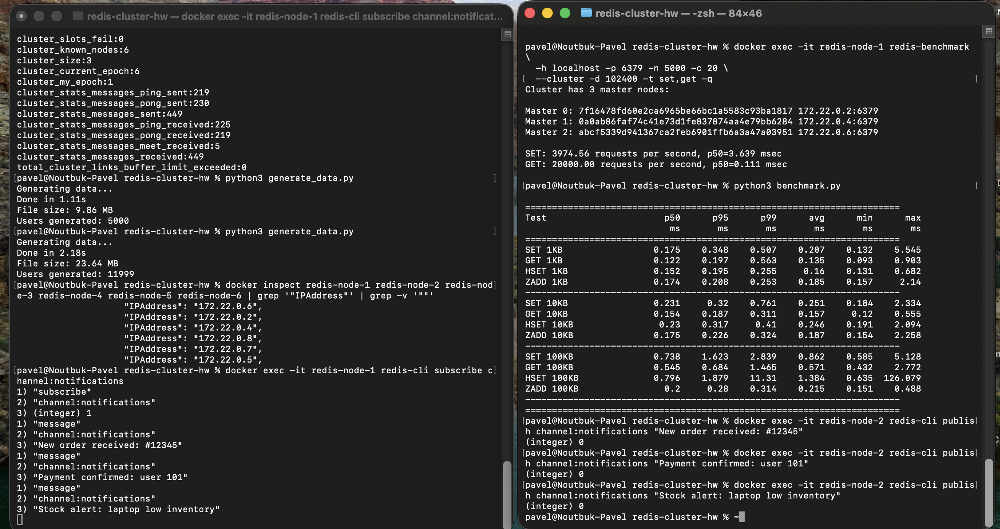

**Pattern-подписка:**

```bash
docker exec -it redis-node-1 redis-cli psubscribe "channel:*"
```

Реагирует только на события, соответствующие маске.

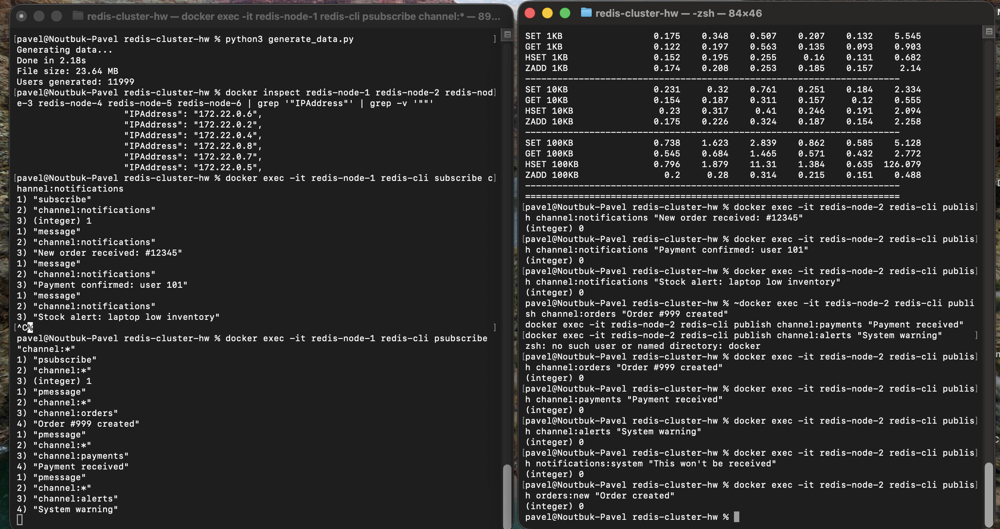

### 5.4. Бенчмарк Redis Streams

Замер throughput и latency для producer (XADD) и consumer (XREADGROUP):

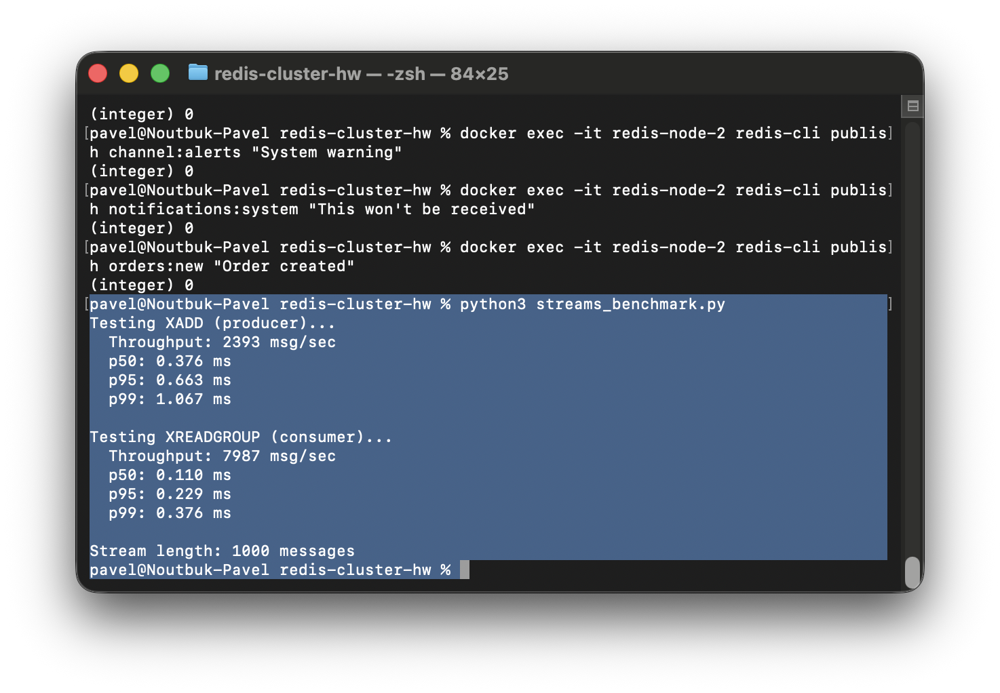

| Роль | Throughput | p50 | p95 | p99 |
|------|-----------|-----|-----|-----|
| Producer (XADD) | 2 393 msg/sec | 0.376 мс | 0.663 мс | 1.067 мс |
| Consumer (XREADGROUP) | 7 987 msg/sec | 0.110 мс | 0.229 мс | 0.376 мс |

Consumer в 3 раза быстрее producer — producer пишет каждое сообщение отдельно (1000 отдельных XADD), а consumer читает батчами по 10 сообщений за round-trip.

Для сравнения с результатами раздела 4:

| Операция | Throughput | p50 | p99 |
|----------|-----------|-----|-----|
| SET 1KB | ~40K rps | 0.175 мс | 0.507 мс |
| XADD (Stream) | 2.4K rps | 0.376 мс | 1.067 мс |
| XREADGROUP | 8K rps | 0.110 мс | 0.376 мс |

XADD заметно медленнее SET по throughput, поскольку скрипт пишет по одному сообщению синхронно (каждый XADD ждёт ответа), тогда как redis-benchmark для SET использует 50 параллельных клиентов.

### 5.5. Fan-out: конкурентный режим (1 группа, 3 consumers)

Один producer записывает 1 000 сообщений, три consumer в одной группе параллельно их обрабатывают.

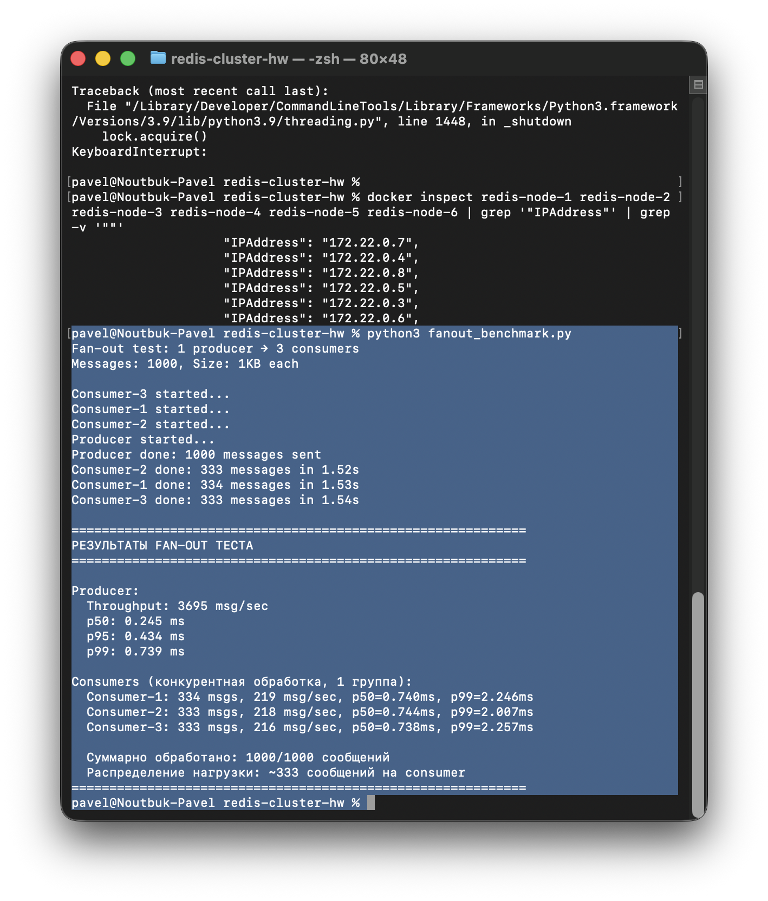

**Producer:**

| Метрика | Значение |
|---------|----------|
| Throughput | 3 695 msg/sec |
| p50 | 0.245 мс |
| p95 | 0.434 мс |
| p99 | 0.739 мс |

**Consumers:**

| Consumer | Сообщений | Throughput | p50 | p99 |
|----------|-----------|-----------|-----|-----|
| Consumer-1 | 334 | 219 msg/sec | 0.740 мс | 2.246 мс |
| Consumer-2 | 333 | 218 msg/sec | 0.744 мс | 2.007 мс |
| Consumer-3 | 333 | 216 msg/sec | 0.738 мс | 2.257 мс |

Распределение нагрузки практически идеальное: 334 / 333 / 333. Отклонение — всего 1 сообщение.

### 5.6. Fan-out: broadcast-режим (3 независимые группы)

Каждая из трёх групп получает все 1 000 сообщений — аналог Kafka, где каждый consumer group читает topic независимо.

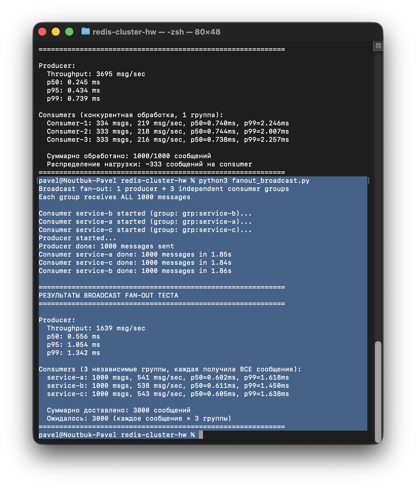

**Producer:**

| Метрика | Значение |
|---------|----------|
| Throughput | 1 639 msg/sec |
| p50 | 0.556 мс |
| p99 | 1.342 мс |

**Consumers:**

| Consumer | Сообщений | Throughput | p50 | p99 |
|----------|-----------|-----------|-----|-----|
| service-a | 1 000 | 541 msg/sec | 0.602 мс | 1.618 мс |
| service-b | 1 000 | 538 msg/sec | 0.611 мс | 1.450 мс |
| service-c | 1 000 | 543 msg/sec | 0.605 мс | 1.638 мс |

Суммарно доставлено 3 000 сообщений (1 000 × 3 группы) — каждое сообщение получено каждой группой.

### 5.7. Сравнение режимов fan-out

| Метрика | Конкурентный (1 группа) | Broadcast (3 группы) |
|---------|------------------------|---------------------|
| Producer throughput | 3 695 msg/sec | 1 639 msg/sec |
| Producer p50 | 0.245 мс | 0.556 мс |
| Producer p99 | 0.739 мс | 1.342 мс |
| Сообщений на consumer | ~333 (из 1000) | 1000 (все) |
| Consumer throughput | ~218 msg/sec | ~541 msg/sec |
| Consumer p99 | ~2.2 мс | ~1.6 мс |
| Суммарно доставлено | 1 000 | 3 000 |

Producer в broadcast-режиме медленнее, потому что три consumer параллельно читают из того же стрима и создают дополнительную нагрузку на ноду. Consumer в broadcast-режиме быстрее — каждый читает свою группу без конкуренции, 1 000 сообщений подряд без холостых опросов.

---

## 6. TTL, Eviction Policies и инвалидация кеша

### 6.1. Работа с TTL

Созданы ключи с разным временем жизни:

```bash
SET session:user:101 "user-session-data" EX 30
SET cache:product:555 "product-data" EX 60
SET otp:code:79001234567 "847291" EX 120
```

Проверка оставшегося времени жизни:

```bash
TTL session:user:101
TTL cache:product:555
TTL otp:code:79001234567
```

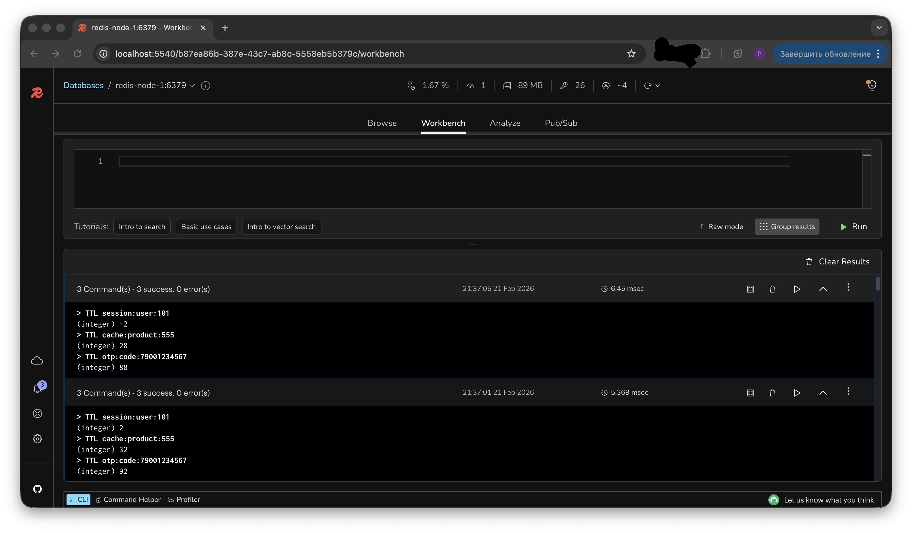

Протестированы различные сценарии работы с TTL: просмотр остатка в миллисекундах (`PTTL`), снятие TTL для превращения ключа в «вечный» (`PERSIST`), обновление TTL (`EXPIRE`).

Значения TTL: `-1` означает «без TTL» (ключ вечный), `-2` означает «ключ не существует» (истёк или удалён).

### 6.2. Политики вытеснения (Eviction Policies)

Проверены и переключены настройки политик через RedisInsight.

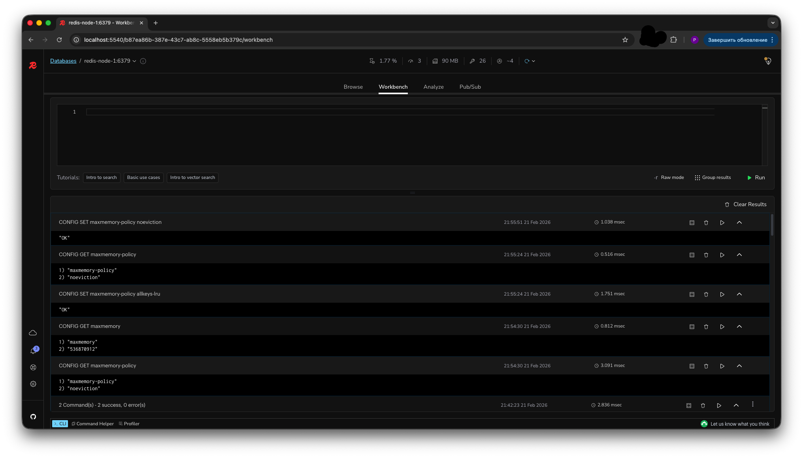

| Политика | Что делает | Когда использовать |
|----------|------------|-------------------|
| noeviction | Возвращает ошибку при нехватке памяти | Брокер сообщений, нельзя терять данные |
| allkeys-lru | Удаляет давно неиспользуемые из всех ключей | Универсальный кеш |
| volatile-lru | LRU только среди ключей с TTL | Кеш + постоянные данные вместе |
| allkeys-lfu | Удаляет редко используемые из всех ключей | Кеш с «горячими» данными |
| volatile-lfu | LFU только среди ключей с TTL | Аналогично volatile-lru, но умнее |
| allkeys-random | Удаляет случайные из всех | Когда все данные равноценны |
| volatile-random | Случайные только среди ключей с TTL | Редко используется |
| volatile-ttl | Удаляет с наименьшим TTL первыми | Кеш, где свежесть важна |

### 6.3. Инвалидация кеша через Pub/Sub

Симуляция реальной ситуации: закешированный товар, его цена изменилась в базе данных, нужно инвалидировать кеш.

**Шаг 1** — Создан канал для инвалидационных событий:

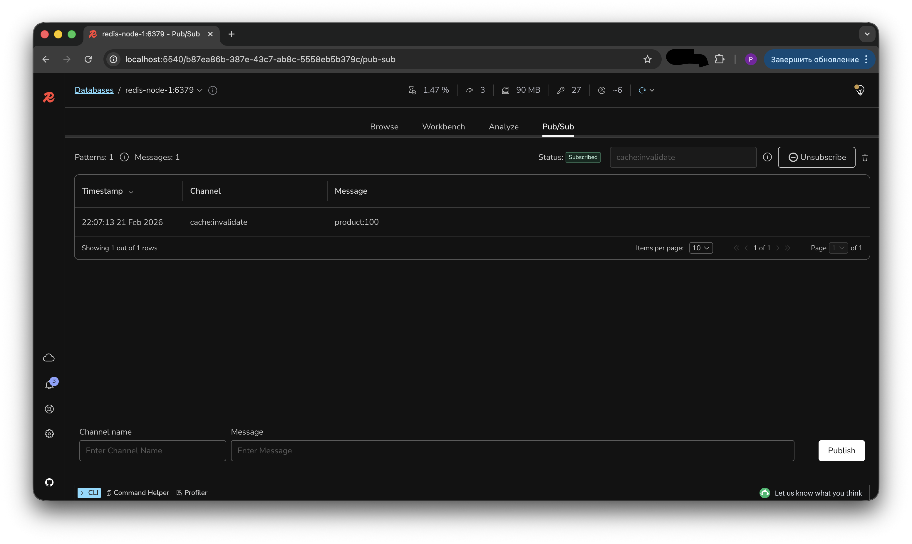

**Шаг 2** — Создан закешированный товар:

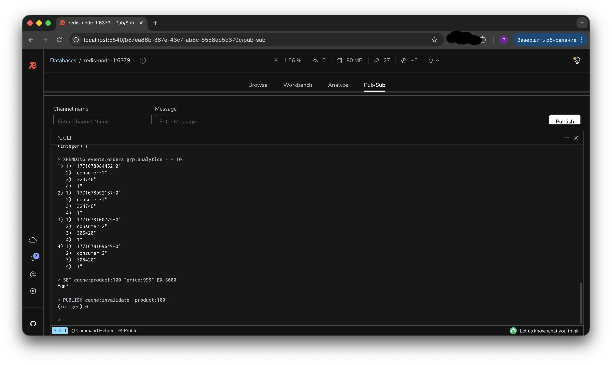

**Шаг 3** — Симуляция изменения цены и получение события инвалидации:

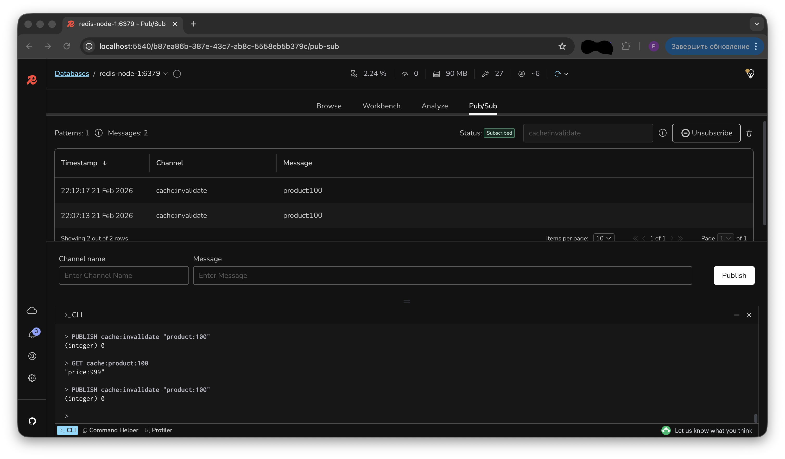

### 6.4. Другие методы инвалидации

Протестированы также TTL-based самоинвалидация и версионирование ключей (старый ключ просто перестают использовать, новые данные записываются под новым ключом).

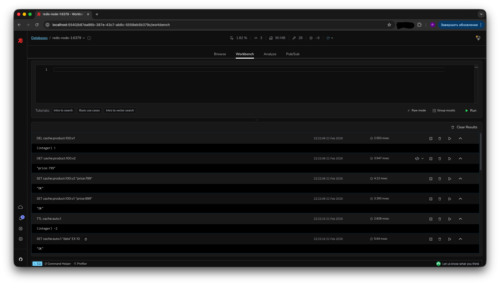

---

## 7. Отказоустойчивость кластера (Failover)

### 7.1. Фиксация состояния ДО

```bash
docker exec -it redis-node-1 redis-cli cluster nodes
```

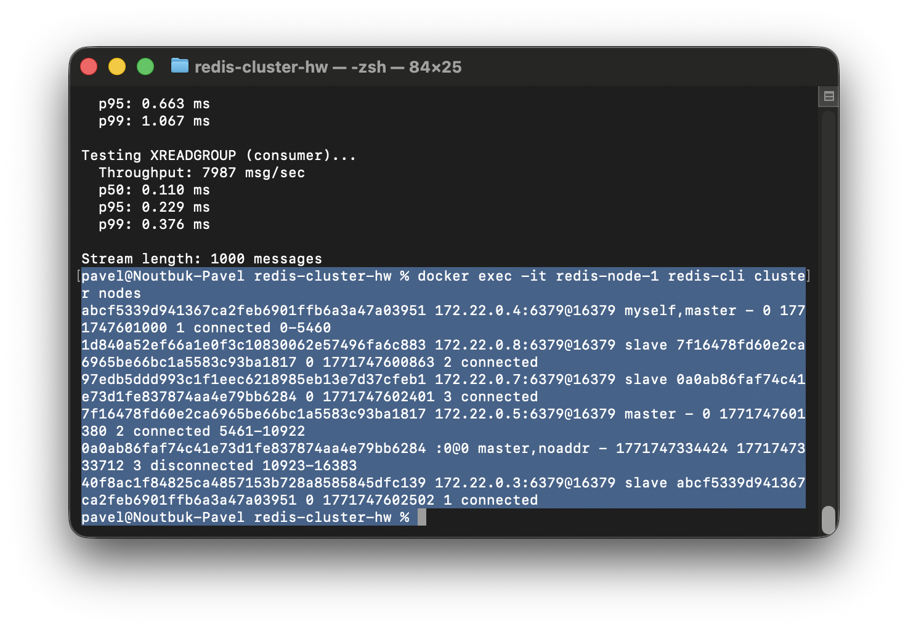

Проверка стабильности контейнеров:

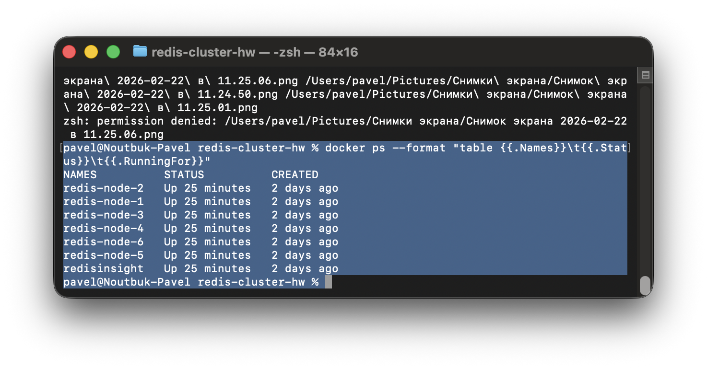

Фиксируем мастер-ноды:

```bash
docker exec -it redis-node-1 redis-cli cluster nodes | grep master
```

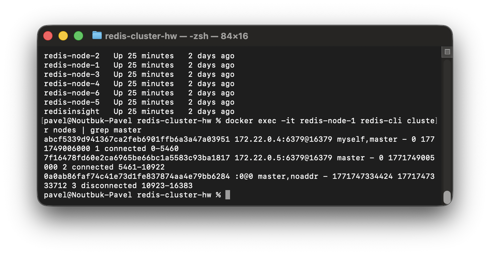

### 7.2. Запись тестовых данных и остановка ноды

```bash
docker exec -it redis-node-1 redis-cli -c SET test:failover "data-before-failover"
docker exec -it redis-node-1 redis-cli -c GET test:failover
docker stop redis-node-2
```

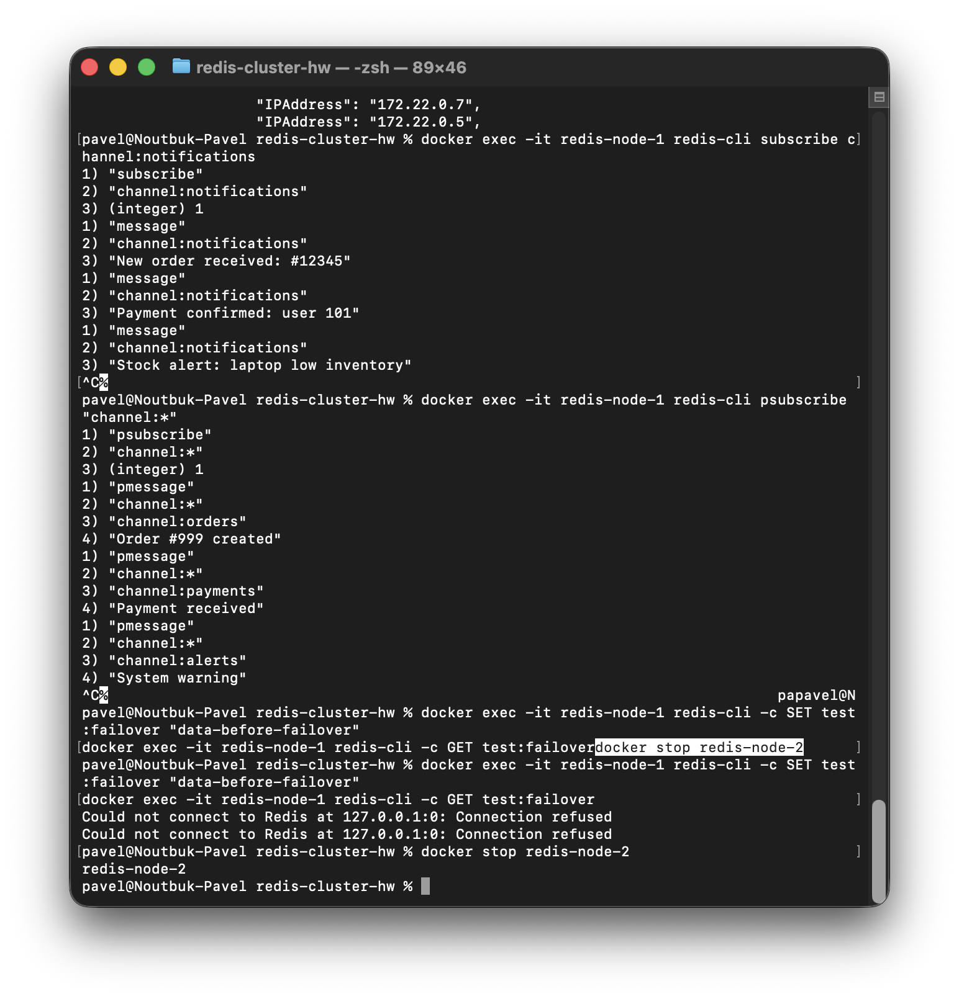

### 7.3. Наблюдение за failover

```bash
docker exec -it redis-node-1 redis-cli cluster nodes
```

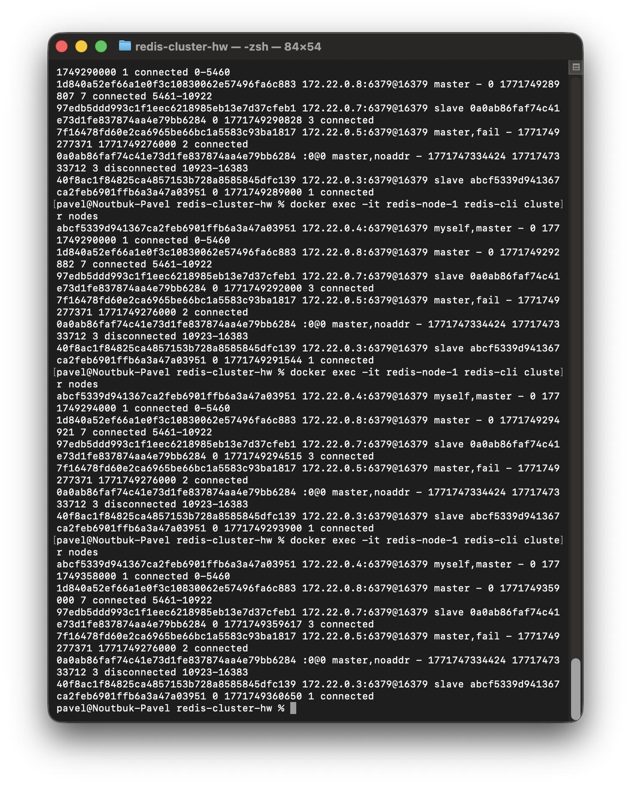

**Хронология failover:**

1. **ДО остановки ноды:** `7f16478... 172.22.0.5:6379 master - connected 5461-10922` — живой мастер.
2. **Сразу после `docker stop redis-node-2`:** `7f16478... 172.22.0.5:6379 master,fail` — нода помечена как FAIL.
3. **Failover завершён (~5-6 секунд):** `1d840a5... 172.22.0.8:6379 master` — бывшая реплика стала мастером.

Время failover = ~6 секунд. Это точно соответствует настройке `cluster-node-timeout 5000` плюс время голосования между оставшимися мастерами.

### 7.4. Восстановление ноды

```bash
docker exec -it redis-node-1 redis-cli -c GET test:failover
docker start redis-node-2
```

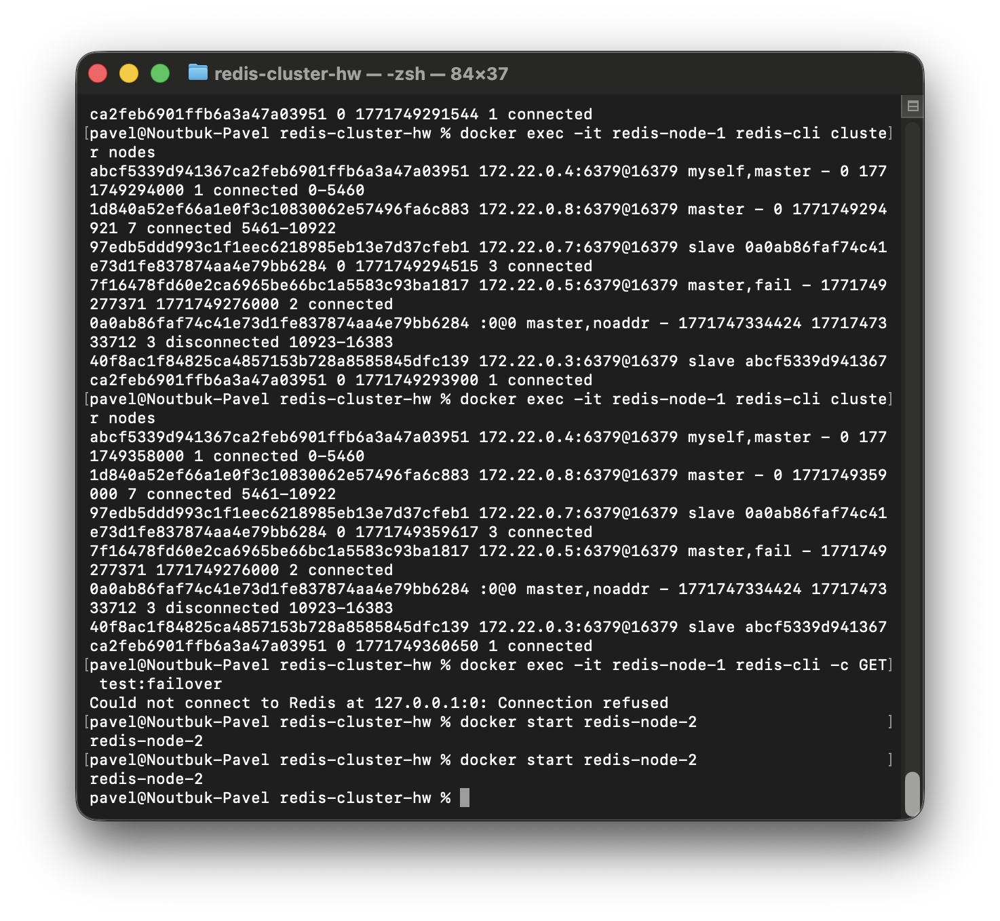

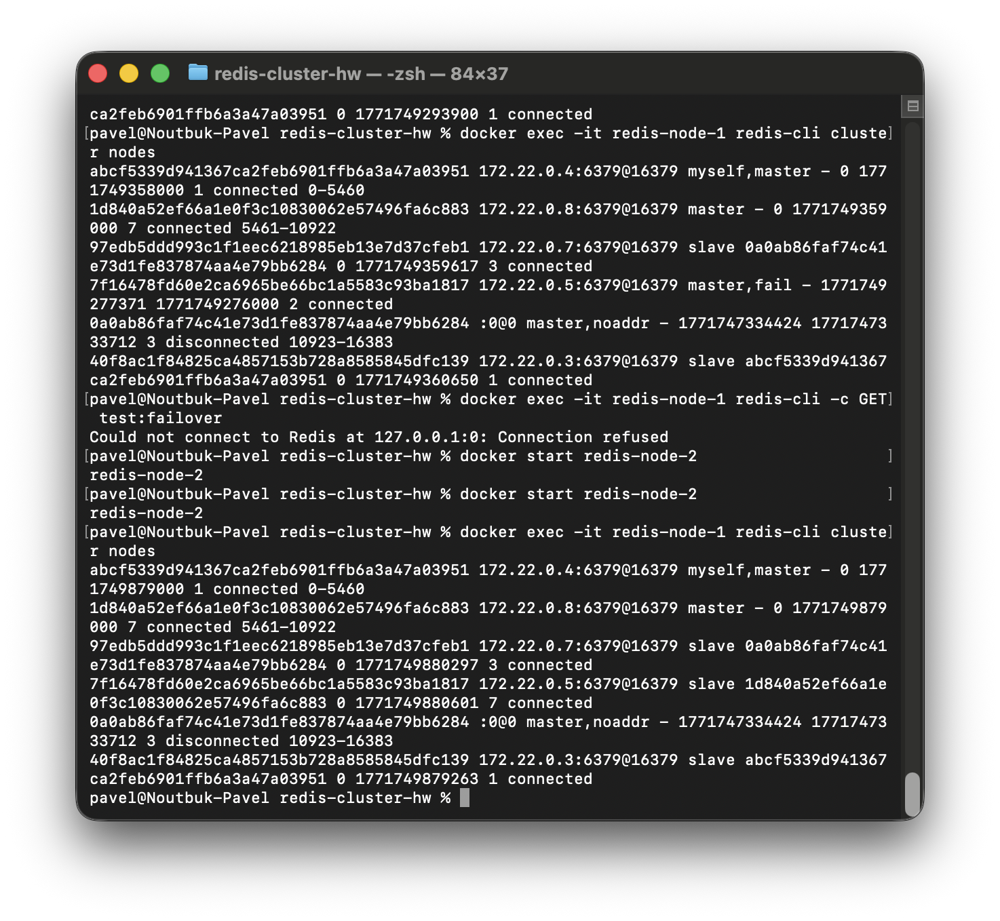

Вернувшаяся нода автоматически присоединилась к кластеру как **реплика** бывшего slave, который стал мастером. Иерархия инвертировалась: `7f16478... slave 1d840a52...`.

**Замечание:** GET test:failover не сработал — ключ попал в слоты 10923-16383, которые принадлежали давно недоступной третьей ноде (`0a0ab86... master,noaddr - disconnected`). Кластер не мог маршрутизировать запрос к этим слотам.

### 7.5. Ручное восстановление третьей ноды

Выполнено восстановление связи с третьей нодой через `CLUSTER MEET`.

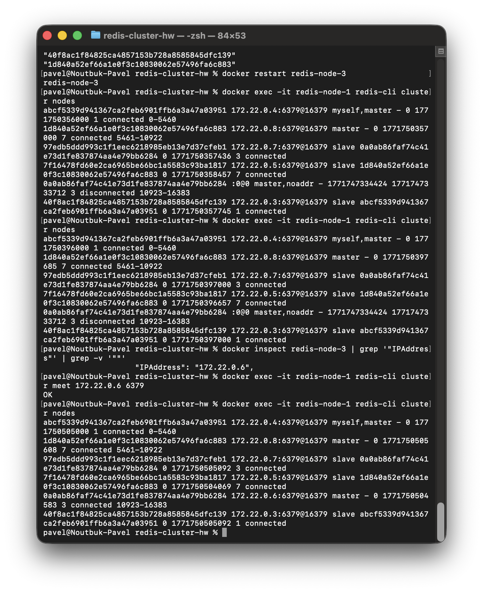

### 7.6. Сводная таблица failover

| Событие | Результат |
|---------|-----------|
| Остановка мастер-ноды | redis-node-2 остановлена |
| Время обнаружения отказа | ~5 сек (cluster-node-timeout) |
| Автоматический failover | Реплика повышена до мастера |
| Данные после failover | Сохранены на реплике |
| Возврат ноды | Вернулась как реплика |
| Ручное восстановление адреса | `CLUSTER MEET 172.22.0.6 6379` |

---

## 8. Выводы

### 8.1. Базовое ДЗ: структуры данных

Один и тот же JSON (~20 МБ) сохранён в четырёх структурах Redis. Каждая структура подходит для своего сценария: String — для кеширования целых объектов, Hash — для доступа к отдельным полям, ZSet — для отсортированных выборок, List — для очередей и последовательного доступа. Производительность записи и чтения сильно зависит от количества операций (один большой объект vs тысячи мелких) и объёма хранимых данных.

### 8.2. Производительность

Redis демонстрирует sub-millisecond latency (p50 < 1 мс) для всех операций на данных до 10KB. На 100KB сообщениях SET деградирует до ~4K rps (из-за AOF и сетевого оверхеда), тогда как GET остаётся стабильным на ~20K rps. HSET на крупных данных даёт опасные выбросы в p99 из-за перестройки внутренних структур.

### 8.3. Streams и Pub/Sub

Redis Streams с consumer groups обеспечивают надёжную доставку сообщений с гарантией at-least-once. Два режима fan-out — конкурентный (1 группа, сообщения распределяются между consumers) и broadcast (независимые группы, каждый получает все сообщения) — работают корректно и показывают предсказуемую производительность.

### 8.4. Отказоустойчивость

Redis Cluster автоматически выполняет failover при потере мастер-ноды за ~6 секунд. Реплика повышается до мастера, данные сохраняются. При возврате упавшей ноды она автоматически присоединяется к кластеру как реплика.

### 8.5. Общие впечатления

Redis показал себя как быстрая и гибкая система, особенно сильная на мелких и средних сообщениях (до 10KB). Кластерный режим обеспечивает отказоустойчивость с минимальным временем простоя. Богатый набор структур данных позволяет подобрать оптимальное решение под конкретный сценарий — от простого кеша до брокера сообщений.
