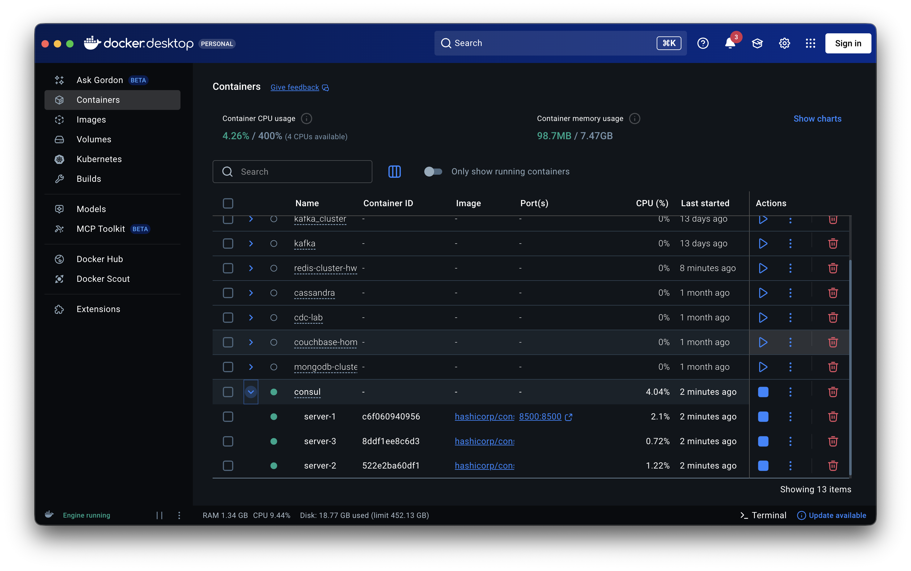
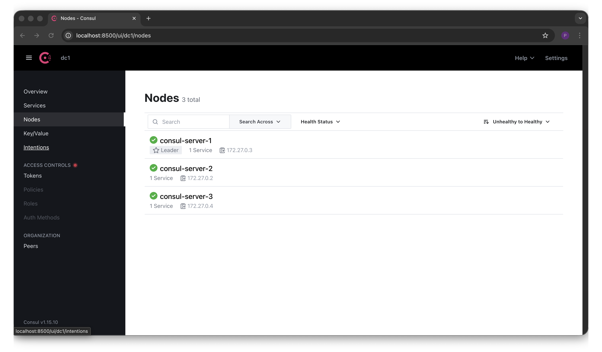
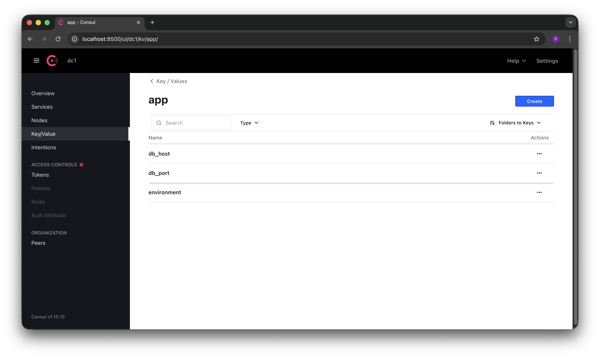
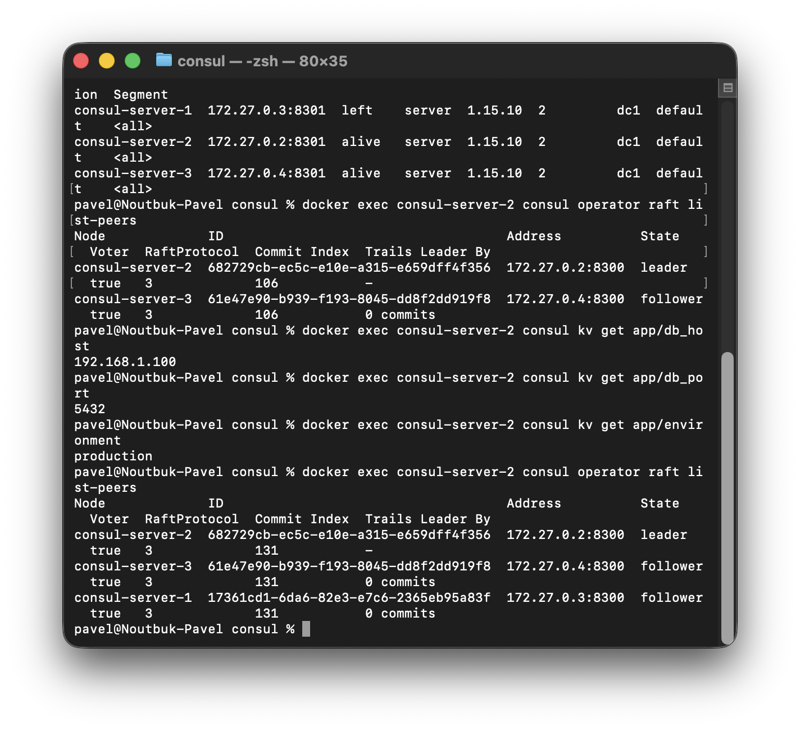
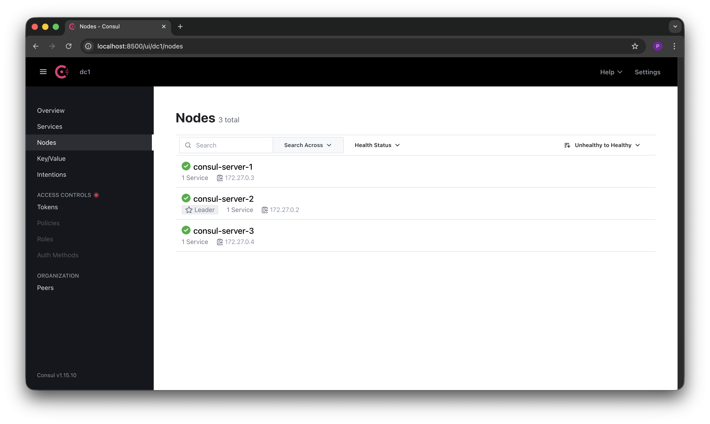
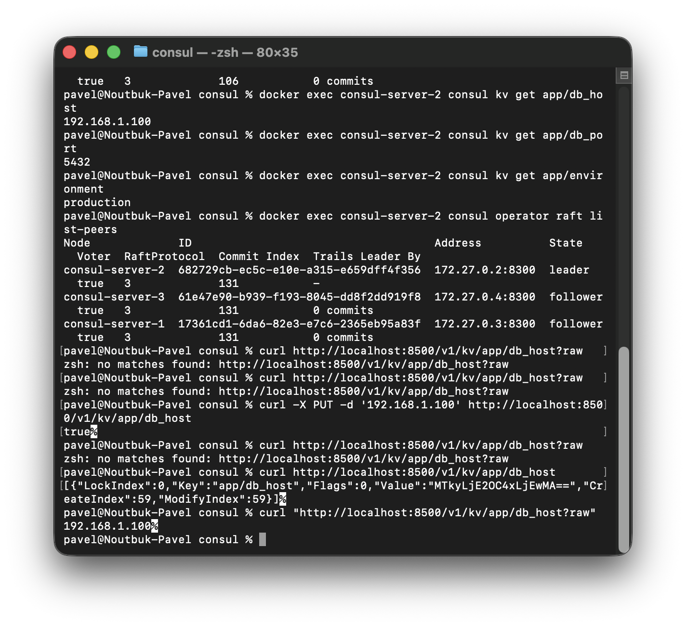

# Отчет по домашней работе: Consul

## 1. Установка и настройка окружения

### 1.1. Развертывание кластера Consul в Docker

Для работы развернут кластер из трёх серверных нод Consul с использованием Docker Compose. Кластер работает по протоколу Raft, который обеспечивает консенсус и отказоустойчивость: пока работает большинство нод (кворум), кластер продолжает обслуживать запросы.

**Docker Compose файл:**

```yaml
version: "3.8"

services:
  consul-server-1:
    image: hashicorp/consul:1.15
    container_name: consul-server-1
    command: agent -server -bootstrap-expect=3 -node=consul-server-1 -client=0.0.0.0 -ui -retry-join=consul-server-2 -retry-join=consul-server-3
    ports:
      - "8500:8500"
    networks:
      - consul-net

  consul-server-2:
    image: hashicorp/consul:1.15
    container_name: consul-server-2
    command: agent -server -bootstrap-expect=3 -node=consul-server-2 -client=0.0.0.0 -retry-join=consul-server-1 -retry-join=consul-server-3
    networks:
      - consul-net

  consul-server-3:
    image: hashicorp/consul:1.15
    container_name: consul-server-3
    command: agent -server -bootstrap-expect=3 -node=consul-server-3 -client=0.0.0.0 -retry-join=consul-server-1 -retry-join=consul-server-3
    networks:
      - consul-net

networks:
  consul-net:
    driver: bridge
```

Параметр `bootstrap-expect=3` указывает, что кластер считается готовым после подключения трёх серверных нод. Флаг `-ui` включён только на первой ноде — именно через неё доступен веб-интерфейс на порту 8500.

**Запуск кластера:**
```
docker compose up -d
```

**Скриншот запущенных контейнеров в Docker Desktop:**



---

## 2. Проверка работоспособности кластера

### 2.1. Веб-интерфейс Consul

После запуска всех трёх нод кластер автоматически провёл выборы лидера по протоколу Raft. В веб-интерфейсе Consul (localhost:8500) отображаются все три ноды в статусе healthy, при этом consul-server-1 выбран лидером.

**Скриншот Consul UI — раздел Nodes:**



---

## 3. Работа с Key/Value хранилищем

### 3.1. Создание ключей

Consul предоставляет встроенное распределённое Key/Value хранилище, которое реплицируется между всеми серверными нодами через Raft. Были созданы три ключа с конфигурационными данными приложения:

| Key | Value |
|-----|-------|
| app/db_host | 192.168.1.100 |
| app/db_port | 5432 |
| app/environment | production |

**Скриншот Key/Value хранилища в Consul UI:**



---

## 4. Тестирование отказоустойчивости

### 4.1. Сценарий: отказ лидера

Для проверки отказоустойчивости была остановлена нода consul-server-1, которая на тот момент являлась лидером кластера.

```
docker stop consul-server-1
```

После остановки первой ноды веб-интерфейс Consul перестал быть доступным, поскольку именно consul-server-1 был настроен на проброс порта 8500. Однако сам кластер продолжил работу — кворум (2 из 3) сохранился.

### 4.2. Проверка состояния кластера после отказа

Для диагностики использовались команды через оставшуюся ноду consul-server-2.

**Проверка участников кластера:**
```
docker exec consul-server-2 consul members
```

```
Node             Address          Status  Type    Build    Protocol  DC   Partition  Segment
consul-server-1  172.27.0.3:8301  left    server  1.15.10  2         dc1  default    <all>
consul-server-2  172.27.0.2:8301  alive   server  1.15.10  2         dc1  default    <all>
consul-server-3  172.27.0.4:8301  alive   server  1.15.10  2         dc1  default    <all>
```

**Проверка Raft-пиров и нового лидера:**
```
docker exec consul-server-2 consul operator raft list-peers
```

```
Node             ID                                    Address          State     Voter  RaftProtocol  Commit Index  Trails Leader By
consul-server-2  682729cb-ec5c-e10e-a315-e659dff4f356  172.27.0.2:8300  leader    true   3             106           -
consul-server-3  61e47e90-b939-f193-8045-dd8f2dd919f8  172.27.0.4:8300  follower  true   3             106           0 commits
```

**Проверка сохранности данных в KV-хранилище:**
```
docker exec consul-server-2 consul kv get app/db_host
192.168.1.100

docker exec consul-server-2 consul kv get app/db_port
5432

docker exec consul-server-2 consul kv get app/environment
production
```

**Скриншот выполнения команд:**



### 4.3. Результаты теста отказоустойчивости

Ключевые наблюдения после отказа лидера:

- **consul-server-1** — статус `left`, нода выбыла из кластера
- **consul-server-2** — автоматически стал новым лидером (ранее был follower)
- **consul-server-3** — остался follower
- **Все данные на месте** — все три ключа вернули корректные значения

Это наглядная демонстрация отказоустойчивости Raft: кворум 2 из 3 сохранился, кластер автоматически выбрал нового лидера, данные не потеряны.

---

## 5. Восстановление кластера

### 5.1. Возврат упавшей ноды

Для восстановления кластера в полном составе нода consul-server-1 была запущена заново.

```
docker start consul-server-1
```

После запуска consul-server-1 автоматически присоединилась к кластеру благодаря параметрам `-retry-join`. Все три ноды снова в статусе healthy.

**Скриншот Consul UI после восстановления:**


### 5.2. Поведение лидера после восстановления

Важный момент: лидером остался consul-server-2. Автоматического возврата лидерства на восстановленную ноду не происходит — некоторые другие СУБД так делают.

**Скриншот раздела Services — все инстансы healthy:**



### 5.3. Верификация данных через HTTP API

Дополнительно проверена работа KV-хранилища через HTTP API Consul, а также состояние Raft после полного восстановления кластера.

**Запись и чтение через curl:**
```
curl -X PUT -d '192.168.1.100' http://localhost:8500/v1/kv/app/db_host
true

curl "http://localhost:8500/v1/kv/app/db_host?raw"
192.168.1.100
```

**Чтение метаданных ключа:**
```
curl http://localhost:8500/v1/kv/app/db_host
[{"LockIndex":0,"Key":"app/db_host","Flags":0,"Value":"MTkyLjE2OC4xLjEwMA==","CreateIndex":59,"ModifyIndex":59}]
```

Значение хранится в Base64 — при декодировании `MTkyLjE2OC4xLjEwMA==` получается `192.168.1.100`.

**Состояние Raft после восстановления — все три ноды в кластере:**
```
docker exec consul-server-2 consul operator raft list-peers

Node             ID                                    Address          State     Voter  RaftProtocol  Commit Index  Trails Leader By
consul-server-2  682729cb-ec5c-e10e-a315-e659dff4f356  172.27.0.2:8300  leader    true   3             131           -
consul-server-3  61e47e90-b939-f193-8045-dd8f2dd919f8  172.27.0.4:8300  follower  true   3             131           0 commits
consul-server-1  17361cd1-6da6-82e3-e7c6-2365eb95a83f  172.27.0.3:8300  follower  true   3             131           0 commits
```

**Скриншот выполнения команд верификации:**



---

## 6. Выводы

### 6.1. Что было сделано

Развернут кластер Consul из трёх серверных нод в Docker, настроено KV-хранилище с тестовыми данными, проведено тестирование отказоустойчивости с полным циклом: отказ лидера → автоматическое переключение → восстановление ноды.

### 6.2. Ключевые наблюдения

Протокол Raft в Consul обеспечивает автоматический выбор нового лидера при отказе текущего — без ручного вмешательства и без потери данных. Для кластера из 3 нод допустим отказ одной ноды (кворум = 2). При восстановлении упавшей ноды она автоматически присоединяется к кластеру как follower, а лидерство не возвращается — это предотвращает ненужные перевыборы и обеспечивает стабильность.

KV-хранилище доступно как через CLI (`consul kv get`), так и через HTTP API (`/v1/kv/`), что удобно для интеграции с приложениями. Данные реплицируются на все ноды и переживают отказы отдельных серверов.

### 6.3. Практическая ценность

Consul подходит для задач service discovery и централизованного управления конфигурацией в распределённых системах. Встроенная отказоустойчивость через Raft делает его надёжным решением для production-окружений, где важно не терять конфигурацию при отказе отдельных компонентов инфраструктуры.
