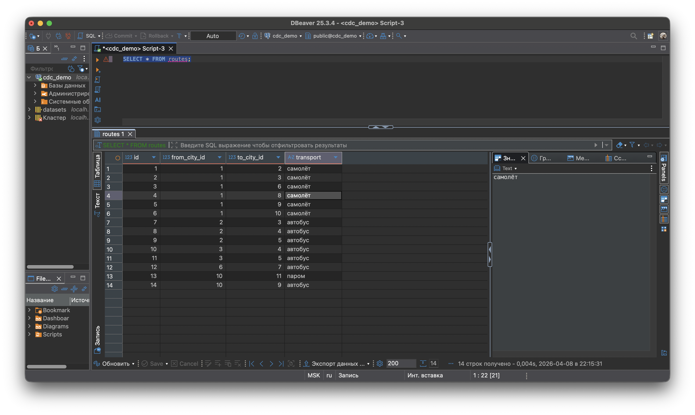
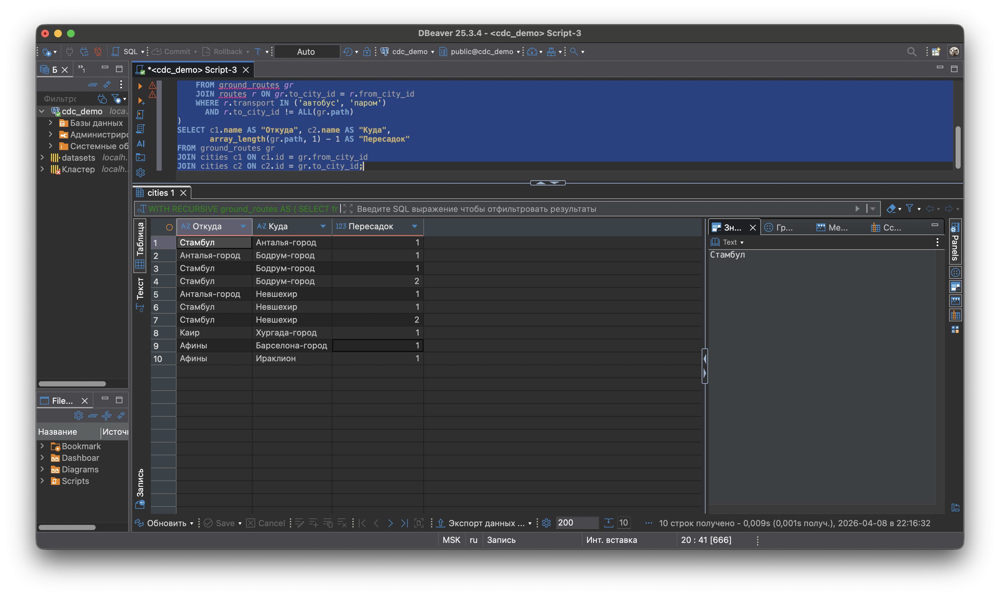

# Отчет по домашней работе: Сравнение графовых и неграфовых БД

## 1. Варианты применения графовых баз данных

### 1.1. Социальные сети и рекомендации «друзья друзей»

В социальной сети пользователи связаны отношениями дружбы, подписки, лайков. Типичная задача — рекомендация «люди, которых вы можете знать». Нужно найти друзей друзей, исключив уже существующие связи. В реляционной БД это многоуровневые self-join, которые становятся крайне медленными на миллионах пользователей. В графовой БД это естественный обход на глубину 2 — запрос буквально описывает задачу: «пройди два шага по связям FRIEND и верни тех, кого я ещё не знаю».

### 1.2. Обнаружение мошенничества (fraud detection)

В банковской сфере мошенники создают цепочки связанных аккаунтов, транзакций и устройств. Нужно выявлять подозрительные кластеры: несколько аккаунтов с одного IP, переводы друг другу, вывод через один счёт. В реляционной БД анализ таких цепочек требует сложных рекурсивных запросов с неизвестной глубиной. В графовой БД связи — нативные объекты, и поиск паттернов сводится к поиску подграфов с определёнными характеристиками.

### 1.3. Управление IT-инфраструктурой и анализ зависимостей

Сотни микросервисов зависят друг от друга. При падении компонента нужно мгновенно понять impact — что ещё затронуто. В реляционной модели рекурсивный обход зависимостей на произвольную глубину требует CTE. В графовой БД это естественная операция обхода графа, которая масштабируется пропорционально количеству связей, а не общему объёму данных.
 
---

## 2. Реализация аналогичной модели в PostgreSQL

Для сравнения была реализована та же модель данных (туроператоры, страны, курорты, города, маршруты) в PostgreSQL.

### 2.1. Создание таблиц

```sql
CREATE TABLE tour_operators (
    id SERIAL PRIMARY KEY,
    name VARCHAR(100)
);
 
CREATE TABLE countries (
    id SERIAL PRIMARY KEY,
    name VARCHAR(100)
);
 
CREATE TABLE resorts (
    id SERIAL PRIMARY KEY,
    name VARCHAR(100),
    country_id INT REFERENCES countries(id)
);
 
CREATE TABLE cities (
    id SERIAL PRIMARY KEY,
    name VARCHAR(100),
    hub VARCHAR(50)
);
 
CREATE TABLE operator_countries (
    operator_id INT REFERENCES tour_operators(id),
    country_id INT REFERENCES countries(id),
    PRIMARY KEY (operator_id, country_id)
);
 
CREATE TABLE resort_cities (
    resort_id INT REFERENCES resorts(id),
    city_id INT REFERENCES cities(id),
    PRIMARY KEY (resort_id, city_id)
);
 
CREATE TABLE routes (
    id SERIAL PRIMARY KEY,
    from_city_id INT REFERENCES cities(id),
    to_city_id INT REFERENCES cities(id),
    transport VARCHAR(50)
);
```

**Скриншот:**



### 2.2. Наполнение данными

```sql
-- Туроператоры
INSERT INTO tour_operators (name) VALUES ('TUI'), ('Anex Tour'), ('Pegas Touristik'), ('Coral Travel'), ('Sunmar');
 
-- Страны
INSERT INTO countries (name) VALUES ('Турция'), ('Египет'), ('Таиланд'), ('Испания'), ('Греция');
 
-- Курорты
INSERT INTO resorts (name, country_id) VALUES
('Анталья', 1), ('Бодрум', 1), ('Каппадокия', 1),
('Хургада', 2), ('Шарм-эль-Шейх', 2),
('Пхукет', 3), ('Паттайя', 3),
('Барселона', 4), ('Тенерифе', 4),
('Крит', 5), ('Родос', 5), ('Санторини', 5);
 
-- Города
INSERT INTO cities (name, hub) VALUES
('Москва', 'аэропорт'), ('Стамбул', 'аэропорт'), ('Анталья-город', 'аэропорт'),
('Бодрум-город', 'аэропорт'), ('Невшехир', 'вокзал'), ('Каир', 'аэропорт'),
('Хургада-город', 'аэропорт'), ('Бангкок', 'аэропорт'), ('Барселона-город', 'аэропорт'),
('Афины', 'аэропорт'), ('Ираклион', 'аэропорт');
 
-- Связи оператор-страна
INSERT INTO operator_countries (operator_id, country_id) VALUES
(1,1),(1,4),(1,5), (2,1),(2,2),(2,3), (3,1),(3,2),(3,5), (4,3),(4,4),(4,2), (5,1),(5,5),(5,3);
 
-- Связи курорт-город
INSERT INTO resort_cities (resort_id, city_id) VALUES
(1,3),(2,4),(3,5),(4,7),(5,6),(6,8),(7,8),(8,9),(10,11),(11,10),(12,10);
 
-- Маршруты
INSERT INTO routes (from_city_id, to_city_id, transport) VALUES
(1,2,'самолёт'),(1,3,'самолёт'),(1,6,'самолёт'),(1,8,'самолёт'),(1,9,'самолёт'),(1,10,'самолёт'),
(2,3,'автобус'),(2,4,'автобус'),(2,5,'автобус'),
(3,4,'автобус'),(3,5,'автобус'),
(6,7,'автобус'),
(10,11,'паром'),
(10,9,'автобус');
```
 
---

## 3. Сравнение запросов: маршруты наземным транспортом

### 3.1. Запрос в Neo4j (Cypher)

```cypher
MATCH path = (c1:City)-[:ROUTE*1..5]->(c2:City)
WHERE ALL(r IN relationships(path) WHERE r.transport IN ["автобус", "паром"])
  AND c1 <> c2
RETURN path
```

4 строки. Читается как описание задачи: «найди путь по связям ROUTE, где транспорт наземный».

### 3.2. Запрос в PostgreSQL (рекурсивный CTE)

```sql
WITH RECURSIVE ground_routes AS (
    SELECT from_city_id, to_city_id, transport,
           ARRAY[from_city_id, to_city_id] AS path
    FROM routes
    WHERE transport IN ('автобус', 'паром')
 
    UNION ALL
 
    SELECT gr.from_city_id, r.to_city_id, r.transport,
           gr.path || r.to_city_id
    FROM ground_routes gr
    JOIN routes r ON gr.to_city_id = r.from_city_id
    WHERE r.transport IN ('автобус', 'паром')
      AND r.to_city_id != ALL(gr.path)
)
SELECT c1.name AS "Откуда", c2.name AS "Куда",
       array_length(gr.path, 1) - 1 AS "Пересадок"
FROM ground_routes gr
JOIN cities c1 ON c1.id = gr.from_city_id
JOIN cities c2 ON c2.id = gr.to_city_id;
```

15+ строк SQL, рекурсивный CTE, ручное отслеживание пути через массив, два JOIN для получения имён городов.

**Скриншот результата:**


 
---

## 4. Сравнение производительности

### 4.1. PostgreSQL без индексов

**Запрос:**

```sql
EXPLAIN ANALYZE
WITH RECURSIVE ground_routes AS (
    SELECT from_city_id, to_city_id, transport,
           ARRAY[from_city_id, to_city_id] AS path
    FROM routes
    WHERE transport IN ('автобус', 'паром')
    UNION ALL
    SELECT gr.from_city_id, r.to_city_id, r.transport,
           gr.path || r.to_city_id
    FROM ground_routes gr
    JOIN routes r ON gr.to_city_id = r.from_city_id
    WHERE r.transport IN ('автобус', 'паром')
      AND r.to_city_id != ALL(gr.path)
)
SELECT c1.name, c2.name
FROM ground_routes gr
JOIN cities c1 ON c1.id = gr.from_city_id
JOIN cities c2 ON c2.id = gr.to_city_id;
```

**Результат:**

```
Hash Join  (cost=206.88..220.05 rows=15 width=436) (actual time=0.370..0.377 rows=10 loops=1)
  Hash Cond: (c2.id = gr.to_city_id)
  CTE ground_routes
    ->  Recursive Union  (cost=0.00..193.03 rows=15 width=158) (actual time=0.041..0.153 rows=10 loops=1)
          ->  Seq Scan on routes  (cost=0.00..16.38 rows=5 width=158) (actual time=0.025..0.032 rows=8 loops=1)
                Filter: ((transport)::text = ANY ('{автобус,паром}'::text[]))
                Rows Removed by Filter: 6
          ->  Hash Join  (cost=16.44..17.65 rows=1 width=158) (actual time=0.044..0.047 rows=1 loops=2)
                Hash Cond: (gr_1.to_city_id = r.from_city_id)
                ->  WorkTable Scan on ground_routes gr_1  (cost=0.00..1.00 rows=50 width=40)
                ->  Hash  (cost=16.38..16.38 rows=5 width=126)
                      ->  Seq Scan on routes r  (cost=0.00..16.38 rows=5 width=126)
                            Filter: ((transport)::text = ANY ('{автобус,паром}'::text[]))
                            Rows Removed by Filter: 6
  ->  Seq Scan on cities c2  (cost=0.00..12.20 rows=220 width=222)
  ->  Hash  (cost=13.66..13.66 rows=15 width=222)
        ->  Hash Join  (cost=0.49..13.66 rows=15 width=222)
              ->  Seq Scan on cities c1  (cost=0.00..12.20 rows=220 width=222)
Planning Time: 0.582 ms
Execution Time: 0.554 ms
```

Cost: 206.88..220.05, execution time: 0.554 ms. PostgreSQL использует Seq Scan на всех таблицах — при 14 строках в routes планировщик считает полный перебор оптимальным.

### 4.2. PostgreSQL с индексами

**Создание индексов:**

```sql
CREATE INDEX idx_routes_transport ON routes(transport);
CREATE INDEX idx_routes_from_city ON routes(from_city_id);
CREATE INDEX idx_routes_to_city ON routes(to_city_id);
CREATE INDEX idx_cities_name ON cities(name);
```

**Результат:**

```
Hash Join  (cost=21.14..21.68 rows=6 width=436) (actual time=0.178..0.254 rows=10 loops=1)
  Hash Cond: (gr.to_city_id = c2.id)
  CTE ground_routes
    ->  Recursive Union  (cost=0.00..18.64 rows=22 width=158) (actual time=0.032..0.100 rows=10 loops=1)
          ->  Seq Scan on routes  (cost=0.00..1.18 rows=2 width=158) (actual time=0.025..0.027 rows=8 loops=1)
                Filter: ((transport)::text = ANY ('{автобус,паром}'::text[]))
                Rows Removed by Filter: 6
          ->  Hash Join  (cost=1.20..1.72 rows=2 width=158) (actual time=0.028..0.030 rows=1 loops=2)
                Hash Cond: (gr_1.to_city_id = r.from_city_id)
                ->  WorkTable Scan on ground_routes gr_1  (cost=0.00..0.40 rows=20 width=40)
                ->  Hash  (cost=1.18..1.18 rows=2 width=126)
                      ->  Seq Scan on routes r  (cost=0.00..1.18 rows=2 width=126)
                            Filter: ((transport)::text = ANY ('{автобус,паром}'::text[]))
                            Rows Removed by Filter: 6
  ->  Hash Join  (cost=1.25..1.76 rows=11 width=222)
        ->  CTE Scan on ground_routes gr  (cost=0.00..0.44 rows=22 width=8)
        ->  Hash  (cost=1.11..1.11 rows=11 width=222)
              ->  Seq Scan on cities c1  (cost=0.00..1.11 rows=11 width=222)
  ->  Hash  (cost=1.11..1.11 rows=11 width=222)
        ->  Seq Scan on cities c2  (cost=0.00..1.11 rows=11 width=222)
Planning Time: 1.879 ms
Execution Time: 0.465 ms
```

Оценочная стоимость (cost) упала примерно в 10 раз: с 220 до 21. Фактическое время выполнения снизилось незначительно (0.554 → 0.465 мс), потому что данных мало. PostgreSQL по-прежнему использует Seq Scan — на 14 строках планировщик считает полный перебор дешевле обращения к индексу. Индексы начнут реально использоваться на тысячах строк. Тем не менее, планировщик пересчитал стоимость плана и выбрал более оптимальную стратегию соединений.

### 4.3. Neo4j — PROFILE запроса обхода графа

В Neo4j аналогичный запрос анализировался через `PROFILE`:

```cypher
PROFILE
MATCH path = (c1:City)-[:ROUTE*1..5]->(c2:City)
WHERE ALL(r IN relationships(path) WHERE r.transport IN ["автобус", "паром"])
  AND c1 <> c2
RETURN path
```

Результат без индексов: 165 db accesses, ~70 мс. С property-индексами на name: без изменений, потому что обход связей использует native graph storage, а не property-индексы.

Для запроса с поиском по свойству (`MATCH (c:City {name: "Москва"})`) индексы дали ощутимый эффект: NodeByLabelScan (72 db accesses) заменился на NodeIndexSeek (45 db accesses), экономия ~37%.

### 4.4. Сводная таблица производительности

| Метрика | PostgreSQL без индексов | PostgreSQL с индексами | Neo4j |
|---------|----------------------|----------------------|-------|
| Cost / DB accesses | 206.88..220.05 | 21.14..21.68 | 165 db accesses |
| Время выполнения | 0.554 мс | 0.465 мс | ~70 мс |
| Тип сканирования | Seq Scan | Seq Scan (малый объём) | AllNodesScan + VarLengthExpand |
| Влияние индексов | Cost ×10 ↓ | — | Только для поиска по свойствам |

На малом объёме данных (14 маршрутов, 11 городов) PostgreSQL быстрее по абсолютному времени — реляционный движок оптимизирован для небольших таблиц и hash join работает эффективно. Однако Neo4j масштабируется лучше на больших графах: сложность обхода связей — O(количество связей), тогда как рекурсивный CTE в PostgreSQL при каждой итерации выполняет JOIN по всей таблице маршрутов
 
---

## 5. Сравнительный анализ Neo4j vs PostgreSQL

### 5.1. Моделирование данных

| Аспект | Neo4j | PostgreSQL |
|--------|-------|------------|
| Типы сущностей | 3 типа нод + связи | 7 таблиц, из которых 2 связующие |
| Связи | Объект первого класса | Foreign keys + промежуточные таблицы |
| Соответствие предметной области | Модель совпадает напрямую | Требуется нормализация |

### 5.2. Читаемость запросов

Neo4j: 4 строки Cypher, запрос описывает задачу на уровне «что хочу получить».

PostgreSQL: 15+ строк SQL с рекурсивным CTE, ручным управлением путями и дополнительными JOIN.

### 5.3. Что удобнее в PostgreSQL

Простые CRUD-операции, агрегации и стандартная аналитика — привычный SQL, богатая экосистема инструментов, транзакции ACID «из коробки». Для задач вроде «посчитай средний чек по городам» или «найди топ-5 операторов по количеству направлений» PostgreSQL справляется без лишних усилий.

### 5.4. Что удобнее в Neo4j

Любые задачи обхода связей — маршруты, рекомендации, анализ зависимостей. Запрос проще, модель естественнее. На больших графах производительность масштабируется как O(количество связей в обходе), а не как рекурсивные JOIN по всей таблице.
 
---

## 6. Ключевые выводы

Графовая БД — естественный выбор для задач, где суть запроса — обход связей на произвольную глубину. PostgreSQL выигрывает в стандартной аналитике, агрегациях и CRUD. Для задачи «найди все маршруты через N пересадок только наземным транспортом» Neo4j даёт и более читаемый запрос, и более естественную модель данных.
 